# The Guiding Philosophy: Sequential Writes and Immutable Data

## The Core Principle: Never Modify, Only Append

LSM Trees are built on a simple but powerful philosophy: **never modify data in place**. Instead, always write new data sequentially and clean up later.

This principle drives every design decision in LSM Trees:
- New writes go to memory first
- Memory structures flush to immutable files on disk  
- Background processes merge and organize these files
- Old data is eventually garbage collected

## The Three-Layer Architecture

```mermaid
flowchart TD
    subgraph "Layer 1: MemTable (Memory)"
        MT["🧠 MemTable<br/>• Fast writes<br/>• Sorted in memory<br/>• Volatile"]
    end
    
    subgraph "Layer 2: SSTables (Disk)"
        SST1["💾 SSTable-001<br/>• Immutable<br/>• Sorted<br/>• Persistent"]
        SST2["💾 SSTable-002<br/>• Immutable<br/>• Sorted<br/>• Persistent"]
        SST3["💾 SSTable-003<br/>• Immutable<br/>• Sorted<br/>• Persistent"]
    end
    
    subgraph "Layer 3: Compaction (Background)"
        COMP["🔄 Compaction<br/>• Merges SSTables<br/>• Reclaims space<br/>• Maintains performance"]
    end
    
    MT -->|"Flush when full"| SST1
    SST1 --> COMP
    SST2 --> COMP
    SST3 --> COMP
    COMP -->|"Creates new"| SST4["💾 SSTable-004<br/>Merged & Optimized"]
    
    style MT fill:#FFB6C1
    style SST1 fill:#87CEEB
    style SST2 fill:#87CEEB
    style SST3 fill:#87CEEB
    style SST4 fill:#90EE90
    style COMP fill:#FFD700
```



### Layer 1: MemTable (Write Buffer)
- **Purpose**: Accept all incoming writes at memory speed
- **Structure**: Usually a balanced tree (Red-Black, AVL) or skip list
- **Characteristics**: Mutable, sorted, lost on crash (unless replicated)

### Layer 2: SSTables (Sorted String Tables)
- **Purpose**: Immutable, sorted storage files on disk
- **Structure**: Sorted key-value pairs with optional indexes
- **Characteristics**: Immutable after creation, mergeable

### Layer 3: Compaction Process
- **Purpose**: Background reorganization and garbage collection
- **Operation**: Merges multiple SSTables into fewer, larger ones
- **Benefit**: Maintains read performance and reclaims space

## The Write Path: Fast and Sequential


**The magic**: Every disk write is sequential, maximizing throughput.

## The Read Path: Multiple Sources


**Read principle**: Check newest data first, work backwards in time.
Reads may touch multiple files but writes never block.

## Immutability: The Secret Sauce

Making SSTables immutable provides several benefits:

### 1. Concurrent Access Without Locks
```
Reader: "I'll read SSTable-001.db"
Writer: "I'll write SSTable-002.db"  
Compactor: "I'll merge SSTable-003.db and SSTable-004.db into SSTable-005.db"
```
No coordination needed—each process works on different files.

### 2. Crash Safety
```
Power failure during compaction:
- Original SSTables remain intact
- Partially written file is discarded
- System recovers cleanly
```

### 3. Simple Backup and Replication
```
Backup: Copy all SSTable files (they never change)
Replication: Ship SSTable files to replicas
Verification: Checksums detect corruption
```

## Memory vs. Disk Trade-offs

LSM Trees make explicit trade-offs between memory and disk efficiency:

### Write-Optimized Design
- **Pro**: All writes are sequential (fast)
- **Pro**: Write latency is predictable
- **Con**: Reads may need to check multiple files

### Memory Usage
- **MemTable**: Uses RAM for write buffering
- **Block cache**: Caches frequently accessed SSTable blocks
- **Bloom filters**: Reduce unnecessary SSTable reads

## The Compaction Strategy

Different compaction strategies optimize for different use cases:

### Size-Tiered Compaction

Merge files of similar size. **Best for write-heavy workloads**.

### Leveled Compaction  

Maintain sorted levels with no overlap. **Better for read-heavy workloads**.

## Handling Deletes: Tombstones

Since files are immutable, deletions use **tombstone** markers:

```
SSTable-001: key="user:123" value="Alice"
SSTable-002: key="user:123" value=TOMBSTONE
```

During reads, the tombstone "shadows" the original value. Compaction eventually removes both the tombstone and original value.

## Write Amplification by Design

LSM Trees intentionally accept write amplification to optimize write latency:


**The amplification equation**: `Write Amplification = Total Bytes Written / User Bytes Written`

In this example: `5KB / 1KB = 5x amplification`

The trade-off: **lower write latency** in exchange for **higher background I/O**.

## Real-World Analogy: The Restaurant Kitchen

Think of LSM Trees like a busy restaurant kitchen:

### Traditional Database (B-Tree Kitchen)
- **Order comes in**: Chef immediately finds the right pan, cooks the dish completely
- **Problem**: Only one dish can be prepared at a time
- **Result**: Orders back up during rush hour

### LSM Tree Kitchen
- **Order comes in**: Prep cook adds ingredients to staging area (MemTable)
- **Staging full**: Dump everything onto cooking surfaces (SSTable flush)
- **Background**: Line cooks organize and combine dishes (compaction)
- **Result**: Orders processed continuously, organization happens in parallel

The key insight: **separate the fast path (accepting orders) from the slow path (organization)**.

## Memory and Durability

LSM Trees handle the classic memory vs. durability trade-off:

### Write-Ahead Log (WAL)


**Crash recovery process**:
1. Replay WAL to reconstruct MemTable
2. Resume normal operation
3. Continue from where we left off

This provides both **speed** (memory writes) and **durability** (WAL on disk).

## The Philosophy in Action

LSM Trees embody a simple philosophy: **optimize for the common case**. 


In modern applications:
- **Writes**: High volume, require low latency (logs, metrics, events)
- **Reads**: Important but can tolerate slightly higher latency
- **Storage**: Sequential I/O is 100x faster than random I/O


By designing for write-heavy workloads and accepting read complexity, LSM Trees enable applications that were impossible with traditional storage engines.

The next section examines the key abstractions that make this philosophy concrete.