# Key Abstractions: MemTables, SSTables, and Compaction

## The Three Pillars of LSM Trees

LSM Trees are built on three fundamental abstractions that work together to achieve high write performance:

1. **MemTable**: The write buffer in memory
2. **SSTable**: Immutable sorted files on disk  
3. **Compaction**: Background organization process

## MemTable: The Write Accelerator

The MemTable is where all writes land first. It's the secret to LSM Trees' write performance.

### Structure and Properties
```
MemTable characteristics:
- Data structure: Balanced tree (Red-Black, AVL) or Skip List
- Location: RAM (volatile but fast)
- Mutability: Can be modified (unlike SSTables)
- Ordering: Maintains sorted order by key
- Size limit: Fixed threshold (e.g., 64MB)
```

### Why These Choices Matter

**Balanced Tree Structure**: 
- Writes: O(log n) insertion time
- Reads: O(log n) point queries
- Range scans: Efficient in-order traversal

**Memory Storage**:
- Eliminates disk seeks for recent writes
- Provides microsecond access times
- Allows complex operations (e.g., read-modify-write)

**Size Limit**:
- Bounds memory usage
- Triggers flush to disk when full
- Keeps tree depth manageable

### MemTable Operations

```rust
// Simplified MemTable interface
trait MemTable {
    fn put(&mut self, key: Key, value: Value);
    fn get(&self, key: &Key) -> Option<&Value>;
    fn scan(&self, start: &Key, end: &Key) -> Iterator<(Key, Value)>;
    fn size(&self) -> usize;
    fn is_full(&self) -> bool;
}
```

## SSTable: Immutable Sorted Storage

SSTables (Sorted String Tables) are the persistent storage layer of LSM Trees.

### File Format

```mermaid
flowchart TD
    subgraph "SSTable File Structure"
        A["📊 Data Blocks<br/>• Key-value pairs<br/>• Sorted by key<br/>• Compressed"]
        B["🗂️ Index Block<br/>• Sparse index<br/>• Points to data blocks<br/>• Enables fast lookup"]
        C["🌸 Bloom Filter Block<br/>• Probabilistic filter<br/>• Reduces false reads<br/>• ~1% false positive"]
        D["📋 Footer<br/>• Metadata<br/>• Block pointers<br/>• Checksums"]
    end
    
    A --> B
    B --> C
    C --> D
    
    style A fill:#87CEEB
    style B fill:#FFD700
    style C fill:#FFB6C1
    style D fill:#90EE90
```


### Data Block Structure
```
Data Block (typically 4KB-64KB):
┌──────────────────────────────────┐
│ key1:value1, key2:value2, ...    │
│ Compression: LZ4/Snappy/ZSTD     │
│ Checksum: CRC32                  │
└──────────────────────────────────┘
```

### Index Block Structure
```
Index Block:
┌─────────────────────────────────────┐
│ key10 → DataBlock#1 (offset: 0)    │
│ key25 → DataBlock#2 (offset: 4096) │
│ key40 → DataBlock#3 (offset: 8192) │
└─────────────────────────────────────┘
```

### Why Immutability?

**Concurrent Access**: Multiple readers can access without locks
**Crash Safety**: Partial writes can't corrupt existing data
**Simplified Code**: No complex update-in-place logic
**Efficient Caching**: Blocks never change, cache indefinitely

### SSTable Operations

```rust
trait SSTable {
    fn get(&self, key: &Key) -> Option<Value>;
    fn scan(&self, start: &Key, end: &Key) -> Iterator<(Key, Value)>;
    fn bloom_filter_check(&self, key: &Key) -> bool;
    fn size(&self) -> u64;
    fn key_range(&self) -> (Key, Key);
}
```

## Compaction: The Invisible Organizer

Compaction is the background process that maintains LSM Tree efficiency by merging SSTables.

### Why Compaction Is Necessary

Without compaction, problems accumulate:
```
Time 0: SSTable-1 [a:1, b:2, c:3]
Time 1: SSTable-2 [a:4, d:5]  (a:4 overwrites a:1)
Time 2: SSTable-3 [b:6, e:7]  (b:6 overwrites b:2)

Read key 'a': Must check SSTable-2 then SSTable-1
Read key 'b': Must check SSTable-3, SSTable-2, then SSTable-1
```

Reads get slower as more SSTables accumulate.

### Compaction Process

```mermaid
flowchart TD
    subgraph "Input SSTables (Overlapping Data)"
        A["SSTable-1<br/>a:1, b:2, c:3<br/>Time: T1"]
        B["SSTable-2<br/>a:4, d:5<br/>Time: T2"]
        C["SSTable-3<br/>b:6, e:7<br/>Time: T3"]
    end
    
    subgraph "Compaction Engine"
        D["🔄 Merge Iterator<br/>• Reads all SSTables<br/>• Sorts by key<br/>• Resolves conflicts"]
    end
    
    subgraph "Output SSTable (Deduplicated)"
        E["SSTable-4<br/>a:4 (latest), b:6 (latest)<br/>c:3, d:5, e:7<br/>All conflicts resolved"]
    end
    
    A --> D
    B --> D
    C --> D
    D --> E
    
    style A fill:#FFB6C1
    style B fill:#FFB6C1  
    style C fill:#FFB6C1
    style D fill:#FFD700
    style E fill:#90EE90
```



### Compaction Algorithm

```rust
fn compact(input_sstables: Vec<SSTable>) -> SSTable {
    let mut merged_iterator = MergeIterator::new(input_sstables);
    let mut output_builder = SSTableBuilder::new();
    
    let mut current_key = None;
    let mut current_value = None;
    
    while let Some((key, value)) = merged_iterator.next() {
        if current_key.as_ref() != Some(&key) {
            // New key: emit previous key-value if exists
            if let (Some(k), Some(v)) = (current_key, current_value) {
                output_builder.add(k, v);
            }
            current_key = Some(key);
            current_value = Some(value);
        } else {
            // Duplicate key: keep the newer value
            current_value = Some(value);
        }
    }
    
    // Emit final key-value
    if let (Some(k), Some(v)) = (current_key, current_value) {
        output_builder.add(k, v);
    }
    
    output_builder.finish()
}
```

## The Desk Analogy Revisited

Let's extend the desk analogy to understand these abstractions:

```mermaid
flowchart LR
    subgraph "Your Desk Workspace"
        A["📥 Inbox Tray<br/>(MemTable)<br/>• New docs here<br/>• Easy to search<br/>• Limited space"]
        
        B["🗄️ Filing Cabinet<br/>(SSTables)<br/>• Organized folders<br/>• Alphabetical order<br/>• Never change files"]
        
        C["🧹 Reorganization<br/>(Compaction)<br/>• Merge thin folders<br/>• Remove duplicates<br/>• Maintain order"]
    end
    
    A -->|"When full"| B
    B --> C
    C --> B
    
    style A fill:#FFB6C1
    style B fill:#87CEEB
    style C fill:#FFD700
```



### MemTable = Inbox Tray
- **New documents**: Drop them in the inbox (fast)
- **Searching**: Quick scan through the small pile
- **Full inbox**: Time to organize and file away

### SSTable = Filing Cabinet
- **Organized files**: Documents sorted alphabetically in folders
- **Read access**: Use the folder index to find documents quickly
- **Immutable**: Never modify filed documents, create new folders instead

### Compaction = Periodic Reorganization
- **Merge folders**: Combine multiple thin folders into fewer thick ones
- **Remove duplicates**: Keep only the latest version of each document
- **Maintain order**: Ensure everything stays alphabetically sorted

## Memory Management Strategy

LSM Trees use a sophisticated memory hierarchy:

```mermaid
flowchart TD
    subgraph "Memory (Fast)"
        L1["🟢 Level 1: Active MemTable<br/>• Accepting writes<br/>• Mutable<br/>• ~64MB"]
        L2["🟡 Level 2: Immutable MemTables<br/>• Being flushed<br/>• Read-only<br/>• Multiple instances"]
        L3["🔵 Level 3: Block Cache<br/>• Hot SSTable blocks<br/>• LRU eviction<br/>• ~1GB"]
    end
    
    subgraph "Disk (Persistent)"
        L4["💾 Level 4: SSTables<br/>• Cold storage<br/>• Immutable files<br/>• Compressed"]
    end
    
    L1 -->|"When full"| L2
    L2 -->|"Flush"| L4
    L4 -->|"Cache hot blocks"| L3
    
    style L1 fill:#90EE90
    style L2 fill:#FFD700
    style L3 fill:#87CEEB
    style L4 fill:#DDA0DD
```



### Write Path Through Hierarchy


### Read Path Through Hierarchy  


## Bloom Filters: The Smart Gatekeeper

Bloom filters prevent unnecessary SSTable reads:

```rust
fn get(&self, key: &Key) -> Option<Value> {
    // Quick check: definitely not present?
    if !self.bloom_filter.might_contain(key) {
        return None;  // Avoid expensive disk read
    }
    
    // Maybe present: check the actual SSTable
    self.read_from_disk(key)
}
```

**False positives**: Bloom filter says "maybe present" but key doesn't exist
**False negatives**: Never happen (filter says "definitely not present" and it's true)

## Versioning and MVCC

LSM Trees naturally support multi-version concurrency control:


**Point-in-time reads**: Each SSTable is immutable with a timestamp, enabling:
- **Snapshot isolation**: Read consistent data as of a specific time
- **Time travel queries**: "What was the value at 2PM yesterday?"
- **Conflict-free concurrent reads**: Multiple readers don't interfere

## The Abstractions Working Together

These three abstractions create a powerful system:

```mermaid
flowchart LR
    subgraph "LSM Tree System"
        A["🧠 MemTable<br/>Fast Writes"] 
        B["💾 SSTables<br/>Durable Storage"]
        C["🔄 Compaction<br/>Space Efficiency"]
    end
    
    subgraph "Capabilities"
        D["⚡ High Write Throughput"]
        E["📚 Point-in-Time Reads"]
        F["🎯 Range Queries"]
        G["💪 Crash Recovery"]
    end
    
    A --> D
    B --> E
    B --> F
    B --> G
    C --> E
    C --> F
    
    style A fill:#FFB6C1
    style B fill:#87CEEB
    style C fill:#FFD700
    style D fill:#90EE90
    style E fill:#90EE90
    style F fill:#90EE90
    style G fill:#90EE90
```



**The synergy**:
1. **MemTable** provides fast write ingestion (memory speed)
2. **SSTables** provide durable, sorted storage (persistence)  
3. **Compaction** maintains read performance and space efficiency (optimization)

**The result**: A storage engine optimized for write-heavy workloads while maintaining reasonable read performance.

The next section shows how to implement these concepts in a practical system.