# Simulating an LSM Tree: A Python Implementation

This guide builds a minimal but functional LSM Tree in Python to demonstrate the core concepts. While simplified, it captures the essential mechanics of MemTables, SSTables, and compaction.

```mermaid
flowchart TD
    subgraph "What We'll Build"
        A["🟢 MemTable Class<br/>• OrderedDict storage<br/>• Size limits<br/>• Auto-sorting"]
        B["🟡 SSTable Class<br/>• JSON file format<br/>• Range queries<br/>• Metadata tracking"]
        C["🔵 LSMTree Class<br/>• Orchestrates components<br/>• Flush mechanism<br/>• Compaction logic"]
    end
    
    A --> C
    B --> C
    
    style A fill:#90EE90
    style B fill:#87CEEB
    style C fill:#FFD700
```



## Prerequisites

```python
import os
import json
import time
from typing import Dict, List, Optional, Tuple, Iterator
from collections import OrderedDict
import bisect
```

## Step 1: MemTable Implementation

We'll use an OrderedDict to maintain sorted order:

```python
class MemTable:
    def __init__(self, max_size: int = 1000):
        self.data = OrderedDict()
        self.max_size = max_size
    
    def put(self, key: str, value: str) -> None:
        """Insert or update a key-value pair."""
        self.data[key] = value
        # Maintain sorted order
        self.data.move_to_end(key)
        self._sort_if_needed()
    
    def get(self, key: str) -> Optional[str]:
        """Retrieve a value by key."""
        return self.data.get(key)
    
    def scan(self, start_key: str = "", end_key: str = "~") -> Iterator[Tuple[str, str]]:
        """Scan a range of keys."""
        for k, v in self.data.items():
            if start_key <= k <= end_key:
                yield k, v
    
    def is_full(self) -> bool:
        """Check if MemTable has reached capacity."""
        return len(self.data) >= self.max_size
    
    def size(self) -> int:
        """Return number of key-value pairs."""
        return len(self.data)
    
    def clear(self) -> None:
        """Clear all data."""
        self.data.clear()
    
    def _sort_if_needed(self) -> None:
        """Maintain sorted order by key."""
        if len(self.data) > 1:
            sorted_items = sorted(self.data.items())
            self.data.clear()
            self.data.update(sorted_items)
    
    def items(self) -> Iterator[Tuple[str, str]]:
        """Return all key-value pairs in sorted order."""
        return iter(self.data.items())
```

## Step 2: SSTable Implementation

SSTables are stored as JSON files with metadata:

```python
class SSTable:
    def __init__(self, filename: str):
        self.filename = filename
        self.data: Dict[str, str] = {}
        self.min_key: str = ""
        self.max_key: str = ""
        self.creation_time = time.time()
        
        if os.path.exists(filename):
            self._load()
    
    @classmethod
    def create_from_memtable(cls, memtable: MemTable, filename: str) -> 'SSTable':
        """Create an SSTable by flushing a MemTable to disk."""
        sstable = cls(filename)
        
        # Convert MemTable data to sorted format
        items = list(memtable.items())
        if items:
            sstable.min_key = items[0][0]
            sstable.max_key = items[-1][0]
            sstable.data = dict(items)
            sstable._save()
        
        return sstable
    
    def get(self, key: str) -> Optional[str]:
        """Retrieve a value by key."""
        # Quick range check
        if not self._key_in_range(key):
            return None
        
        return self.data.get(key)
    
    def scan(self, start_key: str = "", end_key: str = "~") -> Iterator[Tuple[str, str]]:
        """Scan a range of keys."""
        for k in sorted(self.data.keys()):
            if start_key <= k <= end_key:
                yield k, self.data[k]
    
    def size(self) -> int:
        """Return number of key-value pairs."""
        return len(self.data)
    
    def _key_in_range(self, key: str) -> bool:
        """Check if key could be in this SSTable's range."""
        if not self.data:
            return False
        return self.min_key <= key <= self.max_key
    
    def _save(self) -> None:
        """Persist SSTable to disk."""
        sstable_data = {
            'data': self.data,
            'min_key': self.min_key,
            'max_key': self.max_key,
            'creation_time': self.creation_time
        }
        
        with open(self.filename, 'w') as f:
            json.dump(sstable_data, f, indent=2)
    
    def _load(self) -> None:
        """Load SSTable from disk."""
        with open(self.filename, 'r') as f:
            sstable_data = json.load(f)
            
        self.data = sstable_data['data']
        self.min_key = sstable_data['min_key']
        self.max_key = sstable_data['max_key']
        self.creation_time = sstable_data['creation_time']
    
    def remove(self) -> None:
        """Delete the SSTable file."""
        if os.path.exists(self.filename):
            os.remove(self.filename)
```

## Step 3: LSM Tree Implementation

The main LSM Tree class orchestrates MemTables and SSTables:

```python
class SimpleLSMTree:
    def __init__(self, data_dir: str = "./lsm_data", memtable_size: int = 100):
        self.data_dir = data_dir
        self.memtable_size = memtable_size
        self.memtable = MemTable(memtable_size)
        self.sstables: List[SSTable] = []
        self.next_sstable_id = 0
        
        # Create data directory
        os.makedirs(data_dir, exist_ok=True)
        
        # Load existing SSTables
        self._load_existing_sstables()
    
    def put(self, key: str, value: str) -> None:
        """Insert or update a key-value pair."""
        self.memtable.put(key, value)
        
        # Flush MemTable if full
        if self.memtable.is_full():
            self._flush_memtable()
    
    def get(self, key: str) -> Optional[str]:
        """Retrieve a value by key."""
        # Check MemTable first (most recent data)
        value = self.memtable.get(key)
        if value is not None:
            return value
        
        # Check SSTables (newest first)
        for sstable in reversed(self.sstables):
            value = sstable.get(key)
            if value is not None:
                return value
        
        return None
    
    def scan(self, start_key: str = "", end_key: str = "~") -> Iterator[Tuple[str, str]]:
        """Scan a range of keys, merging results from all sources."""
        # Collect all key-value pairs from all sources
        all_pairs: Dict[str, str] = {}
        
        # Add from SSTables (oldest first, so newer values overwrite)
        for sstable in self.sstables:
            for k, v in sstable.scan(start_key, end_key):
                all_pairs[k] = v
        
        # Add from MemTable (newest data, overwrites SSTable data)
        for k, v in self.memtable.scan(start_key, end_key):
            all_pairs[k] = v
        
        # Return in sorted order
        for key in sorted(all_pairs.keys()):
            yield key, all_pairs[key]
    
    def force_flush(self) -> None:
        """Manually flush MemTable to SSTable."""
        if self.memtable.size() > 0:
            self._flush_memtable()
    
    def compact(self) -> None:
        """Merge all SSTables into a single SSTable."""
        if len(self.sstables) <= 1:
            return  # Nothing to compact
        
        # Merge all SSTables
        all_data: Dict[str, str] = {}
        
        for sstable in self.sstables:
            for k, v in sstable.scan():
                all_data[k] = v  # Newer values overwrite older ones
        
        # Create new compacted SSTable
        new_filename = self._get_sstable_filename()
        new_sstable = SSTable(new_filename)
        
        if all_data:
            sorted_keys = sorted(all_data.keys())
            new_sstable.min_key = sorted_keys[0]
            new_sstable.max_key = sorted_keys[-1]
            new_sstable.data = all_data
            new_sstable._save()
        
        # Remove old SSTables
        for sstable in self.sstables:
            sstable.remove()
        
        # Replace with compacted SSTable
        self.sstables = [new_sstable] if all_data else []
    
    def stats(self) -> Dict:
        """Return statistics about the LSM Tree."""
        return {
            'memtable_size': self.memtable.size(),
            'num_sstables': len(self.sstables),
            'total_sstable_keys': sum(s.size() for s in self.sstables),
            'sstable_files': [os.path.basename(s.filename) for s in self.sstables]
        }
    
    def _flush_memtable(self) -> None:
        """Flush MemTable to a new SSTable."""
        if self.memtable.size() == 0:
            return
        
        # Create new SSTable from MemTable
        filename = self._get_sstable_filename()
        sstable = SSTable.create_from_memtable(self.memtable, filename)
        
        if sstable.size() > 0:
            self.sstables.append(sstable)
        
        # Clear MemTable
        self.memtable.clear()
        
        print(f"Flushed MemTable to {os.path.basename(filename)} ({sstable.size()} keys)")
    
    def _get_sstable_filename(self) -> str:
        """Generate a unique SSTable filename."""
        filename = f"sstable_{self.next_sstable_id:04d}.json"
        self.next_sstable_id += 1
        return os.path.join(self.data_dir, filename)
    
    def _load_existing_sstables(self) -> None:
        """Load existing SSTables from disk."""
        if not os.path.exists(self.data_dir):
            return
        
        sstable_files = []
        for filename in os.listdir(self.data_dir):
            if filename.startswith('sstable_') and filename.endswith('.json'):
                sstable_files.append(filename)
        
        # Sort by creation time
        sstable_files.sort()
        
        for filename in sstable_files:
            filepath = os.path.join(self.data_dir, filename)
            sstable = SSTable(filepath)
            if sstable.size() > 0:
                self.sstables.append(sstable)
        
        # Update next ID
        if sstable_files:
            last_id = max(int(f.split('_')[1].split('.')[0]) for f in sstable_files)
            self.next_sstable_id = last_id + 1
```

## Step 4: Demo Script

Let's see the LSM Tree in action:


```python
def demo_lsm_tree():
    """Demonstrate LSM Tree operations."""
    
    # Clean start
    import shutil
    if os.path.exists("./lsm_data"):
        shutil.rmtree("./lsm_data")
    
    # Create LSM Tree with small MemTable for demo
    lsm = SimpleLSMTree(memtable_size=5)
    
    print("=== LSM Tree Demo ===\n")
    
    # Insert some data
    print("1. Inserting data...")
    for i in range(12):
        key = f"key{i:02d}"
        value = f"value_{i}"
        lsm.put(key, value)
        print(f"   Put {key} -> {value}")
        
        # Show stats every few inserts
        if (i + 1) % 5 == 0:
            stats = lsm.stats()
            print(f"   Stats: {stats}\n")
    
    # Force flush remaining data
    lsm.force_flush()
    
    # Show final state before compaction
    print("2. State before compaction:")
    stats = lsm.stats()
    print(f"   {stats}\n")
    
    # Test reads
    print("3. Testing reads...")
    test_keys = ["key00", "key05", "key11", "key99"]
    for key in test_keys:
        value = lsm.get(key)
        print(f"   Get {key} -> {value}")
    print()
    
    # Test range scan
    print("4. Range scan (key03 to key07):")
    for key, value in lsm.scan("key03", "key07"):
        print(f"   {key} -> {value}")
    print()
    
    # Compact SSTables
    print("5. Compacting SSTables...")
    lsm.compact()
    stats = lsm.stats()
    print(f"   After compaction: {stats}\n")
    
    # Test updates
    print("6. Testing updates...")
    lsm.put("key05", "updated_value_5")
    lsm.put("key20", "new_value_20")
    
    print(f"   Get key05 -> {lsm.get('key05')}")
    print(f"   Get key20 -> {lsm.get('key20')}")
    
    final_stats = lsm.stats()
    print(f"\n7. Final stats: {final_stats}")

if __name__ == "__main__":
    demo_lsm_tree()
```

## Step 5: Running the Demo

Save the code as `lsm_demo.py` and run:

```bash
python lsm_demo.py
```

Expected output:
```
=== LSM Tree Demo ===

1. Inserting data...
   Put key00 -> value_0
   Put key01 -> value_1
   Put key02 -> value_2
   Put key03 -> value_3
   Put key04 -> value_4
   Stats: {'memtable_size': 5, 'num_sstables': 0, 'total_sstable_keys': 0, 'sstable_files': []}

Flushed MemTable to sstable_0000.json (5 keys)
   Put key05 -> value_5
   ...

2. State before compaction:
   {'memtable_size': 2, 'num_sstables': 2, 'total_sstable_keys': 10, 'sstable_files': ['sstable_0000.json', 'sstable_0001.json']}

3. Testing reads...
   Get key00 -> value_0
   Get key05 -> value_5
   Get key11 -> value_11
   Get key99 -> None

4. Range scan (key03 to key07):
   key03 -> value_3
   key04 -> value_4
   key05 -> value_5
   key06 -> value_6
   key07 -> value_7

5. Compacting SSTables...
   After compaction: {'memtable_size': 2, 'num_sstables': 1, 'total_sstable_keys': 10, 'sstable_files': ['sstable_0002.json']}

6. Testing updates...
   Get key05 -> updated_value_5
   Get key20 -> new_value_20

7. Final stats: {'memtable_size': 2, 'num_sstables': 1, 'total_sstable_keys': 10, 'sstable_files': ['sstable_0002.json']}
```

## Key Observations

```mermaid
mindmap
  root((LSM Tree Demo Insights))
    (Writes)
      Automatic flushing
      MemTable → SSTable
      Sequential I/O only
    (Reads)
      Check MemTable first
      Newest data wins
      Multiple source merge
    (Compaction)
      Background process
      Reduces file count
      Reclaims space
    (Updates)
      No in-place modification
      Shadow previous values
      Eventual garbage collection
```



1. **Automatic flushing**: MemTable flushes to SSTable when full
2. **Read precedence**: MemTable values override SSTable values (newer wins)
3. **Range scans**: Merge data from multiple sources in sorted order
4. **Compaction**: Reduces multiple SSTables to one, removing duplicates
5. **Updates**: New values in MemTable shadow old values in SSTables

## Limitations of This Implementation

This simplified version omits several production features:


**Missing production features**:
- **Bloom filters**: To avoid unnecessary SSTable reads
- **Compression**: SSTables should compress data blocks
- **Write-ahead log**: For crash recovery and durability
- **Concurrent access**: Thread safety and locking mechanisms
- **Tiered compaction**: More sophisticated compaction strategies
- **Block-based storage**: More efficient than JSON files

Despite these limitations, this implementation demonstrates the core LSM Tree concepts and provides a foundation for understanding more complex systems like RocksDB, Cassandra, and LevelDB.


The next section examines the performance trade-offs inherent in LSM Tree design.