# Read and Write Amplification: Understanding the Trade-offs

## The Price of Performance

LSM Trees achieve excellent write performance by accepting two forms of amplification: **read amplification** and **write amplification**. Understanding these trade-offs is crucial for designing effective LSM-based systems.

## Write Amplification: The Hidden Cost of Organization

Write amplification occurs when a single logical write results in multiple physical writes to storage.

### Sources of Write Amplification

#### 1. MemTable Flushes
```
Logical: Insert 1KB key-value pair
Physical: 
  - Write to WAL: 1KB
  - Eventually flush entire MemTable: 64MB
  
Write amplification: 64x for this operation
```

#### 2. Compaction Cascades
```
Initial state:
  Level 0: [1MB] [1MB] [1MB] [1MB]
  Level 1: [10MB] [10MB] 

Compaction triggers:
  1. Merge Level 0 files: Read 4MB, Write 4MB
  2. Merge with Level 1: Read 20MB, Write 20MB
  
Total I/O: 48MB for 4MB of logical data
Write amplification: 12x
```

#### 3. Multi-Level Compaction
```
Level 0 → Level 1: Data written once
Level 1 → Level 2: Same data written again  
Level 2 → Level 3: Same data written again

Total: Each byte written 3+ times through its lifetime
```

### Measuring Write Amplification

```
Write Amplification = Physical Bytes Written / Logical Bytes Written

Example over 1 hour:
  Logical writes: 1GB of user data
  Physical writes: 3.5GB (including compaction)
  Write amplification: 3.5x
```

### Write Amplification in Different Compaction Strategies

#### Size-Tiered Compaction
```
Amplification per level: ~2x (merge files of same size)
Total amplification: 2 × log(data_size/memtable_size)
Typical: 6-10x for large datasets
```

#### Leveled Compaction  
```
Amplification per level: ~10x (one file merges with 10 files)
Total amplification: 10 × num_levels
Typical: 20-30x for large datasets
```

## Read Amplification: The Lookup Tax

Read amplification occurs when a single logical read requires multiple physical reads.

### Sources of Read Amplification

#### 1. Multiple Source Checks
```
Read query for key "user:12345":
  1. Check MemTable (1 operation)
  2. Check SSTable-001 (1 disk read + index lookup)
  3. Check SSTable-002 (1 disk read + index lookup)  
  4. Check SSTable-003 (1 disk read + index lookup)
  
Result: 1 logical read = 4 physical operations
```

#### 2. Index and Data Block Reads
```
SSTable read for one key:
  1. Read index block (4KB)
  2. Read data block (64KB)
  
Total: 68KB read for a 100-byte value
Read amplification: 680x
```

#### 3. Bloom Filter Misses
```
Query for non-existent key:
  Without Bloom filter: Check every SSTable
  With Bloom filter: Skip most SSTables
  
Bloom filter false positive rate: 1%
Read amplification reduction: 99%
```

### Read Amplification Formula

```
Read Amplification = 
  (Avg SSTables checked) × (Blocks per SSTable lookup)

Factors:
  - Number of SSTables: More files = more checks
  - Key distribution: Hot vs cold data
  - Bloom filter effectiveness: Reduces unnecessary reads
  - Cache hit rates: Block cache reduces disk reads
```

## The Fundamental Trade-off

LSM Trees make a conscious trade-off between read and write performance:

| Metric | Traditional B-Tree | LSM Tree | Winner |
|--------|-------------------|----------|--------|
| Write Latency | High (random I/O) | **Low** (sequential) | 🏆 LSM |
| Write Throughput | Low (bottleneck) | **High** (append-only) | 🏆 LSM |
| Read Latency | **Low** (direct access) | Medium (multiple files) | 🏆 B-Tree |
| Read Throughput | **High** (indexed) | Medium (amplification) | 🏆 B-Tree |
| Space Amplification | **Low** (in-place) | Medium (duplication) | 🏆 B-Tree |

```mermaid
radar
    title Storage Engine Performance Comparison
    "Write Speed" : [3, 9]
    "Read Speed" : [9, 6]
    "Space Efficiency" : [8, 5]
    "Scalability" : [5, 8]
    "Simplicity" : [7, 4]
    "Durability" : [8, 9]
```

## Compaction Strategy Impact

Different compaction strategies optimize for different scenarios:

### Size-Tiered Compaction

**Write amplification**: Lower (2-10x)  
**Read amplification**: Higher (more overlapping files)  
**Best for**: Write-heavy workloads

```mermaid
flowchart TD
    subgraph "Size-Tiered Strategy"
        A["4 × 1MB files<br/>(overlapping keys)"] 
        B["1 × 4MB file<br/>(merged)"]
        C["4 × 4MB files<br/>(overlapping keys)"]
        D["1 × 16MB file<br/>(merged)"]
    end
    
    subgraph "Characteristics"
        E["✅ Low write amplification<br/>❌ High read amplification<br/>🎯 Good for writes"]
    end
    
    A --> B
    C --> D
    A -.-> E
    
    style A fill:#FFB6C1
    style C fill:#FFB6C1
    style B fill:#90EE90
    style D fill:#90EE90
    style E fill:#FFFFE0
```



### Leveled Compaction

**Write amplification**: Higher (10-30x)  
**Read amplification**: Lower (no overlapping files)  
**Best for**: Read-heavy workloads

```mermaid
flowchart TD
    subgraph "Leveled Strategy"
        A["Level 0<br/>Overlapping files"]
        B["Level 1<br/>Non-overlapping<br/>Max 10MB total"]
        C["Level 2<br/>Non-overlapping<br/>Max 100MB total"]
        D["Level 3<br/>Non-overlapping<br/>Max 1GB total"]
    end
    
    subgraph "Characteristics"
        E["❌ High write amplification<br/>✅ Low read amplification<br/>🎯 Good for reads"]
    end
    
    A --> B
    B --> C
    C --> D
    A -.-> E
    
    style A fill:#FFB6C1
    style B fill:#87CEEB
    style C fill:#87CEEB
    style D fill:#87CEEB
    style E fill:#FFFFE0
```



## Real-World Performance Analysis

### Write-Heavy Workload (Time-Series Data)

```
Workload: 100k writes/sec, 1k reads/sec
Configuration: Size-tiered compaction

Results:
  Write latency: P99 < 1ms
  Write amplification: 4x
  Read latency: P99 < 50ms  
  Read amplification: 8x

Verdict: Excellent for this use case
```

### Read-Heavy Workload (User Profiles)

```
Workload: 10k writes/sec, 100k reads/sec
Configuration: Leveled compaction + aggressive caching

Results:
  Write latency: P99 < 10ms
  Write amplification: 25x
  Read latency: P99 < 5ms
  Read amplification: 2x

Verdict: Good with proper tuning
```

## Mitigation Strategies

### Reducing Write Amplification

#### 1. Larger MemTables
```
Small MemTable (8MB): Frequent flushes, more SSTables
Large MemTable (256MB): Less frequent flushes, fewer SSTables

Trade-off: Memory usage vs write amplification
```

#### 2. Compaction Tuning
```
# RocksDB example
max_bytes_for_level_base = 256MB     # Larger base level
max_bytes_for_level_multiplier = 8   # Slower level growth
level0_file_num_compaction_trigger = 8  # More L0 files before compaction
```

#### 3. Write Buffer Optimization
```
# Multiple write buffers
min_write_buffer_number_to_merge = 2
max_write_buffer_number = 6

Effect: Reduces flush frequency, increases write batching
```

### Reducing Read Amplification

#### 1. Aggressive Caching
```
Block cache: Cache frequently accessed data blocks
Index cache: Cache SSTable indexes in memory
Bloom filter cache: Keep filters in memory

Memory trade-off: More cache = fewer disk reads
```

#### 2. Bloom Filter Tuning
```
bits_per_key = 10    # 1% false positive rate
bits_per_key = 20    # 0.01% false positive rate

Trade-off: Memory usage vs read amplification
```

#### 3. Compaction Strategy
```
# Leveled for read-heavy
compaction_style = level

# Size-tiered for write-heavy  
compaction_style = universal
```

## Monitoring Amplification in Production

### Key Metrics to Track

```python
# Write amplification
write_amplification = bytes_written_to_disk / bytes_written_by_user

# Read amplification  
read_amplification = disk_reads_per_query / logical_reads_per_query

# Compaction overhead
compaction_cpu_percent = compaction_cpu_time / total_cpu_time
compaction_io_percent = compaction_bytes / total_io_bytes
```

### Example Monitoring Dashboard


**Dashboard Status**:
- 🟢 **Green**: Write amp <3x, Read amp <3x, CPU <20%
- 🟡 **Yellow**: Write amp 3-5x, Read amp 3-8x, CPU 20-40%  
- 🔴 **Red**: Write amp >5x, Read amp >8x, CPU >40%

## The Economics of Amplification

### Storage Cost Analysis


### Performance SLA Impact

```mermaid
flowchart TD
    A["SLA: 99.9% reads <10ms"] --> B{Mitigation Strategy?}
    
    B -->|"No mitigation"| C["P99: 50ms ❌<br/>SLA violated"]
    B -->|"With optimization"| D["P99: 8ms ✅<br/>SLA met"]
    
    D --> E["Cost: +2GB RAM/node<br/>~$200/month extra"]
    C --> F["Cost: Lost customers<br/>Reputation damage"]
    
    style A fill:#87CEEB
    style C fill:#FF6347
    style D fill:#90EE90
    style E fill:#FFD700
    style F fill:#FF6347
```



## Choosing the Right Trade-offs

### Decision Matrix


| Workload Pattern | Compaction Strategy | Write Amp | Read Amp | Best For |
|------------------|-------------------|-----------|----------|----------|
| Write-heavy | Size-tiered | 🟢 Low | 🔴 High | Logging, metrics |
| Read-heavy | Leveled | 🔴 High | 🟢 Low | User data, cache |
| Mixed | Hybrid | 🟡 Medium | 🟡 Medium | General purpose |

### Application Examples

**Time-series database** (Prometheus, InfluxDB):
- Mostly writes, occasional range queries
- Choice: Size-tiered compaction
- Accept: Higher read latency for blazing write speed

**User profile store** (Social media):  
- Frequent profile reads, occasional updates
- Choice: Leveled compaction + caching
- Accept: Higher write cost for consistent read performance

**Event sourcing system**:
- Append-only writes, replay reads
- Choice: Write-optimized with periodic snapshots
- Accept: Complex read path for simple write path

## The Bigger Picture

Amplification in LSM Trees reflects a fundamental principle in systems design: **you can't optimize everything simultaneously**.


The key insight is that LSM Trees make the trade-offs **explicit and configurable**, allowing system designers to optimize for their specific workload patterns.

**Understanding these trade-offs enables informed decisions about**:
- 🤔 When to use LSM Trees vs other storage engines
- ⚙️ How to configure compaction strategies  
- 💻 What hardware to provision (more memory for caching, faster SSDs for compaction)
- 🎯 How to set performance expectations
- 📊 How to monitor and alert on system health

The next section shows how these concepts translate into a production-ready implementation.