# The Core Problem: The High Cost of Repetitive, Complex Queries

Imagine you're running a large e-commerce platform. Your CEO wants a real-time dashboard that shows the total sales revenue, broken down by product category and region, for the last 30 days.

To get this data, you'd need to write a complex SQL query that performs several intensive operations.

This query is computationally expensive. It might take several seconds, or even minutes, to run on a large dataset.

Now, imagine that this dashboard is being viewed by dozens of executives, and it refreshes every minute. Each refresh triggers the same expensive query. This leads to several significant problems:

*   **High Database Load:** The database is constantly strained, which can slow down other critical operations, like processing customer orders.
*   **Slow User Experience:** The dashboard users have to wait for the query to finish, making the application feel sluggish.
*   **Wasted Resources:** You're repeatedly performing the exact same computation, which is incredibly inefficient.

### The Performance Death Spiral

As the problem scales, it gets exponentially worse:

### The Hidden Costs Beyond Performance

The repetitive query problem creates cascading issues:

**Resource Contention:**
- CPU cycles wasted on redundant calculations
- Memory pressure from multiple concurrent complex queries
- I/O bandwidth consumed by repeated disk scans
- Network traffic multiplied unnecessarily

**Operational Complexity:**
- Database administrators struggling with performance tuning
- Application developers implementing crude caching workarounds
- Infrastructure teams scaling hardware to handle inefficient queries
- Business stakeholders frustrated with slow reporting systems

**Business Impact:**
- Executive decisions delayed by slow dashboards
- Customer-facing reports timing out
- Real-time monitoring systems that aren't actually real-time
- Competitive disadvantage from sluggish analytics

### Real-World Query Performance Examples

Here's what this looks like with actual numbers:

**The Multiplication Factor:**
- 1 user viewing dashboard: 5 minutes of database time
- 10 executives refreshing every hour: 50 minutes/hour
- 100 stakeholders checking weekly reports: 8+ hours of database load
- Add real-time refreshes: Database becomes unusable

### Query Complexity Breakdown

```mermaid
graph TD
    subgraph "What Makes Queries Expensive"
        A["📊 Executive Dashboard Query"]
        A --> A1["🔗 Table Joins"]
        A --> A2["🎯 Complex Filtering"]
        A --> A3["📈 Aggregations"]
        A --> A4["🔢 Calculations"]
        
        A1 --> B1["Orders ⟵⟶ Customers"]
        A1 --> B2["Orders ⟵⟶ Products"]
        A1 --> B3["Orders ⟵⟶ Regions"]
        A1 --> B4["Orders ⟵⟶ Categories"]
        
        A2 --> C1["Date range: Last 30 days"]
        A2 --> C2["Status: Completed orders"]
        A2 --> C3["Geography: Multi-region"]
        A2 --> C4["Product: Active catalog"]
        
        A3 --> D1["SUM(revenue) by region"]
        A3 --> D2["COUNT(orders) by category"]
        A3 --> D3["AVG(order_value) by day"]
        A3 --> D4["MAX(single_order) by customer"]
        
        A4 --> E1["Growth rate calculations"]
        A4 --> E2["Moving averages"]
        A4 --> E3["Percentage distributions"]
        A4 --> E4["Year-over-year comparisons"]
    end
    
    style A fill:#e3f2fd
    style A1 fill:#ffcdd2
    style A2 fill:#ffcdd2
    style A3 fill:#ffcdd2
    style A4 fill:#ffcdd2
    style B1 fill:#fff3e0
    style B2 fill:#fff3e0
    style B3 fill:#fff3e0
    style B4 fill:#fff3e0
    style C1 fill:#f3e5f5
    style C2 fill:#f3e5f5
    style C3 fill:#f3e5f5
    style C4 fill:#f3e5f5
    style D1 fill:#e8f5e8
    style D2 fill:#e8f5e8
    style D3 fill:#e8f5e8
    style D4 fill:#e8f5e8
    style E1 fill:#e1f5fe
    style E2 fill:#e1f5fe
    style E3 fill:#e1f5fe
    style E4 fill:#e1f5fe
```

### The Resource Consumption Pattern

```mermaid
graph TD
    subgraph "Database Resource Usage During Complex Query"
        A["Query Execution Start"]
        A --> B["💾 Memory Allocation"]
        A --> C["🔄 CPU Spike"]
        A --> D["💿 Disk I/O Surge"]
        A --> E["🔒 Table Locks"]
        
        B --> B1["Sort buffers: 500MB"]
        B --> B2["Hash tables: 1.2GB"]
        B --> B3["Temporary tables: 800MB"]
        B --> B4["Connection overhead: 50MB"]
        
        C --> C1["JOIN operations: 40% CPU"]
        C --> C2["GROUP BY sorting: 30% CPU"]
        C --> C3["Aggregation calc: 20% CPU"]
        C --> C4["Result formatting: 10% CPU"]
        
        D --> D1["Orders table scan: 15GB"]
        D --> D2["Index lookups: 500MB"]
        D --> D3["Temporary file writes: 2GB"]
        D --> D4["Result buffering: 100MB"]
        
        E --> E1["Shared locks on orders"]
        E --> E2["Shared locks on customers"]
        E --> E3["Shared locks on products"]
        E --> E4["Blocks concurrent writes"]
    end
    
    style A fill:#e3f2fd
    style B fill:#ffcdd2
    style C fill:#ffcdd2
    style D fill:#ffcdd2
    style E fill:#ffcdd2
    style B1 fill:#fff3e0
    style B2 fill:#fff3e0
    style B3 fill:#fff3e0
    style B4 fill:#fff3e0
    style C1 fill:#f3e5f5
    style C2 fill:#f3e5f5
    style C3 fill:#f3e5f5
    style C4 fill:#f3e5f5
    style D1 fill:#e8f5e8
    style D2 fill:#e8f5e8
    style D3 fill:#e8f5e8
    style D4 fill:#e8f5e8
    style E1 fill:#e1f5fe
    style E2 fill:#e1f5fe
    style E3 fill:#e1f5fe
    style E4 fill:#e1f5fe
```

This is the core problem that materialized views are designed to solve. **How can we provide fast access to the results of complex, expensive queries without running them over and over again?**

The answer lies in breaking the fundamental assumption that every query must be computed fresh. Instead, we pre-calculate the expensive parts and serve the results instantly—transforming a 5-minute executive dashboard query into a 50-millisecond table lookup.

### The Solution Preview: Before and After

```mermaid
graph TD
    subgraph "❌ Before: Traditional Query Approach"
        A1["👤 User requests dashboard"]
        A1 --> A2["🔍 Execute complex query"]
        A2 --> A3["⏱️ Wait 5 minutes"]
        A3 --> A4["📊 Display results"]
        A4 --> A5["🔄 Next user repeats cycle"]
        A5 --> A2
        
        A6["💥 Problems:"]
        A6 --> A7["⚡ High CPU usage"]
        A6 --> A8["💾 Memory pressure"]
        A6 --> A9["🐌 Slow user experience"]
        A6 --> A10["🔥 Database overload"]
    end
    
    subgraph "✅ After: Materialized View Approach"
        B1["👤 User requests dashboard"]
        B1 --> B2["⚡ Query pre-computed view"]
        B2 --> B3["⏱️ Wait 50ms"]
        B3 --> B4["📊 Display results"]
        B4 --> B5["🔄 Next user gets same speed"]
        B5 --> B2
        
        B6["🎯 Background process:"]
        B6 --> B7["🔄 Refresh every 15 minutes"]
        B7 --> B8["📋 Update stored results"]
        B8 --> B9["✨ All users benefit"]
        
        B10["🚀 Benefits:"]
        B10 --> B11["⚡ Low CPU usage"]
        B10 --> B12["💾 Predictable memory"]
        B10 --> B13["🚀 Fast user experience"]
        B10 --> B14["😌 Stable database"]
    end
    
    style A2 fill:#ffcdd2
    style A3 fill:#ffcdd2
    style A7 fill:#ffcdd2
    style A8 fill:#ffcdd2
    style A9 fill:#ffcdd2
    style A10 fill:#ffcdd2
    style B2 fill:#c8e6c9
    style B3 fill:#c8e6c9
    style B7 fill:#c8e6c9
    style B8 fill:#c8e6c9
    style B11 fill:#c8e6c9
    style B12 fill:#c8e6c9
    style B13 fill:#c8e6c9
    style B14 fill:#c8e6c9
```

### Real-World Impact: The Numbers

