# The Guiding Philosophy: Compute Once, Read Many Times

The philosophy behind materialized views is simple yet powerful: **"Compute once, read many times."**

Instead of re-running a complex query every time the data is needed, a materialized view pre-calculates the results and stores them as a physical table in the database. This "materialized" table holds the exact data that the query would otherwise generate.

**The Performance Transformation:**

Traditional approach: `N users × 5 minutes = N × 5 minutes of database time`

Materialized view approach: `5 minutes refresh + N × 50ms reads ≈ 5 minutes total`

For 100 concurrent users: **500 minutes vs. 5 minutes** = **100x improvement**

When an application needs the data, it doesn't run the original, expensive query. Instead, it simply queries the materialized view, which is as fast and efficient as querying any other simple table.

## The Box Score Analogy

Think of a baseball game. The game itself is a long, complex event with hundreds of individual plays (the raw data).

*   **The Complex Query:** Watching the entire 3-hour game from start to finish to determine the final score and key statistics.
*   **The Materialized View:** Looking at the final **box score**.

The box score is a pre-calculated summary of the game. It gives you all the important results—runs, hits, errors—without you having to re-watch every play. It's computed once at the end of the game and then can be read by thousands of fans instantly.

A materialized view works the same way. It's a pre-computed snapshot of your data, optimized for fast read access. The trade-off, of course, is that the data might not be perfectly up-to-the-minute, just as the box score isn't updated in real-time during the game. This leads to the central trade-off of materialized views: **freshness vs. performance**.

### The Mental Model: Trading Time for Space

**The Fundamental Trade-offs:**

| Traditional Query | Materialized View |
|-------------------|-------------------|
| **Time**: Slow (compute each time) | **Time**: Fast (pre-computed) |
| **Space**: Minimal storage | **Space**: Additional storage needed |
| **Freshness**: Always current | **Freshness**: Slightly stale |
| **CPU**: High per query | **CPU**: Low per query, periodic refresh |
| **Scalability**: Poor with users | **Scalability**: Excellent with users |

### Real-World Applications

This philosophy enables countless modern applications:

The key insight is that many business questions don't need answers that are current to the second. A sales dashboard that's 15 minutes behind is infinitely more useful than one that takes 5 minutes to load. This slight staleness in exchange for dramatic performance improvement is what makes materialized views so powerful in production systems.

### The Philosophy in Action: Data Warehouse Use Cases

```mermaid
graph TD
    subgraph "Traditional Data Warehouse Query Processing"
        A["👥 Business Analyst"]
        A --> A1["📊 Request quarterly sales report"]
        A1 --> A2["🔍 Execute complex query"]
        A2 --> A3["⏱️ Wait 45 minutes"]
        A3 --> A4["📊 Results delivered"]
        A4 --> A5["🔄 Analyst requests variations"]
        A5 --> A2
        
        A6["💥 Problems:"]
        A6 --> A7["⏱️ Long wait times"]
        A6 --> A8["💾 High resource usage"]
        A6 --> A9["🐌 Analyst frustration"]
        A6 --> A10["🔥 Database bottlenecks"]
    end
    
    subgraph "Materialized View Approach"
        B["👥 Business Analyst"]
        B --> B1["📊 Request quarterly sales report"]
        B1 --> B2["⚡ Query pre-computed mart"]
        B2 --> B3["⏱️ Wait 2 seconds"]
        B3 --> B4["📊 Results delivered"]
        B4 --> B5["🔄 Analyst explores freely"]
        B5 --> B2
        
        B6["🎯 Background ETL:"]
        B6 --> B7["🔄 Refresh nightly"]
        B7 --> B8["📋 Update data marts"]
        B8 --> B9["✨ All analysts benefit"]
        
        B10["🚀 Benefits:"]
        B10 --> B11["⚡ Interactive analysis"]
        B10 --> B12["💾 Predictable loads"]
        B10 --> B13["🚀 Faster decisions"]
        B10 --> B14["😌 Stable operations"]
    end
    
    style A2 fill:#ffcdd2
    style A3 fill:#ffcdd2
    style A7 fill:#ffcdd2
    style A8 fill:#ffcdd2
    style A9 fill:#ffcdd2
    style A10 fill:#ffcdd2
    style B2 fill:#c8e6c9
    style B3 fill:#c8e6c9
    style B7 fill:#c8e6c9
    style B8 fill:#c8e6c9
    style B11 fill:#c8e6c9
    style B12 fill:#c8e6c9
    style B13 fill:#c8e6c9
    style B14 fill:#c8e6c9
```

### Computing Strategy Comparison

```mermaid
graph TD
    subgraph "Compute Every Time (Traditional)"
        A1["👤 User Request"]
        A1 --> A2["🔍 Parse Query"]
        A2 --> A3["📊 Generate Plan"]
        A3 --> A4["💾 Load Data"]
        A4 --> A5["🔄 Process"]
        A5 --> A6["📋 Return Results"]
        A6 --> A7["⚡ Discard Work"]
        A7 --> A8["🔄 Repeat for Next User"]
    end
    
    subgraph "Compute Once, Read Many (Materialized)"
        B1["👤 User Request"]
        B1 --> B2["⚡ Simple Lookup"]
        B2 --> B3["📋 Return Results"]
        B3 --> B4["🚀 Instant Response"]
        
        B5["🔄 Background Job (Periodic)"]
        B5 --> B6["🔍 Parse Query"]
        B6 --> B7["📊 Generate Plan"]
        B7 --> B8["💾 Load Data"]
        B8 --> B9["🔄 Process"]
        B9 --> B10["📋 Store Results"]
        B10 --> B11["✨ All Users Benefit"]
    end
    
    subgraph "Resource Utilization"
        C1["Traditional: N users × Full cost"]
        C1 --> C2["Resource usage: Unpredictable"]
        C1 --> C3["Peak load: Overwhelming"]
        C1 --> C4["Efficiency: Poor"]
        
        C5["Materialized: 1 × Full cost + N × Lookup cost"]
        C5 --> C6["Resource usage: Predictable"]
        C5 --> C7["Peak load: Manageable"]
        C5 --> C8["Efficiency: Excellent"]
    end
    
    style A4 fill:#ffcdd2
    style A5 fill:#ffcdd2
    style A7 fill:#ffcdd2
    style B2 fill:#c8e6c9
    style B4 fill:#c8e6c9
    style B10 fill:#c8e6c9
    style B11 fill:#c8e6c9
    style C1 fill:#ffcdd2
    style C2 fill:#ffcdd2
    style C3 fill:#ffcdd2
    style C4 fill:#ffcdd2
    style C5 fill:#c8e6c9
    style C6 fill:#c8e6c9
    style C7 fill:#c8e6c9
    style C8 fill:#c8e6c9
```

### The Economics of Pre-Computation

```mermaid
graph LR
    subgraph "Cost Analysis"
        A["💰 Traditional Approach"]
        A --> A1["CPU: High per query"]
        A --> A2["Memory: Spike per query"]
        A --> A3["I/O: High per query"]
        A --> A4["Network: High per query"]
        A --> A5["Total: N × High cost"]
        
        B["💰 Materialized View"]
        B --> B1["CPU: Low per query"]
        B --> B2["Memory: Stable usage"]
        B --> B3["I/O: Minimal per query"]
        B --> B4["Network: Minimal per query"]
        B --> B5["Total: High refresh + N × Low cost"]
        
        C["📈 Break-even Analysis"]
        C --> C1["Few users: Traditional cheaper"]
        C --> C2["Many users: Materialized much cheaper"]
        C --> C3["Break-even: ~10-50 users"]
        C --> C4["Scale: Materialized wins massively"]
    end
    
    style A1 fill:#ffcdd2
    style A2 fill:#ffcdd2
    style A3 fill:#ffcdd2
    style A4 fill:#ffcdd2
    style A5 fill:#ffcdd2
    style B1 fill:#c8e6c9
    style B2 fill:#c8e6c9
    style B3 fill:#c8e6c9
    style B4 fill:#c8e6c9
    style B5 fill:#c8e6c9
    style C3 fill:#fff3e0
    style C4 fill:#c8e6c9
```

