# Key Abstractions: View Definition and Refresh Policy

Two key abstractions define how a materialized view works:

1.  **The View Definition:** This is the `SELECT` query that produces the data for the materialized view. It defines the structure and content of the pre-computed table. This is the "recipe" for the view.

2.  **The Refresh Policy:** This determines *how* and *when* the data in the materialized view is updated to reflect changes in the underlying base tables. This is the most critical aspect of using materialized views effectively.

## The Refresh Policy: Keeping the Data Useful

The refresh policy is where the real engineering decisions lie. Here are the common strategies:

*   **`ON DEMAND` (Manual Refresh):** The view is only updated when you explicitly tell it to. This gives you full control but requires an external mechanism (like a cron job) to trigger the refresh.
    *   **Use Case:** Nightly reports where the data only needs to be fresh once a day.

*   **`ON COMMIT` (Automatic Refresh):** The view is updated automatically every time a transaction that modifies the underlying data is committed.
    *   **Use Case:** When you need near real-time data, but this can slow down write operations on the base tables, as the refresh becomes part of the transaction.

*   **`ON SCHEDULE` (Scheduled Refresh):** The database automatically refreshes the view at a specified interval (e.g., every 15 minutes).
    *   **Use Case:** Dashboards that need reasonably fresh data but can tolerate some lag. This is a good compromise between `ON DEMAND` and `ON COMMIT`.

### The Refresh Policy Spectrum

### Advanced Refresh Strategies

Beyond the basic policies, production systems often implement sophisticated approaches:

### The Complete Materialized View Lifecycle

Understanding the full lifecycle helps in making the right architectural decisions:

The choice of refresh policy is a direct trade-off between **data freshness** and the **computational cost** of the refresh. A more frequent refresh means fresher data but higher overhead.

### Real-World Refresh Policy Examples

Here's how different industries approach the freshness trade-off:

| Use Case | Refresh Policy | Reasoning |
|----------|----------------|-----------|
| **Financial Trading Dashboard** | ON COMMIT or every 30 seconds | Regulatory requirements, time-sensitive decisions |
| **E-commerce Product Analytics** | Every 15 minutes | Balance between insight freshness and system load |
| **Monthly Sales Reports** | Daily at 2 AM | Historical data, overnight processing acceptable |
| **Website Performance Metrics** | Every 5 minutes | Operational alerting, near real-time monitoring |
| **Customer Segmentation Analysis** | Weekly | Strategic planning, complex calculations |
| **Inventory Management** | Every hour | Operational decisions, moderate urgency |

The key insight is that the refresh policy should align with the business value of data freshness, not just technical convenience.

### Advanced Refresh Policy Patterns

### View Definition Architecture

```mermaid
graph TD
    subgraph "Materialized View Components"
        A["📝 View Definition"]
        A --> A1["🔍 Base Query"]
        A --> A2["📊 Aggregations"]
        A --> A3["🔗 Joins"]
        A --> A4["🎯 Filters"]
        
        A1 --> B1["SELECT columns"]
        A1 --> B2["FROM tables"]
        A1 --> B3["WHERE conditions"]
        A1 --> B4["ORDER BY clauses"]
        
        A2 --> C1["SUM(), COUNT(), AVG()"]
        A2 --> C2["GROUP BY dimensions"]
        A2 --> C3["HAVING conditions"]
        A2 --> C4["Window functions"]
        
        A3 --> D1["INNER JOIN"]
        A3 --> D2["LEFT JOIN"]
        A3 --> D3["Lookup tables"]
        A3 --> D4["Dimension tables"]
        
        A4 --> E1["Date ranges"]
        A4 --> E2["Status filters"]
        A4 --> E3["Business rules"]
        A4 --> E4["Data quality filters"]
    end
    
    subgraph "Storage & Indexing"
        F["💾 Physical Storage"]
        F --> F1["🔢 Clustered indexes"]
        F --> F2["🔍 Search indexes"]
        F --> F3["📅 Partitioning"]
        F --> F4["📊 Statistics"]
        
        F1 --> G1["Query performance"]
        F2 --> G2["Lookup efficiency"]
        F3 --> G3["Maintenance speed"]
        F4 --> G4["Optimizer hints"]
    end
    
    style A fill:#e3f2fd
    style A1 fill:#e3f2fd
    style A2 fill:#e3f2fd
    style A3 fill:#e3f2fd
    style A4 fill:#e3f2fd
    style F fill:#e8f5e8
    style F1 fill:#e8f5e8
    style F2 fill:#e8f5e8
    style F3 fill:#e8f5e8
    style F4 fill:#e8f5e8
    style G1 fill:#c8e6c9
    style G2 fill:#c8e6c9
    style G3 fill:#c8e6c9
    style G4 fill:#c8e6c9
```

### Refresh Policy Decision Matrix

