# Guide: Creating a Materialized View for a Sales Dashboard

In this guide, we'll walk through a practical example of creating a materialized view to power a sales dashboard. We'll use SQL, which is the standard language for interacting with relational databases.

## The Scenario

We have two tables: `orders` and `order_items`.


**`orders` table:**
| order_id | customer_id | order_date |
|----------|-------------|------------|
| 1        | 101         | 2023-10-01 |
| 2        | 102         | 2023-10-01 |
| 3        | 101         | 2023-10-02 |

**`order_items` table:**
| item_id | order_id | product_id | quantity | price |
|---------|----------|------------|----------|-------|
| 1       | 1        | 'prod_A'   | 2        | 10.00 |
| 2       | 1        | 'prod_B'   | 1        | 25.00 |
| 3       | 2        | 'prod_C'   | 5        | 5.00  |
| 4       | 3        | 'prod_A'   | 1        | 10.00 |

Our goal is to create a summary of total sales per day.

## The Expensive Query

Without a materialized view, we would run this query every time we load the dashboard:

```sql
SELECT
    o.order_date,
    SUM(oi.quantity * oi.price) AS total_sales
FROM
    orders o
JOIN
    order_items oi ON o.order_id = oi.order_id
GROUP BY
    o.order_date
ORDER BY
    o.order_date;
```

On a large dataset, this query can be slow due to the `JOIN` and `GROUP BY` operations.

## Creating the Materialized View

Now, let's create a materialized view to pre-calculate this result. The syntax is straightforward:

```sql
CREATE MATERIALIZED VIEW daily_sales_summary AS
SELECT
    o.order_date,
    SUM(oi.quantity * oi.price) AS total_sales
FROM
    orders o
JOIN
    order_items oi ON o.order_id = oi.order_id
GROUP BY
    o.order_date;
```

The database will execute this query once and store the results in a new object called `daily_sales_summary`.

## Querying the Materialized View

Now, instead of running the complex query, our dashboard can run a much simpler and faster one:

```sql
SELECT * FROM daily_sales_summary ORDER BY order_date;
```

This query is incredibly fast because it's just reading from a simple, pre-computed table.

## Refreshing the Data

The data in `daily_sales_summary` is a snapshot. If new orders come in, the view will be stale. To update it, we need to refresh it:

```sql
REFRESH MATERIALIZED VIEW daily_sales_summary;
```

After running this command, the view will be updated with the latest data from the `orders` and `order_items` tables. How and when you run this `REFRESH` command is the central trade-off of using materialized views.

### Step-by-Step Guide: Complete Implementation


### Data Flow Visualization

```mermaid
graph TD
    subgraph "Materialized View Data Flow"
        A["💾 Source Tables"]
        A --> A1["📋 orders table"]
        A --> A2["📋 order_items table"]
        A --> A3["📋 products table"]
        A --> A4["📋 customers table"]
        
        B["🔍 Complex Query"]
        A1 --> B
        A2 --> B
        A3 --> B
        A4 --> B
        
        B --> B1["JOIN operations"]
        B --> B2["WHERE filtering"]
        B --> B3["GROUP BY aggregation"]
        B --> B4["ORDER BY sorting"]
        
        C["📊 Materialized View"]
        B1 --> C
        B2 --> C
        B3 --> C
        B4 --> C
        
        C --> C1["daily_sales_summary"]
        C --> C2["Indexed for fast reads"]
        C --> C3["Updated by refresh"]
        C --> C4["Queried by applications"]
        
        D["👤 Application Usage"]
        C1 --> D
        C2 --> D
        C3 --> D
        C4 --> D
        
        D --> D1["Dashboard queries"]
        D --> D2["Report generation"]
        D --> D3["API responses"]
        D --> D4["Analytics tools"]
    end
    
    style A fill:#e3f2fd
    style A1 fill:#e3f2fd
    style A2 fill:#e3f2fd
    style A3 fill:#e3f2fd
    style A4 fill:#e3f2fd
    style B fill:#ffcdd2
    style B1 fill:#ffcdd2
    style B2 fill:#ffcdd2
    style B3 fill:#ffcdd2
    style B4 fill:#ffcdd2
    style C fill:#c8e6c9
    style C1 fill:#c8e6c9
    style C2 fill:#c8e6c9
    style C3 fill:#c8e6c9
    style C4 fill:#c8e6c9
    style D fill:#fff3e0
    style D1 fill:#fff3e0
    style D2 fill:#fff3e0
    style D3 fill:#fff3e0
    style D4 fill:#fff3e0
```



### Performance Comparison


### Best Practices Checklist

```mermaid
graph TD
    subgraph "Materialized View Best Practices"
        A["📝 Design Phase"]
        A --> A1["✓ Profile expensive queries"]
        A --> A2["✓ Analyze data access patterns"]
        A --> A3["✓ Consider data freshness needs"]
        A --> A4["✓ Plan for data growth"]
        
        B["🔧 Implementation Phase"]
        B --> B1["✓ Test query performance"]
        B --> B2["✓ Add appropriate indexes"]
        B --> B3["✓ Consider partitioning"]
        B --> B4["✓ Plan refresh strategy"]
        
        C["📊 Monitoring Phase"]
        C --> C1["✓ Track query performance"]
        C --> C2["✓ Monitor refresh times"]
        C --> C3["✓ Alert on failures"]
        C --> C4["✓ Measure data freshness"]
        
        D["🔄 Maintenance Phase"]
        D --> D1["✓ Regular performance reviews"]
        D --> D2["✓ Optimize refresh schedules"]
        D --> D3["✓ Update statistics"]
        D --> D4["✓ Plan for scaling"]
    end
    
    style A fill:#e3f2fd
    style A1 fill:#e3f2fd
    style A2 fill:#e3f2fd
    style A3 fill:#e3f2fd
    style A4 fill:#e3f2fd
    style B fill:#e8f5e8
    style B1 fill:#e8f5e8
    style B2 fill:#e8f5e8
    style B3 fill:#e8f5e8
    style B4 fill:#e8f5e8
    style C fill:#c8e6c9
    style C1 fill:#c8e6c9
    style C2 fill:#c8e6c9
    style C3 fill:#c8e6c9
    style C4 fill:#c8e6c9
    style D fill:#fff3e0
    style D1 fill:#fff3e0
    style D2 fill:#fff3e0
    style D3 fill:#fff3e0
    style D4 fill:#fff3e0
```


