# Deep Dive: The Freshness vs. Cost Trade-off

The single most important concept to understand about materialized views is the trade-off between **data freshness** and **refresh cost**.

A materialized view is a snapshot of data at a specific point in time. This means it can become **stale**. The data in the view might not reflect the most recent changes in the underlying base tables.

This creates a fundamental tension:

*   **High Freshness Requirement:** If your application needs near real-time data, you'll need to refresh the view very frequently.
*   **High Refresh Cost:** Frequent refreshes can be computationally expensive and place a significant load on the database, negating some of the performance benefits of the view.

## Visualizing the Trade-off

Here's a mental model for thinking about this trade-off:

### The Hidden Costs: Beyond Just CPU Time

The real cost of refreshing isn't just computational—it's systemic:

## Choosing the Right Refresh Strategy

The right strategy depends entirely on your use case:

*   **Analytics and Reporting:** For daily or weekly reports, data that is a few hours or even a day old is often acceptable. An **on-demand** or **nightly scheduled** refresh is usually the best choice. It minimizes the load on the database during peak hours.

*   **Dashboards:** For operational dashboards, users often expect data that is reasonably current. A **scheduled refresh** every 5, 15, or 60 minutes is a common pattern. You need to balance the user's expectation of freshness with the cost of the refresh query.

*   **Data Caching:** In some cases, you might use a materialized view as a cache for a very complex query that rarely changes. An **on-commit** refresh might seem appealing, but it can be dangerous. If the underlying tables are written to frequently, an on-commit refresh can severely degrade write performance. It's often better to use a more targeted caching layer in your application.

## The "Cost" of a Refresh

The cost of a refresh isn't just about CPU and memory. It also involves:

*   **Locking:** Refreshing a materialized view can sometimes lock the underlying tables, which can block other queries.
*   **I/O:** The refresh process reads from the base tables and writes to the materialized view, which consumes I/O resources.
*   **Transaction Log Growth:** In some database systems, the refresh operation can generate a large amount of transaction log data.

### Advanced Optimization Strategies

Production systems employ sophisticated techniques to minimize the freshness vs. cost trade-off:

### Real-World Performance Impact Analysis

Here's how the trade-off plays out in practice:

| Refresh Strategy | User Experience | System Impact | Business Value |
|------------------|-----------------|---------------|----------------|
| **ON COMMIT** | Perfect freshness, possible slowdowns during writes | High: every write operation affected | Critical systems only |
| **Every 1 minute** | Nearly real-time, excellent UX | High: frequent refresh overhead | High-value real-time dashboards |
| **Every 15 minutes** | Good freshness, responsive UI | Medium: manageable refresh cost | Most business dashboards |
| **Hourly** | Acceptable for most analytics | Low: minimal system impact | Standard reporting systems |
| **Daily** | Good for historical analysis | Very low: single overnight job | Batch analytics, compliance |
| **Weekly/Monthly** | Strategic planning only | Minimal: rare refresh events | Long-term trend analysis |

### Monitoring and Alerting Strategy

Before implementing a materialized view, always analyze the cost of the refresh query and choose a refresh strategy that aligns with your application's requirements and your database's capacity. The goal isn't perfect freshness—it's optimal freshness for your specific business context.

### Decision Framework: Choosing Your Refresh Strategy

Ask these questions to determine the right approach:

1. **Business Impact**: What's the cost of making decisions on stale data?
2. **User Expectations**: How fresh do users expect the data to be?
3. **Data Volatility**: How frequently does the underlying data change?
4. **System Capacity**: Can your database handle the refresh overhead?
5. **Peak Usage Patterns**: When do users most need fresh data?
6. **Compliance Requirements**: Are there regulatory freshness requirements?

The answers to these questions will guide you to the refresh strategy that provides the best balance of freshness, performance, and cost for your specific use case.

### Advanced Refresh Optimization Techniques

### Real-World Cost-Benefit Analysis

### Comprehensive Decision Framework

```mermaid
graph TD
    subgraph "Materialized View Decision Tree"
        A["🎯 Start: Analyze Query"]
        A --> A1{"Query runs frequently?"}
        A1 -->|Yes| A2{"Query is expensive?"}
        A1 -->|No| A3["Don't use materialized view"]
        
        A2 -->|Yes| B{"Data changes frequently?"}
        A2 -->|No| B3["Consider regular indexing"]
        
        B -->|Yes| C{"Can tolerate some staleness?"}
        B -->|No| B2["Use materialized view with daily refresh"]
        
        C -->|Yes| D{"High user concurrency?"}
        C -->|No| C2["Use real-time query optimization"]
        
        D -->|Yes| E{"System can handle refresh cost?"}
        D -->|No| D2["Optimize query instead"]
        
        E -->|Yes| F["✅ Use materialized view"]
        E -->|No| E2["Scale infrastructure or optimize"]
        
        F --> F1["Choose refresh strategy"]
        F1 --> F2["Implement monitoring"]
        F2 --> F3["Optimize over time"]
        
        G["📈 Success Metrics"]
        G --> G1["Query response time"]
        G --> G2["System resource usage"]
        G --> G3["User satisfaction"]
        G --> G4["Business impact"]
        
        F3 --> G
    end
    
    style A fill:#e3f2fd
    style A1 fill:#e3f2fd
    style A2 fill:#e3f2fd
    style B fill:#e8f5e8
    style C fill:#f3e5f5
    style D fill:#fff3e0
    style E fill:#ffecb3
    style F fill:#c8e6c9
    style F1 fill:#c8e6c9
    style F2 fill:#c8e6c9
    style F3 fill:#c8e6c9
    style G fill:#e8f5e8
    style G1 fill:#e8f5e8
    style G2 fill:#e8f5e8
    style G3 fill:#e8f5e8
    style G4 fill:#e8f5e8
```

### Failure Mode Analysis

```mermaid
graph TD
    subgraph "Common Materialized View Failure Modes"
        A["🔥 Refresh Failures"]
        A --> A1["Source table locks"]
        A --> A2["Memory exhaustion"]
        A --> A3["Disk space issues"]
        A --> A4["Network timeouts"]
        
        B["🐌 Performance Degradation"]
        B --> B1["Refresh takes too long"]
        B --> B2["View becomes stale"]
        B --> B3["Query performance drops"]
        B --> B4["Resource contention"]
        
        C["🛑 Data Consistency Issues"]
        C --> C1["Partial refresh failures"]
        C --> C2["Concurrent modification"]
        C --> C3["Schema evolution"]
        C --> C4["Time zone problems"]
        
        D["🔧 Mitigation Strategies"]
        D --> D1["Robust retry logic"]
        D --> D2["Incremental refresh"]
        D --> D3["Monitoring and alerting"]
        D --> D4["Graceful degradation"]
        
        A --> D
        B --> D
        C --> D
    end
    
    style A fill:#ffcdd2
    style A1 fill:#ffcdd2
    style A2 fill:#ffcdd2
    style A3 fill:#ffcdd2
    style A4 fill:#ffcdd2
    style B fill:#fff3e0
    style B1 fill:#fff3e0
    style B2 fill:#fff3e0
    style B3 fill:#fff3e0
    style B4 fill:#fff3e0
    style C fill:#fce4ec
    style C1 fill:#fce4ec
    style C2 fill:#fce4ec
    style C3 fill:#fce4ec
    style C4 fill:#fce4ec
    style D fill:#c8e6c9
    style D1 fill:#c8e6c9
    style D2 fill:#c8e6c9
    style D3 fill:#c8e6c9
    style D4 fill:#c8e6c9
```

