# Practical Implementation: SQL Examples

This file provides a set of SQL commands to demonstrate the creation, usage, and maintenance of materialized views. These examples use standard SQL syntax that is compatible with PostgreSQL, one of the most popular open-source relational databases.

### 1. Setup: Create Base Tables and Insert Data

First, let's create the tables that will be the source for our materialized view and populate them with some sample data.

```sql
-- Create a table for customer orders
CREATE TABLE orders (
    order_id SERIAL PRIMARY KEY,
    customer_id INT NOT NULL,
    order_date TIMESTAMPTZ NOT NULL
);

-- Create a table for the items within each order
CREATE TABLE order_items (
    item_id SERIAL PRIMARY KEY,
    order_id INT REFERENCES orders(order_id),
    product_id VARCHAR(50) NOT NULL,
    quantity INT NOT NULL,
    price DECIMAL(10, 2) NOT NULL
);

-- Insert some sample data
INSERT INTO orders (customer_id, order_date) VALUES
(101, '2023-10-01 10:00'),
(102, '2023-10-01 11:30'),
(101, '2023-10-02 14:00');

INSERT INTO order_items (order_id, product_id, quantity, price) VALUES
(1, 'prod_A', 2, 10.00),
(1, 'prod_B', 1, 25.00),
(2, 'prod_C', 5, 5.00),
(3, 'prod_A', 1, 10.00);
```

### 2. The Expensive Query

This is the query we want to optimize. Running this repeatedly would be inefficient.

```sql
-- Query to get total sales per day
SELECT
    o.order_date::date AS sale_date,
    SUM(oi.quantity * oi.price) AS total_sales
FROM
    orders o
JOIN
    order_items oi ON o.order_id = oi.order_id
GROUP BY
    sale_date
ORDER BY
    sale_date;
```

### 3. Create the Materialized View

Now, we create the materialized view. This executes the query and stores the result set.

```sql
-- Create the materialized view
CREATE MATERIALIZED VIEW daily_sales_summary AS
SELECT
    o.order_date::date AS sale_date,
    SUM(oi.quantity * oi.price) AS total_sales,
    COUNT(DISTINCT o.order_id) AS number_of_orders
FROM
    orders o
JOIN
    order_items oi ON o.order_id = oi.order_id
GROUP BY
    sale_date;
```
*Notice we've added another aggregation (`number_of_orders`) to make the view even more useful.*

### 4. Query the Materialized View

This is the fast query that your application's dashboard would run.

```sql
-- Query the materialized view (fast!)
SELECT * FROM daily_sales_summary ORDER BY sale_date;
```

### 5. Refreshing the Materialized View

Let's add a new order and see that the view is stale.

```sql
-- A new order comes in
INSERT INTO orders (customer_id, order_date) VALUES (103, '2023-10-02 15:00');
INSERT INTO order_items (order_id, product_id, quantity, price) VALUES (4, 'prod_D', 1, 100.00);

-- Querying the view shows STALE data
SELECT * FROM daily_sales_summary ORDER BY sale_date;
-- The new order for 2023-10-02 is NOT reflected yet.

-- Refresh the view to update its data
REFRESH MATERIALIZED VIEW daily_sales_summary;

-- Querying the view again shows FRESH data
SELECT * FROM daily_sales_summary ORDER BY sale_date;
-- Now the total_sales for 2023-10-02 is updated.
```

### 6. Advanced: Concurrent Refresh

A standard `REFRESH` command will lock the materialized view, preventing reads while it is being updated. For large views, this can cause significant downtime for your application.

PostgreSQL offers a solution: `REFRESH CONCURRENTLY`. This command creates a new, temporary version of the view in the background. Once the new version is ready, it's swapped with the old one in a quick, non-blocking transaction.

To use `REFRESH CONCURRENTLY`, the materialized view must have a `UNIQUE` index.

```sql
-- Add a unique index to the materialized view
CREATE UNIQUE INDEX daily_sales_summary_date ON daily_sales_summary (sale_date);

-- Now you can refresh the view without locking it for reads
REFRESH MATERIALIZED VIEW CONCURRENTLY daily_sales_summary;
```

### 7. Advanced: Partitioned Materialized Views

For very large datasets, partitioned materialized views can dramatically improve refresh performance:

```sql
-- Create a partitioned materialized view for large-scale analytics
CREATE MATERIALIZED VIEW monthly_sales_summary 
PARTITION BY RANGE (sale_month)
AS
SELECT
    DATE_TRUNC('month', o.order_date) AS sale_month,
    SUM(oi.quantity * oi.price) AS total_sales,
    COUNT(DISTINCT o.order_id) AS number_of_orders,
    COUNT(DISTINCT o.customer_id) AS unique_customers,
    AVG(oi.quantity * oi.price) AS avg_order_value
FROM
    orders o
JOIN
    order_items oi ON o.order_id = oi.order_id
GROUP BY
    sale_month;

-- Create partitions for specific months
CREATE TABLE monthly_sales_summary_2023_10 
PARTITION OF monthly_sales_summary 
FOR VALUES FROM ('2023-10-01') TO ('2023-11-01');

CREATE TABLE monthly_sales_summary_2023_11 
PARTITION OF monthly_sales_summary 
FOR VALUES FROM ('2023-11-01') TO ('2023-12-01');

-- Refresh only the current month's partition
REFRESH MATERIALIZED VIEW monthly_sales_summary_2023_11;
```

### 8. Performance Monitoring and Optimization

Monitor your materialized views to ensure they're performing optimally:

```sql
-- Check materialized view size and last refresh
SELECT 
    schemaname,
    matviewname,
    pg_size_pretty(pg_total_relation_size(matviewname::regclass)) AS size,
    definition,
    ispopulated
FROM pg_matviews
WHERE matviewname = 'daily_sales_summary';

-- Check query performance against the materialized view
EXPLAIN (ANALYZE, BUFFERS) 
SELECT * FROM daily_sales_summary 
WHERE sale_date >= CURRENT_DATE - INTERVAL '7 days'
ORDER BY sale_date;

-- Monitor refresh performance
\timing on
REFRESH MATERIALIZED VIEW daily_sales_summary;
\timing off
```

### 9. Incremental Refresh Simulation

While PostgreSQL doesn't have built-in incremental refresh, you can simulate it:

```sql
-- Create a tracking table for incremental updates
CREATE TABLE sales_changes_log (
    change_id SERIAL PRIMARY KEY,
    table_name VARCHAR(50),
    operation VARCHAR(10), -- INSERT, UPDATE, DELETE
    record_id INT,
    change_timestamp TIMESTAMPTZ DEFAULT NOW()
);

-- Create a trigger to log changes
CREATE OR REPLACE FUNCTION log_sales_changes()
RETURNS TRIGGER AS $$
BEGIN
    IF TG_OP = 'INSERT' THEN
        INSERT INTO sales_changes_log (table_name, operation, record_id)
        VALUES (TG_TABLE_NAME, 'INSERT', NEW.order_id);
    ELSIF TG_OP = 'UPDATE' THEN
        INSERT INTO sales_changes_log (table_name, operation, record_id)
        VALUES (TG_TABLE_NAME, 'UPDATE', NEW.order_id);
    ELSIF TG_OP = 'DELETE' THEN
        INSERT INTO sales_changes_log (table_name, operation, record_id)
        VALUES (TG_TABLE_NAME, 'DELETE', OLD.order_id);
    END IF;
    RETURN NULL;
END;
$$ LANGUAGE plpgsql;

-- Apply trigger to track changes
CREATE TRIGGER orders_change_trigger
    AFTER INSERT OR UPDATE OR DELETE ON orders
    FOR EACH ROW EXECUTE FUNCTION log_sales_changes();

-- Function for incremental refresh (simplified)
CREATE OR REPLACE FUNCTION incremental_refresh_daily_sales()
RETURNS VOID AS $$
DECLARE
    changed_dates DATE[];
BEGIN
    -- Find dates that need refreshing based on change log
    SELECT ARRAY_AGG(DISTINCT o.order_date::date)
    INTO changed_dates
    FROM sales_changes_log scl
    JOIN orders o ON o.order_id = scl.record_id
    WHERE scl.change_timestamp > (
        SELECT COALESCE(MAX(last_refresh), '1970-01-01'::timestamptz)
        FROM materialized_view_refresh_log 
        WHERE view_name = 'daily_sales_summary'
    );
    
    -- Refresh only changed dates (pseudo-code - actual implementation more complex)
    IF array_length(changed_dates, 1) > 0 THEN
        -- Delete affected rows
        DELETE FROM daily_sales_summary 
        WHERE sale_date = ANY(changed_dates);
        
        -- Insert fresh calculations
        INSERT INTO daily_sales_summary
        SELECT
            o.order_date::date AS sale_date,
            SUM(oi.quantity * oi.price) AS total_sales,
            COUNT(DISTINCT o.order_id) AS number_of_orders
        FROM orders o
        JOIN order_items oi ON o.order_id = oi.order_id
        WHERE o.order_date::date = ANY(changed_dates)
        GROUP BY sale_date;
        
        -- Log the refresh
        INSERT INTO materialized_view_refresh_log (view_name, last_refresh)
        VALUES ('daily_sales_summary', NOW())
        ON CONFLICT (view_name) 
        DO UPDATE SET last_refresh = EXCLUDED.last_refresh;
    END IF;
END;
$$ LANGUAGE plpgsql;

-- Create refresh log table
CREATE TABLE IF NOT EXISTS materialized_view_refresh_log (
    view_name VARCHAR(100) PRIMARY KEY,
    last_refresh TIMESTAMPTZ
);
```

### 10. Automated Refresh Scheduling

Set up automated refresh using pg_cron (if available):

```sql
-- Install pg_cron extension (requires superuser)
CREATE EXTENSION IF NOT EXISTS pg_cron;

-- Schedule daily refresh at 2 AM
SELECT cron.schedule(
    'daily-sales-refresh',
    '0 2 * * *', 
    'REFRESH MATERIALIZED VIEW CONCURRENTLY daily_sales_summary;'
);

-- Schedule incremental refresh every 15 minutes during business hours
SELECT cron.schedule(
    'incremental-sales-refresh',
    '*/15 9-17 * * 1-5', 
    'SELECT incremental_refresh_daily_sales();'
);

-- View scheduled jobs
SELECT * FROM cron.job;

-- Remove a scheduled job
SELECT cron.unschedule('daily-sales-refresh');
```

### 11. Troubleshooting Common Issues

```sql
-- Check for blocking locks during refresh
SELECT 
    pg_stat_activity.pid,
    pg_stat_activity.query,
    pg_stat_activity.state,
    pg_locks.mode,
    pg_locks.locktype,
    pg_locks.relation::regclass
FROM pg_stat_activity
JOIN pg_locks ON pg_stat_activity.pid = pg_locks.pid
WHERE pg_locks.relation = 'daily_sales_summary'::regclass;

-- Check materialized view dependencies
SELECT DISTINCT
    dependent_ns.nspname as dependent_schema,
    dependent_view.relname as dependent_view,
    source_ns.nspname as source_schema,
    source_table.relname as source_table
FROM pg_depend 
JOIN pg_rewrite ON pg_depend.objid = pg_rewrite.oid
JOIN pg_class as dependent_view ON pg_rewrite.ev_class = dependent_view.oid
JOIN pg_class as source_table ON pg_depend.refobjid = source_table.oid
JOIN pg_namespace dependent_ns ON dependent_ns.oid = dependent_view.relnamespace
JOIN pg_namespace source_ns ON source_ns.oid = source_table.relnamespace
WHERE source_table.relname IN ('orders', 'order_items')
AND dependent_view.relkind = 'm'; -- 'm' for materialized view

-- Analyze query plan for the underlying view query
EXPLAIN (ANALYZE, BUFFERS, FORMAT JSON)
SELECT
    o.order_date::date AS sale_date,
    SUM(oi.quantity * oi.price) AS total_sales,
    COUNT(DISTINCT o.order_id) AS number_of_orders
FROM orders o
JOIN order_items oi ON o.order_id = oi.order_id
GROUP BY sale_date;
```

This comprehensive example demonstrates the complete lifecycle of materialized views: creation, querying, refreshing, monitoring, optimization, and troubleshooting. The key to using them effectively is to choose a refresh strategy that matches your application's needs, implement proper monitoring, and use `REFRESH CONCURRENTLY` when possible to minimize downtime.

Production materialized views require careful planning around refresh strategies, monitoring for performance degradation, and regular maintenance to ensure they continue providing value as data volumes and access patterns evolve.

### Performance Benchmarking Framework

```mermaid
graph TD
    subgraph "Materialized View Performance Testing"
        A["📊 Baseline Measurements"]
        A --> A1["Query response times"]
        A --> A2["Resource utilization"]
        A --> A3["Concurrent user capacity"]
        A --> A4["System stability"]
        
        B["🔍 Load Testing"]
        B --> B1["Simulate user queries"]
        B --> B2["Measure refresh impact"]
        B --> B3["Test concurrent refreshes"]
        B --> B4["Monitor failure points"]
        
        C["📈 Performance Metrics"]
        C --> C1["Query throughput (QPS)"]
        C --> C2["Response time percentiles"]
        C --> C3["Resource usage patterns"]
        C --> C4["Refresh completion times"]
        
        D["🎯 Optimization Targets"]
        D --> D1["P95 response time < 100ms"]
        D --> D2["Refresh time < 5 minutes"]
        D --> D3["CPU usage < 70%"]
        D --> D4["Zero query failures"]
        
        A --> B --> C --> D
    end
    
    style A fill:#e3f2fd
    style A1 fill:#e3f2fd
    style A2 fill:#e3f2fd
    style A3 fill:#e3f2fd
    style A4 fill:#e3f2fd
    style B fill:#e8f5e8
    style B1 fill:#e8f5e8
    style B2 fill:#e8f5e8
    style B3 fill:#e8f5e8
    style B4 fill:#e8f5e8
    style C fill:#c8e6c9
    style C1 fill:#c8e6c9
    style C2 fill:#c8e6c9
    style C3 fill:#c8e6c9
    style C4 fill:#c8e6c9
    style D fill:#fff3e0
    style D1 fill:#fff3e0
    style D2 fill:#fff3e0
    style D3 fill:#fff3e0
    style D4 fill:#fff3e0
```



### Advanced SQL Patterns

```mermaid
graph TD
    subgraph "Complex Materialized View Patterns"
        A["Hierarchical Aggregation"]
        A --> A1["Daily → Weekly → Monthly"]
        A --> A2["Product → Category → Division"]
        A --> A3["Customer → Region → Country"]
        A --> A4["Time-based rollups"]
        
        B["Multi-Dimensional Analysis"]
        B --> B1["Time + Geography + Product"]
        B --> B2["Customer + Channel + Campaign"]
        B --> B3["OLAP cube simulation"]
        B --> B4["Pivot table optimization"]
        
        C["Real-time Approximation"]
        C --> C1["Base view + recent delta"]
        C --> C2["Streaming updates"]
        C --> C3["Change data capture"]
        C --> C4["Near real-time freshness"]
        
        D["Dependency Management"]
        D --> D1["Upstream view changes"]
        D --> D2["Cascading refreshes"]
        D --> D3["Dependency graph tracking"]
        D --> D4["Failure propagation"]
    end
    
    style A fill:#e3f2fd
    style A1 fill:#e3f2fd
    style A2 fill:#e3f2fd
    style A3 fill:#e3f2fd
    style A4 fill:#e3f2fd
    style B fill:#e8f5e8
    style B1 fill:#e8f5e8
    style B2 fill:#e8f5e8
    style B3 fill:#e8f5e8
    style B4 fill:#e8f5e8
    style C fill:#c8e6c9
    style C1 fill:#c8e6c9
    style C2 fill:#c8e6c9
    style C3 fill:#c8e6c9
    style C4 fill:#c8e6c9
    style D fill:#fff3e0
    style D1 fill:#fff3e0
    style D2 fill:#fff3e0
    style D3 fill:#fff3e0
    style D4 fill:#fff3e0
```



### Production Deployment Checklist

```mermaid
graph TD
    subgraph "Materialized View Production Readiness"
        A["📝 Pre-Deployment"]
        A --> A1["✓ Performance testing completed"]
        A --> A2["✓ Refresh strategy validated"]
        A --> A3["✓ Monitoring implemented"]
        A --> A4["✓ Rollback plan prepared"]
        
        B["🚀 Deployment"]
        B --> B1["✓ Create view during low-traffic"]
        B --> B2["✓ Initial population verified"]
        B --> B3["✓ Indexes created"]
        B --> B4["✓ Statistics updated"]
        
        C["📊 Post-Deployment"]
        C --> C1["✓ Query performance verified"]
        C --> C2["✓ Refresh jobs scheduled"]
        C --> C3["✓ Alerts configured"]
        C --> C4["✓ Documentation updated"]
        
        D["🔄 Ongoing Maintenance"]
        D --> D1["✓ Regular performance reviews"]
        D --> D2["✓ Refresh optimization"]
        D --> D3["✓ Capacity planning"]
        D --> D4["✓ Schema evolution handling"]
    end
    
    style A fill:#e3f2fd
    style A1 fill:#e3f2fd
    style A2 fill:#e3f2fd
    style A3 fill:#e3f2fd
    style A4 fill:#e3f2fd
    style B fill:#e8f5e8
    style B1 fill:#e8f5e8
    style B2 fill:#e8f5e8
    style B3 fill:#e8f5e8
    style B4 fill:#e8f5e8
    style C fill:#c8e6c9
    style C1 fill:#c8e6c9
    style C2 fill:#c8e6c9
    style C3 fill:#c8e6c9
    style C4 fill:#c8e6c9
    style D fill:#fff3e0
    style D1 fill:#fff3e0
    style D2 fill:#fff3e0
    style D3 fill:#fff3e0
    style D4 fill:#fff3e0
```



### Scaling Considerations

```mermaid
graph TD
    subgraph "Materialized View Scaling Strategies"
        A["📈 Data Growth"]
        A --> A1["Partition by time"]
        A --> A2["Partition by key"]
        A --> A3["Archive old data"]
        A --> A4["Compress storage"]
        
        B["👥 User Growth"]
        B --> B1["Read replicas"]
        B --> B2["Connection pooling"]
        B --> B3["Query optimization"]
        B --> B4["Caching layers"]
        
        C["🔄 Refresh Scaling"]
        C --> C1["Parallel processing"]
        C --> C2["Incremental updates"]
        C --> C3["Distributed refresh"]
        C --> C4["Resource isolation"]
        
        D["🎯 Multi-Region"]
        D --> D1["Geographic distribution"]
        D --> D2["Local refresh jobs"]
        D --> D3["Consistency management"]
        D --> D4["Disaster recovery"]
    end
    
    style A fill:#e3f2fd
    style A1 fill:#e3f2fd
    style A2 fill:#e3f2fd
    style A3 fill:#e3f2fd
    style A4 fill:#e3f2fd
    style B fill:#e8f5e8
    style B1 fill:#e8f5e8
    style B2 fill:#e8f5e8
    style B3 fill:#e8f5e8
    style B4 fill:#e8f5e8
    style C fill:#c8e6c9
    style C1 fill:#c8e6c9
    style C2 fill:#c8e6c9
    style C3 fill:#c8e6c9
    style C4 fill:#c8e6c9
    style D fill:#fff3e0
    style D1 fill:#fff3e0
    style D2 fill:#fff3e0
    style D3 fill:#fff3e0
    style D4 fill:#fff3e0
```


