# Materialized Views: The Pre-Calculated Answer

## Summary

Learn how materialized views transform slow, complex database queries into lightning-fast table lookups—the secret behind responsive dashboards and real-time analytics at scale. This tutorial takes you from understanding the fundamental performance problems that materialized views solve to implementing production-ready solutions with proper refresh strategies.

Materialized views are the database equivalent of keeping a pre-calculated answer sheet: instead of solving the same complex math problem over and over, you compute it once and store the result for instant access. Whether you're building executive dashboards, real-time reporting systems, or data warehouses, understanding materialized views is essential for achieving database performance at scale.

## Prerequisites

- Basic SQL knowledge (SELECT, JOIN, GROUP BY)
- Understanding of database tables and relationships
- Familiarity with database performance concepts
- Basic knowledge of database indexing (helpful but not required)

## What You'll Learn

- **The Performance Problem**: Why complex queries become bottlenecks at scale
- **The Materialization Philosophy**: How pre-computation trades storage for speed  
- **Refresh Strategies**: When and how to update materialized views effectively
- **Real-World Implementation**: Building dashboard views with proper maintenance
- **Advanced Techniques**: Concurrent refreshes and optimization strategies
- **Production Considerations**: Monitoring, troubleshooting, and best practices

## Who This Is For

This tutorial is perfect for developers and database administrators working on:
- Dashboard and reporting systems
- Data warehouses and analytics platforms
- High-traffic applications with complex queries
- Real-time monitoring and alerting systems
- Any system where query performance matters

### Learning Path Overview

```mermaid
graph TD
    subgraph "Materialized Views Learning Journey"
        A["🎆 Start: The Problem"]
        A --> A1["Slow complex queries"]
        A --> A2["High database load"]
        A --> A3["Poor user experience"]
        A --> A4["Scaling challenges"]
        
        B["💡 Understanding: The Solution"]
        B --> B1["Pre-compute expensive results"]
        B --> B2["Store for fast access"]
        B --> B3["Refresh periodically"]
        B --> B4["Optimize for read performance"]
        
        C["🔧 Practice: Implementation"]
        C --> C1["Create materialized views"]
        C --> C2["Design refresh strategies"]
        C --> C3["Monitor performance"]
        C --> C4["Optimize and maintain"]
        
        D["🎯 Mastery: Production"]
        D --> D1["Handle complex scenarios"]
        D --> D2["Scale to enterprise"]
        D --> D3["Troubleshoot issues"]
        D --> D4["Architect solutions"]
        
        A --> B --> C --> D
    end
    
    style A fill:#ffcdd2
    style A1 fill:#ffcdd2
    style A2 fill:#ffcdd2
    style A3 fill:#ffcdd2
    style A4 fill:#ffcdd2
    style B fill:#fff3e0
    style B1 fill:#fff3e0
    style B2 fill:#fff3e0
    style B3 fill:#fff3e0
    style B4 fill:#fff3e0
    style C fill:#c8e6c9
    style C1 fill:#c8e6c9
    style C2 fill:#c8e6c9
    style C3 fill:#c8e6c9
    style C4 fill:#c8e6c9
    style D fill:#e3f2fd
    style D1 fill:#e3f2fd
    style D2 fill:#e3f2fd
    style D3 fill:#e3f2fd
    style D4 fill:#e3f2fd
```

## Table of Contents

### 🧠 Core Concepts (~15 min read)
*   **[The Core Problem](./01-concepts-01-the-core-problem.md)** - Why complex queries become performance bottlenecks at scale
*   **[The Guiding Philosophy](./01-concepts-02-the-guiding-philosophy.md)** - How "compute once, read many" transforms database performance
*   **[Key Abstractions](./01-concepts-03-key-abstractions.md)** - View definitions and refresh policies that make it all work

### 🔧 Hands-On Guides (~10 min read)
*   **[Creating a Dashboard View](./02-guides-01-creating-a-dashboard-view.md)** - Step-by-step materialized view implementation

### 🏗️ Deep Dives (~15 min read)  
*   **[The Freshness Trade-off](./03-deep-dive-01-the-freshness-trade-off.md)** - Balancing data freshness with computational cost

### 💻 Implementation (~20 min read)
*   **[SQL Examples](./04-sql-examples.md)** - Complete working examples with PostgreSQL

---

**Total Time Investment**: ~60 minutes to master the art of pre-calculated database performance.

### Key Takeaways

