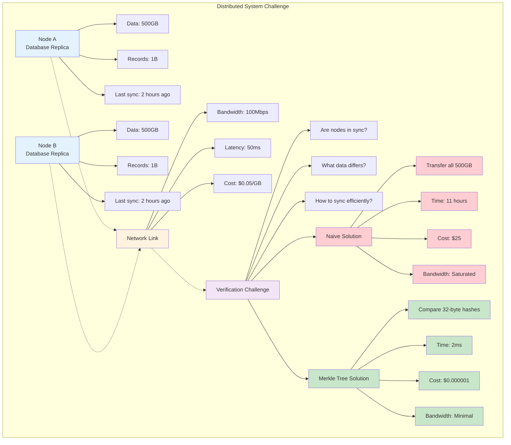
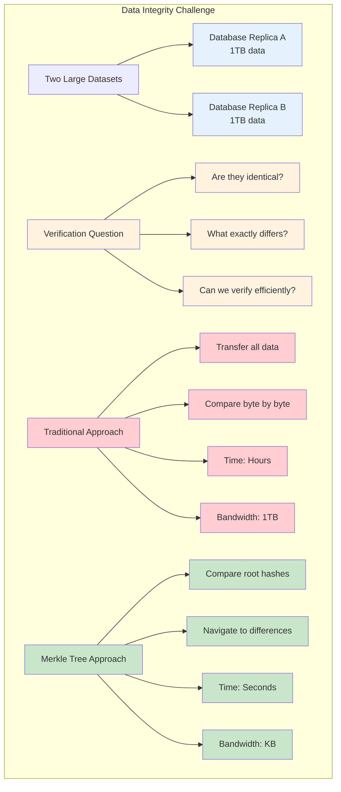
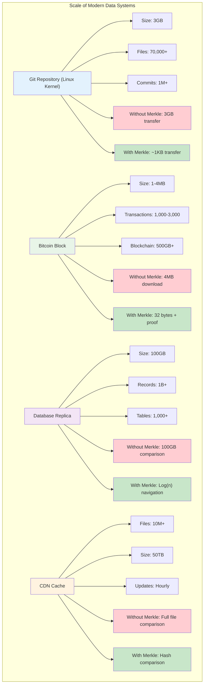
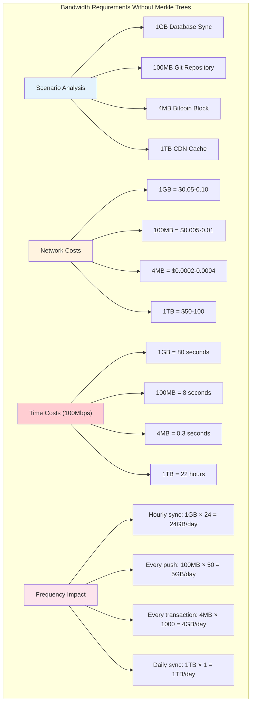
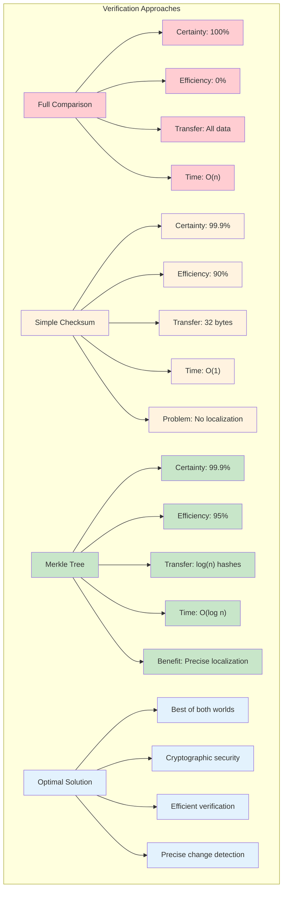
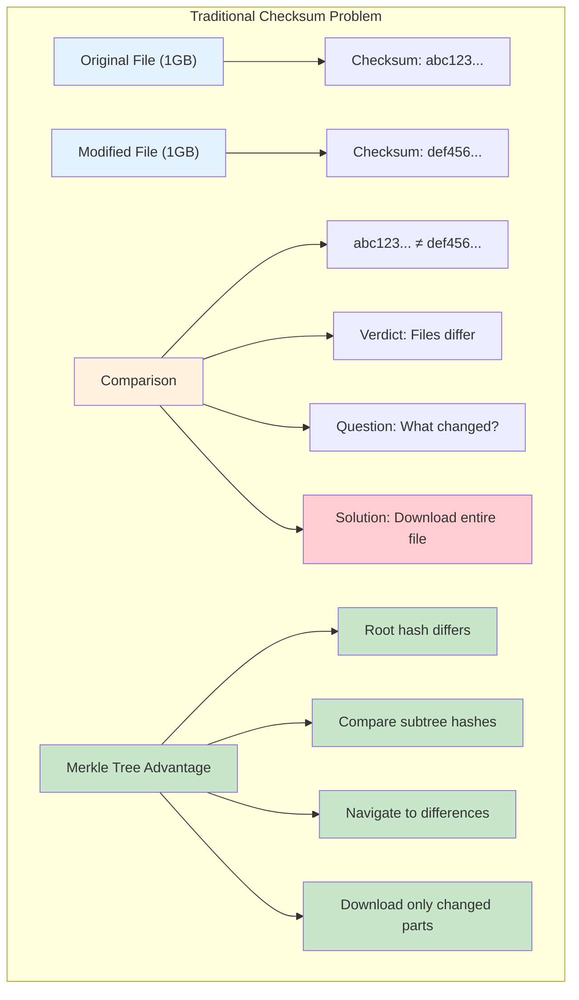
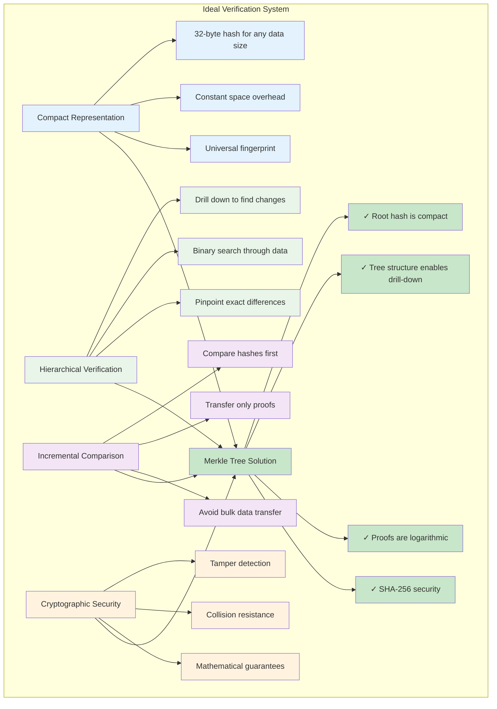
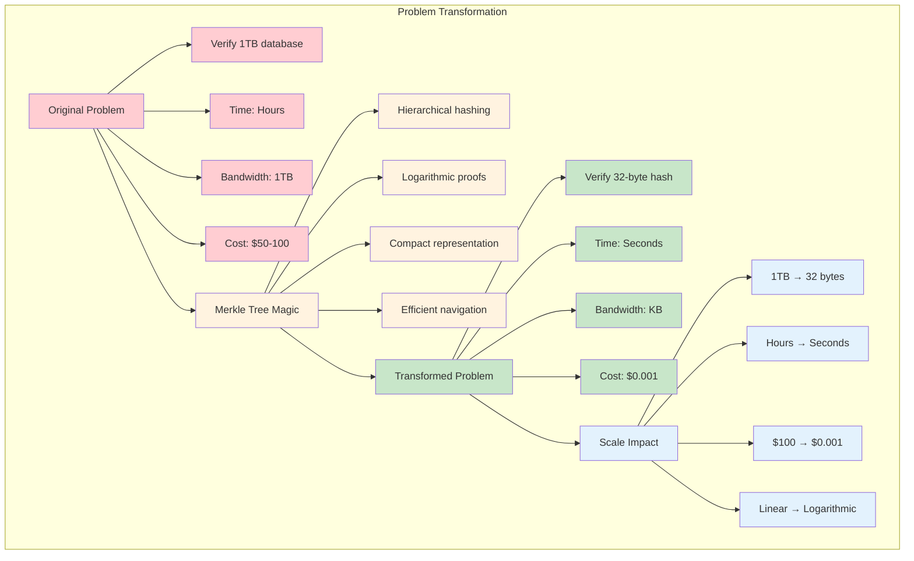

# The Core Problem

Imagine you have two massive datasets stored on different machines—perhaps two database replicas, distributed file systems, or blockchain nodes. How do you efficiently verify if these datasets are identical? The naive approach would be to transfer and compare every single byte, but this is prohibitively expensive in terms of bandwidth, time, and computational resources.

### The Distributed Verification Problem

This is the fundamental challenge that Merkle trees solve: **How can we verify data integrity and detect differences between large datasets without transferring the entire data?**

### The Verification Challenge Visualized

## The Scale of the Problem

Consider these real-world scenarios:

- **Git repositories**: When you run `git pull`, Git needs to determine which objects have changed without downloading your entire repository history
- **Bitcoin blockchain**: Nodes need to verify that a specific transaction exists in a block without downloading the entire block (which can be several megabytes)
- **Distributed databases**: Replica synchronization requires identifying which records differ between nodes
- **Content delivery networks**: Verifying that cached content matches the origin server

In each case, a full comparison would be impractical. A 1GB database would require transferring 1GB to verify integrity. A blockchain with millions of transactions would need massive bandwidth just for verification.

### Real-World Scale Analysis

### The Bandwidth Problem

## The Verification Dilemma

The core tension is between **efficiency** and **certainty**:

- **Certainty** requires examining every piece of data
- **Efficiency** demands minimal data transfer and computation

Traditional checksums help but only work for complete datasets. If you have a checksum for an entire file, you still can't determine *which part* has changed without examining the whole file.

### The Efficiency vs Certainty Trade-off

### The Checksum Limitation

## What We Really Need

An ideal solution would provide:

1. **Compact representation**: A small "fingerprint" that represents large amounts of data
2. **Hierarchical verification**: The ability to drill down and identify exactly what has changed
3. **Incremental comparison**: Fast detection of differences without full data transfer
4. **Cryptographic security**: Assurance that the verification cannot be easily spoofed

This is exactly what Merkle trees deliver—a elegant data structure that transforms the seemingly impossible task of efficient large-scale data verification into a practical, logarithmic operation.

### The Perfect Solution Requirements

### The Transformation: From Impossible to Practical

