# The Guiding Philosophy

The Merkle tree's genius lies in a simple but profound insight: **hash the data, then hash the hashes**. This recursive hashing creates a tree structure where each level provides a more compact representation of the data below it, culminating in a single "root hash" that represents the entire dataset.

## The Core Principle: Hierarchical Hashing

Instead of comparing massive datasets directly, Merkle trees let us:

1. **Break data into blocks**: Divide the dataset into manageable chunks
2. **Hash each block**: Create a cryptographic fingerprint of each chunk  
3. **Hash pairs of hashes**: Combine adjacent hashes to create parent hashes
4. **Repeat until one remains**: Continue until you have a single root hash

This creates a binary tree where:
- **Leaves** contain hashes of actual data blocks
- **Internal nodes** contain hashes of their children's hashes
- **Root** contains a hash representing the entire dataset

### The Hierarchical Hashing Process

### The Tree Structure

```mermaid
graph TD
    subgraph "Complete Merkle Tree"
        ROOT["🏆 Root Hash<br/>stu901...<br/>(Represents entire dataset)"]
        
        AB["🔗 Internal Node<br/>mno345...<br/>(Represents Files 1-2)"]
        CD["🔗 Internal Node<br/>pqr678...<br/>(Represents Files 3-4)"]
        
        A1["📄 Leaf<br/>abc123...<br/>(File 1)"]
        B1["📄 Leaf<br/>def456...<br/>(File 2)"]
        C1["📄 Leaf<br/>ghi789...<br/>(File 3)"]
        D1["📄 Leaf<br/>jkl012...<br/>(File 4)"]
        
        ROOT --> AB
        ROOT --> CD
        AB --> A1
        AB --> B1
        CD --> C1
        CD --> D1
    end
    
    style ROOT fill:#c8e6c9
    style AB fill:#f3e5f5
    style CD fill:#f3e5f5
    style A1 fill:#e8f5e8
    style B1 fill:#e8f5e8
    style C1 fill:#e8f5e8
    style D1 fill:#e8f5e8
```

## The Power of Recursive Structure

This hierarchical approach provides several key advantages:

### 1. Logarithmic Verification
To verify any piece of data, you only need O(log n) hashes—the "path" from leaf to root. For a million data blocks, you need at most 20 hashes to verify any single block.

### 2. Efficient Difference Detection  
When two Merkle trees have different root hashes, you can quickly identify which subtrees differ by comparing intermediate nodes. This allows binary-search-like exploration to pinpoint exact differences.

### 3. Tamper Evidence
Changing any data block changes its hash, which changes its parent's hash, propagating all the way to the root. This makes any modification immediately detectable at the top level.

## Design Trade-offs and Philosophy

The Merkle tree embodies several important design principles:

### Space vs. Time Trade-off
We trade storage space (storing intermediate hashes) for verification time. The tree structure requires O(n) additional space but reduces verification from O(n) to O(log n).

### Trust through Mathematics
Rather than relying on trusted third parties, Merkle trees use cryptographic properties. The security comes from the mathematical difficulty of finding hash collisions, not from institutional trust.

### Incremental Verification
You don't need the entire tree to verify a piece of data—just the "authentication path" from leaf to root. This enables efficient protocols where only relevant proof data is transmitted.

```mermaid
graph TD
    subgraph "Incremental Verification Process"
        A["Full Tree (Not Needed)"]
        A --> A1["1M blocks"]
        A --> A2["2M hashes"]
        A --> A3["64MB storage"]
        
        B["Authentication Path (Sufficient)"]
        B --> B1["Target block"]
        B --> B2["20 sibling hashes"]
        B --> B3["640 bytes"]
        
        C["Verification Process"]
        C --> C1["1. Hash target block"]
        C --> C2["2. Combine with sibling"]
        C --> C3["3. Repeat up to root"]
        C --> C4["4. Compare with known root"]
        
        D["Efficiency Gains"]
        D --> D1["Data transfer: 64MB → 640 bytes"]
        D --> D2["Reduction: 100,000x"]
        D --> D3["Time: Hours → Milliseconds"]
        D --> D4["Bandwidth: Minimal"]
        
        E["Protocol Applications"]
        E --> E1["Bitcoin SPV: Block headers only"]
        E --> E2["Git sync: Only changed objects"]
        E --> E3["DB replication: Delta sync"]
        E --> E4["CDN: Cache validation"]
    end
    
    style A fill:#ffcdd2
    style A1 fill:#ffcdd2
    style A2 fill:#ffcdd2
    style A3 fill:#ffcdd2
    style B fill:#c8e6c9
    style B1 fill:#c8e6c9
    style B2 fill:#c8e6c9
    style B3 fill:#c8e6c9
    style C fill:#e8f5e8
    style D fill:#e3f2fd
    style D1 fill:#e3f2fd
    style D2 fill:#e3f2fd
    style D3 fill:#e3f2fd
    style D4 fill:#e3f2fd
    style E fill:#f3e5f5
```

## The Elegance of Simplicity

What makes Merkle trees beautiful is how they solve a complex distributed systems problem with a remarkably simple concept: recursive hashing. There are no complex algorithms, no sophisticated protocols—just the systematic application of hash functions in a tree structure.

This simplicity makes them:
- **Easy to implement correctly**
- **Efficient to compute**  
- **Straightforward to verify**
- **Universally applicable** across different domains

The philosophy is fundamentally about transforming a hard problem (efficient large-scale verification) into a series of simple operations (hashing) arranged in a clever structure (binary tree).

### The Simplicity Principle

### Implementation Simplicity

### The Philosophy in Action

