# Building a Merkle Root

Let's build a Merkle root step-by-step using a concrete example. We'll take an array of strings, hash each one, and recursively combine the hashes until we have a single root hash.

## Our Sample Data

We'll start with four simple text strings:
```
["apple", "banana", "cherry", "date"]
```

## Step 1: Hash the Leaves

First, we compute the hash of each data block. We'll use SHA-256 and show simplified hashes for clarity:

```
Hash("apple")  = a1b2c3d4...  [Leaf A]
Hash("banana") = e5f6g7h8...  [Leaf B]  
Hash("cherry") = i9j0k1l2...  [Leaf C]
Hash("date")   = m3n4o5p6...  [Leaf D]
```

### Visualization: Data to Hash Transformation

```mermaid
graph TD
    subgraph "Data Blocks"
        A["🍎 apple<br/>String data"]
        B["🍌 banana<br/>String data"]
        C["🍒 cherry<br/>String data"]
        D["🗓️ date<br/>String data"]
    end
    
    subgraph "Hash Function (SHA-256)"
        H1["SHA-256<br/>Cryptographic hash"]
        H2["SHA-256<br/>Cryptographic hash"]
        H3["SHA-256<br/>Cryptographic hash"]
        H4["SHA-256<br/>Cryptographic hash"]
    end
    
    subgraph "Leaf Hashes (32 bytes each)"
        L1["🔑 a1b2c3d4...<br/>Leaf A"]
        L2["🔑 e5f6g7h8...<br/>Leaf B"]
        L3["🔑 i9j0k1l2...<br/>Leaf C"]
        L4["🔑 m3n4o5p6...<br/>Leaf D"]
    end
    
    A --> H1 --> L1
    B --> H2 --> L2
    C --> H3 --> L3
    D --> H4 --> L4
    
    style A fill:#e3f2fd
    style B fill:#e3f2fd
    style C fill:#e3f2fd
    style D fill:#e3f2fd
    style H1 fill:#fff3e0
    style H2 fill:#fff3e0
    style H3 fill:#fff3e0
    style H4 fill:#fff3e0
    style L1 fill:#c8e6c9
    style L2 fill:#c8e6c9
    style L3 fill:#c8e6c9
    style L4 fill:#c8e6c9
```



## Step 2: Build Level 1 (Internal Nodes)

Now we combine adjacent leaf hashes to create the first level of internal nodes:

```
Hash(A || B) = Hash(a1b2c3d4... || e5f6g7h8...) = q7r8s9t0...  [Node AB]
Hash(C || D) = Hash(i9j0k1l2... || m3n4o5p6...) = u1v2w3x4...  [Node CD]
```

The `||` symbol represents concatenation. We combine the bytes of the two hashes and hash the result.

### Visualization: Hash Combination Process


## Step 3: Build the Root

Finally, we combine the two internal nodes to create the Merkle root:

```
Merkle Root = Hash(AB || CD) = Hash(q7r8s9t0... || u1v2w3x4...) = y5z6a7b8...
```

### Visualization: Final Root Construction


## Complete Tree Structure

Here's our finished Merkle tree:

```
                 y5z6a7b8...
                 (Merkle Root)
                /            \
         q7r8s9t0...        u1v2w3x4...
          (Node AB)          (Node CD)
          /       \           /       \
   a1b2c3d4...  e5f6g7h8... i9j0k1l2... m3n4o5p6...
    (apple)     (banana)    (cherry)    (date)
```

### Complete Tree Visualization

```mermaid
graph TD
    subgraph "Level 0: Merkle Root"
        ROOT["🏆 y5z6a7b8...<br/>Merkle Root<br/>Represents ALL data"]
    end
    
    subgraph "Level 1: Internal Nodes"
        AB["🔗 q7r8s9t0...<br/>Node AB<br/>Represents apple + banana"]
        CD["🔗 u1v2w3x4...<br/>Node CD<br/>Represents cherry + date"]
    end
    
    subgraph "Level 2: Leaf Hashes"
        LA["🔑 a1b2c3d4...<br/>Hash(apple)"]
        LB["🔑 e5f6g7h8...<br/>Hash(banana)"]
        LC["🔑 i9j0k1l2...<br/>Hash(cherry)"]
        LD["🔑 m3n4o5p6...<br/>Hash(date)"]
    end
    
    subgraph "Level 3: Original Data"
        DA["🍎 apple<br/>Original data"]
        DB["🍌 banana<br/>Original data"]
        DC["🍒 cherry<br/>Original data"]
        DD["🗓️ date<br/>Original data"]
    end
    
    ROOT --> AB
    ROOT --> CD
    AB --> LA
    AB --> LB
    CD --> LC
    CD --> LD
    LA -.-> DA
    LB -.-> DB
    LC -.-> DC
    LD -.-> DD
    
    style ROOT fill:#c8e6c9
    style AB fill:#e8f5e8
    style CD fill:#e8f5e8
    style LA fill:#e3f2fd
    style LB fill:#e3f2fd
    style LC fill:#e3f2fd
    style LD fill:#e3f2fd
    style DA fill:#fff3e0
    style DB fill:#fff3e0
    style DC fill:#fff3e0
    style DD fill:#fff3e0
```



### Tree Properties Summary


## Pseudo-code Algorithm

Here's the general algorithm for building a Merkle root:

```python
function buildMerkleRoot(data_blocks):
    # Step 1: Hash all data blocks to create leaves
    current_level = []
    for block in data_blocks:
        hash_value = hash(block)
        current_level.append(hash_value)
    
    # Step 2: Build tree bottom-up
    while len(current_level) > 1:
        next_level = []
        
        # Process pairs of hashes
        for i in range(0, len(current_level), 2):
            left = current_level[i]
            
            # Handle odd number of nodes by duplicating the last one
            if i + 1 < len(current_level):
                right = current_level[i + 1]
            else:
                right = left
            
            # Combine and hash the pair
            combined_hash = hash(left + right)
            next_level.append(combined_hash)
        
        current_level = next_level
    
    # Step 3: Return the root
    return current_level[0]
```

## Handling Odd Numbers of Nodes

What happens if we have an odd number of data blocks? There are two common approaches:

### Approach 1: Duplicate the Last Node
If there's an odd number of nodes at any level, duplicate the last node:

```
["apple", "banana", "cherry"]  # 3 items

Level 0: [Hash(apple), Hash(banana), Hash(cherry)]
Level 1: [Hash(apple || banana), Hash(cherry || cherry)]
Root:    Hash(Hash(apple || banana) || Hash(cherry || cherry))
```

### Approach 2: Promote the Odd Node
Promote the unpaired node to the next level:

```
["apple", "banana", "cherry"]  # 3 items

Level 0: [Hash(apple), Hash(banana), Hash(cherry)]
Level 1: [Hash(apple || banana), Hash(cherry)]
Root:    Hash(Hash(apple || banana) || Hash(cherry))
```

Both approaches work, but consistency is key—all parties must use the same method.

## Real Example with Actual Hashes

Let's use real SHA-256 hashes for our fruit example:

```python
import hashlib

def sha256(data):
    return hashlib.sha256(data.encode()).hexdigest()

# Step 1: Hash the data
leaf_a = sha256("apple")   # a665a45920422f9d417e4867efdc4fb8a04a1f3fff1fa07e998e86f7f7a27ae3
leaf_b = sha256("banana")  # b493d48364afe44d11c0165cf470a4164d1e2609911ef998be868d46ade3de4e
leaf_c = sha256("cherry")  # 2c26b46b68ffc68ff99b453c1d30413413422d706483bfa0f98a5e886266e7ae
leaf_d = sha256("date")    # d6bb28dd56b4c1a9a3e1c7ad95e7d0b9e90d1dc85e4e3c5b1a1f88e1b6b6d3e8

# Step 2: Combine pairs
node_ab = sha256(leaf_a + leaf_b)  # Combine hash strings and hash again
node_cd = sha256(leaf_c + leaf_d)

# Step 3: Create root
merkle_root = sha256(node_ab + node_cd)

print(f"Merkle Root: {merkle_root}")
```

## Verification Example

With our Merkle root, we can now efficiently verify any piece of data. To verify "apple" belongs to our dataset:

1. **Compute Hash("apple")** = a665a45920422f...
2. **Get authentication path**: [Hash("banana"), Hash(CD)]
3. **Reconstruct**:
   - Combine Hash("apple") + Hash("banana") = Node AB
   - Combine Node AB + Hash(CD) = Root
4. **Compare** computed root with known root

If they match, "apple" is definitely in our dataset. If they don't match, either "apple" isn't in the dataset or the data has been tampered with.

This verification only required 2 hash operations instead of checking all 4 data blocks—a 50% savings that becomes exponentially better with larger datasets.

### Step-by-Step Verification Process

```mermaid
graph TD
    subgraph "Verification Steps"
        A["Step 1: Hash Target Data"]
        A --> A1["Hash('apple') = a1b2c3d4..."]
        
        B["Step 2: Get Proof"]
        B --> B1["Proof = [Hash('banana'), Hash(CD)]"]
        B --> B2["Sibling 1: e5f6g7h8... (banana)"]
        B --> B3["Sibling 2: u1v2w3x4... (CD)"]
        
        C["Step 3: Reconstruct Path"]
        C --> C1["current = Hash('apple')"]
        C --> C2["current = Hash(current + banana)"]
        C --> C3["current = Hash(current + CD)"]
        C --> C4["current = computed_root"]
        
        D["Step 4: Compare"]
        D --> D1["computed_root == known_root"]
        D --> D2["y5z6a7b8... == y5z6a7b8..."]
        D --> D3["✓ VALID"]
        
        A --> B --> C --> D
    end
    
    style A fill:#e3f2fd
    style A1 fill:#e3f2fd
    style B fill:#e8f5e8
    style B1 fill:#e8f5e8
    style B2 fill:#e8f5e8
    style B3 fill:#e8f5e8
    style C fill:#fff3e0
    style C1 fill:#fff3e0
    style C2 fill:#fff3e0
    style C3 fill:#fff3e0
    style C4 fill:#fff3e0
    style D fill:#c8e6c9
    style D1 fill:#c8e6c9
    style D2 fill:#c8e6c9
    style D3 fill:#c8e6c9
```



### Verification Efficiency Analysis


### Tamper Detection Example

