# Merkle Trees in Git and Bitcoin

Merkle trees are not just academic concepts—they're fundamental to two of the most important distributed systems of our time: Git and Bitcoin. Understanding how these systems use Merkle trees reveals the practical power of this data structure.

## Git: Version Control at Scale

Git uses Merkle trees to efficiently manage repository history and detect changes across distributed repositories.

### Git's Object Model

Every Git repository is essentially a content-addressable filesystem built on Merkle trees:

```
Commit Object
├── Tree Object (root directory)
│   ├── Blob Object (file1.txt)
│   ├── Blob Object (file2.txt)
│   └── Tree Object (subdirectory/)
│       ├── Blob Object (file3.txt)
│       └── Blob Object (file4.txt)
```

Each object is identified by the SHA-1 hash of its content:
- **Blob objects**: Contain file content, identified by hash of the file data
- **Tree objects**: Contain directory listings, identified by hash of the file/subdirectory references
- **Commit objects**: Contain metadata and tree reference, identified by hash of the entire commit

### Git's Merkle Tree Structure

```mermaid
graph TD
    subgraph "Git Repository as Merkle Tree"
        COMMIT["🏷️ Commit Object<br/>abc123...<br/>Author, Message, Timestamp"]
        
        ROOT_TREE["📁 Root Tree<br/>def456...<br/>Directory listing"]
        
        SRC_TREE["📁 src/ Tree<br/>ghi789...<br/>Source directory"]
        DOCS_TREE["📁 docs/ Tree<br/>jkl012...<br/>Documentation"]
        
        MAIN_BLOB["📄 main.rs<br/>mno345...<br/>Source code"]
        LIB_BLOB["📄 lib.rs<br/>pqr678...<br/>Library code"]
        README_BLOB["📄 README.md<br/>stu901...<br/>Documentation"]
        
        COMMIT --> ROOT_TREE
        ROOT_TREE --> SRC_TREE
        ROOT_TREE --> DOCS_TREE
        SRC_TREE --> MAIN_BLOB
        SRC_TREE --> LIB_BLOB
        DOCS_TREE --> README_BLOB
    end
    
    style COMMIT fill:#c8e6c9
    style ROOT_TREE fill:#e8f5e8
    style SRC_TREE fill:#e3f2fd
    style DOCS_TREE fill:#e3f2fd
    style MAIN_BLOB fill:#fff3e0
    style LIB_BLOB fill:#fff3e0
    style README_BLOB fill:#fff3e0
```



### Content-Addressable Storage


### Why This Matters

When you run `git pull`, Git doesn't need to transfer your entire repository. Instead:

1. **Compare root hashes**: Local and remote commit objects have different hashes
2. **Drill down**: Compare tree objects to find which directories changed
3. **Transfer only differences**: Download only the objects that actually changed

### Git Pull Optimization Process

```mermaid
graph TD
    subgraph "Efficient Git Synchronization"
        A["Local Repository"]
        A --> A1["Local commit: abc123..."]
        A --> A2["Local tree: def456..."]
        A --> A3["Files: 10,000"]
        
        B["Remote Repository"]
        B --> B1["Remote commit: xyz789..."]
        B --> B2["Remote tree: uvw012..."]
        B --> B3["Files: 10,000 (1 changed)"]
        
        C["Git Pull Process"]
        C --> C1["1. Compare commit hashes"]
        C --> C2["2. abc123... ≠ xyz789..."]
        C --> C3["3. Drill down to tree objects"]
        C --> C4["4. Find differing subtrees"]
        C --> C5["5. Transfer only changed objects"]
        
        D["Result"]
        D --> D1["Objects transferred: ~10"]
        D --> D2["vs all 10,000 files"]
        D --> D3["Bandwidth saved: 99.9%"]
        D --> D4["Time saved: 1000x"]
        
        A --> C
        B --> C
        C --> D
    end
    
    style A fill:#e3f2fd
    style A1 fill:#e3f2fd
    style A2 fill:#e3f2fd
    style A3 fill:#e3f2fd
    style B fill:#e8f5e8
    style B1 fill:#e8f5e8
    style B2 fill:#e8f5e8
    style B3 fill:#e8f5e8
    style C fill:#fff3e0
    style C1 fill:#fff3e0
    style C2 fill:#fff3e0
    style C3 fill:#fff3e0
    style C4 fill:#fff3e0
    style C5 fill:#fff3e0
    style D fill:#c8e6c9
    style D1 fill:#c8e6c9
    style D2 fill:#c8e6c9
    style D3 fill:#c8e6c9
    style D4 fill:#c8e6c9
```



#### Example: Detecting Changes

Imagine a repository with this structure:
```
my-project/
├── src/
│   ├── main.rs        # Modified
│   └── lib.rs         # Unchanged
├── docs/
│   └── README.md      # Unchanged
└── tests/
    └── test.rs        # Unchanged
```

When `main.rs` is modified:

1. **Blob hash changes**: `main.rs` gets a new SHA-1 hash
2. **Tree hash changes**: `src/` tree object hash changes (it references the new blob)
3. **Commit hash changes**: Commit object hash changes (it references the new tree)
4. **Other hashes unchanged**: `lib.rs`, `docs/`, and `tests/` hashes remain the same

Git can identify that only `src/main.rs` changed by comparing tree structures, transferring minimal data.

### Change Propagation in Git


### Git's Efficiency

For a repository with 10,000 files, where only 1 file changed:
- **Without Merkle trees**: Transfer 10,000 files to compare
- **With Merkle trees**: Transfer ~log₂(10,000) ≈ 14 objects to identify the change

This logarithmic efficiency makes Git practical for massive codebases like the Linux kernel.

### Git Efficiency Scaling


## Bitcoin: Blockchain Verification

Bitcoin uses Merkle trees to enable lightweight verification without downloading entire blocks.

### Block Structure

Each Bitcoin block contains:
```
Block Header (80 bytes)
├── Previous Block Hash
├── Timestamp  
├── Difficulty Target
├── Nonce
└── Merkle Root (32 bytes)

Block Body (variable size)
└── Transactions (can be thousands)
    ├── Transaction 1
    ├── Transaction 2
    ├── ...
    └── Transaction N
```

The **Merkle Root** in the header represents all transactions in the block.

### Bitcoin Block Architecture

```mermaid
graph TD
    subgraph "Bitcoin Block Structure"
        BH["📦 Block Header (80 bytes)"]
        BH --> BH1["Previous Block Hash (32B)"]
        BH --> BH2["Timestamp (4B)"]
        BH --> BH3["Difficulty Target (4B)"]
        BH --> BH4["Nonce (4B)"]
        BH --> BH5["🌳 Merkle Root (32B)"]
        
        BB["📄 Block Body (Variable)"]
        BB --> TX["Transaction List"]
        TX --> T1["💰 Transaction 1"]
        TX --> T2["💰 Transaction 2"]
        TX --> T3["💰 Transaction 3"]
        TX --> TN["💰 Transaction N"]
        
        MT["Merkle Tree"]
        MT --> MT1["Internal Nodes"]
        MT --> MT2["Leaf Nodes"]
        MT2 --> T1
        MT2 --> T2
        MT2 --> T3
        MT2 --> TN
        MT1 --> BH5
    end
    
    style BH fill:#e3f2fd
    style BH1 fill:#e3f2fd
    style BH2 fill:#e3f2fd
    style BH3 fill:#e3f2fd
    style BH4 fill:#e3f2fd
    style BH5 fill:#c8e6c9
    style BB fill:#fff3e0
    style TX fill:#fff3e0
    style T1 fill:#e8f5e8
    style T2 fill:#e8f5e8
    style T3 fill:#e8f5e8
    style TN fill:#e8f5e8
    style MT fill:#f3e5f5
    style MT1 fill:#f3e5f5
    style MT2 fill:#f3e5f5
```



### Simplified Payment Verification (SPV)

Mobile Bitcoin wallets use SPV to verify transactions without downloading the entire blockchain:

#### Traditional Full Node Verification
```
1. Download entire blockchain (~400GB as of 2024)
2. Verify every transaction in every block
3. Check if your transaction exists
```

#### SPV with Merkle Trees
```
1. Download only block headers (~80MB for entire chain)
2. Request Merkle proof for your specific transaction
3. Verify proof against known block header
```

### SPV Example

Suppose you want to verify that Transaction T₅ is in Block B:

```
                    Merkle Root
                   /           \
              Node AB           Node CD
             /      \          /      \
        Node A    Node B   Node C    Node D
        /   \     /   \     /   \     /   \
      T₁   T₂   T₃   T₄   T₅   T₆   T₇   T₈
```

**Merkle Proof for T₅:**
1. Provide: [T₆, Node C, Node AB]
2. Verify: 
   - Hash(T₅ || T₆) = Node D
   - Hash(Node C || Node D) = Node CD  
   - Hash(Node AB || Node CD) = Merkle Root
3. Compare computed root with block header

You only need 3 hashes (plus T₅) to verify the transaction instead of downloading all 8 transactions.

### SPV Verification Process

```mermaid
graph TD
    subgraph "SPV Transaction Verification"
        A["Mobile Wallet wants to verify T₅"]
        A --> A1["Has: Block headers only"]
        A --> A2["Needs: Proof T₅ is in block"]
        A --> A3["Knows: Merkle root from header"]
        
        B["Request Merkle Proof"]
        B --> B1["Full node provides proof"]
        B --> B2["Proof: [T₆, Node C, Node AB]"]
        B --> B3["Size: 3 × 32 bytes = 96 bytes"]
        
        C["Verification Steps"]
        C --> C1["Hash(T₅ || T₆) = Node D"]
        C --> C2["Hash(Node C || Node D) = Node CD"]
        C --> C3["Hash(Node AB || Node CD) = Root"]
        C --> C4["Compare with header's root"]
        
        D["Result"]
        D --> D1["Root matches ✓"]
        D --> D2["T₅ is confirmed in block"]
        D --> D3["Downloaded: 96 bytes"]
        D --> D4["vs full block: 1-4 MB"]
        
        A --> B --> C --> D
    end
    
    style A fill:#e3f2fd
    style A1 fill:#e3f2fd
    style A2 fill:#e3f2fd
    style A3 fill:#e3f2fd
    style B fill:#e8f5e8
    style B1 fill:#e8f5e8
    style B2 fill:#e8f5e8
    style B3 fill:#e8f5e8
    style C fill:#fff3e0
    style C1 fill:#fff3e0
    style C2 fill:#fff3e0
    style C3 fill:#fff3e0
    style C4 fill:#fff3e0
    style D fill:#c8e6c9
    style D1 fill:#c8e6c9
    style D2 fill:#c8e6c9
    style D3 fill:#c8e6c9
    style D4 fill:#c8e6c9
```



### Real-World Impact

For a block with 2,000 transactions:
- **Full verification**: Download ~2MB of transaction data
- **Merkle proof**: Download ~log₂(2000) ≈ 11 hashes = ~350 bytes

This 6,000x reduction in data transfer makes Bitcoin practical on mobile devices.

### Bitcoin Mobile Wallet Efficiency

```mermaid
graph TD
    subgraph "Mobile Bitcoin Wallet Requirements"
        A["Mobile Constraints"]
        A --> A1["Limited bandwidth"]
        A --> A2["Limited storage"]
        A --> A3["Battery life concerns"]
        A --> A4["Need fast verification"]
        
        B["Full Node Approach"]
        B --> B1["Download: 500GB blockchain"]
        B --> B2["Verify: All transactions"]
        B --> B3["Storage: 500GB"]
        B --> B4["Time: Days to sync"]
        B --> B5["Result: Impossible on mobile"]
        
        C["SPV with Merkle Proofs"]
        C --> C1["Download: 80MB headers"]
        C --> C2["Verify: Only your transactions"]
        C --> C3["Storage: 80MB"]
        C --> C4["Time: Minutes to sync"]
        C --> C5["Result: Practical on mobile"]
        
        D["Efficiency Comparison"]
        D --> D1["Data: 500GB → 80MB (6,250x less)"]
        D --> D2["Verification: All → Selective"]
        D --> D3["Time: Days → Minutes"]
        D --> D4["Enables: Mobile Bitcoin"]
    end
    
    style A fill:#e3f2fd
    style A1 fill:#e3f2fd
    style A2 fill:#e3f2fd
    style A3 fill:#e3f2fd
    style A4 fill:#e3f2fd
    style B fill:#ffcdd2
    style B1 fill:#ffcdd2
    style B2 fill:#ffcdd2
    style B3 fill:#ffcdd2
    style B4 fill:#ffcdd2
    style B5 fill:#ffcdd2
    style C fill:#c8e6c9
    style C1 fill:#c8e6c9
    style C2 fill:#c8e6c9
    style C3 fill:#c8e6c9
    style C4 fill:#c8e6c9
    style C5 fill:#c8e6c9
    style D fill:#e8f5e8
    style D1 fill:#e8f5e8
    style D2 fill:#e8f5e8
    style D3 fill:#e8f5e8
    style D4 fill:#e8f5e8
```



## The Network Effect

Both Git and Bitcoin leverage Merkle trees to solve the same fundamental distributed systems challenge: **How do you efficiently synchronize state across untrusted networks?**

### Git's Challenge
- Multiple developers working on the same codebase
- Need to merge changes without conflicts
- Must detect which files actually changed

### Bitcoin's Challenge  
- Thousands of nodes maintaining the same ledger
- Need to verify transactions without trusting other nodes
- Must prove transaction inclusion without downloading everything

### The Merkle Solution

In both cases, Merkle trees provide:

1. **Compact representation**: Single hash represents entire state
2. **Efficient verification**: Logarithmic proof size
3. **Tamper detection**: Any change cascades to root
4. **Incremental synchronization**: Transfer only what's different

## Performance Comparison

| Operation | Without Merkle Trees | With Merkle Trees |
|-----------|---------------------|-------------------|
| Git diff between branches | O(n) files to check | O(log n) objects to compare |
| Bitcoin transaction verification | O(n) transactions to download | O(log n) hashes for proof |
| Detecting repository changes | Compare all files | Compare root hashes |
| Blockchain synchronization | Download full blocks | Download headers + proofs |

These aren't just theoretical improvements—they're the reason Git can handle repositories with millions of files and Bitcoin can operate on mobile devices with limited bandwidth.

### Performance Impact Visualization


## Why Merkle Trees Are Essential

Without Merkle trees:
- **Git** would require transferring entire repositories for every sync
- **Bitcoin** would be unusable on mobile devices due to bandwidth requirements

With Merkle trees:
- **Git** scales to repositories with millions of files
- **Bitcoin** enables lightweight wallets and global adoption

This is the power of choosing the right data structure: it doesn't just optimize performance—it makes entirely new use cases possible.

### The Transformation: From Impossible to Possible


### The Merkle Tree Impact Summary

