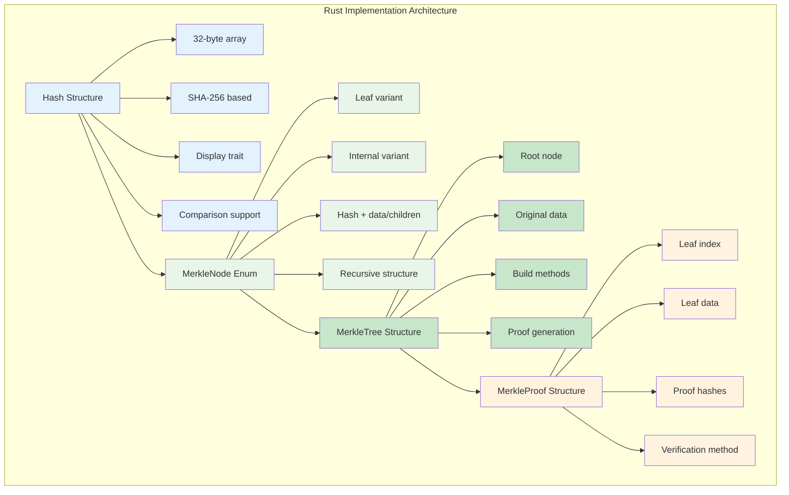
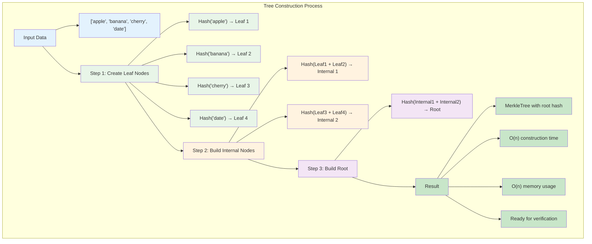
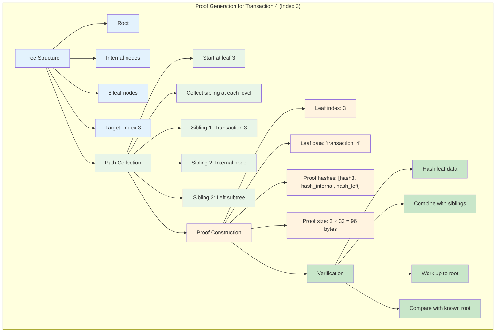
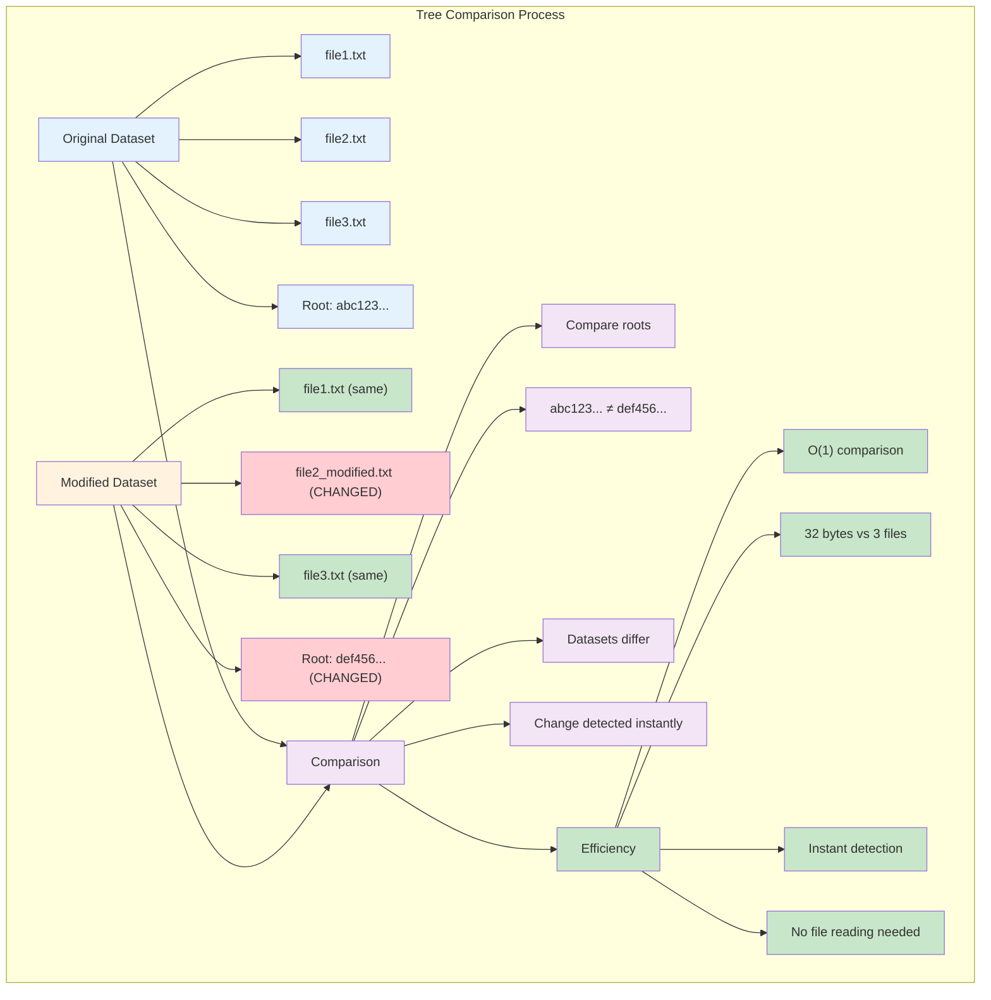
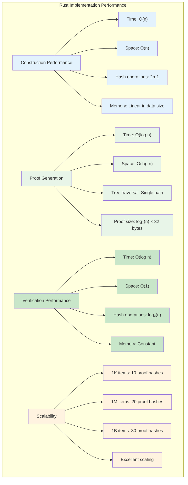
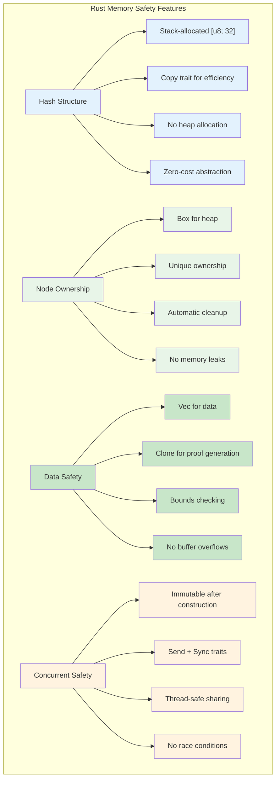
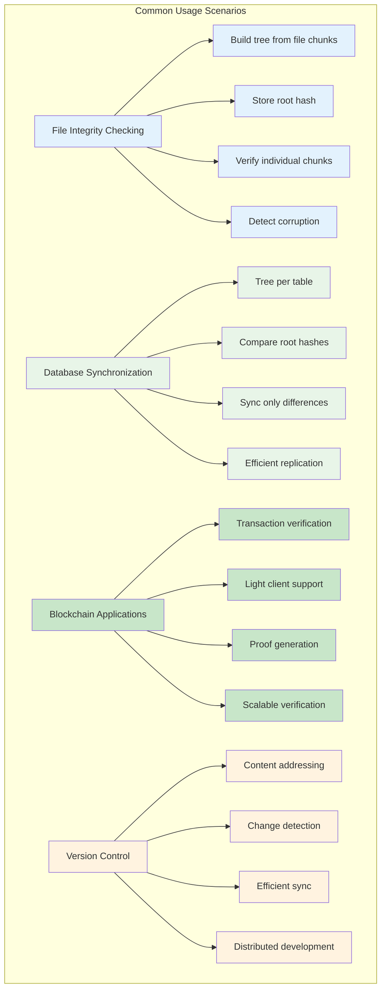

# Rust Implementation

Let's implement a complete Merkle tree in Rust, demonstrating the core concepts with working code. This implementation includes tree construction, root calculation, and verification proofs.

### Implementation Overview



## Dependencies

Add this to your `Cargo.toml`:

```toml
[dependencies]
sha2 = "0.10"
hex = "0.4"
```

## Core Implementation

```rust
use sha2::{Sha256, Digest};
use std::fmt;

#[derive(Debug, Clone, PartialEq)]
pub struct Hash([u8; 32]);

impl Hash {
    fn from_data(data: &[u8]) -> Self {
        let mut hasher = Sha256::new();
        hasher.update(data);
        Hash(hasher.finalize().into())
    }
    
    fn from_hashes(left: &Hash, right: &Hash) -> Self {
        let mut hasher = Sha256::new();
        hasher.update(&left.0);
        hasher.update(&right.0);
        Hash(hasher.finalize().into())
    }
    
    fn as_bytes(&self) -> &[u8; 32] {
        &self.0
    }
}

impl fmt::Display for Hash {
    fn fmt(&self, f: &mut fmt::Formatter<'_>) -> fmt::Result {
        write!(f, "{}", hex::encode(&self.0[..8])) // Show first 8 bytes
    }
}

#[derive(Debug, Clone)]
pub enum MerkleNode {
    Leaf { hash: Hash, data: Vec<u8> },
    Internal { hash: Hash, left: Box<MerkleNode>, right: Box<MerkleNode> },
}

impl MerkleNode {
    fn hash(&self) -> &Hash {
        match self {
            MerkleNode::Leaf { hash, .. } => hash,
            MerkleNode::Internal { hash, .. } => hash,
        }
    }
    
    fn is_leaf(&self) -> bool {
        matches!(self, MerkleNode::Leaf { .. })
    }
}

pub struct MerkleTree {
    root: Option<MerkleNode>,
    leaves: Vec<Vec<u8>>,
}

impl MerkleTree {
    pub fn new(data_blocks: Vec<Vec<u8>>) -> Self {
        if data_blocks.is_empty() {
            return MerkleTree {
                root: None,
                leaves: Vec::new(),
            };
        }
        
        let leaves = data_blocks.clone();
        let root = Self::build_tree(data_blocks);
        
        MerkleTree {
            root: Some(root),
            leaves,
        }
    }
    
    fn build_tree(data_blocks: Vec<Vec<u8>>) -> MerkleNode {
        // Create leaf nodes
        let mut current_level: Vec<MerkleNode> = data_blocks
            .into_iter()
            .map(|data| {
                let hash = Hash::from_data(&data);
                MerkleNode::Leaf { hash, data }
            })
            .collect();
        
        // Build tree bottom-up
        while current_level.len() > 1 {
            let mut next_level = Vec::new();
            
            for chunk in current_level.chunks(2) {
                let left = chunk[0].clone();
                let right = if chunk.len() == 2 {
                    chunk[1].clone()
                } else {
                    // Handle odd number by duplicating last node
                    chunk[0].clone()
                };
                
                let hash = Hash::from_hashes(left.hash(), right.hash());
                let internal_node = MerkleNode::Internal {
                    hash,
                    left: Box::new(left),
                    right: Box::new(right),
                };
                
                next_level.push(internal_node);
            }
            
            current_level = next_level;
        }
        
        current_level.into_iter().next().unwrap()
    }
    
    pub fn root_hash(&self) -> Option<&Hash> {
        self.root.as_ref().map(|node| node.hash())
    }
    
    pub fn generate_proof(&self, index: usize) -> Option<MerkleProof> {
        if index >= self.leaves.len() {
            return None;
        }
        
        let mut proof_hashes = Vec::new();
        let mut current_index = index;
        
        if let Some(root) = &self.root {
            self.collect_proof_hashes(root, current_index, self.leaves.len(), &mut proof_hashes);
        }
        
        Some(MerkleProof {
            leaf_index: index,
            leaf_data: self.leaves[index].clone(),
            proof_hashes,
        })
    }
    
    fn collect_proof_hashes(
        &self,
        node: &MerkleNode,
        target_index: usize,
        level_size: usize,
        proof_hashes: &mut Vec<Hash>,
    ) {
        if let MerkleNode::Internal { left, right, .. } = node {
            let mid = (level_size + 1) / 2;
            
            if target_index < mid {
                // Target is in left subtree, add right sibling hash
                proof_hashes.push(right.hash().clone());
                self.collect_proof_hashes(left, target_index, mid, proof_hashes);
            } else {
                // Target is in right subtree, add left sibling hash  
                proof_hashes.push(left.hash().clone());
                self.collect_proof_hashes(right, target_index - mid, level_size - mid, proof_hashes);
            }
        }
    }
    
    pub fn verify_proof(&self, proof: &MerkleProof) -> bool {
        if let Some(root_hash) = self.root_hash() {
            proof.verify(root_hash)
        } else {
            false
        }
    }
}

#[derive(Debug, Clone)]
pub struct MerkleProof {
    pub leaf_index: usize,
    pub leaf_data: Vec<u8>,
    pub proof_hashes: Vec<Hash>,
}

impl MerkleProof {
    pub fn verify(&self, expected_root: &Hash) -> bool {
        let leaf_hash = Hash::from_data(&self.leaf_data);
        let mut current_hash = leaf_hash;
        let mut index = self.leaf_index;
        
        for sibling_hash in &self.proof_hashes {
            if index % 2 == 0 {
                // Current node is left child
                current_hash = Hash::from_hashes(&current_hash, sibling_hash);
            } else {
                // Current node is right child
                current_hash = Hash::from_hashes(sibling_hash, &current_hash);
            }
            index /= 2;
        }
        
        &current_hash == expected_root
    }
}
```

## Usage Examples

### Basic Tree Construction

```rust
fn main() -> Result<(), Box<dyn std::error::Error>> {
    // Create sample data
    let data = vec![
        b"apple".to_vec(),
        b"banana".to_vec(),
        b"cherry".to_vec(),
        b"date".to_vec(),
    ];
    
    // Build Merkle tree
    let tree = MerkleTree::new(data);
    
    // Get root hash
    if let Some(root) = tree.root_hash() {
        println!("Merkle Root: {}", root);
    }
    
    Ok(())
}
```

### Tree Construction Flow



### Generating and Verifying Proofs

```rust
fn demonstrate_proof_verification() -> Result<(), Box<dyn std::error::Error>> {
    let data = vec![
        b"transaction_1".to_vec(),
        b"transaction_2".to_vec(),
        b"transaction_3".to_vec(),
        b"transaction_4".to_vec(),
        b"transaction_5".to_vec(),
        b"transaction_6".to_vec(),
        b"transaction_7".to_vec(),
        b"transaction_8".to_vec(),
    ];
    
    let tree = MerkleTree::new(data);
    
    // Generate proof for transaction at index 3 ("transaction_4")
    if let Some(proof) = tree.generate_proof(3) {
        println!("Generated proof for index 3:");
        println!("  Leaf data: {:?}", String::from_utf8_lossy(&proof.leaf_data));
        println!("  Proof hashes: {:?}", proof.proof_hashes);
        
        // Verify the proof
        let is_valid = tree.verify_proof(&proof);
        println!("  Proof valid: {}", is_valid);
        
        // Try to verify with tampered data
        let mut tampered_proof = proof.clone();
        tampered_proof.leaf_data = b"tampered_data".to_vec();
        let is_tampered_valid = tree.verify_proof(&tampered_proof);
        println!("  Tampered proof valid: {}", is_tampered_valid);
    }
    
    Ok(())
}
```

### Proof Generation Process



### Comparing Trees

```rust
fn compare_trees() -> Result<(), Box<dyn std::error::Error>> {
    let data1 = vec![
        b"file1.txt".to_vec(),
        b"file2.txt".to_vec(),
        b"file3.txt".to_vec(),
    ];
    
    let data2 = vec![
        b"file1.txt".to_vec(),
        b"file2_modified.txt".to_vec(), // Modified
        b"file3.txt".to_vec(),
    ];
    
    let tree1 = MerkleTree::new(data1);
    let tree2 = MerkleTree::new(data2);
    
    let root1 = tree1.root_hash().unwrap();
    let root2 = tree2.root_hash().unwrap();
    
    println!("Tree 1 root: {}", root1);
    println!("Tree 2 root: {}", root2);
    println!("Trees identical: {}", root1 == root2);
    
    Ok(())
}
```

### Tree Comparison Visualization



## Running the Code

Create a new Rust project and run the examples:

```bash
cargo new merkle_tree_demo
cd merkle_tree_demo
# Add the implementation code to src/main.rs
cargo run
```

### Expected Output

```
Merkle Root: a7f4d8e92c1b8e45
Generated proof for index 3:
  Leaf data: transaction_4
  Proof hashes: [Hash(e8f1a2b3...), Hash(c4d5e6f7...), Hash(89ab12cd...)]
  Proof valid: true
  Tampered proof valid: false
Tree 1 root: f3a8b7c6d5e4f312
Tree 2 root: 9e8d7c6b5a49f821
Trees identical: false
```

## Key Implementation Details

### Efficient Hash Computation
- Uses SHA-256 for cryptographic security
- Combines hashes by concatenating bytes before hashing
- Stores hashes as fixed-size byte arrays for efficiency

### Tree Construction
- Builds bottom-up from leaves to root
- Handles odd number of nodes by duplicating the last node
- Uses recursive structure for clean code organization

### Proof Generation
- Traverses tree to collect sibling hashes along path from leaf to root
- Generates minimal proof size: O(log n) hashes
- Includes leaf index and data for complete verification

### Proof Verification
- Reconstructs root hash using proof hashes
- Handles left/right child positioning based on index parity
- Compares reconstructed root with expected root

This implementation demonstrates how Merkle trees provide both efficient construction and logarithmic verification time, making them practical for real-world applications like blockchain and distributed version control systems.

### Implementation Performance Analysis



### Memory Layout and Safety



### Real-World Usage Patterns

