# Merkle Trees: The Fingerprint of Data

A comprehensive tutorial on Merkle trees—the elegant data structure that enables efficient verification of large datasets without transferring all the data.

## Summary

Merkle trees solve a fundamental problem in distributed systems: how do you efficiently verify that two large datasets are identical, or quickly identify exactly what has changed? By organizing data into a tree of cryptographic hashes, Merkle trees provide a compact "fingerprint" that represents entire datasets. This makes them essential for systems like Git (version control), Bitcoin (blockchain verification), and any application requiring efficient data integrity checking.

This tutorial explores Merkle trees from first principles, showing how recursive hashing creates a powerful verification system that scales logarithmically rather than linearly with data size.

### Key Concepts Covered

```mermaid
graph TD
    subgraph "Merkle Tree Learning Path"
        A["🎯 Core Problem"]
        A --> A1["Large-scale data verification"]
        A --> A2["Distributed system challenges"]
        A --> A3["Bandwidth optimization"]
        A --> A4["Trust without authority"]
        
        B["🏗️ Solution Architecture"]
        B --> B1["Hierarchical hashing"]
        B --> B2["Tree-based organization"]
        B --> B3["Logarithmic verification"]
        B --> B4["Compact proofs"]
        
        C["🔧 Practical Implementation"]
        C --> C1["Step-by-step construction"]
        C --> C2["Proof generation"]
        C --> C3["Verification process"]
        C --> C4["Working Rust code"]
        
        D["🌟 Real-world Applications"]
        D --> D1["Git version control"]
        D --> D2["Bitcoin blockchain"]
        D --> D3["Distributed databases"]
        D --> D4["Content delivery networks"]
        
        A --> B --> C --> D
    end
    
    style A fill:#e3f2fd
    style A1 fill:#e3f2fd
    style A2 fill:#e3f2fd
    style A3 fill:#e3f2fd
    style A4 fill:#e3f2fd
    style B fill:#e8f5e8
    style B1 fill:#e8f5e8
    style B2 fill:#e8f5e8
    style B3 fill:#e8f5e8
    style B4 fill:#e8f5e8
    style C fill:#c8e6c9
    style C1 fill:#c8e6c9
    style C2 fill:#c8e6c9
    style C3 fill:#c8e6c9
    style C4 fill:#c8e6c9
    style D fill:#fff3e0
    style D1 fill:#fff3e0
    style D2 fill:#fff3e0
    style D3 fill:#fff3e0
    style D4 fill:#fff3e0
```

## Table of Contents

### 📚 Core Concepts
- **[The Core Problem](01-concepts-01-the-core-problem.md)** - Why efficient large-scale data verification is challenging and what we need to solve it
- **[The Guiding Philosophy](01-concepts-02-the-guiding-philosophy.md)** - How recursive hashing creates hierarchical verification through "hash the data, then hash the hashes"
- **[Key Abstractions](01-concepts-03-key-abstractions.md)** - Understanding leaves, internal nodes, and the Merkle root with practical analogies

### 🛠️ Practical Guides  
- **[Building a Merkle Root](02-guides-01-building-a-merkle-root.md)** - Step-by-step construction of a Merkle tree from an array of strings to a single root hash

### 🔍 Deep Dives
- **[Merkle Trees in Git and Bitcoin](03-deep-dive-01-merkle-trees-in-git-and-bitcoin.md)** - Real-world applications showing how Git uses them for efficient repository syncing and Bitcoin uses them for lightweight transaction verification

### 💻 Implementation
- **[Rust Implementation](04-rust-implementation.md)** - Complete working code demonstrating tree construction, proof generation, and verification with performance characteristics

---

**What you'll learn**: By the end of this tutorial, you'll understand why Merkle trees are fundamental to modern distributed systems and how they enable efficient verification that scales from small datasets to blockchain-sized applications. You'll also have hands-on experience implementing and using Merkle trees for practical verification tasks.

### Tutorial Structure Overview

```mermaid
graph TD
    subgraph "Tutorial Journey"
        A["🚀 Start Here"]
        A --> A1["Why do we need Merkle trees?"]
        A --> A2["What problems do they solve?"]
        A --> A3["How big is this problem?"]
        
        B["🧠 Core Understanding"]
        B --> B1["Hierarchical hashing philosophy"]
        B --> B2["Tree structure benefits"]
        B --> B3["Key abstractions"]
        
        C["🛠️ Hands-on Building"]
        C --> C1["Step-by-step construction"]
        C --> C2["Proof generation"]
        C --> C3["Verification process"]
        
        D["🌐 Real-world Context"]
        D --> D1["Git's object model"]
        D --> D2["Bitcoin's SPV"]
        D --> D3["Performance comparisons"]
        
        E["💻 Implementation"]
        E --> E1["Complete Rust code"]
        E --> E2["Performance analysis"]
        E --> E3["Memory safety"]
        
        F["🎯 Mastery"]
        F --> F1["Understand the impact"]
        F --> F2["Apply to your projects"]
        F --> F3["Recognize use cases"]
        
        A --> B --> C --> D --> E --> F
    end
    
    style A fill:#e3f2fd
    style A1 fill:#e3f2fd
    style A2 fill:#e3f2fd
    style A3 fill:#e3f2fd
    style B fill:#e8f5e8
    style B1 fill:#e8f5e8
    style B2 fill:#e8f5e8
    style B3 fill:#e8f5e8
    style C fill:#c8e6c9
    style C1 fill:#c8e6c9
    style C2 fill:#c8e6c9
    style C3 fill:#c8e6c9
    style D fill:#fff3e0
    style D1 fill:#fff3e0
    style D2 fill:#fff3e0
    style D3 fill:#fff3e0
    style E fill:#f3e5f5
    style E1 fill:#f3e5f5
    style E2 fill:#f3e5f5
    style E3 fill:#f3e5f5
    style F fill:#ffecb3
    style F1 fill:#ffecb3
    style F2 fill:#ffecb3
    style F3 fill:#ffecb3
```

## 📈 Next Steps

After mastering Merkle trees fundamentals, consider these specialized learning paths based on your career focus:

### 🎯 Recommended Learning Path

**Based on your interests and goals:**

#### For Blockchain/Cryptocurrency Engineers
- **Next**: [Consensus Algorithms: The Agreement Protocol](../consensus-algorithms-the-agreement-protocol/README.md) - Use Merkle roots for efficient blockchain consensus
- **Then**: [Probabilistic Data Structures: Good Enough is Perfect](../probabilistic-data-structures-good-enough-is-perfect/README.md) - Combine Merkle trees with Bloom filters for lightweight verification
- **Advanced**: [Adaptive Data Structures](../adaptive-data-structures/README.md) - Build adaptive Merkle structures for variable-size blockchains

#### For Distributed Systems Engineers
- **Next**: [Consistent Hashing](../consistent-hashing/README.md) - Combine Merkle trees with consistent hashing for distributed data verification
- **Then**: [Replication: Don't Put All Your Eggs in One Basket](../replication-dont-put-all-your-eggs-in-one-basket/README.md) - Use Merkle trees for efficient replica synchronization
- **Advanced**: [Sharding: Slicing the Monolith](../sharding-slicing-the-monolith/README.md) - Implement Merkle-tree-based shard verification

#### For Storage/Database Engineers
- **Next**: [LSM Trees: Making Writes Fast Again](../lsm-trees-making-writes-fast-again/README.md) - Use Merkle trees for efficient SSTable verification
- **Then**: [Indexing: The Ultimate Table of Contents](../indexing-the-ultimate-table-of-contents/README.md) - Combine Merkle trees with indexing for tamper-proof databases
- **Advanced**: [Time Series Databases: The Pulse of Data](../time-series-databases-the-pulse-of-data/README.md) - Apply Merkle trees for time series data integrity

### 🔗 Alternative Learning Paths

- **Advanced Data Structures**: [B-trees](../b-trees/README.md), [Radix Trees: The Compressed Prefix Tree](../radix-trees-the-compressed-prefix-tree/README.md), [Skip Lists: The Probabilistic Search Tree](../skip-lists-the-probabilistic-search-tree/README.md)
- **Cryptographic Applications**: [Caching](../caching/README.md), [Compression: Making Data Smaller](../compression/README.md), [Batching: The Efficiency Multiplier](../batching/README.md)
- **Distributed Storage**: [Partitioning: The Art of Slicing Data](../partitioning-the-art-of-slicing-data/README.md), [Columnar Storage: Querying at Ludicrous Speed](../columnar-storage/README.md), [In-Memory Storage: The Need for Speed](../in-memory-storage-the-need-for-speed/README.md)

### 📚 Prerequisites for Advanced Topics

- **Foundations Complete**: ✅ You understand Merkle trees and cryptographic verification principles
- **Difficulty Level**: Intermediate → Advanced
- **Estimated Time**: 2-3 weeks per next tutorial depending on implementation complexity

Merkle trees are the fingerprint of data that enables trust without authority. Master these concepts, and you'll have the power to build systems that verify data integrity at massive scale.

### Prerequisites and Target Audience

### Expected Time Investment

```mermaid
graph TD
    subgraph "Time Investment Guide"
        A["📚 Section 1: Concepts"]
        A --> A1["Time: 30-45 minutes"]
        A --> A2["Difficulty: Beginner"]
        A --> A3["Focus: Understanding"]
        
        B["🛠️ Section 2: Guides"]
        B --> B1["Time: 20-30 minutes"]
        B --> B2["Difficulty: Intermediate"]
        B --> B3["Focus: Building"]
        
        C["🔍 Section 3: Deep Dive"]
        C --> C1["Time: 45-60 minutes"]
        C --> C2["Difficulty: Intermediate"]
        C --> C3["Focus: Applications"]
        
        D["💻 Section 4: Implementation"]
        D --> D1["Time: 60-90 minutes"]
        D --> D2["Difficulty: Advanced"]
        D --> D3["Focus: Coding"]
        
        E["🎯 Total Experience"]
        E --> E1["Time: 2.5-3.5 hours"]
        E --> E2["Outcome: Complete mastery"]
        E --> E3["Skill: Production-ready"]
        
        A --> B --> C --> D --> E
    end
    
    style A fill:#e3f2fd
    style A1 fill:#e3f2fd
    style A2 fill:#e3f2fd
    style A3 fill:#e3f2fd
    style B fill:#e8f5e8
    style B1 fill:#e8f5e8
    style B2 fill:#e8f5e8
    style B3 fill:#e8f5e8
    style C fill:#c8e6c9
    style C1 fill:#c8e6c9
    style C2 fill:#c8e6c9
    style C3 fill:#c8e6c9
    style D fill:#fff3e0
    style D1 fill:#fff3e0
    style D2 fill:#fff3e0
    style D3 fill:#fff3e0
    style E fill:#f3e5f5
    style E1 fill:#f3e5f5
    style E2 fill:#f3e5f5
    style E3 fill:#f3e5f5
```

