# The Core Problem: When Direct Communication Breaks Down

## The Traffic Jam of Synchronous Systems

Imagine a busy restaurant where every waiter must personally hand each order directly to the chef and wait for the dish to be prepared before they can take another order. What happens when the chef is overwhelmed? The entire restaurant grinds to a halt. Waiters stand idle, customers wait longer, and the whole system becomes fragile.


This is exactly what happens in synchronous software systems.

## The Coupling Catastrophe

In traditional synchronous architectures, services communicate directly with each other:


When Service A needs something from Service B, it makes a direct call and waits for a response. This creates several critical problems:

### 1. **Tight Coupling**
Services become dependent on each other's availability. If Service B is down, Service A cannot function. The failure of one component cascades through the entire system.

### 2. **Performance Bottlenecks**
If Service B is slow, Service A must wait, creating a chain reaction of delays. One sluggish service can bring down the entire system's performance.

### 3. **Scalability Nightmares**
When traffic spikes, every service in the chain must scale simultaneously. If Service B can't handle the load, the entire chain fails, regardless of how well Service A and C are performing.

### 4. **Temporal Coupling**
All services must be available at the same time. There's no flexibility for services to process requests at their own pace or during their optimal times.

## The Real-World Impact

Consider an e-commerce checkout process:


In a synchronous system, if the Email Service is experiencing issues, the entire checkout process fails. A customer's payment might be processed, but they receive an error message because the final email step failed.

### The Cascade Effect Visualized

```mermaid
graph TD
    A["🎯 User Request"] --> B["⚡ Service A (Fast)"]
    B --> C["🐌 Service B (Slow)"]
    C --> D["⚡ Service C (Fast)"]
    D --> E["💥 Service D (Fails)"]
    
    F["⏰ Result: Entire chain fails"] 
    
    B -.-> |"Blocked waiting"| F
    C -.-> |"Bottleneck"| F
    D -.-> |"Wasted capacity"| F
    E -.-> |"Single point of failure"| F
    
    style A fill:#e1f5fe
    style B fill:#c8e6c9
    style C fill:#ffcdd2
    style D fill:#c8e6c9
    style E fill:#f44336,color:#fff
    style F fill:#ffeb3b
```



## The Fundamental Question

How do we build systems where:
- Services can communicate without being directly dependent on each other?
- One service's failure doesn't cascade to others?
- Services can process work at their own optimal pace?
- The system remains responsive even under heavy load?

```mermaid
graph TB
    subgraph "❌ Synchronous Problems"
        P1["🔗 Tight Coupling"]
        P2["⚡ Performance Bottlenecks"]
        P3["📈 Scalability Issues"]
        P4["⏰ Temporal Coupling"]
        P5["💥 Cascade Failures"]
    end
    
    subgraph "✅ Desired Solution"
        S1["🔄 Loose Coupling"]
        S2["🚀 Independent Scaling"]
        S3["⚡ Failure Isolation"]
        S4["📊 Load Smoothing"]
        S5["🎯 Resilient Architecture"]
    end
    
    P1 -.-> S1
    P2 -.-> S2
    P3 -.-> S3
    P4 -.-> S4
    P5 -.-> S5
    
    style P1 fill:#ffcdd2
    style P2 fill:#ffcdd2
    style P3 fill:#ffcdd2
    style P4 fill:#ffcdd2
    style P5 fill:#ffcdd2
    style S1 fill:#c8e6c9
    style S2 fill:#c8e6c9
    style S3 fill:#c8e6c9
    style S4 fill:#c8e6c9
    style S5 fill:#c8e6c9
```



This is the core problem that message queues solve. They act as a buffer, a translator, and a traffic controller all rolled into one—transforming fragile, tightly-coupled systems into resilient, scalable architectures.

## The Mental Shift: From Calls to Messages

The solution isn't just about adding a queue. It's about fundamentally rethinking how services should communicate in distributed systems:

```mermaid
compare
    flowchart TD
        subgraph "Before: Direct Calls"
            A1[Service A] -->|"call()"| B1[Service B]
            B1 -->|"response"| A1
            A1 -.->|"blocks until response"| A1
        end
        
        subgraph "After: Message Passing"
            A2[Service A] -->|"send message"| Q[📬 Queue]
            Q -->|"deliver when ready"| B2[Service B]
            A2 -.->|"continues immediately"| A2
            B2 -.->|"processes at own pace"| B2
        end
        
        style A1 fill:#ffcdd2
        style B1 fill:#ffcdd2
        style A2 fill:#c8e6c9
        style B2 fill:#c8e6c9
        style Q fill:#e1f5fe
```

This shift from "request-response" thinking to "fire-and-forget" messaging is the key to building systems that can handle the chaos and unpredictability of the real world.