# The Guiding Philosophy: Decoupling Through Indirection

## The Mailbox Paradigm

Think of message queues as a sophisticated postal system. Instead of walking directly to someone's house to deliver a message (synchronous communication), you drop your letter in a mailbox (the queue). The postal service handles delivery at its own pace, and the recipient picks up mail when convenient.

This simple shift in thinking transforms everything.

## Core Principle: Temporal Decoupling

The fundamental philosophy of message queues is **temporal decoupling**—breaking the requirement that the sender and receiver must be active at the same time.

### Before: Tight Temporal Coupling

### After: Loose Temporal Coupling

The producer can send messages even if the consumer is offline. The consumer processes messages at its own pace, creating natural flow control.

## The Four Pillars of Queue Philosophy

### 1. **Fire and Forget**
Producers send messages without waiting for immediate responses. They trust that the queue will handle delivery reliably. This eliminates blocking and allows producers to maintain high throughput.

### 2. **Pull-Based Consumption**
Consumers control their own pace. They pull messages when ready, preventing overload and enabling natural backpressure. A slow consumer doesn't break the system—it just creates a longer queue.

### 3. **Location Independence**
Producers and consumers don't need to know each other's network addresses, ports, or even existence. They only need to know the queue's address. This enables dynamic scaling and deployment flexibility.

### 4. **Failure Isolation**
If a consumer fails, it doesn't affect the producer or other consumers. Messages remain in the queue, ready for retry or processing by other workers.

## The Trade-offs: What We Gain and Lose

### What We Gain
- **Resilience**: System components can fail independently
- **Scalability**: Easy to add more consumers for higher throughput
- **Flexibility**: Components can be developed and deployed independently
- **Load Smoothing**: Queues absorb traffic spikes naturally

### What We Lose
- **Immediate Feedback**: Producers can't get instant responses
- **Guaranteed Ordering**: Messages might be processed out of order
- **Simplicity**: Added complexity of queue management
- **Latency**: Extra hop through the queue adds processing time

### The Trade-off Visualization

```mermaid
flowchart LR
    subgraph "📈 Gains"
        G1[🛡️ Resilience]
        G2[📊 Scalability]
        G3[🔧 Flexibility]
        G4[📊 Load Smoothing]
    end
    
    subgraph "📉 Losses"
        L1[⚡ Immediate Feedback]
        L2[🔄 Guaranteed Ordering]
        L3[🎯 Simplicity]
        L4[🚀 Latency]
    end
    
    subgraph "⚖️ The Decision"
        D["Worth it for distributed systems"]
    end
    
    G1 --> D
    G2 --> D
    G3 --> D
    G4 --> D
    
    L1 --> D
    L2 --> D
    L3 --> D
    L4 --> D
    
    style G1 fill:#c8e6c9
    style G2 fill:#c8e6c9
    style G3 fill:#c8e6c9
    style G4 fill:#c8e6c9
    style L1 fill:#ffcdd2
    style L2 fill:#ffcdd2
    style L3 fill:#ffcdd2
    style L4 fill:#ffcdd2
    style D fill:#fff3e0
```

## Design Patterns Enabled by Queues

### 1. **Work Distribution Pattern**
Multiple consumers can process messages from the same queue, automatically distributing load:

### 2. **Fan-Out Pattern**
One message can trigger multiple different processes:

```mermaid
flowchart TD
    P[Producer] --> Q1[Email Queue]
    P --> Q2[Analytics Queue]
    P --> Q3[Audit Queue]
    
    Q1 --> C1[Email Service]
    Q2 --> C2[Analytics Service]
    Q3 --> C3[Audit Service]
    
    C1 --> R1[📧 Email Sent]
    C2 --> R2[📊 Data Logged]
    C3 --> R3[📋 Audit Trail]
    
    style P fill:#e1f5fe
    style Q1 fill:#fff3e0
    style Q2 fill:#fff3e0
    style Q3 fill:#fff3e0
```

### 3. **Chain Processing Pattern**
Complex workflows become simple pipelines:

### 4. **Request-Reply Pattern**
Asynchronous request-response using correlation IDs:

## The Mental Model: A Restaurant Kitchen

The best way to understand message queue philosophy is through the restaurant analogy:

```mermaid
flowchart TD
    subgraph "Restaurant Kitchen System"
        W1[👨‍💼 Waiter 1] --> OR[🎫 Order Rail]
        W2[👩‍💼 Waiter 2] --> OR
        W3[👨‍💼 Waiter 3] --> OR
        
        OR --> C1[👨‍🍳 Cook 1]
        OR --> C2[👩‍🍳 Cook 2]
        OR --> C3[👨‍🍳 Cook 3]
        
        C1 --> D[🍽️ Dishes Ready]
        C2 --> D
        C3 --> D
    end
    
    subgraph "Message Queue Mapping"
        P1[Producer 1] --> Q[Queue]
        P2[Producer 2] --> Q
        P3[Producer 3] --> Q
        
        Q --> CO1[Consumer 1]
        Q --> CO2[Consumer 2]
        Q --> CO3[Consumer 3]
        
        CO1 --> R[Results]
        CO2 --> R
        CO3 --> R
    end
    
    style OR fill:#fff3e0
    style Q fill:#fff3e0
    style D fill:#c8e6c9
    style R fill:#c8e6c9
```

### Key Insights from the Restaurant Model:

## When NOT to Use Queues

Message queues aren't silver bullets. Avoid them when:

- **Immediate Response Required**: Real-time gaming, financial trading
- **Strong Consistency Needed**: Banking transactions, inventory updates
- **Simple Request-Response**: Basic CRUD operations
- **Low Latency Critical**: High-frequency operations

## The Philosophy in Practice

The message queue philosophy fundamentally changes how we build distributed systems. Instead of asking "How can I make this service call succeed?" we ask "How can I make this message eventually processed?"

### The Mindset Transformation

```mermaid
flowchart TB
    subgraph "❌ Synchronous Thinking"
        ST1["Is the service up?"]
        ST2["Will it respond quickly?"]
        ST3["What if it fails?"]
        ST4["How do I handle timeouts?"]
    end
    
    subgraph "✅ Asynchronous Thinking"
        AT1["Is the message durable?"]
        AT2["Will it be processed eventually?"]
        AT3["What if processing fails?"]
        AT4["How do I handle retries?"]
    end
    
    ST1 -.-> AT1
    ST2 -.-> AT2
    ST3 -.-> AT3
    ST4 -.-> AT4
    
    style ST1 fill:#ffcdd2
    style ST2 fill:#ffcdd2
    style ST3 fill:#ffcdd2
    style ST4 fill:#ffcdd2
    style AT1 fill:#c8e6c9
    style AT2 fill:#c8e6c9
    style AT3 fill:#c8e6c9
    style AT4 fill:#c8e6c9
```

### From Fragile to Resilient

This shift from synchronous RPC thinking to asynchronous message thinking is the key to building resilient, scalable systems that can handle the chaos of the real world.

## The Philosophical Impact

Message queues don't just change how we build systems—they change how we *think* about systems:

- **From "request-response" to "fire-and-forget"**
- **From "immediate consistency" to "eventual consistency"**
- **From "synchronous flow" to "event-driven architecture"**
- **From "tightly coupled" to "loosely coupled"**

This philosophical shift is the foundation of modern distributed systems, enabling everything from microservices to event sourcing to reactive architectures.