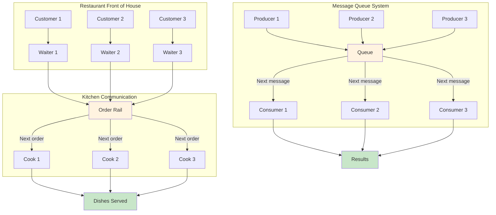
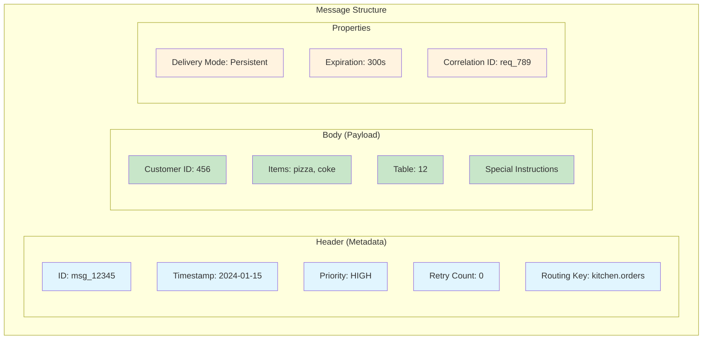
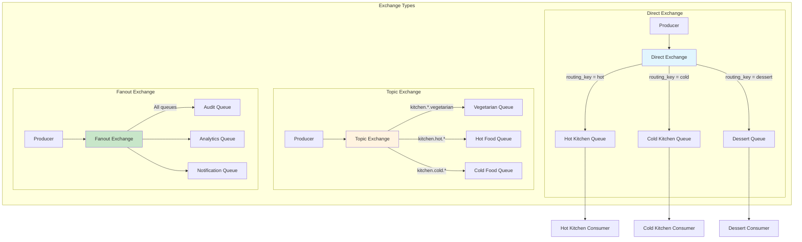
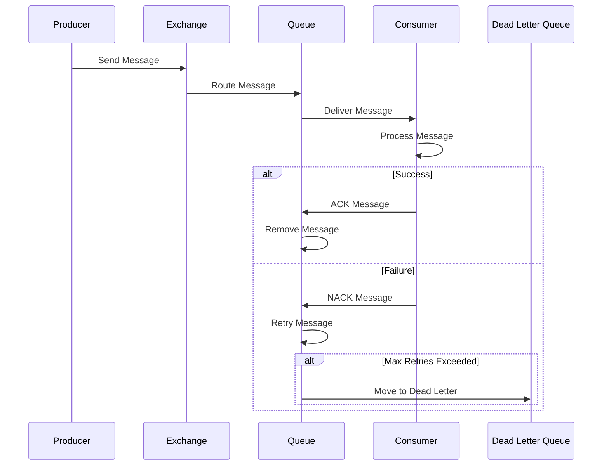

# Key Abstractions: The Building Blocks of Asynchronous Communication

## The Restaurant Order System: A Perfect Mental Model

Before diving into technical details, let's establish a clear mental model. A message queue system works exactly like a restaurant's order management system:



This analogy maps perfectly to message queue concepts and will guide our understanding throughout this tutorial.

## The Four Core Abstractions

### 1. The Queue: The Order Rail

The **queue** is the central data structure—a line of messages waiting to be processed. Think of it as the order rail in a restaurant kitchen where tickets hang in sequence.

**Key Properties:**
- **FIFO Behavior**: First In, First Out (usually)
- **Durability**: Messages persist even if the system crashes
- **Bounded or Unbounded**: Can have size limits or grow indefinitely
- **Visibility**: Messages become visible to consumers when ready

**Real-World Analogy**: The order rail holds tickets in order, survives kitchen chaos, and has physical space limits.

### 2. The Producer: The Waiter

The **producer** creates and sends messages to the queue. Like a waiter taking orders and putting tickets on the rail.

**Key Responsibilities:**
- **Message Creation**: Format data into queue-compatible messages
- **Queue Selection**: Choose which queue to send to (different stations)
- **Error Handling**: Deal with queue unavailability
- **Batching**: Optionally group messages for efficiency

**Code Metaphor:**
```python
# Producer sending a message
queue.send(Message(
    body={"order_id": 123, "items": ["burger", "fries"]},
    priority=HIGH,
    routing_key="kitchen.orders"
))
```

### 3. The Consumer: The Cook

The **consumer** retrieves and processes messages from the queue. Like a cook taking orders from the rail and preparing dishes.

**Key Responsibilities:**
- **Message Retrieval**: Pull messages from the queue
- **Processing**: Execute business logic on message content
- **Acknowledgment**: Confirm successful processing
- **Error Handling**: Deal with processing failures

**Code Metaphor:**
```python
# Consumer processing messages
def process_order(message):
    order = message.body
    prepare_dish(order)
    message.ack()  # Acknowledge completion
```

### 4. The Acknowledgment: The Completed Order

The **acknowledgment** (ACK) is the consumer's signal that a message was processed successfully. Like a cook marking an order as "ready" and removing the ticket from the rail.

**Critical Role:**
- **Reliability**: Ensures messages aren't lost during processing
- **Retry Logic**: Unacknowledged messages can be retried
- **Flow Control**: Prevents overwhelming slow consumers

## Advanced Abstractions

### Message Structure: The Order Ticket

Every message has a standard structure, like a restaurant order ticket:



**Visual Ticket Representation:**
```
┌───────────────────────────────┐
│ 🎫 ORDER TICKET #msg_12345   │
│ 🕰️  2024-01-15 14:30:00      │
│ ⚡ Priority: HIGH            │
│ 🔁 Retry: 0/3               │
├───────────────────────────────┤
│ 🍽️ Customer: 456             │
│ 🍕 Items: pizza, coke        │
│ 🪑 Table: 12                │
│ 📝 Special: Extra cheese     │
└───────────────────────────────┘
```

### Exchange: The Order Distribution System

An **exchange** (in systems like RabbitMQ) is like a restaurant's order distribution system. It receives orders from waiters and routes them to appropriate queues based on rules.

**Types of Exchanges:**
- **Direct**: Route to specific queues (like specific kitchen stations)
- **Topic**: Route based on patterns (like "kitchen.orders.vegetarian")
- **Fanout**: Send to all queues (like announcements to all stations)



### Dead Letter Queue: The Problem Orders

A **dead letter queue** is like a "problem orders" clipboard where tickets that can't be processed are placed for manager review.

**When Messages Go Here:**
- Maximum retry attempts exceeded
- Message processing consistently fails
- Message format is invalid
- Consumer explicitly rejects the message

### Message Broker: The Restaurant Management System

The **message broker** is the entire restaurant management system—the software that coordinates queues, routing, persistence, and monitoring.

**Popular Brokers:**
- **RabbitMQ**: Full-featured, reliable, complex
- **Redis**: Fast, simple, less durable
- **Apache Kafka**: High-throughput, streaming-focused
- **AWS SQS**: Managed, scalable, pay-per-use

## Putting It All Together: The Complete Flow

Here's how all abstractions work together in a typical message flow:



## The Abstraction Hierarchy

Understanding how these abstractions relate is crucial:

```
Message Broker
├── Exchanges (Routing Logic)
├── Queues (Storage)
│   ├── Primary Queue
│   └── Dead Letter Queue
├── Connections (Network)
└── Channels (Multiplexing)
```

## Key Takeaways

1. **Queue = Order Rail**: Central storage for messages awaiting processing
2. **Producer = Waiter**: Creates and sends messages
3. **Consumer = Cook**: Retrieves and processes messages
4. **Acknowledgment = Completion**: Confirms successful processing
5. **Exchange = Distribution System**: Routes messages to appropriate queues
6. **Message Broker = Restaurant System**: Coordinates everything

These abstractions work together to create a robust, scalable communication system that can handle failures gracefully while maintaining message ordering and delivery guarantees.

The beauty of message queues lies in how these simple abstractions combine to solve complex distributed system problems. Just as a restaurant can handle hundreds of orders simultaneously without chaos, message queues enable systems to process thousands of requests reliably and efficiently.