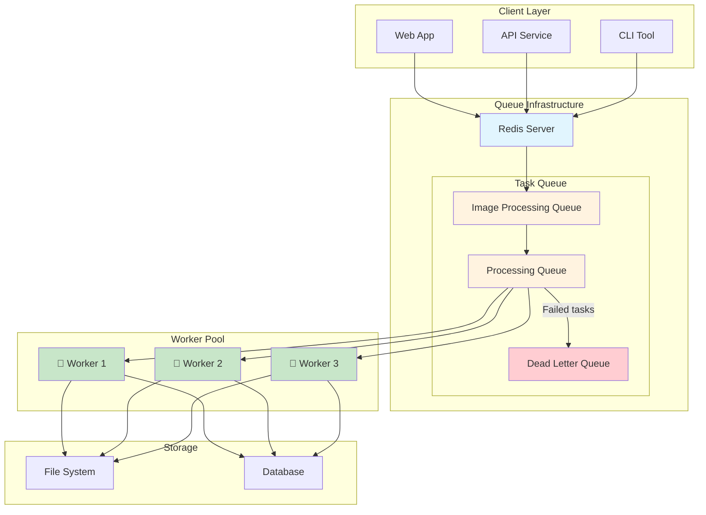
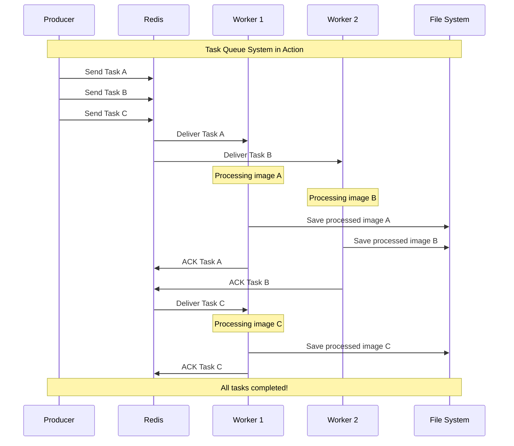
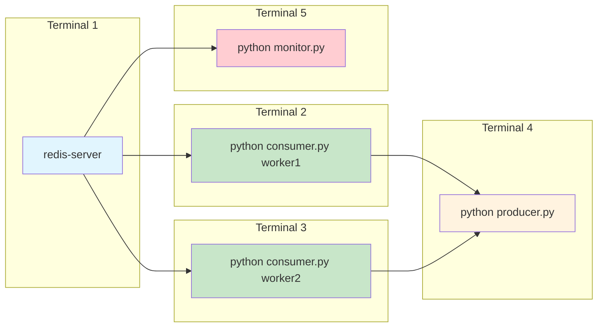
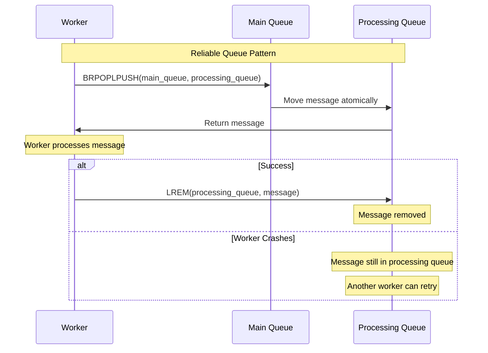
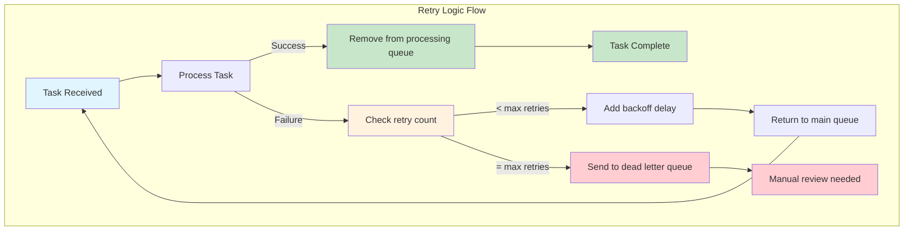
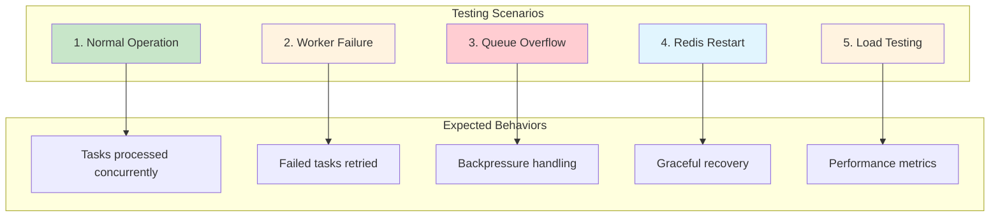
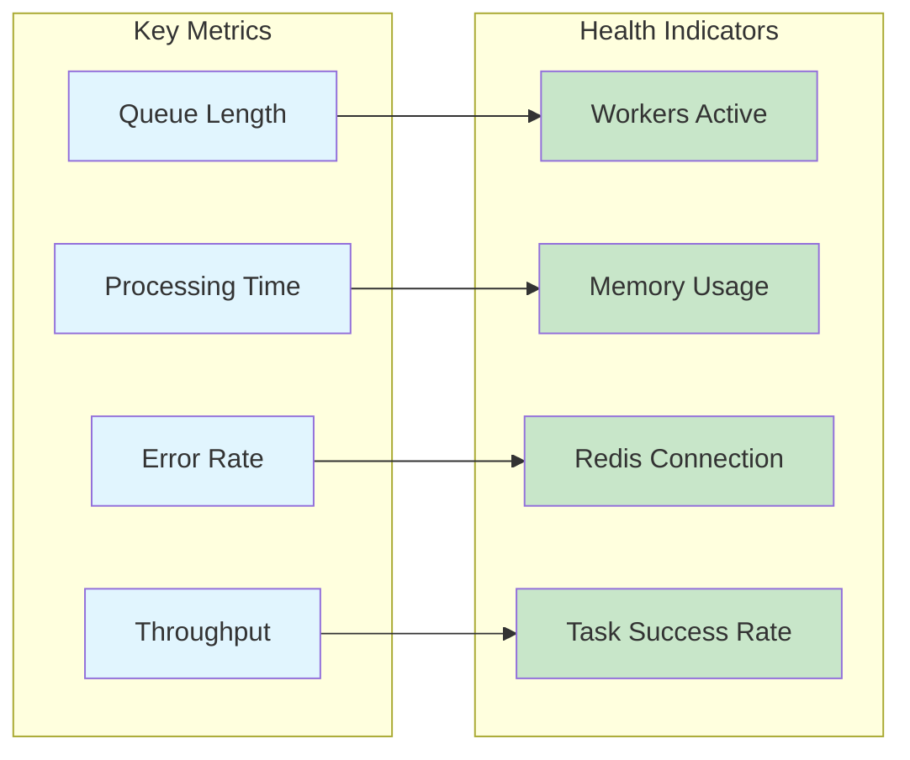

# Simple Task Queue: Your First Message Queue Implementation

## What We're Building

We'll create a simple task queue system that distributes work among multiple workers. Think of it as a pizza restaurant where order tickets are placed on a rail and multiple cooks grab tickets to prepare orders.

**Our Goal**: Send image processing tasks to a queue and have multiple workers process them concurrently.

## Prerequisites

- **Redis**: Our message broker (lightweight and perfect for learning)
- **Python 3.7+**: For our producer and consumer code
- **redis-py**: Python Redis client

### Installation

```bash
# Install Redis (macOS)
brew install redis

# Install Redis (Ubuntu)
sudo apt-get install redis-server

# Start Redis
redis-server

# Install Python dependencies
pip install redis pillow
```

## The Task Queue Architecture



## Step 1: The Producer (Task Sender)

Create `producer.py` to send image processing tasks:

```python
import redis
import json
import uuid
from datetime import datetime

class ImageTaskProducer:
    def __init__(self, redis_host='localhost', redis_port=6379):
        self.redis_client = redis.Redis(host=redis_host, port=redis_port, decode_responses=True)
        self.queue_name = 'image_processing_tasks'
    
    def send_task(self, image_path, operation='resize', width=800, height=600):
        """Send an image processing task to the queue"""
        task = {
            'id': str(uuid.uuid4()),
            'image_path': image_path,
            'operation': operation,
            'width': width,
            'height': height,
            'created_at': datetime.now().isoformat(),
            'status': 'pending'
        }
        
        # Push task to Redis list (our queue)
        self.redis_client.lpush(self.queue_name, json.dumps(task))
        print(f"Task {task['id']} sent to queue")
        return task['id']
    
    def get_queue_length(self):
        """Check how many tasks are waiting"""
        return self.redis_client.llen(self.queue_name)

# Usage example
if __name__ == "__main__":
    producer = ImageTaskProducer()
    
    # Send several tasks
    images = [
        "photos/vacation1.jpg",
        "photos/vacation2.jpg", 
        "photos/vacation3.jpg"
    ]
    
    for image in images:
        producer.send_task(image, operation='resize', width=1200, height=800)
    
    print(f"Queue length: {producer.get_queue_length()}")
```

## Step 2: The Consumer (Task Worker)

Create `consumer.py` to process tasks:

```python
import redis
import json
import time
import signal
import sys
from PIL import Image
import os

class ImageTaskConsumer:
    def __init__(self, worker_id, redis_host='localhost', redis_port=6379):
        self.worker_id = worker_id
        self.redis_client = redis.Redis(host=redis_host, port=redis_port, decode_responses=True)
        self.queue_name = 'image_processing_tasks'
        self.processing_queue = f"{self.queue_name}:processing"
        self.running = True
        
        # Handle graceful shutdown
        signal.signal(signal.SIGINT, self.shutdown)
        signal.signal(signal.SIGTERM, self.shutdown)
    
    def shutdown(self, signum, frame):
        """Graceful shutdown handler"""
        print(f"Worker {self.worker_id} shutting down...")
        self.running = False
    
    def process_image(self, task):
        """Process a single image task"""
        try:
            image_path = task['image_path']
            operation = task['operation']
            width = task['width']
            height = task['height']
            
            print(f"Worker {self.worker_id} processing {task['id']}: {image_path}")
            
            # Simulate processing time
            time.sleep(2)
            
            # In a real implementation, you'd process the image:
            # with Image.open(image_path) as img:
            #     resized = img.resize((width, height))
            #     output_path = f"processed_{os.path.basename(image_path)}"
            #     resized.save(output_path)
            
            print(f"Worker {self.worker_id} completed {task['id']}")
            return True
            
        except Exception as e:
            print(f"Worker {self.worker_id} failed to process {task['id']}: {e}")
            return False
    
    def run(self):
        """Main worker loop"""
        print(f"Worker {self.worker_id} starting...")
        
        while self.running:
            try:
                # Blocking pop with timeout (reliable queue pattern)
                result = self.redis_client.brpoplpush(
                    self.queue_name, 
                    self.processing_queue, 
                    timeout=1
                )
                
                if result:
                    task = json.loads(result)
                    
                    # Process the task
                    success = self.process_image(task)
                    
                    if success:
                        # Remove from processing queue (acknowledge)
                        self.redis_client.lrem(self.processing_queue, 1, result)
                    else:
                        # Put back in main queue for retry
                        self.redis_client.lrem(self.processing_queue, 1, result)
                        self.redis_client.lpush(self.queue_name, result)
                        
            except redis.RedisError as e:
                print(f"Redis error: {e}")
                time.sleep(1)
            except Exception as e:
                print(f"Unexpected error: {e}")
                time.sleep(1)
        
        print(f"Worker {self.worker_id} stopped")

# Usage example
if __name__ == "__main__":
    worker_id = sys.argv[1] if len(sys.argv) > 1 else "default"
    consumer = ImageTaskConsumer(worker_id)
    consumer.run()
```

## Step 3: Running the System

### The Complete System Flow



### Terminal Setup



### Terminal Commands

**Terminal 1: Start Redis**
```bash
redis-server
```

**Terminal 2: Start First Worker**
```bash
python consumer.py worker1
```

**Terminal 3: Start Second Worker**
```bash
python consumer.py worker2
```

**Terminal 4: Send Tasks**
```bash
python producer.py
```

**Terminal 5: Monitor Queue**
```bash
python monitor.py
```

## Step 4: Monitoring Your Queue

Create `monitor.py` to observe queue activity:

```python
import redis
import time
import json

class QueueMonitor:
    def __init__(self):
        self.redis_client = redis.Redis(host='localhost', port=6379, decode_responses=True)
        self.queue_name = 'image_processing_tasks'
        self.processing_queue = f"{self.queue_name}:processing"
    
    def show_status(self):
        """Display current queue status"""
        pending = self.redis_client.llen(self.queue_name)
        processing = self.redis_client.llen(self.processing_queue)
        
        print(f"Queue Status:")
        print(f"  Pending tasks: {pending}")
        print(f"  Processing tasks: {processing}")
        print(f"  Total active: {pending + processing}")
        
        # Show some pending tasks
        if pending > 0:
            print(f"\\nNext few tasks:")
            tasks = self.redis_client.lrange(self.queue_name, 0, 2)
            for i, task_json in enumerate(tasks):
                task = json.loads(task_json)
                print(f"  {i+1}. {task['id']} - {task['image_path']}")
    
    def monitor(self):
        """Continuously monitor the queue"""
        try:
            while True:
                self.show_status()
                print("-" * 40)
                time.sleep(3)
        except KeyboardInterrupt:
            print("\\nMonitoring stopped")

if __name__ == "__main__":
    monitor = QueueMonitor()
    monitor.monitor()
```

## Key Patterns Demonstrated

### 1. **Reliable Queue Pattern**
Using `BRPOPLPUSH` instead of simple `BRPOP` ensures messages aren't lost if a worker crashes:



**Code Comparison:**
```python
# Unreliable: message lost if worker crashes
message = redis_client.brpop(queue_name, timeout=1)

# Reliable: message moved to processing queue
message = redis_client.brpoplpush(queue_name, processing_queue, timeout=1)
```

### 2. **Graceful Shutdown**
Workers handle signals properly and finish current tasks before stopping:

```mermaid
flowchart TD
    subgraph "Graceful Shutdown Process"
        S[Signal Received] --> F[Set shutdown flag]
        F --> C[Complete current task]
        C --> D[Drain processing queue]
        D --> R[Release resources]
        R --> E[Exit cleanly]
    end
    
    subgraph "What NOT to do"
        KS[Kill Signal] --> A[Abrupt termination]
        A --> L[Lost messages]
        L --> P[Partial processing]
    end
    
    style S fill:#c8e6c9
    style E fill:#c8e6c9
    style KS fill:#ffcdd2
    style L fill:#ffcdd2
    style P fill:#ffcdd2
```



**Implementation:**
```python
signal.signal(signal.SIGINT, self.shutdown)
signal.signal(signal.SIGTERM, self.shutdown)
```

### 3. **Retry Logic**
Failed tasks are returned to the queue for retry:



**Implementation:**
```python
if success:
    # Remove from processing queue
    self.redis_client.lrem(self.processing_queue, 1, result)
else:
    # Put back in main queue for retry
    self.redis_client.lrem(self.processing_queue, 1, result)
    self.redis_client.lpush(self.queue_name, result)
```

## Testing Your Implementation



### Testing Steps:

1. **Start the system** (Redis + Workers)
2. **Send tasks** using the producer
3. **Watch the magic** as workers process tasks concurrently
4. **Kill a worker** mid-processing and see tasks get retried
5. **Monitor** the queue to understand the flow
6. **Test failure scenarios** to verify reliability
7. **Measure performance** under different loads

### What to Observe:



## What You've Learned

- **Message queues** decouple producers from consumers
- **Multiple workers** can process tasks concurrently
- **Reliable patterns** prevent message loss
- **Monitoring** is crucial for production systems
- **Graceful shutdown** prevents data loss

## Next Steps

This simple implementation gives you the foundation. In production, you'd want:
- **Persistent storage** (Redis with persistence enabled)
- **Message priorities** (different queues for urgent tasks)
- **Dead letter queues** (for permanently failed messages)
- **Metrics and alerting** (queue length, processing time)
- **Scalability** (multiple Redis instances, clustering)

You've just built your first distributed task processing system!