# Delivery Guarantees: The Promise of Message Arrival

## The Three Fundamental Guarantees

In distributed systems, the question isn't "Will my message be delivered?" but rather "How many times will it be delivered?" This distinction is crucial because network failures, system crashes, and timing issues make perfect delivery impossible.

```mermaid
flowchart TD
    subgraph "The Delivery Guarantee Spectrum"
        AM[At Most Once]
        AL[At Least Once]
        EO[Exactly Once]
        
        AM --> |"Higher Performance"| AL
        AL --> |"Higher Reliability"| EO
        EO --> |"Higher Complexity"| AM
    end
    
    subgraph "Characteristics"
        AM_C["🚀 Fast, may lose messages"]
        AL_C["🔄 Reliable, may duplicate"]
        EO_C["💎 Perfect, expensive"]
    end
    
    subgraph "Trade-offs"
        PERF[Performance]
        REL[Reliability]
        COMP[Complexity]
        
        PERF --> |"Best"| AM_C
        COMP --> |"Lowest"| AM_C
        REL --> |"Balanced"| AL_C
        REL --> |"Highest"| EO_C
        COMP --> |"Highest"| EO_C
    end
    
    AM -.-> AM_C
    AL -.-> AL_C
    EO -.-> EO_C
    
    style AM fill:#e1f5fe
    style AL fill:#fff3e0
    style EO fill:#c8e6c9
    style AM_C fill:#e1f5fe
    style AL_C fill:#fff3e0
    style EO_C fill:#c8e6c9
```



Message queues offer three primary delivery guarantees, each with distinct trade-offs:

## At-Most-Once Delivery: The Fire-and-Forget Approach

### The Promise
"Your message will be delivered zero or one times—never more."

### The Reality
Messages might be lost, but they'll never be duplicated. Think of it like sending a postcard—sometimes it gets lost in the mail, but you never receive duplicates.

### The At-Most-Once Flow


### When It Happens
```python
# Producer sends message
producer.send("process_payment", payment_data)
# Message gets lost due to network failure
# Consumer never receives it
# Payment is never processed ❌
```

### Implementation Example
```python
class AtMostOnceProducer:
    def send_message(self, message):
        try:
            # Fire and forget - no acknowledgment
            self.queue.put(message)
            return True
        except Exception:
            # Don't retry, accept the loss
            return False
```

### Use Cases
- **Metrics and Analytics**: Lost data points are acceptable
- **Log Messages**: Some logs missing won't break the system
- **Real-time Updates**: Latest state matters more than every update
- **Gaming**: Position updates (missing a frame is okay)

### Trade-offs
- **Pros**: Highest performance, simple implementation, no duplicate handling
- **Cons**: Data loss possible, not suitable for critical operations

## At-Least-Once Delivery: The Persistent Approach

### The Promise
"Your message will be delivered at least once—maybe more."

### The Reality
Messages are guaranteed to arrive but might be processed multiple times. Like a persistent friend who keeps calling until you answer—sometimes you pick up multiple calls.

### The At-Least-Once Flow


### When It Happens
```python
# Producer sends message
producer.send("process_payment", payment_data)
# Consumer receives and processes message
consumer.process_payment(payment_data)
# Network failure before acknowledgment
# Message gets redelivered
consumer.process_payment(payment_data)  # Duplicate!
```

### Implementation Example
```python
class AtLeastOnceConsumer:
    def process_message(self, message):
        max_retries = 3
        for attempt in range(max_retries):
            try:
                # Process the message
                self.handle_message(message)
                # Acknowledge success
                message.ack()
                return
            except Exception as e:
                if attempt == max_retries - 1:
                    # Send to dead letter queue
                    self.dead_letter_queue.send(message)
                else:
                    # Retry after delay
                    time.sleep(2 ** attempt)
```

### Handling Duplicates: Idempotency
The key to at-least-once delivery is making operations **idempotent**—safe to perform multiple times:

```python
# NOT idempotent - creates duplicate charges
def process_payment(payment_data):
    charge_amount = payment_data['amount']
    customer_account.charge(charge_amount)

# Idempotent - safe to call multiple times
def process_payment(payment_data):
    payment_id = payment_data['id']
    if not self.payment_exists(payment_id):
        charge_amount = payment_data['amount']
        customer_account.charge(charge_amount)
        self.record_payment(payment_id)
```

### Use Cases
- **Financial Transactions**: Must not be lost, duplicates handled by idempotency
- **Order Processing**: Critical business operations
- **Email Notifications**: Better to send twice than not at all
- **Database Updates**: Use transaction IDs to prevent duplicates

### Trade-offs
- **Pros**: No data loss, reliable delivery, good performance
- **Cons**: Requires duplicate handling, more complex consumer logic

## Exactly-Once Delivery: The Holy Grail

### The Promise
"Your message will be delivered exactly once—no more, no less."

### The Reality
True exactly-once delivery is theoretically impossible in distributed systems due to the [FLP impossibility result](https://en.wikipedia.org/wiki/FLP_impossibility). What we get is "effectively exactly-once" through sophisticated coordination.

### The Exactly-Once Flow


### How It Works
Exactly-once delivery requires distributed transactions and coordination.

### Implementation Example (Kafka)
```python
class ExactlyOnceProcessor:
    def __init__(self):
        # Enable exactly-once semantics
        self.producer = KafkaProducer(
            enable_idempotence=True,
            transactional_id='my-app-processor'
        )
        self.consumer = KafkaConsumer(
            isolation_level='read_committed'
        )
    
    def process_message(self, message):
        # Begin transaction
        self.producer.begin_transaction()
        
        try:
            # Process the message
            result = self.handle_message(message)
            
            # Write result to output topic
            self.producer.send('output-topic', result)
            
            # Commit consumer offset and producer writes together
            self.producer.send_offsets_to_transaction(
                self.consumer.get_offsets(), 
                self.consumer.group_id
            )
            
            # Commit transaction
            self.producer.commit_transaction()
            
        except Exception:
            # Rollback everything
            self.producer.abort_transaction()
            raise
```

### Use Cases
- **Financial Systems**: Money transfers, payments
- **Inventory Management**: Stock updates
- **Compliance Systems**: Audit trails
- **State Machines**: Critical state transitions

### Trade-offs
- **Pros**: Perfect delivery semantics, data consistency
- **Cons**: Highest latency, complex implementation, lower throughput

## The CAP Theorem Reality

The choice between delivery guarantees reflects the CAP theorem:


**The Reality:**
- **At-Most-Once**: Chooses Availability over Consistency
- **At-Least-Once**: Balances Consistency and Availability
- **Exactly-Once**: Prioritizes Consistency over Availability

## Choosing the Right Guarantee

### Decision Matrix

| Scenario | Data Loss Tolerance | Duplicate Tolerance | Performance Need | Recommendation |
|----------|-------------------|-------------------|------------------|----------------|
| Web Analytics | High | High | High | At-Most-Once |
| Order Processing | None | Low | Medium | At-Least-Once + Idempotency |
| Payment Processing | None | None | Low | Exactly-Once |
| Real-time Gaming | Medium | High | Highest | At-Most-Once |
| Email Notifications | Low | Medium | Medium | At-Least-Once |

### Hybrid Approaches

Many systems use different guarantees for different message types:

```python
class HybridMessageSystem:
    def send_message(self, message_type, data):
        if message_type == 'analytics':
            self.at_most_once_queue.send(data)
        elif message_type == 'order':
            self.at_least_once_queue.send(data)
        elif message_type == 'payment':
            self.exactly_once_queue.send(data)
```

## Implementation Patterns

### Circuit Breaker for At-Least-Once
```python
class ReliableConsumer:
    def __init__(self):
        self.circuit_breaker = CircuitBreaker(
            failure_threshold=5,
            recovery_timeout=60
        )
    
    def process_message(self, message):
        if self.circuit_breaker.is_open():
            # Temporarily stop processing
            message.nack()
            return
        
        try:
            self.handle_message(message)
            message.ack()
            self.circuit_breaker.record_success()
        except Exception as e:
            self.circuit_breaker.record_failure()
            message.nack()
```

### Deduplication for At-Least-Once
```python
class DeduplicatingConsumer:
    def __init__(self):
        self.processed_messages = set()
    
    def process_message(self, message):
        message_id = message.get_id()
        
        if message_id in self.processed_messages:
            # Already processed, just acknowledge
            message.ack()
            return
        
        try:
            self.handle_message(message)
            self.processed_messages.add(message_id)
            message.ack()
        except Exception:
            message.nack()
```

## Performance Characteristics


### Performance Trade-offs


### Real-World Numbers
- **At-Most-Once**: ~1ms latency, 100,000 msg/sec
- **At-Least-Once**: ~10ms latency, 50,000 msg/sec  
- **Exactly-Once**: ~100ms latency, 5,000 msg/sec

## The Bottom Line

Delivery guarantees are about making explicit trade-offs:

- **At-Most-Once**: Choose when speed matters more than completeness
- **At-Least-Once**: Choose when reliability matters more than simplicity
- **Exactly-Once**: Choose when correctness matters more than performance

Understanding these guarantees helps you design systems that meet your specific requirements while managing the inherent challenges of distributed communication. The key is not to seek perfection, but to choose the right level of guarantee for each use case.