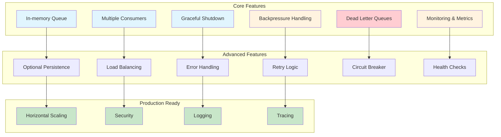
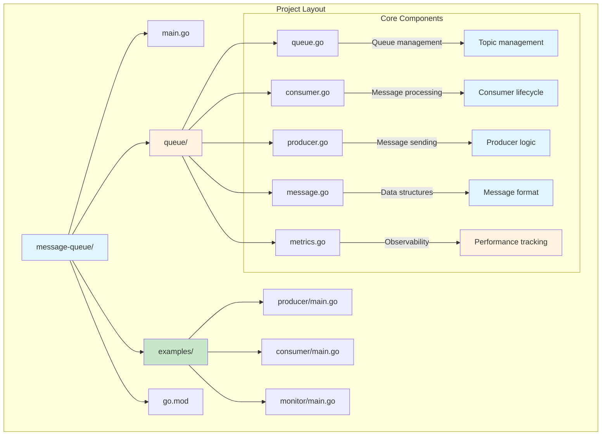
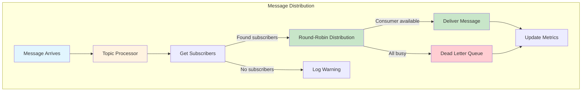
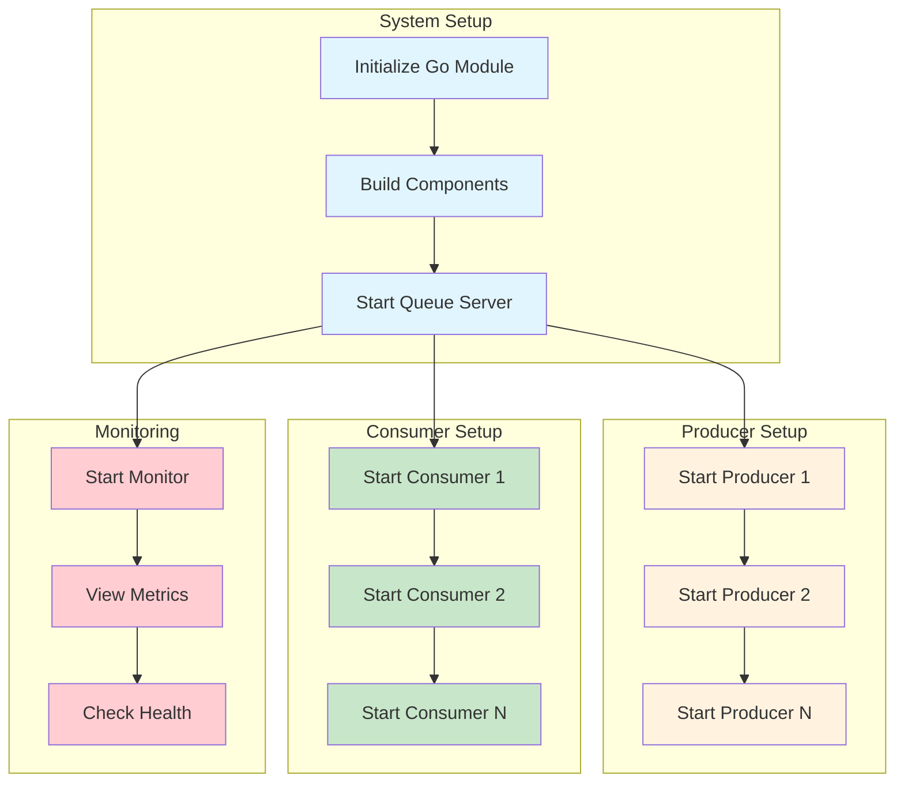
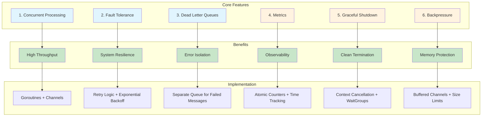
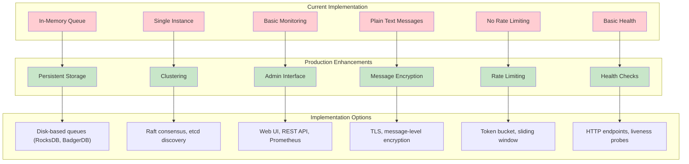

# Go Implementation: Building a Production-Ready Message Queue

## Why Go for Message Queues?

Go's concurrency model, built-in channels, and performance characteristics make it ideal for building message queue systems. We'll implement a lightweight, production-ready queue that demonstrates core concepts while being genuinely useful.

## What We're Building

A complete message queue system with:



**Key Components:**
- **In-memory queue** with optional persistence
- **Multiple consumers** with load balancing
- **Graceful shutdown** and error handling
- **Monitoring** and metrics
- **Backpressure** handling
- **Dead letter queues** for failed messages

## Project Structure



**Directory Structure:**
```
message-queue/
├── main.go
├── queue/
│   ├── queue.go
│   ├── consumer.go
│   ├── producer.go
│   ├── message.go
│   └── metrics.go
├── examples/
│   ├── producer/main.go
│   ├── consumer/main.go
│   └── monitor/main.go
└── go.mod
```

## Core Message Structure

Let's start with the fundamental message type:

```go
// queue/message.go
package queue

import (
    "time"
    "encoding/json"
)

// Message represents a single message in the queue
type Message struct {
    ID          string                 `json:"id"`
    Topic       string                 `json:"topic"`
    Payload     []byte                 `json:"payload"`
    Headers     map[string]string      `json:"headers"`
    CreatedAt   time.Time              `json:"created_at"`
    Attempts    int                    `json:"attempts"`
    MaxAttempts int                    `json:"max_attempts"`
    Delay       time.Duration          `json:"delay"`
}

// NewMessage creates a new message with default values
func NewMessage(topic string, payload []byte) *Message {
    return &Message{
        ID:          generateID(),
        Topic:       topic,
        Payload:     payload,
        Headers:     make(map[string]string),
        CreatedAt:   time.Now(),
        Attempts:    0,
        MaxAttempts: 3,
        Delay:       0,
    }
}

// IsExpired checks if message has exceeded max attempts
func (m *Message) IsExpired() bool {
    return m.Attempts >= m.MaxAttempts
}

// ShouldDelay checks if message should be delayed
func (m *Message) ShouldDelay() bool {
    return m.Delay > 0
}

// generateID creates a unique message ID
func generateID() string {
    return fmt.Sprintf("%d-%s", time.Now().UnixNano(), 
        randomString(8))
}

func randomString(length int) string {
    const charset = "abcdefghijklmnopqrstuvwxyz0123456789"
    b := make([]byte, length)
    for i := range b {
        b[i] = charset[rand.Intn(len(charset))]
    }
    return string(b)
}
```

## The Core Queue Implementation

```go
// queue/queue.go
package queue

import (
    "context"
    "sync"
    "time"
    "log"
    "container/heap"
)

// Queue represents the main message queue
type Queue struct {
    topics      map[string]*Topic
    mu          sync.RWMutex
    consumers   map[string]*Consumer
    deadLetter  *Topic
    metrics     *Metrics
    shutdown    chan struct{}
    done        chan struct{}
}

// Topic represents a message topic/channel
type Topic struct {
    name        string
    messages    chan *Message
    subscribers []chan *Message
    mu          sync.RWMutex
    buffer      int
}

// NewQueue creates a new message queue
func NewQueue() *Queue {
    q := &Queue{
        topics:     make(map[string]*Topic),
        consumers:  make(map[string]*Consumer),
        deadLetter: NewTopic("_dead_letter", 1000),
        metrics:    NewMetrics(),
        shutdown:   make(chan struct{}),
        done:       make(chan struct{}),
    }
    
    // Start background processes
    go q.processDelayedMessages()
    go q.processMetrics()
    
    return q
}

// NewTopic creates a new topic
func NewTopic(name string, buffer int) *Topic {
    return &Topic{
        name:        name,
        messages:    make(chan *Message, buffer),
        subscribers: make([]chan *Message, 0),
        buffer:      buffer,
    }
}

// GetOrCreateTopic returns existing topic or creates new one
func (q *Queue) GetOrCreateTopic(name string) *Topic {
    q.mu.Lock()
    defer q.mu.Unlock()
    
    if topic, exists := q.topics[name]; exists {
        return topic
    }
    
    topic := NewTopic(name, 100) // Default buffer size
    q.topics[name] = topic
    go q.processTopic(topic)
    
    return topic
}

// Publish sends a message to a topic
func (q *Queue) Publish(topic string, payload []byte) error {
    t := q.GetOrCreateTopic(topic)
    message := NewMessage(topic, payload)
    
    select {
    case t.messages <- message:
        q.metrics.IncrementPublished(topic)
        return nil
    default:
        return ErrQueueFull
    }
}

// Subscribe creates a consumer for a topic
func (q *Queue) Subscribe(topic string, handler MessageHandler) *Consumer {
    t := q.GetOrCreateTopic(topic)
    consumer := NewConsumer(topic, handler, q)
    
    q.mu.Lock()
    q.consumers[consumer.ID] = consumer
    q.mu.Unlock()
    
    // Add consumer channel to topic subscribers
    t.mu.Lock()
    t.subscribers = append(t.subscribers, consumer.messages)
    t.mu.Unlock()
    
    go consumer.Start()
    return consumer
}

// processTopic handles message distribution for a topic
func (q *Queue) processTopic(topic *Topic) {
    for {
        select {
        case message := <-topic.messages:
            q.distributeMessage(topic, message)
        case <-q.shutdown:
            return
        }
    }
}

// distributeMessage sends message to next available consumer
func (q *Queue) distributeMessage(topic *Topic, message *Message) {
    topic.mu.RLock()
    subscribers := topic.subscribers
    topic.mu.RUnlock()
    
    if len(subscribers) == 0 {
        log.Printf("No subscribers for topic %s", topic.name)
        return
    }
    
    // Round-robin distribution
    for _, subscriber := range subscribers {
        select {
        case subscriber <- message:
            q.metrics.IncrementDelivered(topic.name)
            return
        default:
            // Consumer is busy, try next one
            continue
        }
    }
    
    // All consumers busy, send to dead letter
    q.sendToDeadLetter(message)
}

// Message Distribution Flow
/*

*/

// sendToDeadLetter sends failed messages to dead letter queue
func (q *Queue) sendToDeadLetter(message *Message) {
    select {
    case q.deadLetter.messages <- message:
        q.metrics.IncrementDeadLetter(message.Topic)
    default:
        log.Printf("Dead letter queue full, dropping message %s", message.ID)
    }
}

// processDelayedMessages handles delayed message processing
func (q *Queue) processDelayedMessages() {
    ticker := time.NewTicker(1 * time.Second)
    defer ticker.Stop()
    
    for {
        select {
        case <-ticker.C:
            // Process delayed messages (implementation depends on storage)
        case <-q.shutdown:
            return
        }
    }
}

// Shutdown gracefully shuts down the queue
func (q *Queue) Shutdown(ctx context.Context) error {
    close(q.shutdown)
    
    // Wait for all consumers to finish
    q.mu.RLock()
    for _, consumer := range q.consumers {
        consumer.Stop()
    }
    q.mu.RUnlock()
    
    // Wait for shutdown or timeout
    select {
    case <-q.done:
        return nil
    case <-ctx.Done():
        return ctx.Err()
    }
}

// Custom errors
var (
    ErrQueueFull = errors.New("queue is full")
    ErrTopicNotFound = errors.New("topic not found")
)
```

## Consumer Implementation

```go
// queue/consumer.go
package queue

import (
    "context"
    "log"
    "time"
    "sync"
)

// MessageHandler processes messages
type MessageHandler func(message *Message) error

// Consumer represents a message consumer
type Consumer struct {
    ID       string
    Topic    string
    Handler  MessageHandler
    messages chan *Message
    queue    *Queue
    shutdown chan struct{}
    done     chan struct{}
    mu       sync.RWMutex
}

// NewConsumer creates a new consumer
func NewConsumer(topic string, handler MessageHandler, queue *Queue) *Consumer {
    return &Consumer{
        ID:       generateID(),
        Topic:    topic,
        Handler:  handler,
        messages: make(chan *Message, 10),
        queue:    queue,
        shutdown: make(chan struct{}),
        done:     make(chan struct{}),
    }
}

// Start begins consuming messages
func (c *Consumer) Start() {
    defer close(c.done)
    
    for {
        select {
        case message := <-c.messages:
            c.processMessage(message)
        case <-c.shutdown:
            return
        }
    }
}

// processMessage handles individual message processing
func (c *Consumer) processMessage(message *Message) {
    message.Attempts++
    
    start := time.Now()
    err := c.Handler(message)
    duration := time.Since(start)
    
    if err != nil {
        log.Printf("Consumer %s failed to process message %s: %v", 
            c.ID, message.ID, err)
        c.queue.metrics.IncrementFailed(message.Topic)
        
        if message.IsExpired() {
            c.queue.sendToDeadLetter(message)
        } else {
            // Retry with exponential backoff
            c.retryMessage(message)
        }
    } else {
        c.queue.metrics.IncrementProcessed(message.Topic)
        c.queue.metrics.RecordProcessingTime(message.Topic, duration)
        log.Printf("Consumer %s processed message %s in %v", 
            c.ID, message.ID, duration)
    }
}

// retryMessage handles message retry logic
func (c *Consumer) retryMessage(message *Message) {
    // Exponential backoff
    delay := time.Duration(message.Attempts) * time.Second
    
    go func() {
        time.Sleep(delay)
        
        select {
        case c.messages <- message:
            // Successfully requeued
        default:
            // Consumer queue full, send to dead letter
            c.queue.sendToDeadLetter(message)
        }
    }()
}

// Stop gracefully stops the consumer
func (c *Consumer) Stop() {
    close(c.shutdown)
    <-c.done
}
```

## Producer Implementation

```go
// queue/producer.go
package queue

import (
    "encoding/json"
    "log"
)

// Producer sends messages to the queue
type Producer struct {
    queue *Queue
    topic string
}

// NewProducer creates a new producer
func NewProducer(queue *Queue, topic string) *Producer {
    return &Producer{
        queue: queue,
        topic: topic,
    }
}

// Send publishes a message
func (p *Producer) Send(payload interface{}) error {
    data, err := json.Marshal(payload)
    if err != nil {
        return err
    }
    
    return p.queue.Publish(p.topic, data)
}

// SendWithHeaders publishes a message with headers
func (p *Producer) SendWithHeaders(payload interface{}, headers map[string]string) error {
    data, err := json.Marshal(payload)
    if err != nil {
        return err
    }
    
    message := NewMessage(p.topic, data)
    message.Headers = headers
    
    topic := p.queue.GetOrCreateTopic(p.topic)
    select {
    case topic.messages <- message:
        p.queue.metrics.IncrementPublished(p.topic)
        return nil
    default:
        return ErrQueueFull
    }
}

// SendBatch publishes multiple messages
func (p *Producer) SendBatch(payloads []interface{}) error {
    for _, payload := range payloads {
        if err := p.Send(payload); err != nil {
            return err
        }
    }
    return nil
}
```

## Metrics and Monitoring

```go
// queue/metrics.go
package queue

import (
    "sync"
    "time"
)

// Metrics tracks queue performance
type Metrics struct {
    Published      map[string]int64
    Delivered      map[string]int64
    Processed      map[string]int64
    Failed         map[string]int64
    DeadLetter     map[string]int64
    ProcessingTime map[string][]time.Duration
    mu             sync.RWMutex
}

// NewMetrics creates new metrics instance
func NewMetrics() *Metrics {
    return &Metrics{
        Published:      make(map[string]int64),
        Delivered:      make(map[string]int64),
        Processed:      make(map[string]int64),
        Failed:         make(map[string]int64),
        DeadLetter:     make(map[string]int64),
        ProcessingTime: make(map[string][]time.Duration),
    }
}

// IncrementPublished increments published message count
func (m *Metrics) IncrementPublished(topic string) {
    m.mu.Lock()
    m.Published[topic]++
    m.mu.Unlock()
}

// IncrementDelivered increments delivered message count
func (m *Metrics) IncrementDelivered(topic string) {
    m.mu.Lock()
    m.Delivered[topic]++
    m.mu.Unlock()
}

// IncrementProcessed increments processed message count
func (m *Metrics) IncrementProcessed(topic string) {
    m.mu.Lock()
    m.Processed[topic]++
    m.mu.Unlock()
}

// IncrementFailed increments failed message count
func (m *Metrics) IncrementFailed(topic string) {
    m.mu.Lock()
    m.Failed[topic]++
    m.mu.Unlock()
}

// IncrementDeadLetter increments dead letter count
func (m *Metrics) IncrementDeadLetter(topic string) {
    m.mu.Lock()
    m.DeadLetter[topic]++
    m.mu.Unlock()
}

// RecordProcessingTime records message processing time
func (m *Metrics) RecordProcessingTime(topic string, duration time.Duration) {
    m.mu.Lock()
    m.ProcessingTime[topic] = append(m.ProcessingTime[topic], duration)
    // Keep only last 1000 entries
    if len(m.ProcessingTime[topic]) > 1000 {
        m.ProcessingTime[topic] = m.ProcessingTime[topic][1:]
    }
    m.mu.Unlock()
}

// GetStats returns current statistics
func (m *Metrics) GetStats() map[string]interface{} {
    m.mu.RLock()
    defer m.mu.RUnlock()
    
    stats := make(map[string]interface{})
    stats["published"] = m.Published
    stats["delivered"] = m.Delivered
    stats["processed"] = m.Processed
    stats["failed"] = m.Failed
    stats["dead_letter"] = m.DeadLetter
    
    return stats
}
```

## Example Usage

### Producer Example

```go
// examples/producer/main.go
package main

import (
    "log"
    "time"
    "your-module/queue"
)

func main() {
    // Create queue
    q := queue.NewQueue()
    defer q.Shutdown(context.Background())
    
    // Create producer
    producer := queue.NewProducer(q, "image-processing")
    
    // Send messages
    for i := 0; i < 10; i++ {
        task := map[string]interface{}{
            "id":        i,
            "image_url": fmt.Sprintf("https://example.com/image-%d.jpg", i),
            "operation": "resize",
            "width":     800,
            "height":    600,
        }
        
        if err := producer.Send(task); err != nil {
            log.Printf("Failed to send message: %v", err)
        } else {
            log.Printf("Sent task %d", i)
        }
        
        time.Sleep(100 * time.Millisecond)
    }
}
```

### Consumer Example

```go
// examples/consumer/main.go
package main

import (
    "context"
    "encoding/json"
    "log"
    "time"
    "your-module/queue"
)

type ImageTask struct {
    ID        int    `json:"id"`
    ImageURL  string `json:"image_url"`
    Operation string `json:"operation"`
    Width     int    `json:"width"`
    Height    int    `json:"height"`
}

func main() {
    // Create queue
    q := queue.NewQueue()
    defer q.Shutdown(context.Background())
    
    // Create consumer
    consumer := q.Subscribe("image-processing", processImageTask)
    
    // Keep running
    select {}
}

func processImageTask(message *queue.Message) error {
    var task ImageTask
    if err := json.Unmarshal(message.Payload, &task); err != nil {
        return err
    }
    
    log.Printf("Processing image task %d: %s", task.ID, task.ImageURL)
    
    // Simulate processing time
    time.Sleep(2 * time.Second)
    
    // Simulate occasional failures
    if task.ID%7 == 0 {
        return fmt.Errorf("simulated processing failure")
    }
    
    log.Printf("Completed image task %d", task.ID)
    return nil
}
```

## Running the System



**Step-by-Step Setup:**

```bash
# Initialize Go module
go mod init message-queue-system

# Build the queue system
go build -o queue-server main.go

# Start the queue server
./queue-server

# In separate terminals:
# Run producer
go run examples/producer/main.go

# Run consumer
go run examples/consumer/main.go

# Run multiple consumers for load balancing
go run examples/consumer/main.go &
go run examples/consumer/main.go &
go run examples/consumer/main.go &

# Monitor the system
go run examples/monitor/main.go
```

**Terminal Layout:**
```
┌─────────────────┬─────────────────┐
│ Terminal 1      │ Terminal 2      │
│ Queue Server    │ Producer        │
│ ./queue-server  │ go run producer │
├─────────────────┼─────────────────┤
│ Terminal 3      │ Terminal 4      │
│ Consumer 1      │ Consumer 2      │
│ go run consumer │ go run consumer │
├─────────────────┼─────────────────┤
│ Terminal 5      │ Terminal 6      │
│ Monitor         │ Logs/Debug      │
│ go run monitor  │ tail -f logs    │
└─────────────────┴─────────────────┘
```

## Key Features Demonstrated



**Feature Details:**
1. **Concurrent Processing**: Multiple consumers can process messages simultaneously
2. **Fault Tolerance**: Failed messages are retried with exponential backoff
3. **Dead Letter Queues**: Permanently failed messages are isolated
4. **Metrics**: Comprehensive tracking of queue performance
5. **Graceful Shutdown**: Proper cleanup and resource management
6. **Backpressure**: Queue size limits prevent memory exhaustion

## Production Considerations



**Production Roadmap:**

```mermaid
gantt
    title Production Enhancement Timeline
    dateFormat  X
    axisFormat %s
    
    section Core Features
    Persistent Storage    :done, storage, 0, 2
    Clustering           :done, cluster, 2, 4
    Health Checks        :done, health, 4, 5
    
    section Scaling
    Rate Limiting        :active, rate, 5, 7
    Load Balancing       :active, balance, 6, 8
    Auto Scaling         :scaling, 8, 10
    
    section Security
    Message Encryption   :crit, encrypt, 7, 9
    Authentication       :auth, 9, 11
    Authorization        :authz, 11, 12
    
    section Monitoring
    Admin Interface      :admin, 5, 8
    Metrics Dashboard    :metrics, 8, 10
    Alerting            :alert, 10, 12
```



**Enhancement Priorities:**
1. **Persistent storage** (disk-based queues)
2. **Clustering** (multiple queue instances)
3. **Admin interface** (web-based monitoring)
4. **Message encryption** (for sensitive data)
5. **Rate limiting** (prevent queue flooding)
6. **Health checks** (monitoring endpoints)

This Go implementation provides a solid foundation for understanding message queue internals while being practical enough for real-world use cases. The modular design makes it easy to add these production features incrementally.