# The Core Problem: When Data Tables Become Unwieldy

Imagine you're running a successful e-commerce platform. Your `orders` table started with a few hundred rows, but now it contains 100 million orders spanning five years. What once was a nimble database query now crawls to a halt.

### The E-commerce Growth Story

**The Exponential Problem**: As data grows linearly, query performance degrades exponentially.

## The Performance Wall: When Size Becomes the Enemy

**Query Performance Degrades**
- Simple queries that once took milliseconds now take minutes
- Index scans become expensive across billions of rows
- Even well-optimized queries struggle with the sheer volume
- Buffer pool can't hold working set in memory

**Maintenance Operations Become Nightmares**
- Creating new indexes can take hours or days
- Database backups grow enormous and time-consuming
- Analyzing table statistics requires scanning massive datasets
- VACUUM/optimization operations lock tables for extended periods

**Storage Limitations**
- Single tables can exceed filesystem limits
- Memory can't hold enough of the table for efficient operations
- Physical storage becomes a bottleneck
- Network I/O saturated during operations

## The Fundamental Challenge: One Size Doesn't Fit All

```mermaid
flowchart LR
    subgraph "Monolithic Table Problem"
        MT["100M Orders Table"] --> H19["2019 Orders<br/>📊 Historical<br/>🔍 Rarely accessed<br/>📦 Archive candidate"]
        MT --> H20["2020 Orders<br/>📊 Archived<br/>🔍 Read-only<br/>📈 Analytics only"]
        MT --> H21["2021-2023 Orders<br/>📊 Analytical<br/>🔍 Monthly reports<br/>📈 BI queries"]
        MT --> H24["2024 Orders<br/>📊 Active<br/>🔍 Daily queries<br/>✏️ Frequent updates"]
    end
    
    subgraph "Uniform Treatment Problem"
        UT["Database treats all data identically"]
        UT --> S1["Same storage strategy"]
        UT --> S2["Same indexing approach"]
        UT --> S3["Same query plans"]
        UT --> S4["Same backup frequency"]
    end
    
    MT -.-> UT
    
    style H19 fill:#e1f5fe
    style H20 fill:#f3e5f5
    style H21 fill:#fff3e0
    style H24 fill:#e8f5e8
```

The core issue isn't just size—it's that we're treating **logically distinct data as one monolithic entity**. Those 100 million orders aren't just "orders"—they're:

- **2019 orders** (historical, rarely accessed, archive candidates)
- **2020 orders** (archived, read-only, analytics only)
- **2021-2023 orders** (analytical queries, monthly reports)
- **2024 orders** (active, frequent updates, real-time queries)

Yet our database treats them all identically, applying the same storage strategy, indexing approach, and query execution plan to fundamentally different access patterns.

### The Access Pattern Mismatch

**Key Insight**: Different data has different lifecycles, but monolithic tables force uniform treatment.

## Why Traditional Solutions Fall Short

```mermaid
flowchart TD
    subgraph "Traditional Solutions"
        A["Vertical Scaling<br/>(Bigger Hardware)"]
        B["Archive-and-Delete<br/>(Remove Old Data)"]
        C["Application-Level Splitting<br/>(Manual Table Management)"]
    end
    
    subgraph "Problems with Each Approach"
        A --> A1["💰 Expensive"]
        A --> A2["📈 Hard limits"]
        A --> A3["⏰ Delays problem"]
        A --> A4["🚫 Doesn't solve organization"]
        
        B --> B1["📊 Loses historical value"]
        B --> B2["🗓️ Creates reporting gaps"]
        B --> B3["🤔 What to keep vs delete?"]
        B --> B4["📈 Medium-aged data dilemma"]
        
        C --> C1["🧠 Application complexity"]
        C --> C2["🔗 Breaks referential integrity"]
        C --> C3["🎯 Manual query routing"]
        C --> C4["🐛 Error-prone maintenance"]
    end
    
    style A fill:#ffcdd2
    style B fill:#ffcdd2
    style C fill:#ffcdd2
```

### Vertical Scaling: The Expensive Band-Aid
- **Expensive and has hard limits**: Even the largest servers hit physical constraints
- **Doesn't address the logical data organization problem**: Throws hardware at a software architecture issue
- **Delays the problem rather than solving it**: Creates false confidence until you hit the next wall
- **Poor ROI**: Cost grows exponentially while benefits are linear

### Archive-and-Delete: The Data Loss Trap
- **Loses historical data that may still be valuable**: Compliance, analytics, and audit trails disappear
- **Doesn't help with medium-aged data that's still relevant**: What do you do with data that's too old for daily use but too valuable to delete?
- **Creates gaps in analytical reporting**: Time-series analysis becomes impossible
- **Irreversible decision**: Once deleted, data recovery requires expensive backup restoration

### Application-Level Splitting: The Complexity Explosion
- **Adds complexity to application code**: Every query needs routing logic
- **Requires manual query routing logic**: Developers must track which table contains what data
- **Breaks referential integrity across splits**: Foreign keys can't span split tables
- **Maintenance nightmare**: Schema changes must be applied to multiple tables
- **Error-prone**: Queries can accidentally hit wrong tables or miss data entirely

## The Need for Intelligent Data Organization

```mermaid
flowchart LR
    subgraph "Requirements for the Ideal Solution"
        R1["🔄 Physically Separate<br/>Data into manageable chunks"]
        R2["👁️ Logically Maintain<br/>Appearance of single table"]
        R3["🎯 Automatically Route<br/>Queries to relevant data"]
        R4["🔒 Preserve<br/>All SQL functionality"]
    end
    
    subgraph "Database Partitioning Solution"
        S["Database Partitioning<br/>The Art of Intelligent Slicing"]
    end
    
    R1 --> S
    R2 --> S
    R3 --> S
    R4 --> S
    
    S --> O1["📊 Partition Elimination"]
    S --> O2["🔍 Query Transparency"]
    S --> O3["⚡ Performance Gains"]
    S --> O4["🛠️ Simplified Maintenance"]
    
    style S fill:#c8e6c9
    style O1 fill:#e8f5e9
    style O2 fill:#e8f5e9
    style O3 fill:#e8f5e9
    style O4 fill:#e8f5e9
```

What we need is a way to:

1. **Physically separate** data into manageable chunks
   - Each partition is a separate physical table
   - Optimal size for memory and I/O operations
   - Independent maintenance and optimization

2. **Logically maintain** the appearance of a single table
   - Applications see one unified table
   - No changes to existing SQL queries
   - Transparent to developers and users

3. **Automatically route** queries to only the relevant data
   - Query planner eliminates irrelevant partitions
   - Massive performance improvements
   - No manual intervention required

4. **Preserve** all SQL functionality and constraints
   - Joins, transactions, and ACID properties intact
   - Foreign keys and check constraints work
   - Full SQL compatibility maintained

### The Partitioning Promise

```mermaid
flowchart TD
    subgraph "Before Partitioning"
        B1["🐌 Query scans 100M rows"]
        B2["⏰ 45-second response time"]
        B3["💾 Entire table in memory"]
        B4["🔄 Hours for maintenance"]
    end
    
    subgraph "After Partitioning"
        A1["⚡ Query scans 1M rows"]
        A2["⏰ 0.5-second response time"]
        A3["💾 Only relevant partition in memory"]
        A4["🔄 Minutes for maintenance"]
    end
    
    B1 -.-> A1
    B2 -.-> A2  
    B3 -.-> A3
    B4 -.-> A4
    
    style A1 fill:#c8e6c9
    style A2 fill:#c8e6c9
    style A3 fill:#c8e6c9
    style A4 fill:#c8e6c9
```

This is exactly what database partitioning solves—it's the **art of slicing your data intelligently** while keeping the database's unified interface intact.

**The Bottom Line**: Partitioning transforms the fundamental economics of large-scale data management by aligning physical storage with logical access patterns.