# The Guiding Philosophy: Divide and Conquer with Intelligence

Database partitioning operates on a elegantly simple principle: **one logical table, multiple physical storage locations**. Think of it as having multiple filing cabinets that, from the outside, appear as one unified system.


**The Magic**: Applications interact with what appears to be a single table, while the database engine intelligently routes operations to the appropriate physical partitions.

## The Core Philosophy: Transparency with Intelligence


### Partition Transparency: The Invisible Optimization
The database engine maintains the illusion of a single table while intelligently distributing data across multiple physical partitions. Applications continue to query the table as if nothing changed—the complexity is hidden beneath the abstraction.

**Key Benefits**:
- **Zero application changes**: Existing queries work unchanged
- **Seamless operations**: INSERTs, UPDATEs, DELETEs route automatically
- **Maintained relationships**: Foreign keys and constraints span partitions

### Intelligent Query Routing: Your Smart Assistant
The query planner becomes your smart assistant. When you ask for "all orders from Q3 2024," it doesn't search through historical data from 2019—it goes directly to the relevant partition.

**The Intelligence Layer**:


## The Fundamental Trade-offs: Understanding the Balance

```mermaid
radar
    title Partitioning Trade-offs Analysis
    options
        x-axis ["Performance", "Simplicity", "Flexibility", "Maintenance", "Consistency", "Planning"]
    
    data
        Partitioned [9, 6, 8, 9, 7, 4]
        Monolithic [4, 9, 5, 3, 9, 8]
```

### Consistency vs. Performance

```mermaid
flowchart LR
    subgraph "Benefits"
        B1["⚡ Faster queries through partition elimination"]
        B2["📊 Targeted index strategies"]
        B3["🔧 Parallel maintenance operations"]
    end
    
    subgraph "Costs"
        C1["🔗 Cross-partition constraint complexity"]
        C2["📝 Unique constraints must include partition key"]
        C3["🔄 Foreign key limitations across partitions"]
    end
    
    style B1 fill:#c8e6c9
    style B2 fill:#c8e6c9
    style B3 fill:#c8e6c9
    style C1 fill:#ffcdd2
    style C2 fill:#ffcdd2
    style C3 fill:#ffcdd2
```


### Simplicity vs. Flexibility
- **Benefit**: Automatic query routing and maintenance operations
- **Cost**: Partition key selection requires careful planning upfront
- **Reality**: Changing partitioning strategy later is complex and expensive

### Storage Efficiency vs. Query Patterns
- **Benefit**: Each partition can be optimized for its access patterns
- **Cost**: Queries spanning multiple partitions may be slower than unpartitioned equivalents
- **Mitigation**: Design partitions to align with common query patterns

### The Planning Paradox


**Key Insight**: The success of partitioning depends heavily on choosing the right partition key based on actual (not assumed) query patterns.

## Design Principles: The Four Pillars of Effective Partitioning

```mermaid
flowchart TD
    subgraph "The Four Pillars"
        P1["🎯 Partition by<br/>Access Pattern"]
        P2["⚖️ Balance<br/>Partition Size"]
        P3["📈 Plan for<br/>Growth"]
        P4["🔗 Minimize<br/>Cross-Partition Ops"]
    end
    
    subgraph "Implementation Guidelines"
        P1 --> G1["Analyze query WHERE clauses<br/>Study application access patterns<br/>Monitor hot vs cold data"]
        P2 --> G2["Target 10-100GB per partition<br/>Ensure memory fits working set<br/>Consider maintenance windows"]
        P3 --> G3["Automate partition creation<br/>Plan archival strategies<br/>Monitor partition skew"]
        P4 --> G4["Design for single-partition queries<br/>Minimize UNION operations<br/>Avoid cross-partition JOINs"]
    end
    
    style P1 fill:#e3f2fd
    style P2 fill:#e8f5e9
    style P3 fill:#fff3e0
    style P4 fill:#f3e5f5
```



### 1. Partition by Access Pattern: The Golden Rule


**The Process**:
- Study your application's actual query patterns (not theoretical ones)
- Identify the most common WHERE clause predicates
- Choose partition boundaries that align with these patterns

### 2. Balance Partition Size: The Goldilocks Principle


**Guidelines**:
- **Too small** (< 1GB): Overhead of many partitions outweighs benefits
- **Sweet spot** (10-100GB): Optimal for most workloads
- **Too large** (> 1TB): Defeats the purpose of partitioning

### 3. Plan for Growth: The Future-Proof Strategy


### 4. Minimize Cross-Partition Operations: The Performance Protector

```mermaid
flowchart TD
    subgraph "Good: Single Partition Query"
        G1["SELECT * FROM orders<br/>WHERE order_date = '2024-01-15'"]
        G1 --> G2["Hits 1 partition"]
        G2 --> G3["⚡ Fast execution"]
    end
    
    subgraph "Bad: Cross-Partition Query"
        B1["SELECT * FROM orders o<br/>JOIN customers c ON o.customer_id = c.id<br/>WHERE o.order_date >= '2024-01-01'"]
        B1 --> B2["Hits multiple partitions"]
        B2 --> B3["🐌 Slower execution"]
    end
    
    style G3 fill:#c8e6c9
    style B3 fill:#ffcdd2
```


## The Mental Model: A Smart Library System

```mermaid
flowchart TD
    subgraph "The Visitor Experience (Application Layer)"
        V["Library Visitor<br/>(Application)"]
        V --> L["Ask Librarian<br/>(Query Interface)"]
        L --> R["Get Book<br/>(Results)"]
    end
    
    subgraph "The Intelligence Layer (Database Engine)"
        Lib["Smart Librarian<br/>(Query Planner)"]
        Lib --> D["Determine Location<br/>(Partition Pruning)"]
    end
    
    subgraph "The Storage Layer (Physical Partitions)"
        F["Fiction Floor<br/>📚 A-M Authors<br/>🎯 Organized by surname"]
        N["Non-Fiction Floor<br/>📖 Subjects & Topics<br/>🎯 Dewey Decimal System"]
        Ref["Reference Floor<br/>📄 By Publication Date<br/>🎯 Chronological order"]
        A["Archive Basement<br/>📦 Historical Materials<br/>🎯 Rarely accessed"]
    end
    
    L --> Lib
    D --> F
    D --> N
    D --> Ref
    D --> A
    
    style V fill:#e3f2fd
    style Lib fill:#fff3e0
    style F fill:#e8f5e9
    style N fill:#f3e5f5
    style Ref fill:#e1f5fe
    style A fill:#efebe9
```



Imagine a library with millions of books. Instead of one enormous room, the library has multiple floors:

- **Fiction Floor**: Organized alphabetically by author (surname partitioning)
- **Non-fiction Floor**: Organized by subject (category partitioning)
- **Reference Floor**: Organized by publication date (time partitioning)
- **Archive Basement**: Historical materials, rarely accessed (cold storage)

### The Smart Query Routing


When you ask for "all books by Stephen King," the librarian (query planner) knows to send you directly to the Fiction floor, A-M section. They don't waste time searching Non-fiction or Archives.

### The Partitioning Genius

```mermaid
flowchart LR
    subgraph "What You Experience"
        UE["🏛️ One Unified Library<br/>📚 All books accessible<br/>🔍 Single search interface<br/>📖 Complete catalog"]
    end
    
    subgraph "What Actually Happens"
        WH["🏢 Multiple specialized floors<br/>🎯 Intelligent routing<br/>⚡ Targeted searches<br/>🚀 Parallel operations"]
    end
    
    UE -.->|"Abstraction Layer"| WH
    
    style UE fill:#e3f2fd
    style WH fill:#e8f5e9
```



The genius is that you still experience "one library"—you don't need to know which floor has which books. But the system operates far more efficiently because data is organized by how it's actually used.

**This is partitioning**: **organizational intelligence that preserves simplicity**.

### Key Parallels

| Library Concept | Database Equivalent | Benefit |
|-----------------|--------------------|---------|
| **Multiple floors** | Multiple partitions | Smaller search space |
| **Smart librarian** | Query planner | Automatic routing |
| **Floor specialization** | Partition optimization | Targeted performance |
| **Unified experience** | Transparent interface | No application changes |
| **Efficient searches** | Partition elimination | Faster queries |