# Setting Up a Partitioned Table: A Practical PostgreSQL Guide

Let's build a real partitioned table for an event tracking system. We'll create an `events` table partitioned by month to handle millions of analytics events efficiently.

```mermaid
flowchart TD
    subgraph "Partitioning Implementation Journey"
        A["1. Create Parent Table<br/>📝 Define structure & strategy"]
        B["2. Create Child Partitions<br/>📋 Set up ranges/boundaries"]
        C["3. Add Indexes<br/>🔍 Optimize query performance"]
        D["4. Insert Test Data<br/>📊 Verify data routing"]
        E["5. Verify Pruning<br/>⚡ Confirm performance gains"]
        F["6. Automate Maintenance<br/>🤖 Future-proof the system"]
    end
    
    A --> B
    B --> C
    C --> D
    D --> E
    E --> F
    
    style A fill:#e3f2fd
    style B fill:#e8f5e9
    style C fill:#fff3e0
    style D fill:#f3e5f5
    style E fill:#e1f5fe
    style F fill:#efebe9
```



## Prerequisites

- PostgreSQL 10+ (declarative partitioning support)
- A database with sufficient storage for test data
- Basic SQL knowledge

## Step 1: Create the Parent Table

```mermaid
flowchart LR
    subgraph "Parent Table Role"
        A["Schema Definition<br/>📝 Column structure<br/>🔒 Constraints<br/>🎯 Partitioning strategy"]
        B["No Data Storage<br/>🚫 Zero rows<br/>📋 Metadata only<br/>🔍 Query interface"]
        C["Child Coordination<br/>🔗 Manages partitions<br/>🎯 Routes queries<br/>⚖️ Enforces constraints"]
    end
    
    A --> B
    B --> C
    
    style A fill:#e3f2fd
    style B fill:#fff3e0
    style C fill:#e8f5e9
```



The parent table defines the structure and partitioning scheme but holds no data itself.

```sql
-- Create the parent table with partitioning
CREATE TABLE events (
    event_id BIGSERIAL,
    user_id INTEGER NOT NULL,
    event_type VARCHAR(50) NOT NULL,
    event_data JSONB,
    created_at TIMESTAMP NOT NULL,
    
    -- Partition key must be part of primary key
    PRIMARY KEY (event_id, created_at),
    
    -- Additional constraints can be added
    CHECK (created_at >= '2024-01-01'),
    CHECK (user_id > 0)
) PARTITION BY RANGE (created_at);
```

### Understanding the Parent Table


**Key Points**:
- `PARTITION BY RANGE (created_at)` defines range partitioning on the timestamp
- The partition key (`created_at`) must be included in any unique constraints
- The parent table is just a schema—it stores no actual rows
- Constraints on the parent table apply to all partitions
- Applications query the parent table as if it were a normal table

## Step 2: Create Monthly Partitions


Now we'll create individual partitions for specific month ranges:

```sql
-- January 2024 partition
CREATE TABLE events_2024_01 PARTITION OF events 
    FOR VALUES FROM ('2024-01-01') TO ('2024-02-01');

-- February 2024 partition  
CREATE TABLE events_2024_02 PARTITION OF events 
    FOR VALUES FROM ('2024-02-01') TO ('2024-03-01');

-- March 2024 partition
CREATE TABLE events_2024_03 PARTITION OF events 
    FOR VALUES FROM ('2024-03-01') TO ('2024-04-01');

-- Current month (adjust dates as needed)
CREATE TABLE events_2024_04 PARTITION OF events 
    FOR VALUES FROM ('2024-04-01') TO ('2024-05-01');
```

### Understanding Range Boundaries

```mermaid
flowchart LR
    subgraph "Boundary Rules"
        A["Lower Bound<br/>✓ INCLUSIVE<br/>date >= '2024-01-01'"]
        B["Upper Bound<br/>❌ EXCLUSIVE<br/>date < '2024-02-01'"]
        C["No Gaps<br/>🔗 Continuous coverage<br/>Every date has a home"]
        D["No Overlaps<br/>⚠️ Unique assignment<br/>One partition per value"]
    end
    
    A --> B
    B --> C
    C --> D
    
    style A fill:#c8e6c9
    style B fill:#ffcdd2
    style C fill:#e3f2fd
    style D fill:#fff3e0
```



**Range Boundaries**:
- Lower bound is **inclusive**: `>=`
- Upper bound is **exclusive**: `<`
- No gaps between partitions
- No overlapping ranges allowed

### Data Distribution Visualization

```mermaid
flowchart TD
    subgraph "Date Range Examples"
        D1["2024-01-15 10:30:00<br/>✓ Goes to events_2024_01<br/>(>= 2024-01-01 AND < 2024-02-01)"]
        D2["2024-02-01 00:00:00<br/>✓ Goes to events_2024_02<br/>(>= 2024-02-01 AND < 2024-03-01)"]
        D3["2024-01-31 23:59:59<br/>✓ Goes to events_2024_01<br/>(< 2024-02-01)"]
    end
    
    style D1 fill:#e8f5e9
    style D2 fill:#e3f2fd
    style D3 fill:#e8f5e9
```



## Step 3: Create Indexes on Partitions

Add indexes to each partition for optimal query performance:

```sql
-- Create indexes on each partition
CREATE INDEX idx_events_2024_01_user_id ON events_2024_01 (user_id);
CREATE INDEX idx_events_2024_01_event_type ON events_2024_01 (event_type);

CREATE INDEX idx_events_2024_02_user_id ON events_2024_02 (user_id);
CREATE INDEX idx_events_2024_02_event_type ON events_2024_02 (event_type);

-- Repeat for all partitions...
```

**Pro Tip**: Consider using a script to automate index creation across all partitions.

## Step 4: Insert Test Data

Let's add sample data spanning multiple months:

```sql
-- Insert events for January 2024
INSERT INTO events (user_id, event_type, event_data, created_at)
VALUES 
    (1001, 'page_view', '{"page": "/home"}', '2024-01-15 10:30:00'),
    (1002, 'click', '{"button": "signup"}', '2024-01-20 14:45:00'),
    (1003, 'purchase', '{"amount": 99.99}', '2024-01-25 16:20:00');

-- Insert events for February 2024
INSERT INTO events (user_id, event_type, event_data, created_at)
VALUES 
    (1001, 'login', '{"method": "oauth"}', '2024-02-10 09:15:00'),
    (1004, 'page_view', '{"page": "/products"}', '2024-02-18 11:30:00');

-- Insert events for March 2024
INSERT INTO events (user_id, event_type, event_data, created_at)
VALUES 
    (1002, 'logout', '{}', '2024-03-05 17:45:00'),
    (1005, 'search', '{"query": "laptop"}', '2024-03-12 13:20:00');
```

## Step 5: Verify Partition Distribution

Check that data landed in the correct partitions:

```sql
-- See which partitions contain data
SELECT 
    schemaname,
    tablename,
    pg_size_pretty(pg_total_relation_size(schemaname||'.'||tablename)) as size
FROM pg_tables 
WHERE tablename LIKE 'events_%' 
ORDER BY tablename;
```

```sql
-- Count rows in each partition
SELECT 'events_2024_01' as partition, COUNT(*) FROM events_2024_01
UNION ALL
SELECT 'events_2024_02' as partition, COUNT(*) FROM events_2024_02  
UNION ALL
SELECT 'events_2024_03' as partition, COUNT(*) FROM events_2024_03;
```

## Step 6: Demonstrate Partition Pruning


The real magic: queries automatically target only relevant partitions.

```sql
-- Query for January events only
EXPLAIN (ANALYZE, BUFFERS) 
SELECT * FROM events 
WHERE created_at BETWEEN '2024-01-01' AND '2024-01-31';
```

**Expected Output** (key parts):
```
Append  (cost=0.00..15.25 rows=125 loops=1)
  ->  Seq Scan on events_2024_01  (cost=0.00..15.25 rows=125 loops=1)
        Filter: ((created_at >= '2024-01-01'::timestamp) AND 
                 (created_at <= '2024-01-31'::timestamp))
        Rows Removed by Filter: 0
Planning Time: 0.123 ms
Execution Time: 0.245 ms
```

### Partition Pruning Visualization

```mermaid
flowchart TD
    subgraph "Query Analysis"
        A["WHERE created_at BETWEEN<br/>'2024-01-01' AND '2024-01-31'"]
        A --> B["Check partition constraints"]
    end
    
    subgraph "Partition Evaluation"
        B --> C{"events_2024_01<br/>Range: 2024-01-01 to 2024-02-01"}
        B --> D{"events_2024_02<br/>Range: 2024-02-01 to 2024-03-01"}
        B --> E{"events_2024_03<br/>Range: 2024-03-01 to 2024-04-01"}
        
        C -->|Match| F["✓ SCAN"]
        D -->|No Match| G["❌ SKIP"]
        E -->|No Match| H["❌ SKIP"]
    end
    
    style F fill:#c8e6c9
    style G fill:#ffcdd2
    style H fill:#ffcdd2
```



Notice that **only** `events_2024_01` is scanned—the other partitions are pruned away!

### Multi-Partition Query Example

```sql
-- Query spanning multiple months  
EXPLAIN (ANALYZE, BUFFERS)
SELECT event_type, COUNT(*) 
FROM events 
WHERE created_at BETWEEN '2024-02-01' AND '2024-03-31'
GROUP BY event_type;
```


This query will scan both February and March partitions, but skip January and April.

### Performance Comparison


**Legend**: Red = Non-partitioned table, Green = Partitioned table with pruning

## Step 7: Automate Future Partitions

Create a function to automatically add new monthly partitions:

```sql
CREATE OR REPLACE FUNCTION create_monthly_partition(table_name TEXT, start_date DATE)
RETURNS TEXT AS $$
DECLARE
    partition_name TEXT;
    end_date DATE;
BEGIN
    partition_name := table_name || '_' || to_char(start_date, 'YYYY_MM');
    end_date := start_date + INTERVAL '1 month';
    
    EXECUTE format('CREATE TABLE %I PARTITION OF %I FOR VALUES FROM (%L) TO (%L)',
                   partition_name, table_name, start_date, end_date);
    
    -- Create indexes
    EXECUTE format('CREATE INDEX idx_%s_user_id ON %I (user_id)', 
                   partition_name, partition_name);
    EXECUTE format('CREATE INDEX idx_%s_event_type ON %I (event_type)', 
                   partition_name, partition_name);
    
    RETURN partition_name;
END;
$$ LANGUAGE plpgsql;
```

```sql
-- Use the function to create May 2024 partition
SELECT create_monthly_partition('events', '2024-05-01');
```

## Verification: The Performance Difference

Compare partitioned vs. non-partitioned performance:

```sql
-- Create a non-partitioned comparison table
CREATE TABLE events_unpartitioned AS SELECT * FROM events;

-- Query performance comparison
EXPLAIN (ANALYZE, BUFFERS) 
SELECT * FROM events_unpartitioned 
WHERE created_at BETWEEN '2024-01-01' AND '2024-01-31';

EXPLAIN (ANALYZE, BUFFERS) 
SELECT * FROM events 
WHERE created_at BETWEEN '2024-01-01' AND '2024-01-31';
```

The partitioned query should show significantly fewer buffer reads and faster execution times.

## Key Takeaways: Partitioning Success Factors

```mermaid
flowchart TD
    subgraph "Operational Benefits"
        A["Transparent Operations<br/>🔍 Same SQL queries<br/>💻 No app changes<br/>🔗 Full ACID compliance"]
        
        B["Automatic Routing<br/>🤖 Smart query planning<br/>🎯 Optimal partition selection<br/>⚡ Zero manual intervention"]
        
        C["Performance Gains<br/>🚀 90%+ query speedup<br/>📊 Reduced I/O<br/>💾 Better memory usage"]
        
        D["Maintenance Benefits<br/>🛠️ Independent operations<br/>🗺️ Parallel processing<br/>📦 Easy archival"]
    end
    
    style A fill:#e3f2fd
    style B fill:#e8f5e9
    style C fill:#fff3e0
    style D fill:#f3e5f5
```



### The Partitioning Achievements

1. **Transparent Operations**: Insert, update, and select work normally on the parent table
   - Applications see a single logical table
   - No changes needed to existing queries
   - Full SQL functionality preserved

2. **Automatic Routing**: PostgreSQL automatically determines which partition(s) to use
   - Query planner analyzes WHERE clauses
   - Optimal partition selection without hints
   - Graceful handling of multi-partition queries

3. **Performance Gains**: Queries scan only relevant partitions, not the entire dataset
   - 90%+ reduction in data scanned for time-range queries
   - Dramatic decrease in I/O operations
   - Better buffer pool utilization

4. **Maintenance Benefits**: You can drop old partitions, rebuild indexes per partition, etc.
   - Independent partition operations
   - Parallel maintenance tasks
   - Easy data lifecycle management

### Production Readiness Checklist

```mermaid
flowchart LR
    subgraph "Ready for Production"
        P1["✓ Parent table created"]
        P2["✓ Partitions established"]
        P3["✓ Indexes optimized"]
        P4["✓ Data routing verified"]
        P5["✓ Pruning confirmed"]
        P6["✓ Automation scripted"]
    end
    
    P1 --> P2
    P2 --> P3
    P3 --> P4
    P4 --> P5
    P5 --> P6
    
    style P6 fill:#c8e6c9
```



### Next Steps for Production

```mermaid
flowchart TD
    A["Current State<br/>🎉 Partitioned table working<br/>⚡ Performance verified<br/>🤖 Automation ready"]
    
    A --> B["Production Deployment<br/>📊 Monitor query patterns<br/>🔍 Set up alerting<br/>📈 Track performance metrics"]
    
    B --> C["Ongoing Optimization<br/>🔄 Adjust partition sizes<br/>📅 Add new partitions<br/>📦 Archive old data"]
    
    style C fill:#c8e6c9
```



**Your partitioned table is now ready to handle millions of events with optimal query performance!**

### Performance Expectations

| Metric | Before Partitioning | After Partitioning | Improvement |
|--------|---------------------|--------------------|--------------|
| **Query Time** | 45 seconds | 0.5 seconds | 90x faster |
| **I/O Operations** | 100M reads | 1M reads | 100x reduction |
| **Memory Usage** | 8GB buffer | 80MB buffer | 100x more efficient |
| **Maintenance Time** | 6 hours | 15 minutes | 24x faster |