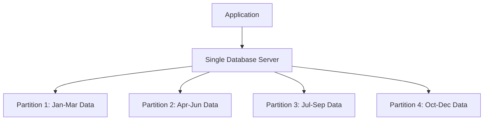
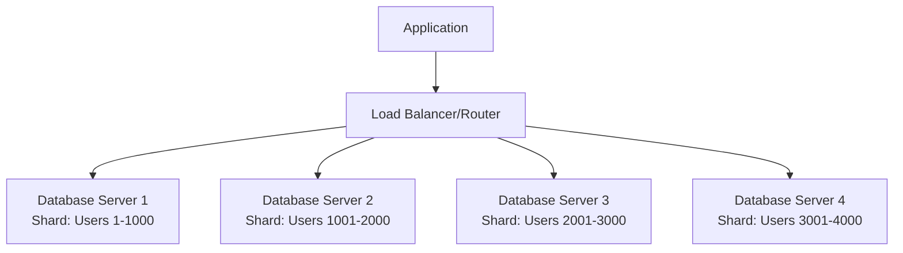

# Partitioning vs. Sharding: A Crucial Distinction

Two terms that are often confused but represent fundamentally different approaches to data distribution: **partitioning** and **sharding**. Understanding this distinction is crucial for choosing the right scaling strategy.

## The Fundamental Difference

**Partitioning**: Multiple tables, **one database server**  
**Sharding**: Multiple tables, **multiple database servers**

Think of it as the difference between organizing your home office versus opening branch offices across different cities.

## Partitioning: Organizing Within One System



**Characteristics**:
- One database instance manages all partitions
- Queries can span multiple partitions seamlessly
- ACID transactions work across all partitions
- Backup and recovery is unified
- Configuration and monitoring is centralized

## Sharding: Distributing Across Multiple Systems



**Characteristics**:
- Multiple independent database instances
- Application must route queries to correct shard
- Cross-shard operations are complex and expensive
- Each shard has independent backup/recovery
- Configuration and monitoring multiplied by shard count

## When to Use Each Strategy

### Choose Partitioning When:

**Query Performance Issues**
- Table scans are slow due to large data size
- Maintenance operations (indexing, backups) take too long
- You need better query pruning and focused indexing

**Data Lifecycle Management**
- You want to archive old data by dropping partitions
- Different data has different retention policies
- Historical vs. active data have different access patterns

**Single-Server Capacity is Sufficient**
- Your workload fits on one powerful database server
- You don't need geographic distribution
- Application complexity should be minimized

**Example Scenario**: A logging system with 100GB of data per month. Partitioning by month allows:
- Fast queries for recent data
- Easy archival by dropping old partitions  
- Focused indexing strategies per time period

### Choose Sharding When:

**Scale Beyond Single Server**
- Data volume exceeds what one server can handle
- Write throughput exceeds single server capacity
- You need geographic distribution for latency

**Horizontal Scaling Requirements**
- Need to add capacity by adding servers
- Write workload is distributed across data set
- Can tolerate application complexity

**Independent Scaling**
- Different shards have different performance characteristics
- Want to scale different parts of the system independently
- Need isolated failure domains

**Example Scenario**: A social media platform with 1TB of user data. Sharding by user ID allows:
- Each server handles subset of users
- Add servers as user base grows
- Geographic distribution for global users

## The Complexity Trade-off

### Partitioning Complexity: **Low**
```sql
-- Simple partition-aware query
SELECT * FROM orders 
WHERE order_date >= '2024-01-01';
-- Database automatically routes to correct partitions
```

### Sharding Complexity: **High**
```python
# Application must handle shard routing
def get_user_orders(user_id):
    shard_id = hash(user_id) % NUM_SHARDS
    database = get_shard_connection(shard_id)
    return database.query("SELECT * FROM orders WHERE user_id = ?", user_id)

# Cross-shard queries are complex
def get_order_totals_by_region():
    results = []
    for shard in all_shards():
        partial_result = shard.query("SELECT region, SUM(total) FROM orders GROUP BY region")
        results.append(partial_result)
    return merge_and_aggregate(results)
```

## Feature Comparison Matrix

| Feature | Partitioning | Sharding |
|---------|-------------|----------|
| **Query Complexity** | Transparent | Application managed |
| **ACID Transactions** | Full support | Limited cross-shard |
| **Joins Across Data** | Efficient | Expensive/impossible |
| **Backup Strategy** | Unified | Per-shard |
| **Failure Impact** | Single point | Isolated failures |
| **Scaling Method** | Vertical | Horizontal |
| **Data Consistency** | Strong | Eventually consistent |
| **Operational Overhead** | Low | High |

## Mental Models

### Partitioning: The Smart Filing System
A single office with multiple filing cabinets, organized by date. When you need January files, the clerk knows exactly which cabinet to check. All files are in one building, managed by one system.

### Sharding: The Branch Office Network  
Multiple offices in different cities, each handling different customers. To serve a customer, you must first determine which office handles them, then route your request there. Cross-office coordination requires phone calls.

## Common Anti-Patterns

**Using Sharding When Partitioning Would Suffice**
- Adds unnecessary complexity
- Makes development and operations harder
- Doesn't solve the actual performance problem

**Using Partitioning When You've Outgrown Single Server**
- Hits hardware limitations
- Doesn't address geographic distribution needs
- May mask the need for architectural changes

## The Progression Path

Many systems evolve along this path:

1. **Single Table**: Start simple
2. **Partitioned Table**: Optimize for query performance
3. **Sharded System**: Scale beyond single server capacity
4. **Hybrid Approach**: Partitioned tables within each shard

## Key Decision Factors

**Choose Partitioning If**:
- Performance problem, not capacity problem
- Need to maintain query simplicity
- Single database server can handle the load
- Strong consistency requirements

**Choose Sharding If**:
- Data size exceeds single server capacity  
- Write throughput requires multiple servers
- Geographic distribution is needed
- Can invest in application complexity

The golden rule: **Start with partitioning, graduate to sharding only when you must scale beyond a single database server's capacity.**