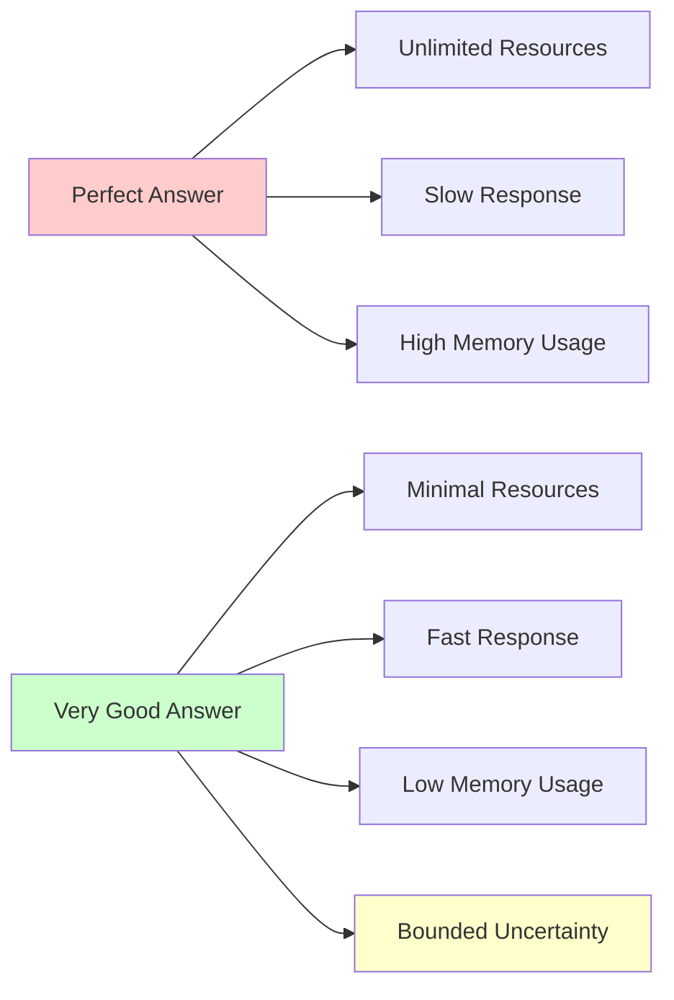
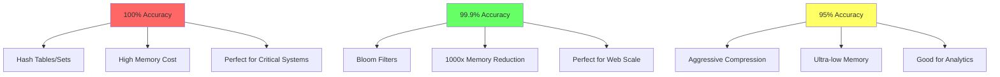
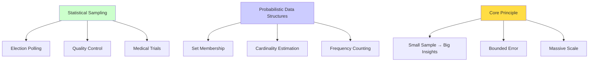
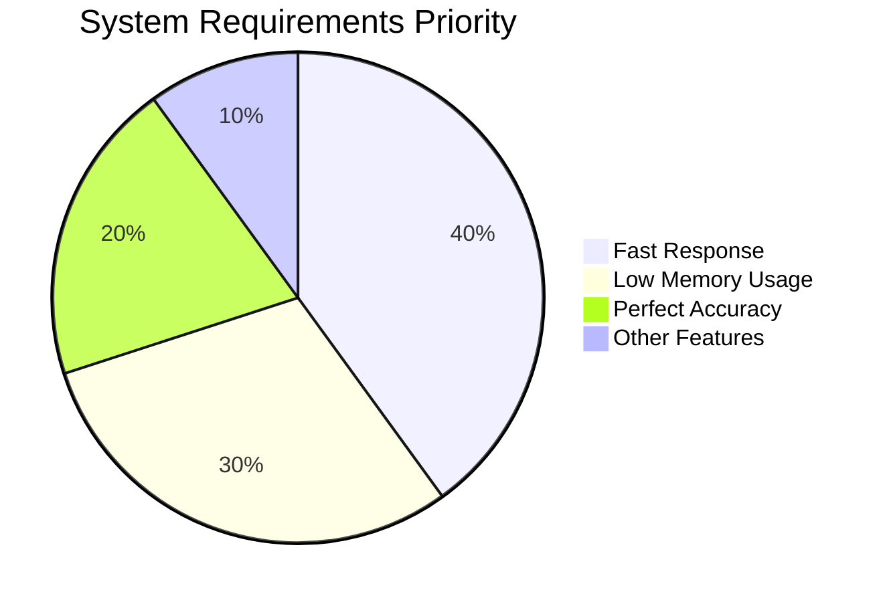

# The Core Problem: Processing Massive Data with Tiny Memory

## The Scale Problem

Imagine you're running a social media platform with billions of users. Every second, hundreds of thousands of new posts arrive, and you need to answer questions like:

- "Have we seen this username before?"
- "How many unique visitors did we have today?"
- "Is this message a duplicate?"

The naive approach would be to store everything in memory or disk and scan through it. But here's the crushing reality:

```mermaid
graph TD
    A[1 Billion Users] --> B[Traditional Storage]
    B --> C[10 GB RAM for usernames]
    B --> D[O(log n) lookup time]
    B --> E[Database bottleneck]
    
    A --> F[Scale to 10 Billion]
    F --> G[100 GB RAM required]
    F --> H[Exponential cost growth]
    F --> I[System failure]
    
    style I fill:#ff9999
    style H fill:#ffcc99
```

**Traditional Approach:**
- Store 1 billion usernames (avg 10 chars each) = 10 GB RAM minimum
- Check if username exists = O(log n) lookup in best case
- Scale to 10 billion users = 100 GB just for usernames

This doesn't scale. We're spending enormous resources to get perfect answers to questions that often don't need perfect precision.

## The Real-World Constraint

Here's what makes this problem particularly brutal: **you often don't actually need perfect accuracy**. Consider these scenarios:

1. **Username availability check**: If we accidentally say "username taken" when it's available, the user just picks another one. Not catastrophic.

2. **Spam detection**: If we miss 0.1% of duplicate content, that's acceptable if we catch 99.9% while using 1000x less memory.

3. **Analytics**: Knowing we had "approximately 1.2 million unique visitors" is often just as valuable as knowing the exact count of 1,247,891.

## The Trade-off Revelation

This is where probabilistic data structures shine. They operate on a profound trade-off:

**Instead of asking:** "Give me the perfect answer using unlimited resources"  
**We ask:** "Give me a very good answer using minimal resources"



The magic happens in the word "very good." These structures don't give random answers—they provide **bounded uncertainty**. You know exactly how wrong they might be, and you can tune that error rate based on your needs.

### The Precision Spectrum



## Why Traditional Computer Science Falls Short

Classic computer science often focuses on worst-case guarantees and perfect correctness. But in distributed systems and big data:

- **Memory is expensive** and finite
- **Network bandwidth** is limited
- **Response time** matters more than perfect precision
- **Approximate answers** delivered quickly beat perfect answers delivered slowly

Probabilistic data structures embrace this reality. They're designed for a world where "good enough" really is perfect for most use cases.

## The Fundamental Insight

The core insight is **statistical confidence over absolute certainty**. Just like how we don't need to survey every voter to predict election outcomes, we don't need to store every data point to answer most questions about our datasets.



This isn't about being lazy or accepting poor quality—it's about being **strategically approximate** in service of massive scalability and performance gains.

### The Engineering Reality Check



In real systems, **speed and efficiency often matter more than perfect precision**. Users would rather get a "good enough" answer in 1ms than a perfect answer in 100ms.

In the next section, we'll explore the philosophical approach that makes this possible.