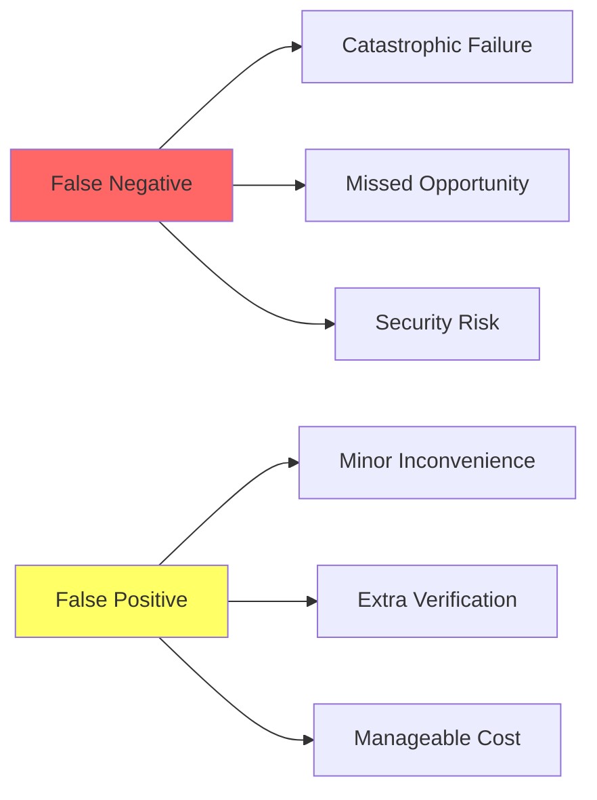
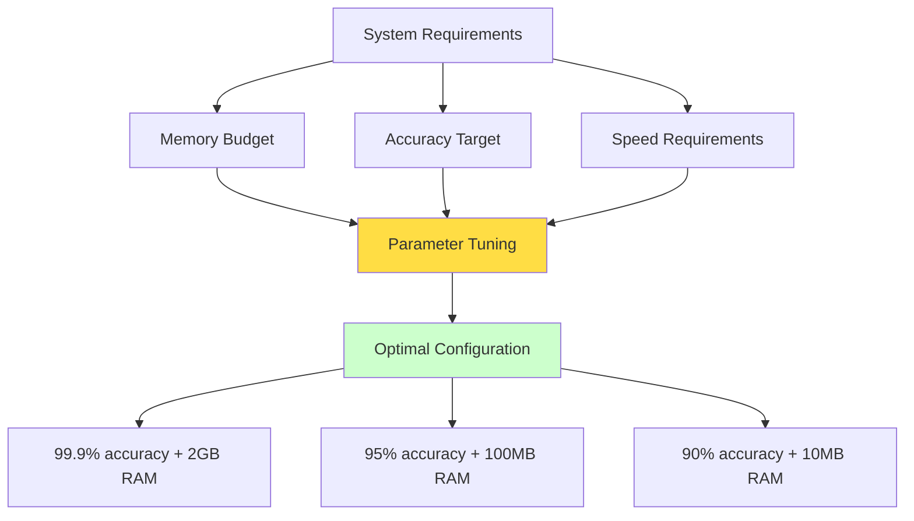
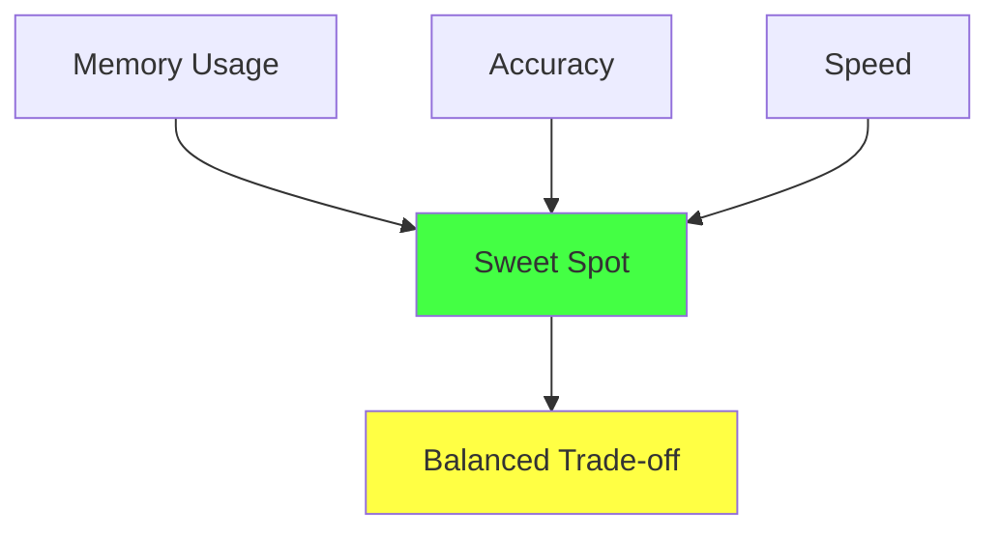

# The Guiding Philosophy: Trading Certainty for Efficiency

## The Philosophical Shift

Traditional data structures operate under the principle of **absolute truth**:
- A hash table either contains a key or it doesn't
- A counter either has the exact value or it's wrong
- A set either includes an element or it doesn't

Probabilistic data structures embrace a fundamentally different philosophy: **statistical confidence with bounded error**. This isn't about being imprecise—it's about being precisely imprecise in a controlled, mathematically rigorous way.

## The Three Pillars of Probabilistic Design

### 1. False Positives, Never False Negatives

Most probabilistic structures follow this pattern:
- **"Maybe yes, definitely no"** (like Bloom filters)
- If the structure says "not present," it's 100% correct
- If it says "present," there's a small, known probability it's wrong

```mermaid
graph TD
    A[Query: "Is X in set?"] --> B{Probabilistic Structure}
    B -->|Says "NO"| C[100% Certain: X is NOT in set]
    B -->|Says "YES"| D[Uncertain: X MIGHT be in set]
    
    D --> E[False Positive Case]
    D --> F[True Positive Case]
    
    style C fill:#ccffcc
    style E fill:#ffcccc
    style F fill:#ccffcc
```

This asymmetry is powerful because many real-world scenarios can tolerate false positives but not false negatives:
- **Spam detection**: Better to flag a legitimate email for review than miss spam
- **Security access**: Better to ask for additional verification than grant unauthorized access
- **Cache optimization**: Better to occasionally skip cache hits than miss cached data

### The Asymmetry Advantage



### 2. Resource Efficiency Through Approximation

Consider this comparison for tracking 1 billion unique items:

**Exact Set:**
- Memory: ~32 GB (assuming 32-byte hashes)
- Lookup time: O(log n) in best case
- Insert time: O(log n) in best case

**Bloom Filter (1% false positive rate):**
- Memory: ~1.2 GB
- Lookup time: O(1)
- Insert time: O(1)

The 27x memory reduction comes from accepting a 1% false positive rate. That's the power of the trade-off.

### 3. Tunable Precision

Unlike traditional "works or doesn't work" structures, probabilistic ones give you **knobs to turn**:



You can decide: "I want 99.9% accuracy and I'm willing to use 2GB of RAM" or "I want 95% accuracy and only use 100MB."

### The Control Triangle



This tunability is what makes probabilistic structures so powerful—you optimize for exactly what your system needs.

## Design Principles in Action

### Embrace Statistical Thinking

Instead of thinking in absolutes, think in probabilities:
- "This item has a 99.7% chance of being unique"
- "Our count is accurate within ±2% with 95% confidence"
- "There's a 0.1% chance this is a false alarm"

### Favor Simplicity Over Perfection

Probabilistic structures often use surprisingly simple algorithms:
- Hash functions and bit arrays (Bloom filters)
- Simple counting with smart bit tricks (HyperLogLog)
- Random sampling (reservoir sampling)

The simplicity isn't a weakness—it's what enables the massive performance gains.

### Design for the Common Case

These structures excel when you optimize for the most frequent scenarios:
- 99% of username checks are for names that don't exist
- Most content isn't spam
- Cache hits are more common than misses

## The Mathematical Foundation

The "magic" isn't really magic—it's applied probability theory:

**Central Limit Theorem**: Large samples converge to predictable distributions  
**Union Bound**: The probability of any of several events happening  
**Concentration Inequalities**: How tightly results cluster around expected values

You don't need to be a mathematician to use these structures, but understanding that they're built on solid statistical foundations helps build confidence in their reliability.

## When NOT to Use Probabilistic Structures

This philosophy has boundaries. Avoid probabilistic approaches when:

1. **Financial calculations** where every cent matters
2. **Safety-critical systems** where false positives have severe consequences
3. **Legal compliance** where exact counts are required by regulation
4. **Small datasets** where the overhead isn't worth the savings

## The Mental Model

Think of probabilistic data structures like **weather forecasting**:
- A 90% chance of rain is incredibly useful information
- It's not 100% certain, but it's statistically reliable
- The prediction gets better with more data
- You can make informed decisions based on the probability

The key insight: **In most software systems, you need fast, approximate answers more often than slow, perfect ones.**

This philosophy enables building systems that scale to internet-level data volumes while maintaining the responsiveness users expect.