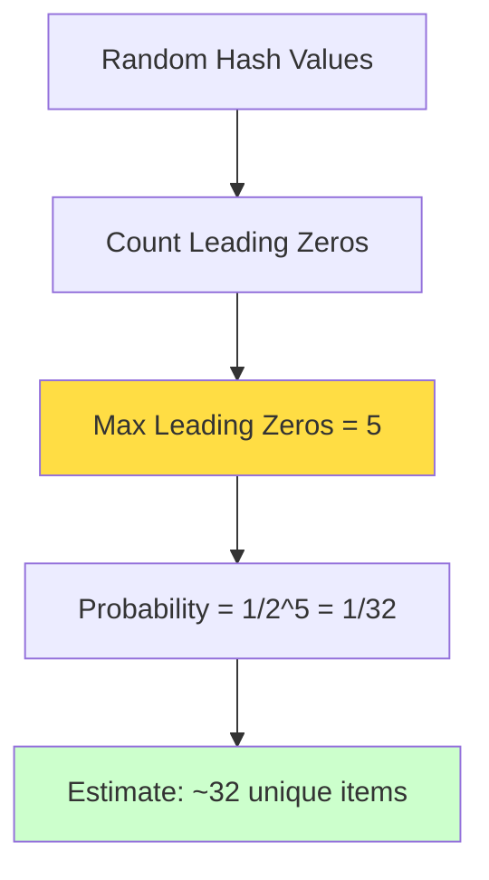

# HyperLogLog: Counting Unique Items at Scale

## The Problem: Counting Unique Visitors

You're running a website analytics service that needs to count unique visitors across millions of pages. Traditional approaches would require storing every visitor ID, which becomes prohibitively expensive at scale.

HyperLogLog solves this by estimating cardinality (unique count) using a tiny, fixed amount of memory—typically just a few kilobytes to count billions of unique items with ~2% error.

## The Core Insight: Leading Zeros as Probability Indicators

The mathematical foundation is elegant: in a stream of random hash values, the maximum number of leading zeros you observe tells you about the stream size.



If you see hash values with 10 leading zeros, you've probably seen around 2^10 = 1024 unique items.

## Step-by-Step Implementation

### Step 1: Understanding the Algorithm


### Step 2: Basic Python Implementation

```python
import hashlib
import math

class SimpleHyperLogLog:
    def __init__(self, precision=12):
        self.precision = precision
        self.bucket_count = 1 << precision  # 2^precision buckets
        self.buckets = [0] * self.bucket_count
        
    def _hash(self, item):
        """Hash an item to get a 32-bit integer"""
        h = hashlib.md5(str(item).encode()).hexdigest()
        return int(h[:8], 16)  # Use first 32 bits
    
    def _leading_zeros(self, hash_value, max_bits=32):
        """Count leading zeros in binary representation"""
        if hash_value == 0:
            return max_bits
        return max_bits - hash_value.bit_length()
    
    def add(self, item):
        """Add an item to the cardinality estimator"""
        hash_value = self._hash(item)
        
        # Use first 'precision' bits for bucket selection
        bucket = hash_value >> (32 - self.precision)
        
        # Use remaining bits for leading zero count
        remaining = hash_value & ((1 << (32 - self.precision)) - 1)
        leading_zeros = self._leading_zeros(remaining, 32 - self.precision) + 1
        
        # Update bucket with maximum leading zeros seen
        self.buckets[bucket] = max(self.buckets[bucket], leading_zeros)
    
    def estimate(self):
        """Estimate cardinality"""
        # HyperLogLog formula
        raw_estimate = (0.7213 / (1 + 1.079 / self.bucket_count)) * \
                      (self.bucket_count ** 2) / \
                      sum(2 ** -bucket for bucket in self.buckets)
        
        # Small range correction
        if raw_estimate <= 2.5 * self.bucket_count:
            zeros = self.buckets.count(0)
            if zeros != 0:
                return self.bucket_count * math.log(self.bucket_count / zeros)
        
        return int(raw_estimate)
```

### Step 3: Practical Usage Example

```python
# Track unique visitors across multiple pages
visitor_counter = SimpleHyperLogLog(precision=12)  # ~4KB memory

# Simulate visitor tracking
import random
unique_visitors = set()

for day in range(30):
    daily_visitors = [f"user_{random.randint(1, 1000000)}" for _ in range(10000)]
    
    for visitor in daily_visitors:
        visitor_counter.add(visitor)
        unique_visitors.add(visitor)  # For comparison
    
    estimated = visitor_counter.estimate()
    actual = len(unique_visitors)
    error = abs(estimated - actual) / actual * 100
    
    print(f"Day {day+1}: Estimated={estimated:,}, Actual={actual:,}, Error={error:.1f}%")
```

## Advanced Implementation with Bias Correction

```python
class ProductionHyperLogLog:
    def __init__(self, precision=12):
        self.precision = precision
        self.bucket_count = 1 << precision
        self.buckets = [0] * self.bucket_count
        self.alpha = self._calculate_alpha()
        
    def _calculate_alpha(self):
        """Calculate alpha constant for bias correction"""
        m = self.bucket_count
        if m == 16:
            return 0.673
        elif m == 32:
            return 0.697
        elif m == 64:
            return 0.709
        else:
            return 0.7213 / (1 + 1.079 / m)
    
    def add(self, item):
        """Add item with improved hashing"""
        # Use multiple hash functions for better distribution
        h1 = hash(item)
        h2 = hash(str(item)[::-1])  # Reverse string hash
        
        # Combine hashes to reduce correlation
        combined = h1 ^ (h2 << 16)
        hash_value = combined & 0xFFFFFFFF  # Ensure 32-bit
        
        bucket = hash_value >> (32 - self.precision)
        remaining = hash_value & ((1 << (32 - self.precision)) - 1)
        leading_zeros = self._leading_zeros(remaining, 32 - self.precision) + 1
        
        self.buckets[bucket] = max(self.buckets[bucket], leading_zeros)
    
    def estimate(self):
        """Estimate with bias correction"""
        raw_estimate = self.alpha * (self.bucket_count ** 2) / \
                      sum(2 ** -bucket for bucket in self.buckets)
        
        # Apply range corrections
        if raw_estimate <= 2.5 * self.bucket_count:
            zeros = self.buckets.count(0)
            if zeros != 0:
                return self.bucket_count * math.log(self.bucket_count / zeros)
        elif raw_estimate <= (1.0/30.0) * (1 << 32):
            return raw_estimate
        else:
            return -1 * (1 << 32) * math.log(1 - raw_estimate / (1 << 32))
        
        return int(raw_estimate)
    
    def merge(self, other):
        """Merge with another HyperLogLog (for distributed counting)"""
        if self.precision != other.precision:
            raise ValueError("Cannot merge HyperLogLogs with different precisions")
        
        merged = ProductionHyperLogLog(self.precision)
        for i in range(self.bucket_count):
            merged.buckets[i] = max(self.buckets[i], other.buckets[i])
        
        return merged
```

## Real-World Applications

### Website Analytics

```python
class WebAnalytics:
    def __init__(self):
        self.daily_visitors = ProductionHyperLogLog(precision=12)
        self.unique_pages = ProductionHyperLogLog(precision=10)
        self.referrer_domains = ProductionHyperLogLog(precision=8)
    
    def track_pageview(self, visitor_id, page_url, referrer):
        self.daily_visitors.add(visitor_id)
        self.unique_pages.add(page_url)
        
        if referrer:
            domain = self._extract_domain(referrer)
            self.referrer_domains.add(domain)
    
    def get_stats(self):
        return {
            'unique_visitors': self.daily_visitors.estimate(),
            'unique_pages': self.unique_pages.estimate(),
            'referrer_domains': self.referrer_domains.estimate()
        }
    
    def _extract_domain(self, url):
        from urllib.parse import urlparse
        return urlparse(url).netloc
```

### Database Query Optimization

```python
class QueryOptimizer:
    def __init__(self):
        self.distinct_values = {}
    
    def analyze_column(self, table, column, values):
        """Estimate distinct values for query optimization"""
        key = f"{table}.{column}"
        if key not in self.distinct_values:
            self.distinct_values[key] = ProductionHyperLogLog(precision=10)
        
        hll = self.distinct_values[key]
        for value in values:
            hll.add(value)
    
    def get_selectivity(self, table, column):
        """Get selectivity estimate for query planner"""
        key = f"{table}.{column}"
        if key in self.distinct_values:
            return self.distinct_values[key].estimate()
        return 0
```

## Performance Characteristics

```mermaid
graph LR
    A[Memory Usage] --> B[Fixed: 2^precision bytes]
    C[Time Complexity] --> D[O(1) per insert]
    E[Accuracy] --> F[~2% error rate]
    G[Scalability] --> H[Billions of items]
    
    style B fill:#66ff66
    style D fill:#66ff66
    style F fill:#ffff66
    style H fill:#66ff66
```

### Memory vs. Accuracy Trade-offs

| Precision | Memory | Buckets | Error Rate |
|-----------|--------|---------|------------|
| 8         | 256 B  | 256     | ~6.5%      |
| 10        | 1 KB   | 1,024   | ~3.2%      |
| 12        | 4 KB   | 4,096   | ~1.6%      |
| 14        | 16 KB  | 16,384  | ~0.8%      |
| 16        | 64 KB  | 65,536  | ~0.4%      |

## Common Pitfalls and Solutions

### Pitfall 1: Poor Hash Function Quality
**Problem**: Using weak hash functions leads to biased estimates  
**Solution**: Use cryptographic hash functions or proven algorithms

### Pitfall 2: Ignoring Bias Correction
**Problem**: Raw estimates can be significantly off, especially for small sets  
**Solution**: Apply standard bias correction formulas

### Pitfall 3: Wrong Precision for Use Case
**Problem**: Too little precision for accuracy needs, too much for memory constraints  
**Solution**: Calculate required precision based on error tolerance

## When to Use HyperLogLog

**Excellent for:**
- Unique visitor counting
- Database cardinality estimation
- Stream processing analytics
- A/B testing metrics
- Distributed counting (merges easily)

**Not suitable for:**
- When you need exact counts
- Small datasets (overhead not worth it)
- When individual items need to be retrieved
- High-precision requirements (< 1% error)

## Distributed HyperLogLog

```python
class DistributedHyperLogLog:
    def __init__(self, precision=12):
        self.local_hll = ProductionHyperLogLog(precision)
        self.precision = precision
    
    def add_local(self, item):
        """Add item to local HyperLogLog"""
        self.local_hll.add(item)
    
    def merge_from_workers(self, worker_hlls):
        """Merge HyperLogLogs from multiple workers"""
        merged = ProductionHyperLogLog(self.precision)
        
        # Start with local data
        for i in range(merged.bucket_count):
            merged.buckets[i] = self.local_hll.buckets[i]
        
        # Merge from all workers
        for worker_hll in worker_hlls:
            for i in range(merged.bucket_count):
                merged.buckets[i] = max(merged.buckets[i], worker_hll.buckets[i])
        
        return merged
```

HyperLogLog's ability to merge makes it perfect for distributed systems where you need to count unique items across multiple servers or time periods.

Next, we'll explore the mathematical foundations and advanced tuning techniques for optimal performance.