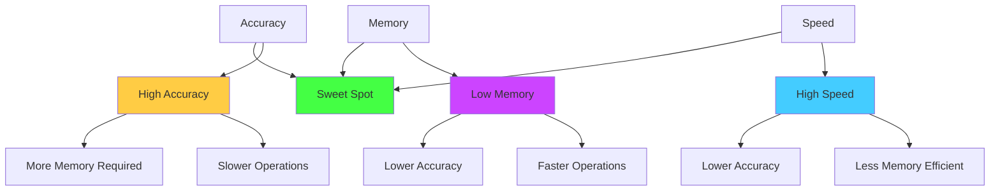
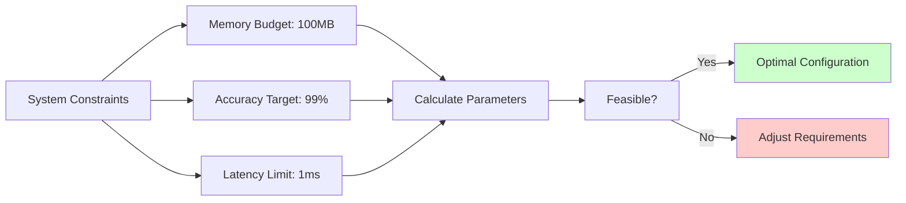
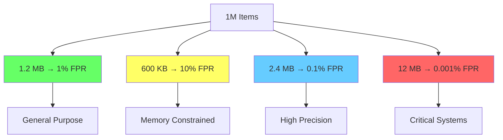
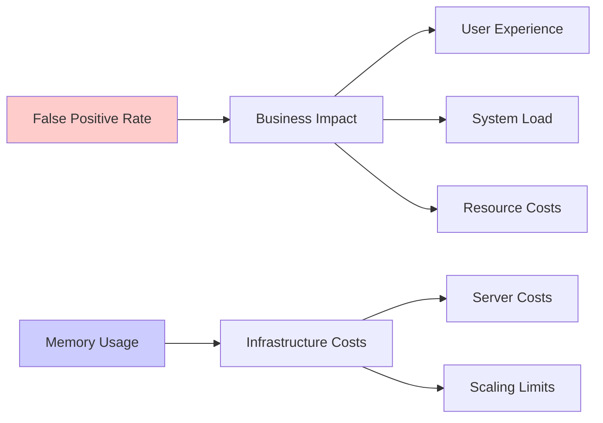

# Tuning for Error: The Art of Strategic Imprecision

## The Parameter Triangle

Every probabilistic data structure involves a three-way trade-off that forms what we can call the "Parameter Triangle":



You can optimize for any two, but the third will suffer. Understanding this trade-off is crucial for real-world applications.

### The Constraint Visualization



## The Mathematics of Error

### Bloom Filter Error Analysis

For a Bloom filter with:
- `m` bits
- `k` hash functions  
- `n` items inserted

The false positive probability is:

```
p = (1 - e^(-kn/m))^k
```

This formula tells the complete story:
- More bits (`m` ↑) → lower error rate
- More hash functions (`k` ↑) → initially lower error, then higher
- More items (`n` ↑) → higher error rate

### Finding the Sweet Spot

The optimal number of hash functions is:

```
k_optimal = (m/n) * ln(2) ≈ 0.693 * (m/n)
```

This gives the minimum false positive rate for given `m` and `n`.

## Mental Model: The Capacity Planning Approach

Think of a Bloom filter like planning a parking garage:

**Scenario 1: Undersized (m too small)**
```
Cars (data): 1000
Parking spots (bits): 500
Result: Overcrowded, high chance of false "parking spot taken"
```

**Scenario 2: Oversized (m too large)**
```
Cars (data): 1000  
Parking spots (bits): 10,000
Result: Wasteful, but very accurate
```

**Scenario 3: Just Right**
```
Cars (data): 1000
Parking spots (bits): ~7,000 (calculated optimally)
Result: Good balance of space and accuracy
```

## Practical Tuning Examples

### Case Study 1: Web Crawler Duplicate Detection

**Requirements:**
- 10 million URLs expected
- 0.1% false positive rate acceptable
- Memory constraint: 50 MB

**Calculation:**
```python
import math

n = 10_000_000  # 10M URLs
p = 0.001       # 0.1% false positive rate
memory_limit = 50 * 1024 * 1024 * 8  # 50 MB in bits

# Calculate required bits
m_required = -(n * math.log(p)) / (math.log(2) ** 2)
print(f"Required bits: {m_required:,.0f}")  # ~143M bits ≈ 18 MB

# We have plenty of memory, so we can do better
m_actual = memory_limit
p_actual = (1 - math.exp(-0.693 * n / m_actual)) ** round(0.693 * m_actual / n)
print(f"Actual false positive rate: {p_actual:.6f}")  # Much better than required!
```

### Case Study 2: Real-time Ad Frequency Capping

**Requirements:**
- Track if user has seen an ad in last 24 hours
- 100 million users
- Memory constraint: 100 MB  
- 5% false positive rate acceptable (better to skip showing ad)

**Analysis:**
```python
n = 100_000_000  # 100M users
memory_limit = 100 * 1024 * 1024 * 8  # 100 MB in bits
m = memory_limit

# Calculate achievable false positive rate
k_optimal = round(0.693 * m / n)
p_achievable = (1 - math.exp(-k_optimal * n / m)) ** k_optimal

print(f"Optimal k: {k_optimal}")
print(f"Achievable false positive rate: {p_achievable:.4f}")
```

If the achievable rate is higher than 5%, you need to either:
1. Increase memory budget
2. Accept higher error rate
3. Use a different approach

## Advanced Tuning Strategies

### Dynamic Resizing

For growing datasets, implement dynamic resizing:

```python
class AdaptiveBloomFilter:
    def __init__(self, initial_capacity, max_fpr):
        self.capacity = initial_capacity
        self.max_fpr = max_fpr
        self.count = 0
        self.filter = self._create_filter()
        
    def _create_filter(self):
        m = int(-(self.capacity * math.log(self.max_fpr)) / (math.log(2) ** 2))
        k = int(round(0.693 * m / self.capacity))
        return BloomFilter(m, k)
        
    def add(self, item):
        self.filter.add(item)
        self.count += 1
        
        # Check if we need to resize
        current_fpr = (1 - math.exp(-self.filter.k * self.count / self.filter.m)) ** self.filter.k
        if current_fpr > self.max_fpr:
            self._resize()
            
    def _resize(self):
        # Double capacity and create new filter
        old_items = self._extract_items()  # Application-specific
        self.capacity *= 2
        self.filter = self._create_filter()
        for item in old_items:
            self.filter.add(item)
```

### Layered Filters

For extremely low false positive rates, use multiple layers:

```python
class LayeredBloomFilter:
    def __init__(self, layers_config):
        # layers_config = [(m1, k1), (m2, k2), ...]
        self.layers = [BloomFilter(m, k) for m, k in layers_config]
        
    def add(self, item):
        for layer in self.layers:
            layer.add(item)
            
    def contains(self, item):
        # Item must be in ALL layers to be considered present
        return all(layer.contains(item) for layer in self.layers)
```

The combined false positive rate is the product of individual rates:
```
p_combined = p1 × p2 × p3 × ...
```

## Monitoring and Validation

### Runtime Monitoring

Track actual vs. expected performance:

```python
class MonitoredBloomFilter:
    def __init__(self, m, k):
        self.filter = BloomFilter(m, k)
        self.true_set = set()  # For monitoring only
        self.false_positives = 0
        self.total_checks = 0
        
    def add(self, item):
        self.filter.add(item)
        self.true_set.add(item)
        
    def contains(self, item):
        self.total_checks += 1
        bloom_result = self.filter.contains(item)
        actual_result = item in self.true_set
        
        if bloom_result and not actual_result:
            self.false_positives += 1
            
        return bloom_result
        
    @property
    def actual_fpr(self):
        if self.total_checks == 0:
            return 0
        return self.false_positives / self.total_checks
```

### A/B Testing Parameters

Test different configurations in production:

```python
def choose_bloom_config(user_id):
    """Route users to different Bloom filter configurations"""
    if user_id % 100 < 50:
        return BloomFilter(m=large_m, k=conservative_k)  # Low FPR
    else:
        return BloomFilter(m=small_m, k=aggressive_k)    # High FPR
```

Monitor business metrics:
- User experience impact
- Database load reduction
- Cache hit rates
- Cost savings

## Error Rate Intuition

### Visualizing the Trade-offs

Consider these scenarios for 1M items:



| Memory | FPR    | Use Case |
|--------|--------|----------|
| 1.2 MB | 1%     | General purpose |
| 600 KB | 10%    | Aggressive memory savings |
| 2.4 MB | 0.1%   | Low tolerance for false positives |
| 12 MB  | 0.001% | Critical applications |

### The Cost-Benefit Analysis



### When to Choose Each

**High FPR (5-10%)**: 
- Cost-sensitive applications
- False positives have low business impact
- Memory is extremely constrained

**Medium FPR (1-2%)**:
- Most general applications
- Balanced trade-offs
- Standard web services

**Low FPR (0.1-0.01%)**:
- Security applications
- Financial systems
- When false positives are expensive

## The Business Impact Calculation

The ultimate tuning question: **What's the cost of being wrong?**

```python
def calculate_optimal_fpr(memory_cost_per_mb, false_positive_cost, expected_items):
    """Find FPR that minimizes total cost"""
    
    def total_cost(fpr):
        # Memory cost
        required_bits = -(expected_items * math.log(fpr)) / (math.log(2) ** 2)
        memory_cost = (required_bits / 8 / 1024 / 1024) * memory_cost_per_mb
        
        # False positive cost
        fp_cost = expected_items * fpr * false_positive_cost
        
        return memory_cost + fp_cost
    
    # Find minimum cost FPR (simplified - use optimization library in practice)
    best_fpr = min([0.01, 0.001, 0.0001], key=total_cost)
    return best_fpr
```

This approach connects technical parameters to business value, enabling data-driven decisions about error tolerance.

Remember: **The best error rate is the one that minimizes total system cost, not necessarily the lowest possible error rate.**