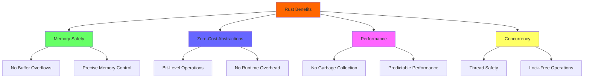
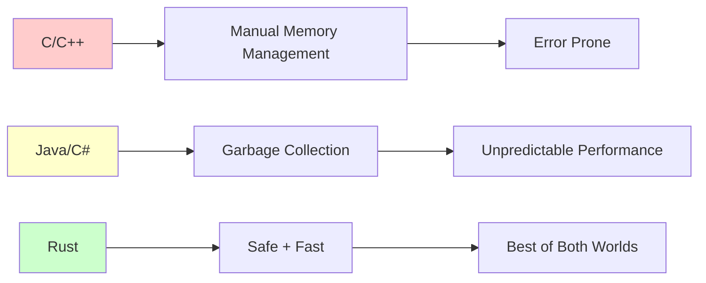

# Rust Implementation: Production-Ready Probabilistic Data Structures

## Why Rust for Probabilistic Data Structures

Rust's memory safety, zero-cost abstractions, and performance characteristics make it ideal for implementing probabilistic data structures:



- **Memory efficiency**: Precise control over bit-level operations
- **Performance**: No garbage collection overhead
- **Safety**: Prevents buffer overflows and memory corruption
- **Concurrency**: Built-in support for thread-safe operations

### The Performance Advantage



## Complete Bloom Filter Implementation

### Core Structure

```rust
use std::hash::{Hash, Hasher};
use std::collections::hash_map::DefaultHasher;
use bitvec::prelude::*;

pub struct BloomFilter {
    bits: BitVec,
    hash_count: usize,
    bit_count: usize,
    item_count: usize,
}

impl BloomFilter {
    /// Create a new Bloom filter optimized for the given parameters
    pub fn new(expected_items: usize, false_positive_rate: f64) -> Self {
        let bit_count = Self::optimal_bit_count(expected_items, false_positive_rate);
        let hash_count = Self::optimal_hash_count(expected_items, bit_count);
        
        BloomFilter {
            bits: bitvec![0; bit_count],
            hash_count,
            bit_count,
            item_count: 0,
        }
    }
    
    /// Calculate optimal bit array size using the standard formula
    fn optimal_bit_count(n: usize, p: f64) -> usize {
        let ln2_squared = std::f64::consts::LN_2.powi(2);
        (-(n as f64) * p.ln() / ln2_squared).ceil() as usize
    }
    
    /// Calculate optimal number of hash functions
    fn optimal_hash_count(n: usize, m: usize) -> usize {
        ((m as f64 / n as f64) * std::f64::consts::LN_2).round() as usize
    }
    
    /// Generate k hash values using double hashing
    fn hash_values<T: Hash>(&self, item: &T) -> Vec<usize> {
        let mut hasher1 = DefaultHasher::new();
        let mut hasher2 = DefaultHasher::new();
        
        item.hash(&mut hasher1);
        // Hash the hash to get a different value
        hasher1.finish().hash(&mut hasher2);
        
        let h1 = hasher1.finish() as usize;
        let h2 = hasher2.finish() as usize;
        
        (0..self.hash_count)
            .map(|i| (h1.wrapping_add(i.wrapping_mul(h2))) % self.bit_count)
            .collect()
    }
    
    /// Add an item to the filter
    pub fn insert<T: Hash>(&mut self, item: &T) {
        for index in self.hash_values(item) {
            self.bits.set(index, true);
        }
        self.item_count += 1;
    }
    
    /// Check if an item might be in the filter
    pub fn contains<T: Hash>(&self, item: &T) -> bool {
        self.hash_values(item)
            .iter()
            .all(|&index| self.bits[index])
    }
    
    /// Get current false positive probability
    pub fn current_false_positive_rate(&self) -> f64 {
        let filled_ratio = self.bits.count_ones() as f64 / self.bit_count as f64;
        (1.0 - (-self.hash_count as f64 * filled_ratio).exp()).powi(self.hash_count as i32)
    }
    
    /// Get memory usage in bytes
    pub fn memory_usage(&self) -> usize {
        self.bits.len() / 8 + std::mem::size_of::<Self>()
    }
}
```

### Thread-Safe Concurrent Version

```rust
use std::sync::RwLock;
use std::sync::Arc;

#[derive(Clone)]
pub struct ConcurrentBloomFilter {
    inner: Arc<RwLock<BloomFilter>>,
}

impl ConcurrentBloomFilter {
    pub fn new(expected_items: usize, false_positive_rate: f64) -> Self {
        ConcurrentBloomFilter {
            inner: Arc::new(RwLock::new(BloomFilter::new(expected_items, false_positive_rate))),
        }
    }
    
    pub fn insert<T: Hash>(&self, item: &T) {
        let mut filter = self.inner.write().unwrap();
        filter.insert(item);
    }
    
    pub fn contains<T: Hash>(&self, item: &T) -> bool {
        let filter = self.inner.read().unwrap();
        filter.contains(item)
    }
    
    pub fn current_false_positive_rate(&self) -> f64 {
        let filter = self.inner.read().unwrap();
        filter.current_false_positive_rate()
    }
}
```

## HyperLogLog Implementation

For cardinality estimation (counting unique items):

```rust
pub struct HyperLogLog {
    buckets: Vec<u8>,
    bucket_count: usize,
    alpha: f64,
}

impl HyperLogLog {
    /// Create HyperLogLog with 2^precision buckets
    pub fn new(precision: u8) -> Self {
        let bucket_count = 1 << precision;
        let alpha = match bucket_count {
            16 => 0.673,
            32 => 0.697,
            64 => 0.709,
            _ => 0.7213 / (1.0 + 1.079 / bucket_count as f64),
        };
        
        HyperLogLog {
            buckets: vec![0; bucket_count],
            bucket_count,
            alpha,
        }
    }
    
    /// Add an item to the estimator
    pub fn add<T: Hash>(&mut self, item: &T) {
        let mut hasher = DefaultHasher::new();
        item.hash(&mut hasher);
        let hash = hasher.finish();
        
        // Use first bits for bucket selection
        let bucket = (hash as usize) & (self.bucket_count - 1);
        
        // Count leading zeros in remaining bits + 1
        let remaining_bits = hash >> (64 - self.bucket_count.trailing_zeros() as usize);
        let leading_zeros = remaining_bits.leading_zeros() as u8 + 1;
        
        // Store maximum leading zeros seen for this bucket
        self.buckets[bucket] = self.buckets[bucket].max(leading_zeros);
    }
    
    /// Estimate cardinality
    pub fn estimate(&self) -> f64 {
        let raw_estimate = self.alpha * (self.bucket_count as f64).powi(2) /
            self.buckets.iter().map(|&x| 2.0_f64.powi(-(x as i32))).sum::<f64>();
        
        // Apply small range correction
        if raw_estimate <= 2.5 * self.bucket_count as f64 {
            let zeros = self.buckets.iter().filter(|&&x| x == 0).count();
            if zeros != 0 {
                return (self.bucket_count as f64) * (self.bucket_count as f64 / zeros as f64).ln();
            }
        }
        
        raw_estimate
    }
}
```

## Count-Min Sketch Implementation

For frequency estimation:

```rust
pub struct CountMinSketch {
    counts: Vec<Vec<u32>>,
    width: usize,
    depth: usize,
}

impl CountMinSketch {
    pub fn new(width: usize, depth: usize) -> Self {
        CountMinSketch {
            counts: vec![vec![0; width]; depth],
            width,
            depth,
        }
    }
    
    fn hash_functions<T: Hash>(&self, item: &T) -> Vec<usize> {
        (0..self.depth)
            .map(|i| {
                let mut hasher = DefaultHasher::new();
                item.hash(&mut hasher);
                i.hash(&mut hasher);
                (hasher.finish() as usize) % self.width
            })
            .collect()
    }
    
    pub fn increment<T: Hash>(&mut self, item: &T) {
        for (row, &col) in self.hash_functions(item).iter().enumerate() {
            self.counts[row][col] = self.counts[row][col].saturating_add(1);
        }
    }
    
    pub fn estimate<T: Hash>(&self, item: &T) -> u32 {
        self.hash_functions(item)
            .iter()
            .enumerate()
            .map(|(row, &col)| self.counts[row][col])
            .min()
            .unwrap_or(0)
    }
}
```

## Practical Usage Examples

### Web Cache Filter

```rust
use std::collections::HashMap;

pub struct WebCache<T> {
    cache: HashMap<String, T>,
    bloom_filter: BloomFilter,
    max_size: usize,
}

impl<T> WebCache<T> {
    pub fn new(max_size: usize) -> Self {
        WebCache {
            cache: HashMap::new(),
            bloom_filter: BloomFilter::new(max_size, 0.01), // 1% FPR
            max_size,
        }
    }
    
    pub fn get(&self, key: &str) -> Option<&T> {
        // Quick check with Bloom filter
        if !self.bloom_filter.contains(&key) {
            return None; // Definitely not in cache
        }
        
        // Might be in cache, check actual storage
        self.cache.get(key)
    }
    
    pub fn insert(&mut self, key: String, value: T) {
        if self.cache.len() >= self.max_size {
            // Simple eviction: remove arbitrary element
            if let Some(k) = self.cache.keys().next().cloned() {
                self.cache.remove(&k);
            }
        }
        
        self.bloom_filter.insert(&key);
        self.cache.insert(key, value);
    }
}
```

### URL Deduplication System

```rust
pub struct UrlDeduplicator {
    seen_urls: ConcurrentBloomFilter,
    stats: Arc<RwLock<DeduplicationStats>>,
}

#[derive(Default)]
struct DeduplicationStats {
    total_urls: usize,
    duplicates_detected: usize,
    false_positives: usize,
}

impl UrlDeduplicator {
    pub fn new(expected_urls: usize) -> Self {
        UrlDeduplicator {
            seen_urls: ConcurrentBloomFilter::new(expected_urls, 0.001), // 0.1% FPR
            stats: Arc::new(RwLock::new(DeduplicationStats::default())),
        }
    }
    
    pub fn is_new_url(&self, url: &str) -> bool {
        let mut stats = self.stats.write().unwrap();
        stats.total_urls += 1;
        
        if self.seen_urls.contains(&url) {
            stats.duplicates_detected += 1;
            false // Probably seen before
        } else {
            self.seen_urls.insert(&url);
            true // Definitely new
        }
    }
    
    pub fn get_stats(&self) -> DeduplicationStats {
        *self.stats.read().unwrap()
    }
}
```

## Performance Benchmarks

```rust
#[cfg(test)]
mod benchmarks {
    use super::*;
    use std::time::Instant;
    
    #[test]
    fn benchmark_bloom_filter() {
        let mut filter = BloomFilter::new(1_000_000, 0.01);
        let items: Vec<String> = (0..100_000)
            .map(|i| format!("item_{}", i))
            .collect();
        
        // Benchmark insertions
        let start = Instant::now();
        for item in &items {
            filter.insert(item);
        }
        let insert_duration = start.elapsed();
        
        // Benchmark lookups
        let start = Instant::now();
        for item in &items {
            filter.contains(item);
        }
        let lookup_duration = start.elapsed();
        
        println!("Insert time: {:?}", insert_duration);
        println!("Lookup time: {:?}", lookup_duration);
        println!("Memory usage: {} bytes", filter.memory_usage());
        println!("False positive rate: {:.4}%", 
                filter.current_false_positive_rate() * 100.0);
    }
}
```

## Cargo.toml Dependencies

```toml
[dependencies]
bitvec = "1.0"
seahash = "4.1"  # Optional: faster hash function

[dev-dependencies]
criterion = "0.5"  # For detailed benchmarking
```

## Running the Code

```bash
# Create new Rust project
cargo new probabilistic_structures
cd probabilistic_structures

# Add the dependencies to Cargo.toml
# Copy the code into src/lib.rs

# Run tests
cargo test

# Run benchmarks
cargo test benchmark_bloom_filter -- --nocapture

# Build optimized version
cargo build --release
```

This implementation provides production-ready probabilistic data structures with:
- Optimal parameter calculation
- Thread safety
- Memory efficiency
- Performance monitoring
- Real-world usage patterns

The code demonstrates how theoretical concepts translate into practical, high-performance implementations suitable for large-scale systems.