# The Core Problem: Sparse Tries Waste Memory

Imagine you're building an autocomplete system for a code editor. You need to store thousands of programming keywords, function names, and variable names—all starting with common prefixes like `get`, `set`, `handle`, or `process`.

A standard trie (prefix tree) seems perfect for this job. It stores strings efficiently by sharing common prefixes among multiple words. But there's a hidden inefficiency lurking beneath the surface.

## The Hidden Inefficiency

```mermaid
graph TD
    subgraph "Code Editor Autocomplete Problem"
        A["Requirements"]
        A --> A1["Store 10,000+ programming terms"]
        A --> A2["Fast prefix-based search"]
        A --> A3["Memory efficient storage"]
        A --> A4["Common prefixes: get, set, handle, process"]
        
        B["Standard Trie Approach"]
        B --> B1["✅ Handles prefixes well"]
        B --> B2["✅ Fast O(k) search time"]
        B --> B3["❌ Memory waste in long chains"]
        B --> B4["❌ Poor cache performance"]
        
        C["The Hidden Problem"]
        C --> C1["Long function names create chains"]
        C --> C2["Each character = separate node"]
        C --> C3["Massive memory overhead"]
        C --> C4["Cache misses slow down searches"]
    end
    
    style A fill:#e3f2fd
    style B fill:#fff3e0
    style C fill:#ffebee
    style B3 fill:#ffcdd2
    style B4 fill:#ffcdd2
    style C1 fill:#ffcdd2
    style C2 fill:#ffcdd2
    style C3 fill:#ffcdd2
    style C4 fill:#ffcdd2
```

## The Memory Waste Problem

Consider storing these three words in a standard trie:
- `developer`
- `development` 
- `devotion`

In a standard trie, you'd create a separate node for every single character:

```mermaid
graph TD
    subgraph "Standard Trie Structure"
        Root["root"]
        D["d"]
        E["e"]
        V["v"]
        E1["e (dev-e)"]
        L["l"]
        O1["o"]
        P["p"]
        E2["e (develope)"]
        R["r 🏁 developer"]
        M["m"]
        EN["e"]
        N["n"]
        T["t 🏁 development"]
        
        O2["o (dev-o)"]
        T2["t"]
        I["i"]
        O3["o"]
        N2["n 🏁 devotion"]
        
        Root --> D
        D --> E
        E --> V
        V --> E1
        E1 --> L
        L --> O1
        O1 --> P
        P --> E2
        E2 --> R
        R --> M
        M --> EN
        EN --> N
        N --> T
        
        V --> O2
        O2 --> T2
        T2 --> I
        I --> O3
        O3 --> N2
    end
    
    style Root fill:#e1f5fe
    style D fill:#ffecb3
    style E fill:#ffecb3
    style V fill:#ffecb3
    style R fill:#c8e6c9
    style T fill:#c8e6c9
    style N2 fill:#c8e6c9
```

Here's the problem: look at that long chain from `root → d → e → v`. Every node in this chain has exactly one child. We're using three separate node objects to store what's essentially just the string "dev".

**This is pure waste.**

### The Single-Child Chain Problem

### The Wasteful Chain Analysis

## Real-World Impact

In production systems, this waste compounds rapidly:

Consider a dictionary containing words like:
- `internationalization`
- `internationalize` 
- `international`

The prefix `internation` creates a chain of 11 single-child nodes before reaching the first branch. That's 11 separate objects to store what could be a single string.

### The Internationalization Example

```mermaid
graph LR
    subgraph "Wasteful Trie Chain"
        I["i"] --> N["n"] --> T["t"] --> E["e"] --> R["r"] --> N2["n"] --> A["a"] --> T2["t"] --> I2["i"] --> O["o"] --> N3["n"]
        
        N3 --> AL["al 🏁 international"]
        N3 --> ALIZE["alize 🏁 internationalize"]
        N3 --> ALIZATION["alization 🏁 internationalization"]
        
        subgraph "Waste Analysis"
            W1["11 nodes × 40 bytes = 440 bytes"]
            W2["For storing 'internation' (11 chars)"]
            W3["Efficiency: 11 bytes / 440 bytes = 2.5%"]
        end
    end
    
    style I fill:#ffcdd2
    style N fill:#ffcdd2
    style T fill:#ffcdd2
    style E fill:#ffcdd2
    style R fill:#ffcdd2
    style N2 fill:#ffcdd2
    style A fill:#ffcdd2
    style T2 fill:#ffcdd2
    style I2 fill:#ffcdd2
    style O fill:#ffcdd2
    style N3 fill:#c8e6c9
    style W1 fill:#fff3e0
    style W2 fill:#fff3e0
    style W3 fill:#fce4ec
```

### Memory Efficiency Comparison

## The Fundamental Question

Why are we creating a separate node object for every character when many paths through our tree are just linear chains with no branching?

**The answer**: We shouldn't. This is where radix trees enter the picture.

The core insight is simple: **compress the chains**. Instead of storing one character per node, store entire strings along the edges between nodes. Only create nodes where the tree actually branches.

### The Path to Efficiency

This transforms our memory-hungry chain of single-child nodes into a compact, efficient structure that achieves the same functionality with dramatically less overhead.

### The Transformation Vision

### The Compression Principle

### Production Impact: Dictionary Example

