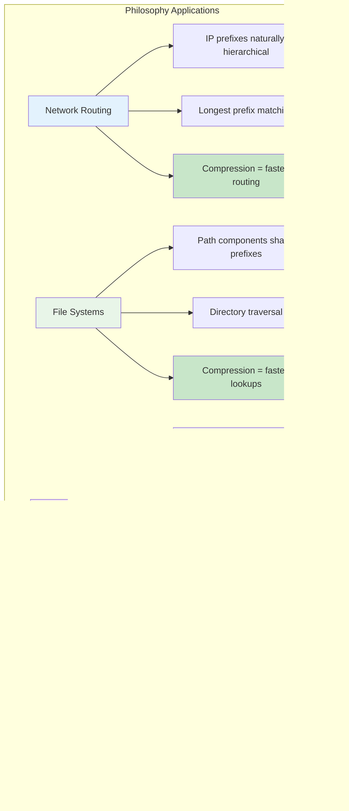

# The Guiding Philosophy: Compress the Paths

A radix tree (also called a PATRICIA trie or compressed trie) embodies a simple but powerful philosophy: **eliminate redundancy by compressing linear paths**.

## The Core Principle

Instead of storing one character per node, radix trees store **strings along edges** and only create nodes at **decision points**—places where the tree branches into multiple paths.

Think of it as the difference between:
- **Standard Trie**: A local train that stops at every single station
- **Radix Tree**: An express train that only stops at major hubs where passengers need to transfer

### The Express Train Analogy

## The Compression Strategy

The transformation follows a clear rule:

> **Any node with exactly one child gets merged with its parent**

This means:
1. **Chains collapse** into single edges labeled with strings
2. **Nodes only exist** where there are genuine choices to make
3. **Memory usage** scales with the number of branch points, not string length

### Compression Strategy Visualization

### Scaling Properties

```mermaid
graph TD
    subgraph "Memory Scaling Analysis"
        A["Standard Trie"]
        A --> A1["Memory = O(n × k)"]
        A --> A2["n = number of strings"]
        A --> A3["k = average string length"]
        A --> A4["Worst case: every character"]
        
        B["Radix Tree"]
        B --> B1["Memory = O(n + total_chars)"]
        B --> B2["n = number of branch points"]
        B --> B3["total_chars = sum of all strings"]
        B --> B4["Best case: shared prefixes"]
        
        C["Compression Ratio"]
        C --> C1["Depends on prefix sharing"]
        C --> C2["English dictionary: 70% reduction"]
        C --> C3["URLs: 80-90% reduction"]
        C --> C4["Code identifiers: 60-80% reduction"]
    end
    
    style A fill:#ffcdd2
    style A1 fill:#ffcdd2
    style A2 fill:#ffcdd2
    style A3 fill:#ffcdd2
    style A4 fill:#ffcdd2
    style B fill:#c8e6c9
    style B1 fill:#c8e6c9
    style B2 fill:#c8e6c9
    style B3 fill:#c8e6c9
    style B4 fill:#c8e6c9
    style C fill:#e3f2fd
    style C1 fill:#e3f2fd
    style C2 fill:#e3f2fd
    style C3 fill:#e3f2fd
    style C4 fill:#e3f2fd
```

## Visualizing the Philosophy

Consider our earlier example with `developer`, `development`, and `devotion`:

### Before and After Compression

```mermaid
graph TD
    subgraph "Before: Standard Trie (Wasteful)"
        A1["root"] --> A2["d"] --> A3["e"] --> A4["v"]
        A4 --> A5["e"] --> A6["l"] --> A7["o"] --> A8["p"] --> A9["e"] --> A10["r 🏁 developer"]
        A10 --> A11["m"] --> A12["e"] --> A13["n"] --> A14["t 🏁 development"]
        A4 --> A15["o"] --> A16["t"] --> A17["i"] --> A18["o"] --> A19["n 🏁 devotion"]
        
        A20["Total nodes: 19"]
        A21["Memory waste: High"]
        A22["Single-child chains: Many"]
    end
    
    subgraph "After: Radix Tree (Compressed)"
        B1["root"] --> B2["'dev' edge"] --> B3["Branch Node"]
        B3 --> B4["'eloper' 🏁 developer"]
        B3 --> B5["'elopment' 🏁 development"]
        B3 --> B6["'otion' 🏁 devotion"]
        
        B20["Total nodes: 4"]
        B21["Memory efficient: High"]
        B22["Only meaningful branches"]
    end
    
    style A1 fill:#ffcdd2
    style A2 fill:#ffcdd2
    style A3 fill:#ffcdd2
    style A4 fill:#ffcdd2
    style A5 fill:#ffcdd2
    style A6 fill:#ffcdd2
    style A7 fill:#ffcdd2
    style A8 fill:#ffcdd2
    style A9 fill:#ffcdd2
    style A10 fill:#ffcdd2
    style A11 fill:#ffcdd2
    style A12 fill:#ffcdd2
    style A13 fill:#ffcdd2
    style A14 fill:#ffcdd2
    style A15 fill:#ffcdd2
    style A16 fill:#ffcdd2
    style A17 fill:#ffcdd2
    style A18 fill:#ffcdd2
    style A19 fill:#ffcdd2
    style A20 fill:#fff3e0
    style A21 fill:#fff3e0
    style A22 fill:#fff3e0
    
    style B1 fill:#c8e6c9
    style B2 fill:#c8e6c9
    style B3 fill:#c8e6c9
    style B4 fill:#c8e6c9
    style B5 fill:#c8e6c9
    style B6 fill:#c8e6c9
    style B20 fill:#e8f5e8
    style B21 fill:#e8f5e8
    style B22 fill:#e8f5e8
```

Notice how the common prefix "dev" became a single edge, and we only have a node where the tree actually branches into three different suffixes.

## Trade-offs and Design Decisions

### Memory vs. Complexity
- **Gain**: Dramatically reduced memory usage and better cache locality
- **Cost**: Slightly more complex insertion and deletion algorithms

### When Compression Helps Most
- **High prefix sharing**: Dictionaries, file systems, IP routing tables
- **Long common prefixes**: URLs, domain names, function names
- **Sparse trees**: Where most internal nodes have few children

### When Standard Tries Might Be Better
- **Very short strings**: Compression overhead isn't worth it
- **Dense branching**: Every character position has many different possibilities
- **Simplicity requirements**: When algorithmic simplicity trumps memory efficiency

### Decision Matrix

## The Elegance of Simplicity

The radix tree philosophy is elegant because it asks a fundamental question: **"What is the minimum information needed to make navigation decisions?"**

The answer isn't "every character needs its own node." It's "we only need nodes where actual choices must be made."

### The Elegance of Minimal Structure

This principle—storing information only where decisions happen—appears throughout computer science: from decision trees in machine learning to routing tables in networks. The radix tree is simply this principle applied to string storage and retrieval.

### Universal Principle Applications

By embracing this philosophy, radix trees achieve the same functionality as standard tries while using significantly less memory and often delivering better performance.

### The Philosophy in Action

### Real-World Philosophy Examples

