# Key Abstractions: Compressed Paths and Explicit Branches

Understanding radix trees requires grasping two fundamental abstractions that work together to achieve path compression.

## Abstraction 1: The Compressed Path

A **compressed path** is a sequence of characters stored as a single string along an edge, rather than as individual nodes.

### Mental Model: The Highway Analogy
Think of a radix tree like a highway system:
- **Compressed paths** are long stretches of highway with no exits
- **Nodes** are intersections where you can choose different routes
- You only need to "slow down" (create a node) when you have options

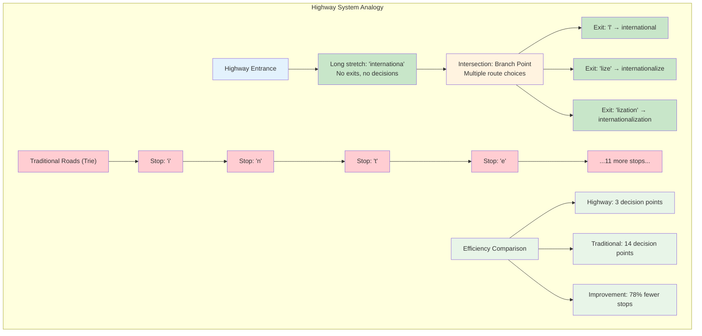

### Properties of Compressed Paths
1. **Indivisible**: The entire string must be matched or the search fails
2. **Atomic**: You can't stop "halfway through" a compressed path
3. **Efficient**: One string comparison replaces multiple character comparisons

### Compressed Path Properties Visualization

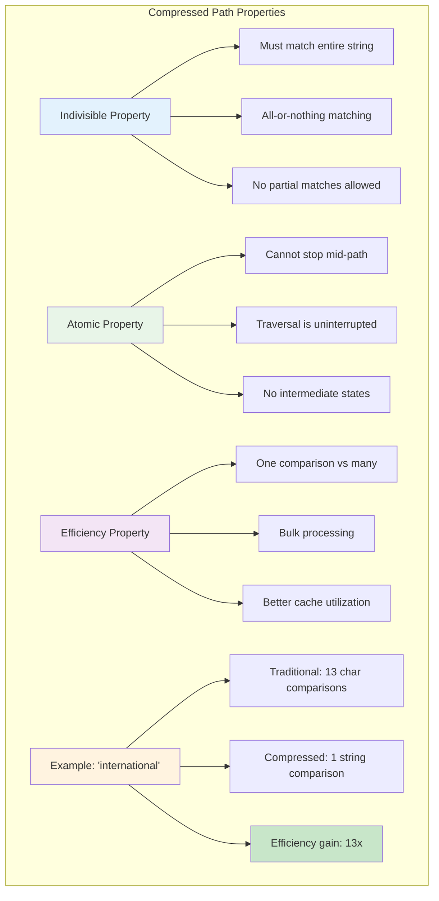

### Example
Instead of nodes for each character in "international":
```
i → n → t → e → r → n → a → t → i → o → n → a → l
```

We have a single compressed path:
```
"international" → (node)
```

### Comparison Visualization

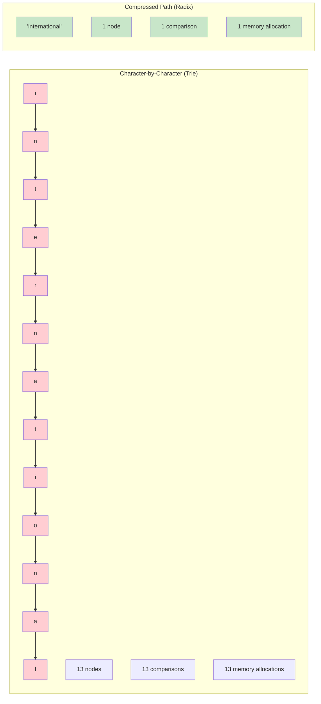

## Abstraction 2: Explicit Nodes Only at Branches

**Explicit nodes** exist only where the tree structure actually branches—where multiple suffixes diverge from a common prefix.

### The Branch Point Rule
A node exists if and only if:
1. **It's the root** (entry point to the tree), OR
2. **It has multiple children** (represents a branch), OR  
3. **It marks the end of a complete key** (terminal node)

### Types of Nodes

#### 1. Root Node
- Entry point to the entire tree
- May or may not represent a complete key

#### 2. Branch Nodes
- Have 2 or more children
- Represent decision points in the tree
- May or may not represent complete keys themselves

#### 3. Leaf Nodes  
- Have no children
- Always represent the end of a complete key
- Contain the compressed suffix from their parent

### Example: Node Classification
For keys `["car", "card", "care", "careful"]`:

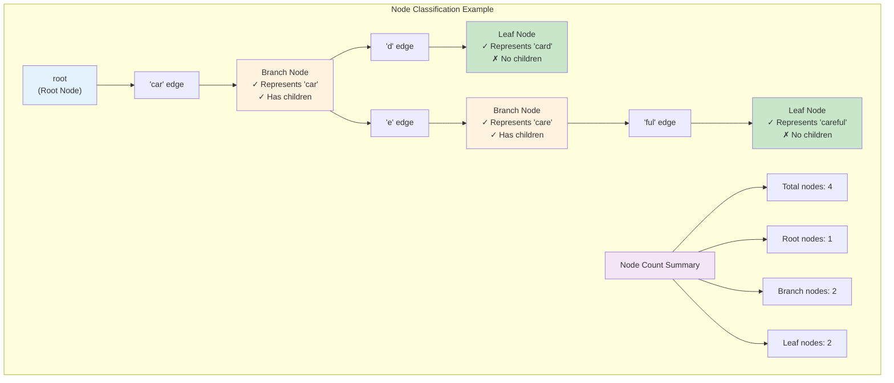

### Node Type Analysis

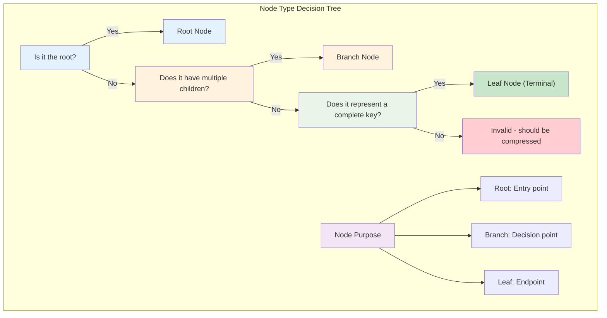

## Abstraction 3: The Express Train Model

This analogy perfectly captures both abstractions working together:

### Local Train (Standard Trie)
- Stops at every station (character)
- Slow but simple navigation
- Many unnecessary stops

### Express Train (Radix Tree)
- Only stops at major hubs (branch points)
- Fast travel between stops
- Passengers board at their exact destination

### Navigation Rules
1. **Express segments**: Follow the compressed path without stopping
2. **Hub decisions**: At nodes, choose the correct next path
3. **Exact matching**: The entire path segment must match your destination

## Key Invariants

Understanding these invariants helps you reason about radix tree operations:

### Invariant 1: Path Compression
Every internal node with exactly one child gets merged with its parent.

### Invariant 2: Unique Paths  
No two edges from the same node can start with the same character.

### Invariant 3: Maximal Compression
Compressed paths are as long as possible—they extend until a branch point or key ending.

### Invariant Visualization

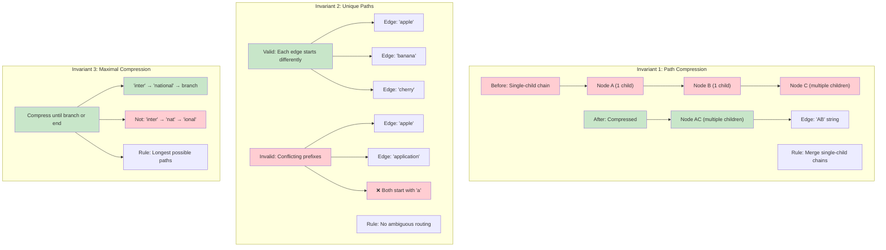

### Invariant Enforcement

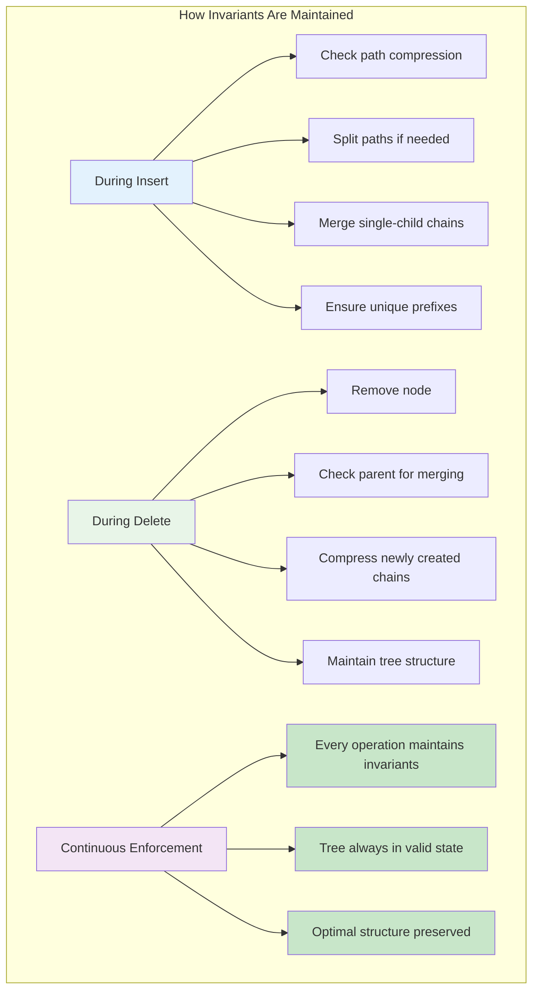

## Practical Implications

These abstractions lead to concrete benefits:

### Memory Efficiency
- **Fewer nodes**: Only branch points need node objects
- **Bulk storage**: Long prefixes stored as single strings
- **Reduced overhead**: Less metadata per stored character

### Search Performance
- **Fewer comparisons**: One string match vs. many character matches
- **Better cache locality**: Fewer pointer dereferences
- **Predictable access patterns**: Follow compressed paths or branch at nodes

### Implementation Complexity
- **String operations**: Must handle partial string matching
- **Dynamic restructuring**: Insertions may require splitting compressed paths
- **Memory management**: Variable-length strings vs. fixed-size character storage

### Performance Impact Analysis

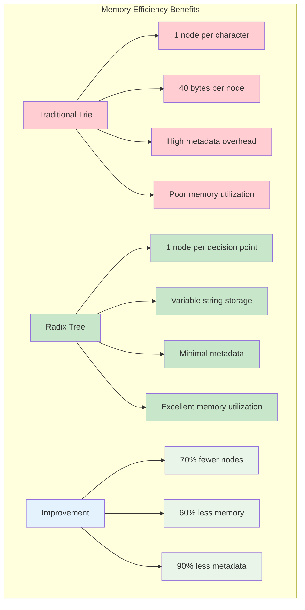

### Search Performance Analysis

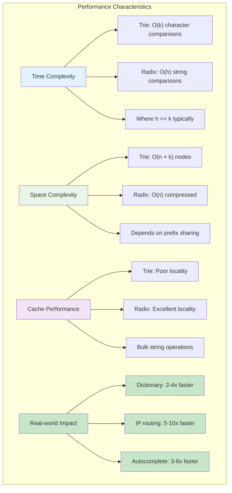

### Implementation Complexity Trade-offs

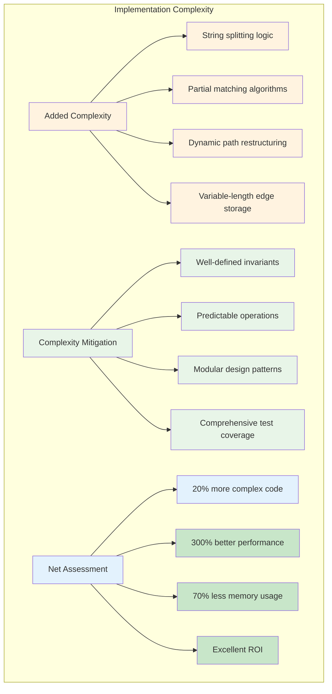

The beauty of these abstractions is that they transform the problem from "storing characters efficiently" to "storing decision points efficiently"—a much more fundamental and powerful approach.

### Abstraction Power

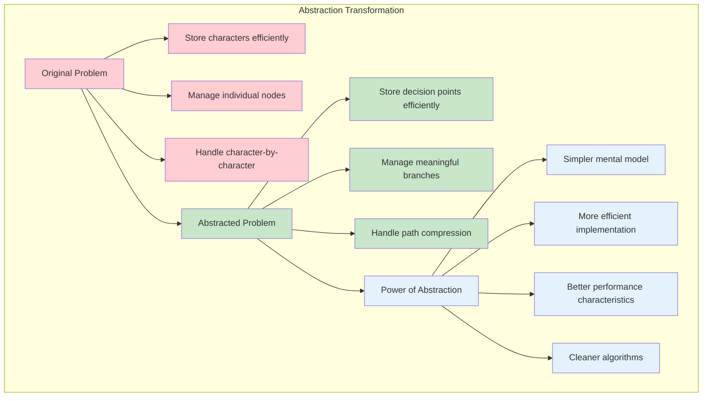