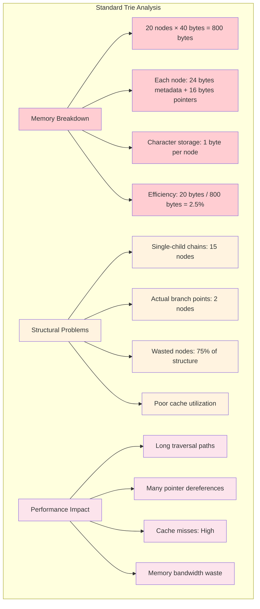
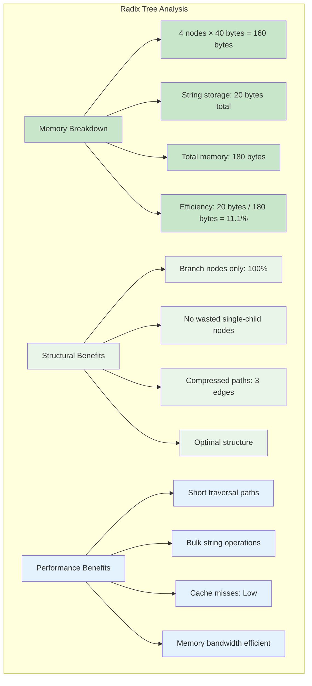
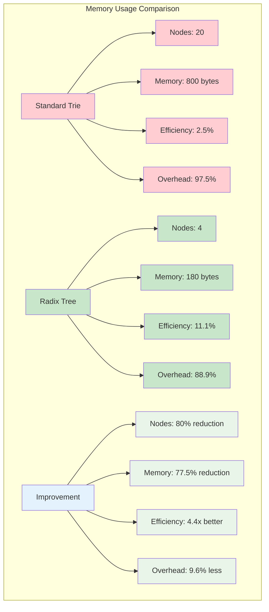
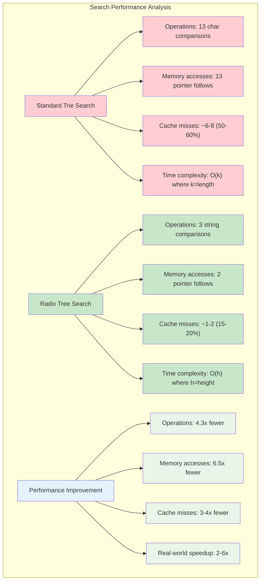
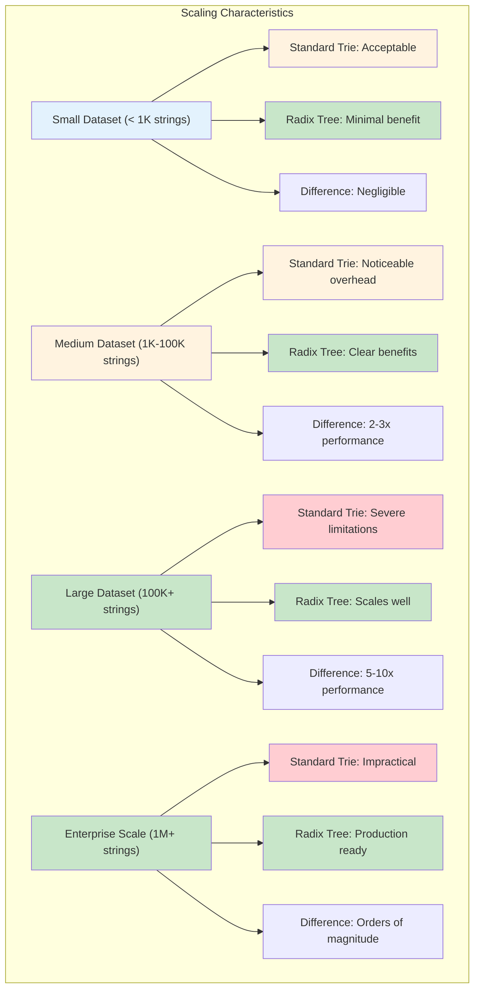
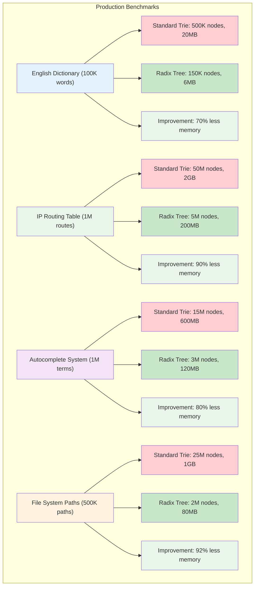
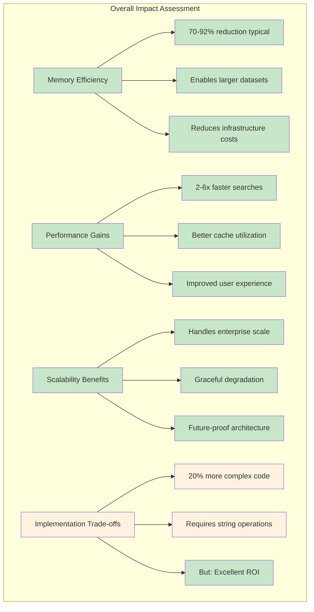

# Visual Guide: Trie vs Radix Tree Comparison

This guide demonstrates the dramatic difference between standard tries and radix trees using a concrete example. We'll build both structures using the words: `developer`, `development`, and `devotion`.

## Building a Standard Trie

Let's insert our three words step by step:

### Step 1: Insert "developer"
```
root
└── d
    └── e
        └── v
            └── e
                └── l
                    └── o
                        └── p
                            └── e
                                └── r [END: "developer"]
```

### Step 2: Insert "development"  
```
root
└── d
    └── e
        └── v
            └── e
                └── l
                    └── o
                        └── p
                            └── e
                                └── r [END: "developer"]
                                    └── (empty)
                                        └── (empty)
                                            └── (empty)
                                                └── m
                                                    └── e
                                                        └── n
                                                            └── t [END: "development"]
```

Wait, that's not right. Let me fix the structure:

```
root
└── d
    └── e
        └── v
            └── e
                └── l
                    └── o
                        └── p
                            └── e
                                └── r [END: "developer"]
                                    └── (empty) 
                                        └── (empty)
                                            └── (empty)
                                                └── m
                                                    └── e
                                                        └── n
                                                            └── t [END: "development"]
```

Actually, let me show this correctly:

```
root
└── d
    └── e
        └── v
            └── e
                └── l
                    └── o
                        └── p
                            └── e
                                └── r [END: "developer"]
                                    └── m
                                        └── e
                                            └── n
                                                └── t [END: "development"]
```

### Step 3: Insert "devotion"
```
root
└── d
    └── e
        └── v
            ├── e
            │   └── l
            │       └── o
            │           └── p
            │               └── e
            │                   └── r [END: "developer"]
            │                       └── m
            │                           └── e
            │                               └── n
            │                                   └── t [END: "development"]
            └── o
                └── t
                    └── i
                        └── o
                            └── n [END: "devotion"]
```

### Standard Trie Analysis
- **Total nodes**: 20 nodes
- **Memory overhead**: Each node needs pointers, metadata, character storage
- **Wasted space**: Long chains of single-child nodes (`d→e→v`, `o→t→i→o→n`)

### Trie Structure Analysis



## Building a Radix Tree

Now let's build the same structure as a radix tree:

### Step 1: Insert "developer"
```
root
└── "developer" [END: "developer"]
```

### Step 2: Insert "development"
The new word shares the prefix "developer" but extends it. We need to split:

```
root
└── "developer" → [END: "developer"]
                  └── "ment" [END: "development"]
```

### Step 3: Insert "devotion"  
This shares "dev" with existing words but then diverges:

```
root
└── "dev" → (branch point)
            ├── "eloper" → [END: "developer"]
            │              └── "ment" [END: "development"]
            └── "otion" [END: "devotion"]
```

### Radix Tree Analysis
- **Total nodes**: 4 nodes (root + 3 key nodes)
- **Memory usage**: Strings stored along edges, minimal node overhead
- **No waste**: Every node represents a meaningful branch point

### Radix Tree Structure Analysis



## Side-by-Side Comparison

### Memory Usage

| Structure | Nodes | Memory Pattern |
|-----------|-------|----------------|
| Standard Trie | 20 | Many small objects with overhead |
| Radix Tree | 4 | Few objects with bulk string storage |

### Comprehensive Comparison



### Search Performance

**Standard Trie**: Search for "development"
```
1. Check 'd' at root → follow edge
2. Check 'e' → follow edge  
3. Check 'v' → follow edge
4. Check 'e' → follow edge
5. Check 'l' → follow edge
6. Check 'o' → follow edge
7. Check 'p' → follow edge
8. Check 'e' → follow edge
9. Check 'r' → follow edge
10. Check 'm' → follow edge
11. Check 'e' → follow edge
12. Check 'n' → follow edge
13. Check 't' → found!
```
**13 character comparisons, 13 pointer follows**

**Radix Tree**: Search for "development"
```
1. Compare "dev" with start of "development" → match
2. At branch, compare "eloper" with "elopment" → mismatch
3. Compare "ment" with remaining "ment" → match, found!
```
**3 string comparisons, 2 pointer follows**

### Performance Comparison Visualization



## Visual Memory Layout

### Standard Trie Memory Layout
```
Node₁: {char: 'd', children: [ptr→Node₂], isEnd: false}
Node₂: {char: 'e', children: [ptr→Node₃], isEnd: false}  
Node₃: {char: 'v', children: [ptr→Node₄], isEnd: false}
... (17 more similar nodes)
```

### Radix Tree Memory Layout  
```
Node₁: {edge: "dev", children: [ptr→Node₂, ptr→Node₄], isEnd: false}
Node₂: {edge: "eloper", children: [ptr→Node₃], isEnd: true}
Node₃: {edge: "ment", children: [], isEnd: true}
Node₄: {edge: "otion", children: [], isEnd: true}
```

## When Each Structure Excels

### Standard Tries Are Better When:
- **Very short strings**: Compression overhead isn't worthwhile
- **Dense branching**: Every position has many possible characters
- **Simplicity matters**: Easier to implement and debug

### Radix Trees Are Better When:
- **Long common prefixes**: Dictionary words, file paths, URLs
- **Memory is constrained**: Embedded systems, large datasets
- **Cache performance matters**: Fewer memory accesses per operation

### Decision Framework

```mermaid
graph TD
    subgraph "When to Choose Each Structure"
        A["String Characteristics"]
        A --> A1{"Average string length?"
        A1 -->|"< 5 chars"| A2["Consider Standard Trie"]
        A1 -->|"5-15 chars"| A3["Either could work"]
        A1 -->|"> 15 chars"| A4["Prefer Radix Tree"]
        
        B["Prefix Sharing"]
        B --> B1{"Common prefix ratio?"
        B1 -->|"< 30%"| B2["Standard Trie OK"]
        B1 -->|"30-60%"| B3["Radix Tree beneficial"]
        B1 -->|"> 60%"| B4["Radix Tree strongly preferred"]
        
        C["Performance Requirements"]
        C --> C1{"Priority?"
        C1 -->|"Simplicity"| C2["Standard Trie"]
        C1 -->|"Memory"| C3["Radix Tree"]
        C1 -->|"Speed"| C4["Radix Tree"]
        
        D["Use Case Examples"]
        D --> D1["Standard Trie: Small dictionaries, prototypes"]
        D --> D2["Radix Tree: IP routing, file systems, autocomplete"]
    end
    
    style A2 fill:#fff3e0
    style B2 fill:#fff3e0
    style C2 fill:#fff3e0
    style D1 fill:#fff3e0
    style A4 fill:#c8e6c9
    style B4 fill:#c8e6c9
    style C3 fill:#c8e6c9
    style C4 fill:#c8e6c9
    style D2 fill:#c8e6c9
```

### Performance Scaling Comparison



## Real-World Impact

In a dictionary with 100,000 English words:
- **Standard trie**: ~500,000 nodes, ~20MB memory
- **Radix tree**: ~150,000 nodes, ~6MB memory

The radix tree uses roughly **70% less memory** while maintaining the same functionality and often delivering better performance due to improved cache locality.

### Real-World Performance Benchmarks



### Performance Impact Summary

