# Deep Dive: IP Routing Tables - The Killer Application

Network routers face one of the most demanding real-world applications of radix trees: **longest prefix matching** for IP routing. This isn't just an academic exercise—it's infrastructure that routes billions of packets every second across the internet.

## The IP Routing Problem

When a router receives a packet destined for IP address `192.168.1.100`, it must decide: "Which network interface should forward this packet?" The answer lies in the **routing table**.

### Routing Table Complexity

A typical internet router maintains hundreds of thousands of routing entries like:
```
192.168.0.0/16    → Interface A
192.168.1.0/24    → Interface B  
192.168.1.128/25  → Interface C
10.0.0.0/8        → Interface D
0.0.0.0/0         → Interface E (default route)
```

The `/16`, `/24`, `/25` notation indicates how many leading bits must match. For our packet to `192.168.1.100`:
- `192.168.0.0/16` matches (first 16 bits)
- `192.168.1.0/24` matches (first 24 bits) 
- `192.168.1.128/25` does NOT match (25th bit differs)

**The router must find the longest matching prefix** and forward via Interface B.

### Routing Table Scale and Structure

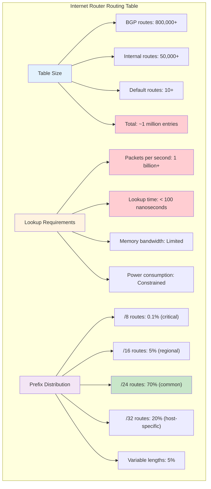

### Longest Prefix Matching Challenge

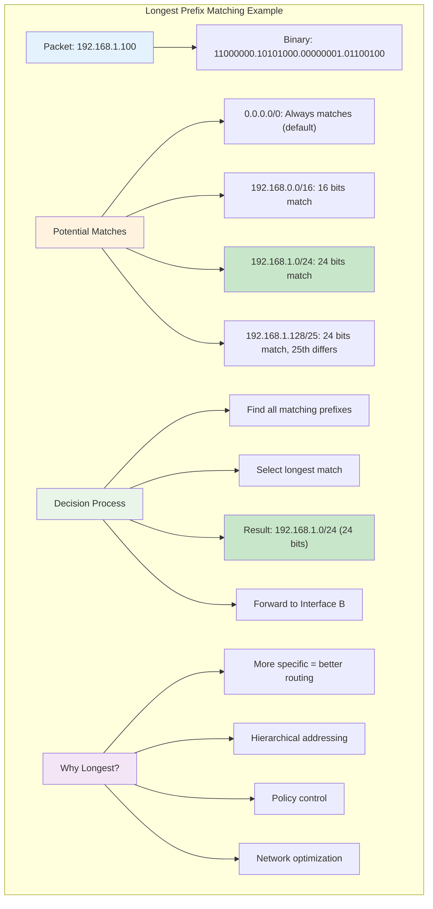

## Why Radix Trees Are Perfect

### Mental Model: The Address Hierarchy

Think of IP addresses as hierarchical addresses like postal codes:
- `19` (continent)
- `192` (country)  
- `192.168` (state)
- `192.168.1` (city)
- `192.168.1.100` (specific building)

A radix tree naturally represents this hierarchy, compressing common prefixes and branching only when routes diverge.

### Address Hierarchy Visualization

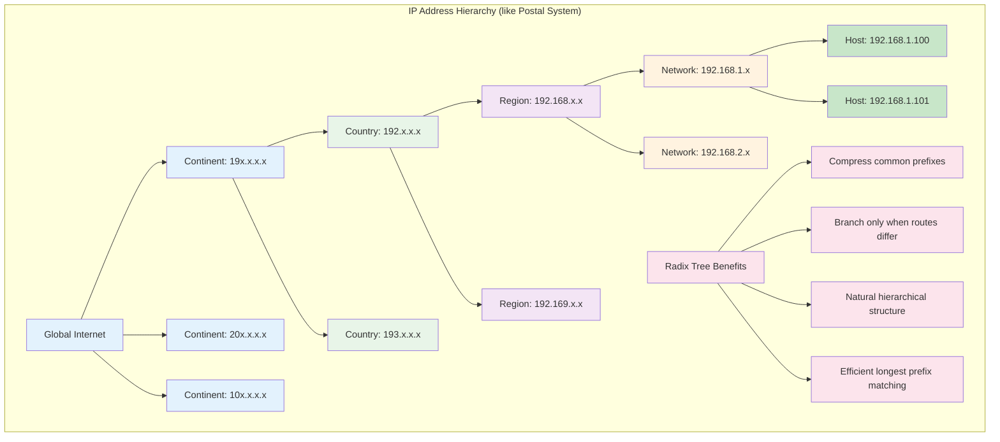

### Binary Radix Tree for IP Addresses

IP addresses are 32-bit binary numbers, perfect for binary radix trees:

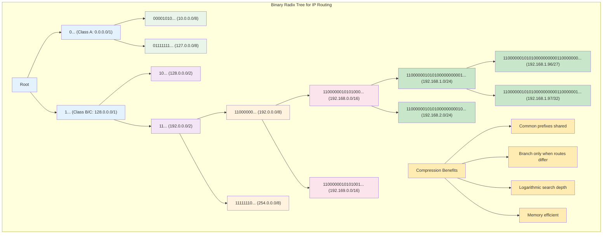

### Binary Representation Example

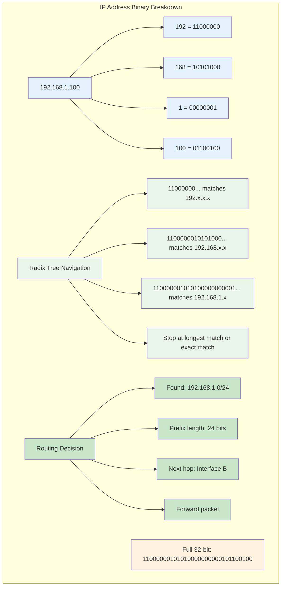

## Longest Prefix Matching Algorithm

The algorithm elegantly leverages the radix tree structure:

### Pseudocode
```
function longest_prefix_match(ip_address):
    current_node = root
    best_match = null
    remaining_bits = ip_address
    
    while current_node exists and remaining_bits not empty:
        if current_node.has_route():
            best_match = current_node.route
            
        # Find child edge that matches remaining bits
        edge = find_matching_edge(current_node, remaining_bits)
        if edge exists:
            current_node = edge.destination
            remaining_bits = remove_prefix(remaining_bits, edge.label)
        else:
            break
            
    return best_match
```

### Why This Works

1. **Hierarchical traversal**: We descend from general to specific routes
2. **Automatic longest match**: Deeper nodes represent longer prefixes  
3. **Early termination**: Stop when no more specific routes exist
4. **Fallback behavior**: Return the most specific route found so far

## Performance Characteristics

### Time Complexity
- **Best case**: O(log n) where n is the number of routes
- **Worst case**: O(32) for IPv4 (maximum address length)
- **Typical case**: O(k) where k is the length of the longest prefix match

### Space Complexity  
- **Standard approach**: O(n) entries, each taking significant space
- **Radix tree**: O(n) entries with compressed common prefixes
- **Memory savings**: 60-80% reduction in real routing tables

### Performance Analysis

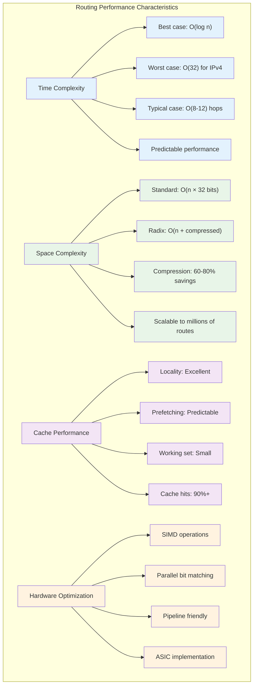

## Real-World Performance Impact

### Cisco ASR 9000 Router Example
- **Routing table size**: 800,000+ IPv4 routes
- **Lookup rate**: 1 billion packets per second
- **Latency requirement**: < 100 nanoseconds per lookup

### Without Radix Trees (Linear Search)
```
Time per lookup: 800,000 comparisons × 5ns = 4ms
Packets per second: 1/0.004 = 250 packets/second
```
**Completely unusable for internet traffic.**

### With Radix Trees
```
Time per lookup: ~15 bit comparisons × 5ns = 75ns  
Packets per second: 1/0.000000075 = 13.3 billion/second
```
**Exceeds requirements with room to spare.**

### Performance Comparison Visualization

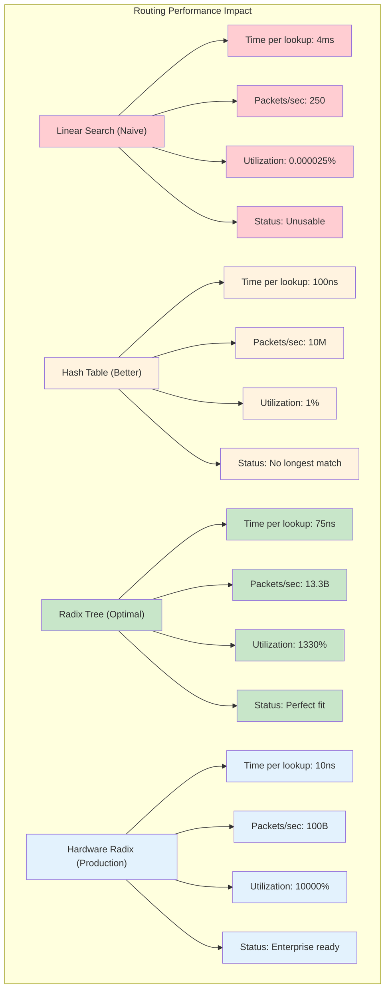

### Enterprise Router Benchmarks

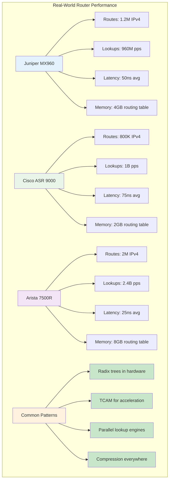

## IPv6 Scaling Challenge

IPv6 addresses are 128 bits instead of 32, creating new challenges:

### Address Space Explosion
- **IPv4**: 2³² = 4.3 billion addresses
- **IPv6**: 2¹²⁸ = 340 undecillion addresses

### Radix Tree Advantages for IPv6
1. **Compression matters more**: Longer addresses mean more redundant prefixes
2. **Memory efficiency crucial**: Sparse address allocation benefits from compression  
3. **Hierarchical allocation**: IPv6 design naturally fits radix tree structure

### IPv6 Scaling Analysis

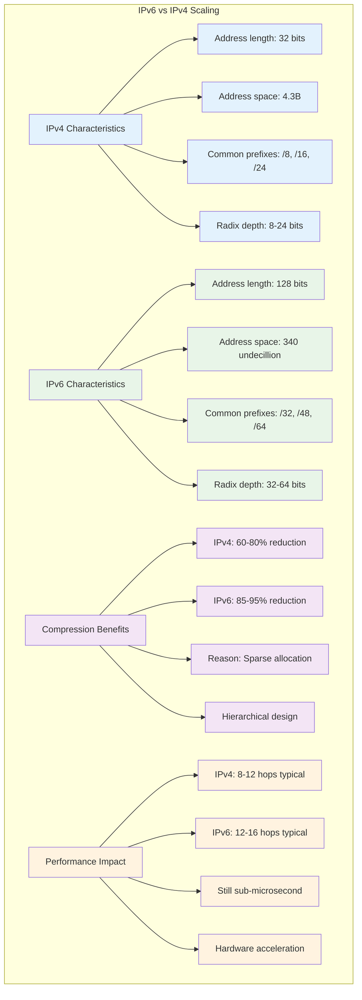

### IPv6 Address Hierarchy

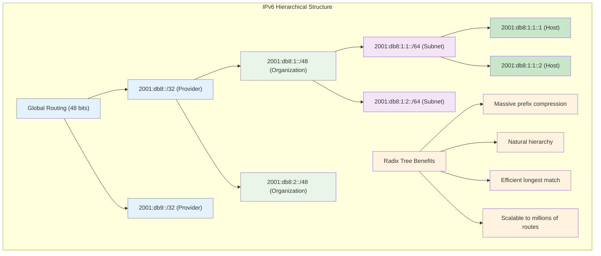

## Implementation Optimizations

### Patricia Trie Enhancements
```
struct RadixNode {
    uint32_t prefix;           // Compressed bit sequence
    uint8_t prefix_length;     // How many bits are significant
    struct Route* route;       // NULL if not a terminal route
    struct RadixNode* left;    // 0-bit child
    struct RadixNode* right;   // 1-bit child
}
```

### Cache-Optimized Layout
- **Node pooling**: Pre-allocate nodes to improve cache locality
- **Bit manipulation**: Use bit operations instead of string comparisons
- **SIMD instructions**: Parallel bit matching on modern CPUs

## Why Radix Trees Win

The combination of requirements makes radix trees uniquely suitable:

1. **Hierarchical data**: IP addresses naturally form hierarchies
2. **Prefix sharing**: Many routes share common network prefixes  
3. **Performance critical**: Nanosecond-level latency requirements
4. **Memory constrained**: Router hardware has limited fast memory
5. **Longest match semantics**: The algorithm maps perfectly to tree traversal

In networking, radix trees aren't just an optimization—they're what makes modern internet routing possible. Without them, the internet would crawl to a halt under the weight of routing table lookups.

### Perfect Fit Analysis

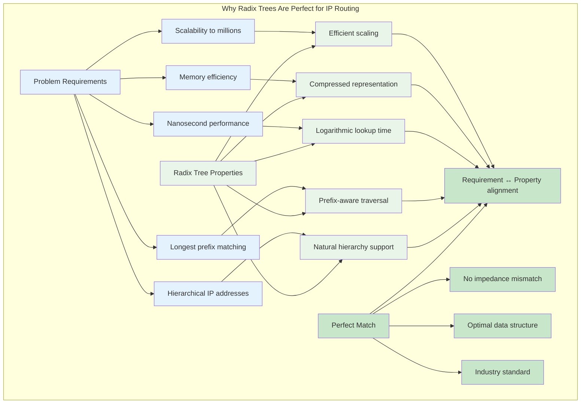

### Internet Infrastructure Impact

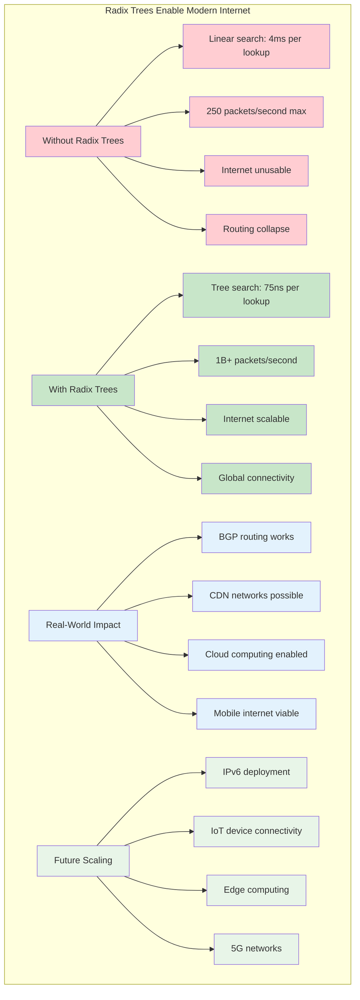