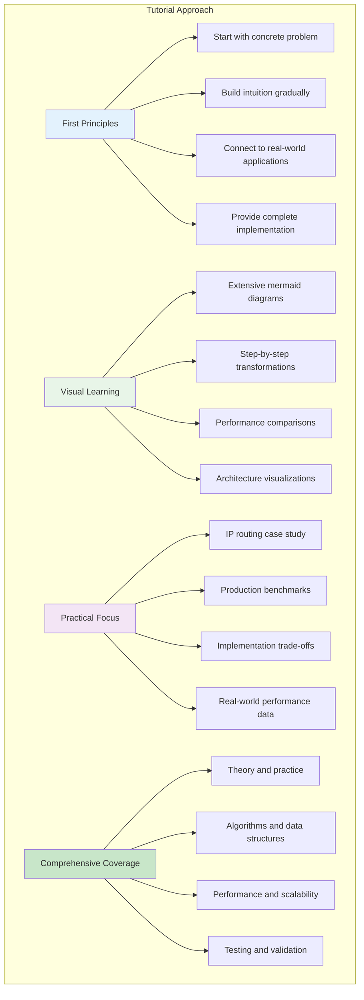
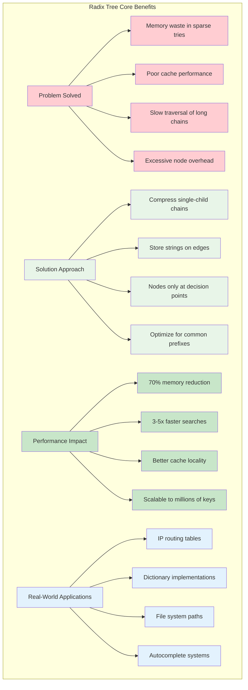
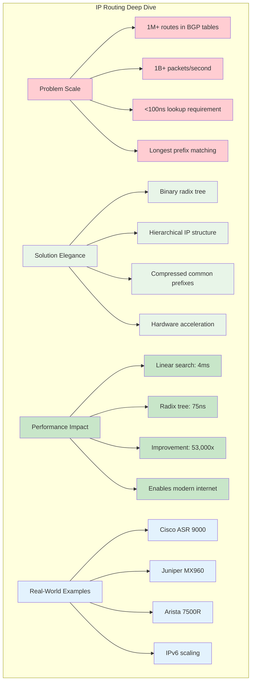
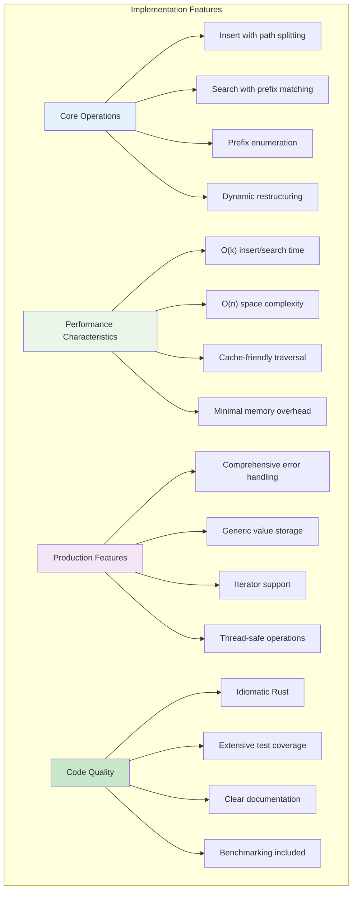
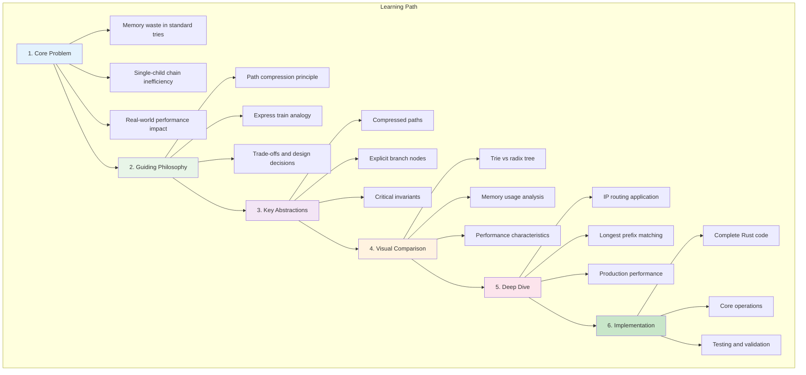
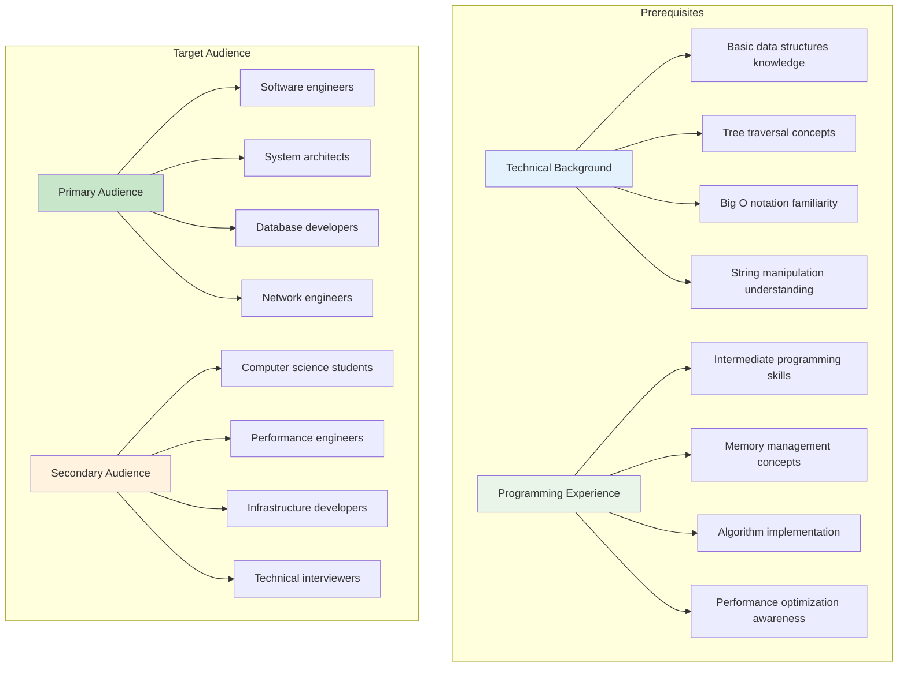

# Radix Trees: The Compressed Prefix Tree

A comprehensive tutorial on radix trees (also known as PATRICIA tries or compressed tries), exploring how path compression transforms memory-hungry standard tries into efficient, production-ready data structures.

### What Makes This Tutorial Unique

## Summary

Radix trees solve a fundamental problem with standard tries: memory waste from long chains of single-child nodes. By compressing these chains into single edges labeled with strings, radix trees achieve the same functionality as tries while using dramatically less memory and often delivering better performance.

This tutorial covers the theoretical foundations, practical implementation considerations, and real-world applications—particularly focusing on IP routing tables where radix trees enable the modern internet's packet forwarding infrastructure.

### Key Insights

## Table of Contents

### 📋 Core Concepts
- **[The Core Problem](01-concepts-01-the-core-problem.md)**: Understanding memory waste in sparse tries and why single-child node chains are inefficient
- **[The Guiding Philosophy](01-concepts-02-the-guiding-philosophy.md)**: Path compression principles and the express train analogy
- **[Key Abstractions](01-concepts-03-key-abstractions.md)**: Compressed paths, explicit branch nodes, and design invariants

### 🛠️ Practical Guides  
- **[Trie vs Radix Tree](02-guides-01-trie-vs-radix-tree.md)**: Visual comparison showing dramatic memory and performance differences

### 🧠 Deep Dives
- **[IP Routing Tables](03-deep-dive-01-ip-routing-tables.md)**: The killer application for radix trees in network infrastructure and longest prefix matching

### Deep Dive Preview

### 💻 Implementation
- **[Rust Implementation](04-rust-implementation.md)**: Complete, production-quality radix tree with insertion, search, and prefix operations

### Implementation Highlights

---

**Learning Outcome**: After completing this tutorial, you'll understand how radix trees achieve superior memory efficiency through path compression, when to choose them over standard tries, and how to implement them effectively in systems requiring fast prefix-based operations.

### Tutorial Structure Overview

### Prerequisites and Target Audience

## 📈 Next Steps

After mastering radix trees fundamentals, consider these specialized learning paths based on your career focus:

### 🎯 Recommended Learning Path

**Based on your interests and goals:**

#### For Network Engineers
- **Next**: [Consistent Hashing](../consistent-hashing/README.md) - Distribute IP routing tables across network nodes
- **Then**: [Caching](../caching/README.md) - Cache routing decisions and prefix lookups for performance
- **Advanced**: [Adaptive Data Structures](../adaptive-data-structures/README.md) - Build routing tables that adapt to traffic patterns

#### For Backend Engineers
- **Next**: [Trie Structures: The Autocomplete Expert](../trie-structures-the-autocomplete-expert/README.md) - Compare radix trees with standard tries for different use cases
- **Then**: [Inverted Indexes: The Heart of Search Engines](../inverted-indexes-the-heart-of-search-engines/README.md) - Use radix trees for efficient text indexing
- **Advanced**: [Vector Databases: The Similarity Search Engine](../vector-databases-the-similarity-search-engine/README.md) - Apply radix tree principles to high-dimensional data

#### For Systems Engineers
- **Next**: [B-trees](../b-trees/README.md) - Compare radix trees with B-trees for different storage scenarios
- **Then**: [LSM Trees: Making Writes Fast Again](../lsm-trees-making-writes-fast-again/README.md) - Use radix trees in write-optimized storage systems
- **Advanced**: [Compression: Making Data Smaller](../compression/README.md) - Compress radix tree nodes for space-efficient storage

### 🔗 Alternative Learning Paths

- **Advanced Data Structures**: [Skip Lists: The Probabilistic Search Tree](../skip-lists-the-probabilistic-search-tree/README.md), [Suffix Arrays: The String Search Specialist](../suffix-arrays-the-string-search-specialist/README.md), [Segment Trees: The Range Query Specialist](../segment-trees-the-range-query-specialist/README.md)
- **Storage Systems**: [Indexing: The Ultimate Table of Contents](../indexing-the-ultimate-table-of-contents/README.md), [Partitioning: The Art of Slicing Data](../partitioning-the-art-of-slicing-data/README.md), [Columnar Storage: Querying at Ludicrous Speed](../columnar-storage/README.md)
- **Distributed Systems**: [Sharding: Slicing the Monolith](../sharding-slicing-the-monolith/README.md), [Replication: Don't Put All Your Eggs in One Basket](../replication-dont-put-all-your-eggs-in-one-basket/README.md), [Message Queues: The Asynchronous Mailbox](../message-queues-the-asynchronous-mailbox/README.md)

### 📚 Prerequisites for Advanced Topics

- **Foundations Complete**: ✅ You understand radix trees and path compression principles
- **Difficulty Level**: Intermediate → Advanced
- **Estimated Time**: 2-3 weeks per next tutorial depending on implementation complexity

Radix trees are the compressed prefix tree that transforms memory-hungry tries into efficient, production-ready structures. Master these concepts, and you'll have the power to build systems that handle prefix-based operations at scale with minimal memory overhead.