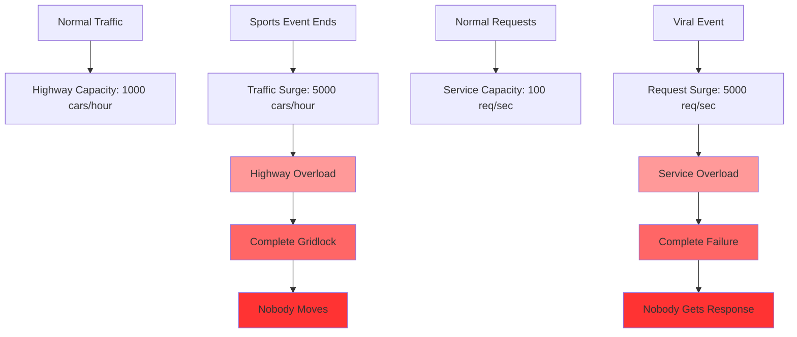
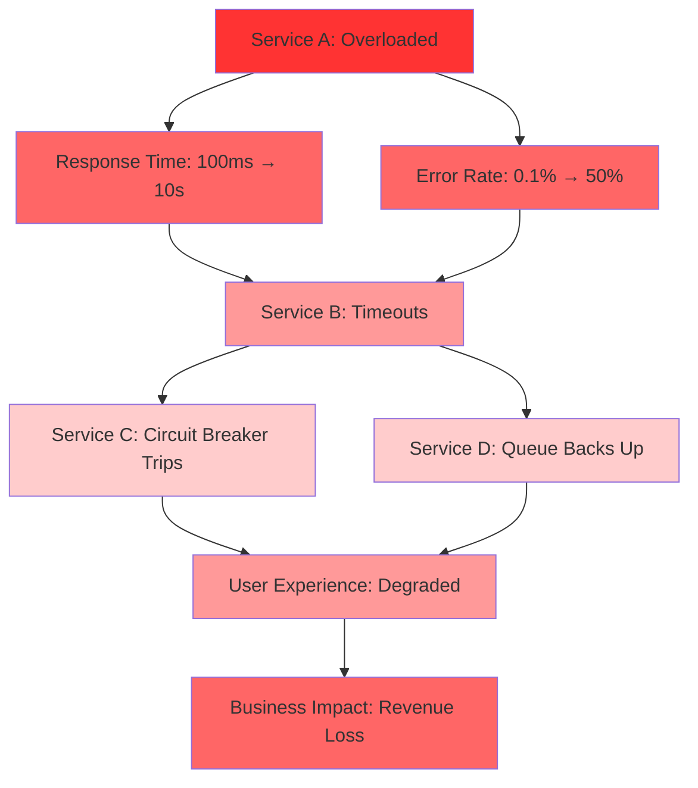
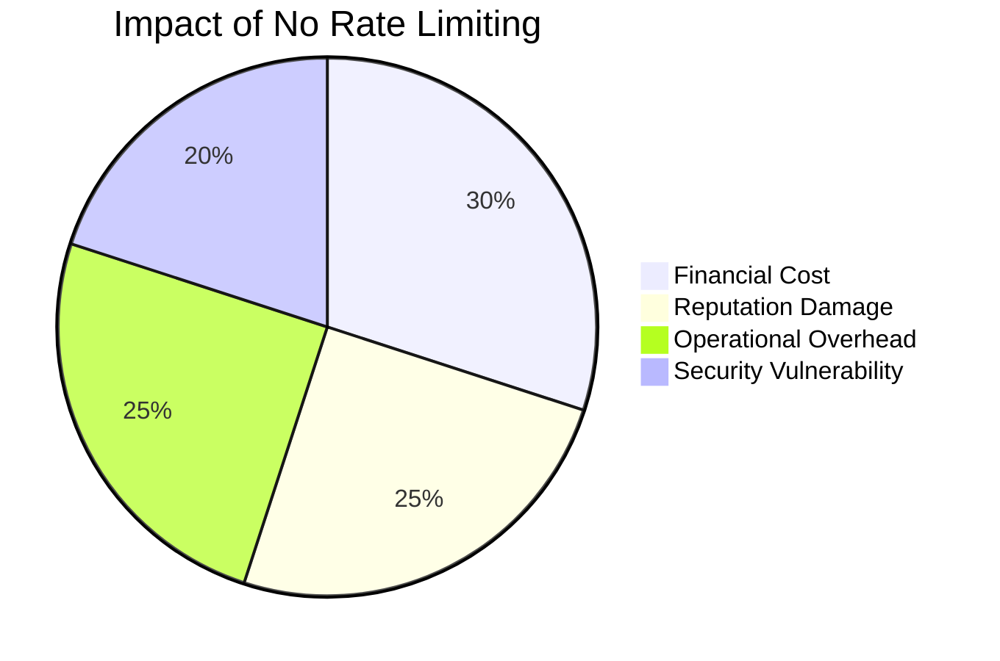

# The Core Problem: Service Overwhelm

## What happens when the floodgates open?

Imagine a highway. On most days, traffic flows smoothly. But when a sports event ends, thousands of cars suddenly rush onto the highway simultaneously. Without traffic control, the highway becomes gridlocked. Nobody moves. The entire system collapses.

This is exactly what happens to web services without rate limiting.

## The Fundamental Challenge

**A single user, misconfigured script, or viral event can generate requests faster than your service can handle them.**

Consider these scenarios:

- **The Retry Storm**: A client experiences a timeout and retries immediately. The timeout was caused by overload, so the retry makes things worse. Soon, exponential backoff fails, and the client is sending hundreds of requests per second.

- **The Viral Moment**: Your API powers a mobile app that suddenly goes viral. Instead of your typical 100 requests per second, you're now receiving 50,000 requests per second. Your databases can't keep up.

- **The Misconfigured Loop**: A developer accidentally deploys code with a polling loop that runs every millisecond instead of every minute. Their single service instance hammers your API with 1,000 requests per second.

## Why This Problem Is Hard

### The Speed of Digital vs. Physical

In the physical world, there are natural limits. A person can only walk so fast. A car can only accelerate so quickly. But in the digital world, a single line of code can generate thousands of requests in a second.

### The Ripple Effect

When one service becomes overwhelmed:
1. Response times increase
2. Error rates spike
3. Other services depending on it start failing
4. The entire system cascades into failure

This cascade effect is why rate limiting is not just about protecting individual services—it's about protecting the entire system ecosystem.

### The Fairness Problem

Without limits, a single misbehaving client can monopolize all resources, starving legitimate users. It's like one person taking all the free samples at a grocery store—everyone else suffers.

## The Cost of No Limits

**Financial Impact**: Cloud bills skyrocket as auto-scaling spins up hundreds of instances trying to handle the load.
- Example: Normal cost $1,000/month → Spike cost $50,000/month
- Auto-scaling can't differentiate between legitimate traffic and abuse

**Reputation Damage**: Users experience slow responses or outages, damaging trust and potentially losing customers.
- Every 100ms of additional latency can reduce conversion rates by 1%
- Outages can lead to immediate customer churn and long-term brand damage

**Operational Nightmare**: Engineering teams spend their weekend firefighting instead of building features.
- On-call engineers pulled from strategic work to handle incidents
- Technical debt accumulates as quick fixes are prioritized over proper solutions

**Security Vulnerability**: Attackers can exploit the lack of rate limiting to mount denial-of-service attacks.
- DDoS attacks become trivial when there are no request limits
- Brute force attacks can run unchecked against authentication endpoints

## The Core Insight

**Rate limiting is not about being restrictive—it's about being protective.**

Just as a circuit breaker protects your house from electrical overload, rate limiting protects your service from request overload. It's a safety mechanism that:

- Keeps your service stable and responsive
- Ensures fair resource allocation among users
- Prevents cascading failures
- Maintains consistent performance

## The Real-World Analogy

Think of rate limiting like a nightclub bouncer. The bouncer doesn't hate people—they're protecting the experience for everyone inside. By controlling how many people enter and how quickly, they ensure:

- Fire safety (system stability)
- Comfortable environment (good performance)
- Fair access (one person can't bring 50 friends)
- Sustainable operation (the club stays profitable)

Without the bouncer, the club becomes overcrowded, unsafe, and unpleasant for everyone.

## The Bottom Line

Rate limiting solves a fundamental problem of digital systems: **unlimited demand can instantly destroy finite resources**. It's not optional—it's essential infrastructure for any system that serves multiple users.

The question isn't whether you need rate limiting. The question is: will you implement it proactively, or will you be forced to implement it reactively when your system is already on fire?