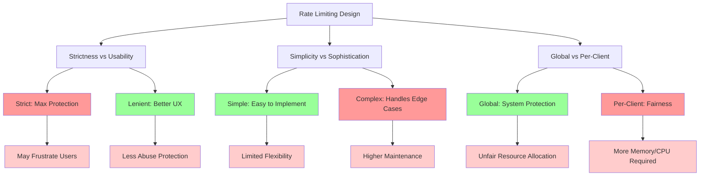

# The Guiding Philosophy: Budget Requests Over Time

## The Central Principle

**Rate limiting is fundamentally about budgeting requests over time.**

Just as you budget money over a month, rate limiting budgets requests over time windows. You give each client a "request allowance" that replenishes over time. When they exceed their allowance, they must wait.

## The Key Insight: Time is the Currency

In rate limiting, time becomes the currency:

- **Clients earn credits** by waiting
- **Clients spend credits** by making requests  
- **The system controls** how quickly credits are earned
- **The system enforces** spending limits


This transforms an infinite resource problem (unlimited requests) into a finite resource problem (limited requests per time window).

## Core Design Principles

### 1. Fairness Through Equality

Every client gets the same baseline allowance. Whether you're a small startup or a large enterprise, you start with the same request budget. This prevents resource monopolization.

```
User A: 100 requests/minute
User B: 100 requests/minute  
User C: 100 requests/minute
```

### 2. Predictable Behavior

Rate limiting should be transparent and consistent:

- **Clients know their limits** (documented in API docs)
- **Limits are enforced uniformly** (no special cases)
- **Responses are predictable** (clear error messages)

### 3. Graceful Degradation

When limits are exceeded, the system degrades gracefully:

- **Reject new requests** instead of crashing
- **Provide clear feedback** about when to retry
- **Maintain service** for clients within limits

### 4. Burst Tolerance

Real-world usage isn't perfectly uniform. Good rate limiting allows for natural bursts while preventing sustained abuse:

- **Allow short bursts** above the average rate
- **Prevent sustained** high-rate usage
- **Smooth out** traffic patterns over time

## The Philosophy in Action

### The Water Bucket Analogy

Think of rate limiting like a bucket with a hole in the bottom:

- **Water flows in** (requests arrive)
- **Water flows out** (requests are processed)
- **Bucket capacity** (burst allowance)
- **Hole size** (steady-state rate)


If water flows in faster than it flows out, the bucket fills up. When it overflows, you reject requests. The hole ensures a steady processing rate regardless of input spikes.

### The Bank Account Model

Rate limiting works like a bank account:

- **Regular deposits** (credits added over time)
- **Withdrawal limits** (maximum requests per period)
- **Overdraft protection** (reject requests when balance is zero)
- **Balance tracking** (current request allowance)

## Trade-offs and Tensions



### Strictness vs. Usability

**Strict Rate Limiting**: Provides maximum protection but may frustrate legitimate users during peak usage.

**Lenient Rate Limiting**: Improves user experience but provides less protection against abuse.

**Philosophy**: Start strict, then relax based on actual usage patterns.

### Simplicity vs. Sophistication

**Simple Rate Limiting**: Easy to understand and implement (e.g., "100 requests per minute").

**Sophisticated Rate Limiting**: Handles complex scenarios (e.g., different limits for different endpoints).

**Philosophy**: Simple first, add complexity only when needed.

### Global vs. Per-Client

**Global Rate Limiting**: Protects the entire system but may unfairly impact some clients.

**Per-Client Rate Limiting**: Ensures fairness but requires more resources to track.

**Philosophy**: Use per-client limits for fairness, with global limits as a safety net.

## The Psychological Aspect

### Managing Expectations

Rate limiting shapes user behavior:

- **Clear limits** encourage efficient API usage
- **Predictable resets** allow for planning
- **Reasonable bounds** prevent frustration

### The Goldilocks Principle

Rate limits should be:
- **Not too strict** (killing legitimate usage)
- **Not too lenient** (allowing abuse)
- **Just right** (protecting the system while enabling normal use)

## Implementation Philosophy

### Fail Fast, Fail Clear

When limits are exceeded:
1. **Reject immediately** (don't queue indefinitely)
2. **Explain clearly** (what limit was hit, when to retry)
3. **Be consistent** (same behavior every time)

### Measure, Don't Guess

Rate limiting decisions should be data-driven:
- **Monitor actual usage** patterns
- **Adjust limits** based on real traffic
- **Track abuse** patterns to improve detection

### Defense in Depth

Rate limiting is one layer of protection:
- **Application-level** rate limiting (per-endpoint)
- **User-level** rate limiting (per-API key)
- **IP-level** rate limiting (per-source)
- **Global** rate limiting (system-wide)

## The Ultimate Goal

**The best rate limiting is invisible to legitimate users while effectively blocking abuse.**

When working correctly, rate limiting should be like a good security guard—present but unobtrusive, protecting the premises without interfering with normal business.

## The Bottom Line

Rate limiting isn't about saying "no" to users—it's about saying "yes" sustainably. By budgeting requests over time, we ensure that services remain available, responsive, and fair for everyone.

The philosophy is simple: **Control the rate, protect the system, preserve the experience.**