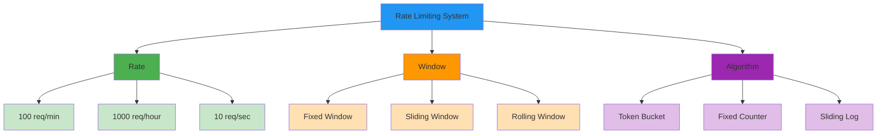
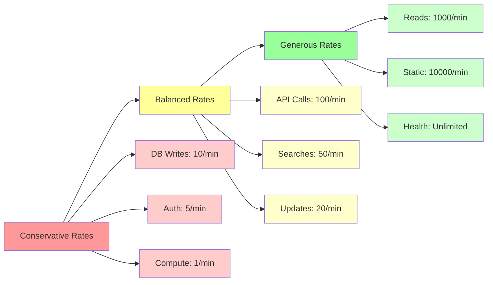
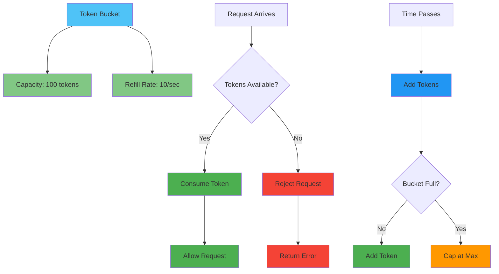

# Key Abstractions: Rate, Window, and Algorithm

## The Three Pillars of Rate Limiting

Every rate limiting system is built on three fundamental abstractions:

1. **Rate**: How many requests are allowed?
2. **Window**: Over what time period?
3. **Algorithm**: How do we enforce the limit?



Understanding these abstractions is crucial for designing effective rate limiting systems.

## Abstraction 1: The Rate

**The rate defines the steady-state throughput you want to allow.**

### Examples of Rate Specifications

```
100 requests per minute
1000 requests per hour
10 requests per second
```

### The Rate Spectrum



**Conservative Rates**: Protect the system but may frustrate users
- Database writes: 10/minute
- Expensive computations: 1/minute
- Authentication attempts: 5/minute

**Generous Rates**: Better user experience but less protection
- Read operations: 1000/minute
- Static content: 10000/minute
- Health checks: Unlimited

### Rate Granularity

**Per-User Rates**: Each user gets their own allowance
```
User A: 100 req/min
User B: 100 req/min
User C: 100 req/min
```

**Per-Endpoint Rates**: Different endpoints have different limits
```
GET /users: 1000 req/min
POST /users: 100 req/min
DELETE /users: 10 req/min
```

**Tiered Rates**: Different user tiers get different allowances
```
Free tier: 100 req/min
Premium tier: 1000 req/min
Enterprise tier: 10000 req/min
```

## Abstraction 2: The Window

**The window defines the time period over which the rate is measured.**

### Window Types

```mermaid
gantt
    title Window Types Comparison
    dateFormat X
    axisFormat %L
    
    section Fixed Window
    Window 1 :milestone, w1, 0, 0
    Window 2 :milestone, w2, 60, 60
    Window 3 :milestone, w3, 120, 120
    Window 4 :milestone, w4, 180, 180
    
    section Sliding Window
    Time 30s :active, s1, 0, 60
    Time 60s :active, s2, 30, 90
    Time 90s :active, s3, 60, 120
    Time 120s :active, s4, 90, 150
```



**Fixed Windows**: Reset at regular intervals
```
Minute 1: 0-60 seconds
Minute 2: 60-120 seconds
Minute 3: 120-180 seconds
```

**Sliding Windows**: Continuously moving time period
```
Current time: 90 seconds
Window: Last 60 seconds (30-90 seconds)
```

**Rolling Windows**: Combination of fixed and sliding
```
Check every 10 seconds
Window: Last 60 seconds
```

### Window Size Trade-offs

**Short Windows** (1 second - 1 minute):
- **Pros**: Fast response to abuse, fine-grained control
- **Cons**: Less burst tolerance, more resource intensive

**Long Windows** (1 hour - 1 day):
- **Pros**: Better for usage quotas, more burst tolerance
- **Cons**: Slower response to abuse, coarser control

### The Highway On-Ramp Analogy

Think of windows like traffic light cycles:

**Fixed Window**: "Green light for exactly 60 seconds, then red for 60 seconds"
- Predictable, but can cause traffic bunching

**Sliding Window**: "Green light moves continuously, always considering the last 60 seconds"
- Smoother traffic flow, but more complex to implement

## Abstraction 3: The Algorithm

**The algorithm defines how requests are processed within the rate and window constraints.**

### Token Bucket Algorithm

**Concept**: Requests consume tokens from a bucket that refills over time.



**Behavior**:
- Allows bursts up to bucket capacity
- Maintains steady-state rate over time
- Smooth handling of irregular traffic

### Fixed Window Counter

**Concept**: Count requests in fixed time windows.

```
Window: 1 minute
Limit: 100 requests
Counter: Current requests in window

If counter < limit → Allow request
If counter >= limit → Reject request
```

**Behavior**:
- Simple to implement
- Predictable reset times
- Can allow double the intended rate at window boundaries

### Sliding Window Log

**Concept**: Track timestamp of each request in a sliding window.

```
Window: 1 minute
Limit: 100 requests
Log: [timestamps of recent requests]

If log.length < limit → Allow request
If log.length >= limit → Reject request
```

**Behavior**:
- Most accurate rate limiting
- Handles bursts smoothly
- Memory intensive for high-traffic systems

### Sliding Window Counter

**Concept**: Approximate sliding window using multiple fixed windows.

```
Previous window: 80 requests
Current window: 30 requests
Time in current window: 70%

Estimated current rate: 30 + (80 × 0.3) = 54 requests
```

**Behavior**:
- Good approximation of sliding window
- Memory efficient
- Balances accuracy with performance

## The Abstractions in Practice

### Choosing the Right Rate

**Consider your system's capacity**:
```
Database can handle: 1000 writes/second
Safety margin: 20%
Per-user limit: 800 writes/second ÷ expected_users
```

**Consider user experience**:
```
Typical user behavior: 10 requests/minute
Burst scenarios: 50 requests/minute
Reasonable limit: 100 requests/minute
```

### Choosing the Right Window

**For abuse prevention**: Short windows (1-5 minutes)
**For usage quotas**: Long windows (1 hour - 1 day)
**For burst tolerance**: Medium windows (5-15 minutes)

### Choosing the Right Algorithm

**Token Bucket**: Best for allowing natural bursts
**Fixed Window**: Simplest to implement and understand
**Sliding Window**: Most accurate but resource intensive
**Sliding Window Counter**: Good balance of accuracy and efficiency

## Implementation Patterns

### The Multi-Layer Approach

```
Layer 1: IP-based (1000 req/min) - Prevent DDoS
Layer 2: User-based (100 req/min) - Prevent abuse
Layer 3: Endpoint-based (10 req/min) - Protect expensive operations
```

### The Hierarchical Approach

```
Global limit: 10000 req/sec (protect system)
Per-user limit: 100 req/min (ensure fairness)
Per-endpoint limit: 10 req/min (protect specific resources)
```

### The Adaptive Approach

```
Normal conditions: 100 req/min
High load conditions: 50 req/min
Emergency conditions: 10 req/min
```

## The Mental Model

**Rate limiting is like a traffic control system:**

- **Rate**: Speed limit (55 mph)
- **Window**: Measurement distance (per mile)
- **Algorithm**: Enforcement method (speed cameras, patrol cars)

Just as traffic control balances flow efficiency with safety, rate limiting balances system protection with user experience.

## Key Takeaways

1. **Rate** defines the steady-state throughput you want to allow
2. **Window** defines the time period for measurement
3. **Algorithm** defines how limits are enforced
4. **Choose based on your specific needs**: abuse prevention, fairness, burst tolerance
5. **Layer multiple approaches** for comprehensive protection
6. **Monitor and adjust** based on real usage patterns

These three abstractions—rate, window, and algorithm—form the foundation of all rate limiting systems. Master them, and you can design rate limiting that protects your system while enabling legitimate use.