# Implementing Token Bucket: A Hands-On Guide

## The Token Bucket Mental Model

Imagine a bucket that:
- Holds a maximum number of tokens
- Tokens are added at a steady rate
- Each request consumes one token
- If no tokens are available, the request is rejected

```mermaid
graph TD
    A[Token Bucket] --> B[Capacity: 10 tokens]
    A --> C[Refill Rate: 2 tokens/sec]
    
    D[Time 0s] --> E[●●●●●●●●●●] 
    D --> F[10 tokens available]
    
    G[Request arrives] --> H[Consume 1 token]
    H --> I[●●●●●●●●●_]
    I --> J[9 tokens remaining]
    
    K[1 second passes] --> L[Add 2 tokens]
    L --> M[●●●●●●●●●●]
    M --> N[10 tokens (capped)]
    
    style A fill:#4fc3f7
    style E fill:#4caf50
    style I fill:#ff9800
    style M fill:#4caf50
```

This is the token bucket algorithm—one of the most effective and intuitive rate limiting approaches.

## Why Token Bucket?

**Burst Tolerance**: Allows legitimate traffic spikes while preventing sustained abuse
**Smooth Rate Control**: Maintains steady-state rate over time
**Intuitive Behavior**: Easy to understand and explain
**Flexible**: Can be tuned for different use cases

## The Core Components

### 1. The Bucket State

```
struct TokenBucket {
    capacity: u32,        // Maximum tokens the bucket can hold
    tokens: u32,          // Current number of tokens
    refill_rate: u32,     // Tokens added per second
    last_refill: Instant, // When we last added tokens
}
```

### 2. The Refill Process

```
fn refill(&mut self) {
    let now = Instant::now();
    let elapsed = now.duration_since(self.last_refill);
    
    // Calculate tokens to add based on elapsed time
    let tokens_to_add = (elapsed.as_secs_f64() * self.refill_rate as f64) as u32;
    
    // Add tokens but don't exceed capacity
    self.tokens = (self.tokens + tokens_to_add).min(self.capacity);
    self.last_refill = now;
}
```

### 3. The Request Processing

```
fn try_consume(&mut self, tokens: u32) -> bool {
    self.refill(); // Update token count first
    
    if self.tokens >= tokens {
        self.tokens -= tokens;
        true  // Request allowed
    } else {
        false // Request rejected
    }
}
```

## Step-by-Step Implementation

### Step 1: Basic Token Bucket

Let's start with a simple implementation:

```rust
use std::time::{Duration, Instant};

pub struct TokenBucket {
    capacity: u32,
    tokens: u32,
    refill_rate: u32,
    last_refill: Instant,
}

impl TokenBucket {
    pub fn new(capacity: u32, refill_rate: u32) -> Self {
        TokenBucket {
            capacity,
            tokens: capacity, // Start with full bucket
            refill_rate,
            last_refill: Instant::now(),
        }
    }
    
    pub fn try_consume(&mut self, tokens: u32) -> bool {
        self.refill();
        
        if self.tokens >= tokens {
            self.tokens -= tokens;
            true
        } else {
            false
        }
    }
    
    fn refill(&mut self) {
        let now = Instant::now();
        let elapsed = now.duration_since(self.last_refill);
        
        let tokens_to_add = (elapsed.as_secs_f64() * self.refill_rate as f64) as u32;
        
        self.tokens = (self.tokens + tokens_to_add).min(self.capacity);
        self.last_refill = now;
    }
}
```

### Step 2: Testing the Basic Bucket

```rust
#[cfg(test)]
mod tests {
    use super::*;
    use std::thread;
    use std::time::Duration;

    #[test]
    fn test_basic_consumption() {
        let mut bucket = TokenBucket::new(10, 1); // 10 tokens, 1 per second
        
        // Should allow 10 requests initially
        for _ in 0..10 {
            assert!(bucket.try_consume(1));
        }
        
        // 11th request should be rejected
        assert!(!bucket.try_consume(1));
    }

    #[test]
    fn test_refill_over_time() {
        let mut bucket = TokenBucket::new(10, 2); // 10 tokens, 2 per second
        
        // Consume all tokens
        for _ in 0..10 {
            assert!(bucket.try_consume(1));
        }
        
        // Wait for refill
        thread::sleep(Duration::from_secs(1));
        
        // Should have ~2 tokens now
        assert!(bucket.try_consume(1));
        assert!(bucket.try_consume(1));
        assert!(!bucket.try_consume(1)); // Third should fail
    }
}
```

### Step 3: Real-World Enhancements

#### Handle Fractional Tokens

```rust
pub struct TokenBucket {
    capacity: f64,
    tokens: f64,
    refill_rate: f64,
    last_refill: Instant,
}

impl TokenBucket {
    fn refill(&mut self) {
        let now = Instant::now();
        let elapsed = now.duration_since(self.last_refill);
        
        let tokens_to_add = elapsed.as_secs_f64() * self.refill_rate;
        
        self.tokens = (self.tokens + tokens_to_add).min(self.capacity);
        self.last_refill = now;
    }
    
    pub fn try_consume(&mut self, tokens: f64) -> bool {
        self.refill();
        
        if self.tokens >= tokens {
            self.tokens -= tokens;
            true
        } else {
            false
        }
    }
}
```

#### Add Burst Detection

```rust
pub struct TokenBucket {
    capacity: f64,
    tokens: f64,
    refill_rate: f64,
    last_refill: Instant,
    burst_threshold: f64,
    burst_count: u32,
}

impl TokenBucket {
    pub fn try_consume(&mut self, tokens: f64) -> Result<(), RateLimitError> {
        self.refill();
        
        if self.tokens >= tokens {
            self.tokens -= tokens;
            
            // Check for burst behavior
            if tokens > self.burst_threshold {
                self.burst_count += 1;
                if self.burst_count > 5 {
                    return Err(RateLimitError::BurstDetected);
                }
            } else {
                self.burst_count = 0;
            }
            
            Ok(())
        } else {
            Err(RateLimitError::InsufficientTokens)
        }
    }
}
```

## Practical Usage Patterns

### Web API Rate Limiting

```rust
use std::collections::HashMap;
use std::sync::Mutex;

pub struct ApiRateLimiter {
    buckets: Mutex<HashMap<String, TokenBucket>>,
    default_capacity: u32,
    default_refill_rate: u32,
}

impl ApiRateLimiter {
    pub fn new(capacity: u32, refill_rate: u32) -> Self {
        ApiRateLimiter {
            buckets: Mutex::new(HashMap::new()),
            default_capacity: capacity,
            default_refill_rate: refill_rate,
        }
    }
    
    pub fn check_rate_limit(&self, user_id: &str) -> bool {
        let mut buckets = self.buckets.lock().unwrap();
        
        let bucket = buckets.entry(user_id.to_string())
            .or_insert_with(|| TokenBucket::new(
                self.default_capacity,
                self.default_refill_rate
            ));
        
        bucket.try_consume(1)
    }
}
```

### Different Costs for Different Operations

```rust
pub enum ApiOperation {
    Read,
    Write,
    Delete,
    Search,
}

impl ApiOperation {
    fn cost(&self) -> u32 {
        match self {
            ApiOperation::Read => 1,
            ApiOperation::Write => 5,
            ApiOperation::Delete => 10,
            ApiOperation::Search => 3,
        }
    }
}

pub fn handle_request(limiter: &mut TokenBucket, operation: ApiOperation) -> Result<(), String> {
    let cost = operation.cost();
    
    if limiter.try_consume(cost) {
        Ok(())
    } else {
        Err(format!("Rate limit exceeded for operation {:?}", operation))
    }
}
```

## Configuration Examples

### Conservative Configuration (Database Writes)
```rust
// 50 writes allowed initially, then 1 per second
let bucket = TokenBucket::new(50, 1);
```

### Generous Configuration (Read Operations)
```rust
// 1000 reads allowed initially, then 100 per second
let bucket = TokenBucket::new(1000, 100);
```

### Burst-Friendly Configuration (API Calls)
```rust
// 100 calls allowed initially, then 10 per second
let bucket = TokenBucket::new(100, 10);
```

## Visualizing Token Bucket Behavior

```mermaid
gantt
    title Token Bucket Timeline
    dateFormat X
    axisFormat %L
    
    section Tokens Available
    20 tokens :milestone, t0, 0, 0
    10 tokens :milestone, t1, 1, 1
    15 tokens :milestone, t2, 1000, 1000
    10 tokens :milestone, t3, 1001, 1001
    15 tokens :milestone, t4, 2000, 2000
    REJECTED :crit, t5, 2001, 2001
    20 tokens :milestone, t6, 3000, 3000
    
    section Requests
    10 requests :active, r1, 0, 1
    5 requests :active, r2, 1000, 1001
    20 requests :crit, r3, 2000, 2001
```



**Timeline Explanation:**
```
Time: 0s    [████████████████████] 20/20 tokens
Request: 10 [██████████          ] 10/20 tokens
Time: 1s    [████████████████████] 15/20 tokens (refilled 5)
Request: 5  [██████████████████  ] 10/20 tokens
Time: 2s    [████████████████████] 15/20 tokens (refilled 5)
Request: 20 [REJECTED - only 15 tokens available]
Time: 3s    [████████████████████] 20/20 tokens (refilled 5, capped at 20)
```

## Common Pitfalls and Solutions

### Problem: Clock Skew
**Issue**: System clock changes affect token refill
**Solution**: Use monotonic time sources

### Problem: Integer Overflow
**Issue**: Long-running systems may overflow time calculations
**Solution**: Use appropriate data types and handle wraparound

### Problem: Memory Leaks
**Issue**: Buckets for inactive users consume memory
**Solution**: Implement TTL cleanup for unused buckets

### Problem: Thundering Herd
**Issue**: All buckets refill simultaneously
**Solution**: Jitter the refill times or use continuous refill

## Integration with Web Frameworks

### Axum Middleware Example

```rust
use axum::{
    http::StatusCode,
    middleware::Next,
    response::Response,
    Request,
};

pub async fn rate_limit_middleware(
    request: Request<Body>,
    next: Next<Body>,
) -> Result<Response, StatusCode> {
    let user_id = extract_user_id(&request);
    
    if !RATE_LIMITER.check_rate_limit(&user_id) {
        return Err(StatusCode::TOO_MANY_REQUESTS);
    }
    
    Ok(next.run(request).await)
}
```

## Key Takeaways

1. **Token bucket allows bursts** while maintaining steady-state rate
2. **Fractional tokens** provide more granular control
3. **Different operations** can have different costs
4. **Proper testing** is crucial for time-based algorithms
5. **Memory management** is important for long-running systems
6. **Integration patterns** make it easy to add to existing systems

The token bucket algorithm strikes an excellent balance between simplicity and effectiveness, making it ideal for most rate limiting scenarios.