# Algorithms Comparison: The Trade-offs That Matter

## The Rate Limiting Algorithm Landscape

Not all rate limiting algorithms are created equal. Each has distinct characteristics that make it suitable for different scenarios. Understanding these trade-offs is crucial for choosing the right algorithm for your use case.

```mermaid
graph TD
    A[Rate Limiting Algorithms] --> B[Token Bucket]
    A --> C[Fixed Window]
    A --> D[Sliding Window Log]
    A --> E[Sliding Window Counter]
    
    B --> F[Burst Tolerant]
    B --> G[Smooth Rate Control]
    B --> H[Complex Implementation]
    
    C --> I[Simple Implementation]
    C --> J[Predictable Behavior]
    C --> K[Boundary Spike Problem]
    
    D --> L[Perfect Accuracy]
    D --> M[No Boundary Issues]
    D --> N[Memory Intensive]
    
    E --> O[Good Balance]
    E --> P[Memory Efficient]
    E --> Q[Approximation Errors]
    
    style B fill:#4caf50
    style C fill:#ff9800
    style D fill:#2196f3
    style E fill:#9c27b0
    style F fill:#c8e6c9
    style G fill:#c8e6c9
    style H fill:#ffcdd2
    style I fill:#fff3e0
    style J fill:#fff3e0
    style K fill:#ffcdd2
    style L fill:#e3f2fd
    style M fill:#e3f2fd
    style N fill:#ffcdd2
    style O fill:#f3e5f5
    style P fill:#f3e5f5
    style Q fill:#ffcdd2
```



## Algorithm 1: Token Bucket

### How It Works
Tokens are added to a bucket at a constant rate. Requests consume tokens. When the bucket is empty, requests are rejected.

```
Bucket: [●●●●●●●●●●] (10 tokens)
Rate: 5 tokens/second
Capacity: 10 tokens

Request → Consume 1 token → [●●●●●●●●●_] (9 tokens)
1 second later → Add 5 tokens → [●●●●●●●●●●] (10 tokens, capped)
```

### Behavior Profile

**Burst Handling**: ⭐⭐⭐⭐⭐ Excellent
- Allows up to `capacity` requests instantly
- Then maintains steady `rate` over time
- Perfect for natural traffic spikes

**Smoothness**: ⭐⭐⭐⭐ Good
- Tokens accumulate gradually
- No sudden traffic spikes after window resets
- Continuous availability of tokens

**Fairness**: ⭐⭐⭐ Moderate
- Early requests can consume all tokens
- Later requests may be starved during bursts
- Long-term fairness through steady refill

### Real-World Behavior

```
Time 0s:    [●●●●●●●●●●] → 10 requests succeed
Time 0.1s:  [__________] → Subsequent requests fail
Time 1s:    [●●●●●_____] → 5 requests succeed (5 tokens refilled)
Time 2s:    [●●●●●●●●●●] → 5 requests succeed (5 more tokens, capped at 10)
```

### Best Use Cases
- **API endpoints with bursty traffic**
- **User-facing applications** (allows responsive interaction)
- **Systems that need to handle legitimate spikes**

### Drawbacks
- **Complex implementation** (time-based token refill)
- **Memory overhead** (storing token counts and timestamps)
- **Potential unfairness** during sustained high traffic

## Algorithm 2: Fixed Window Counter

### How It Works
Count requests in fixed time windows. Reset counter when window expires.

```
Window: 1 minute
Limit: 100 requests

Minute 1 (0-60s):  [████████████████████] 100/100 requests
Minute 2 (60-120s): [___________________] 0/100 requests (reset)
```

### Behavior Profile

**Burst Handling**: ⭐⭐ Poor
- Can allow 2× the intended rate at window boundaries
- Example: 100 requests at 59s, 100 requests at 61s = 200 requests in 2 seconds

**Smoothness**: ⭐⭐ Poor
- Traffic spikes at window reset
- Sudden availability of full quota
- Can cause thundering herd effects

**Fairness**: ⭐⭐⭐⭐ Good
- Clear, predictable limits
- All users get equal treatment within windows
- No advantage to early arrivals

### Real-World Behavior

```
Time 0-59s:   [████████████████████] 100/100 requests used
Time 59-61s:  [████████████████████] 100 requests (59s) + 100 requests (61s) = 200 in 2s!
Time 60-120s: [████████████████████] 100/100 requests used
```

### Best Use Cases
- **Billing and quota systems** (clear accounting periods)
- **Simple rate limiting** (easy to understand and implement)
- **Systems with predictable traffic patterns**

### Drawbacks
- **Boundary spike problem** (double rate at window edges)
- **Uneven traffic distribution** (bunching at window reset)
- **Poor user experience** (sudden rejections mid-window)

## Algorithm 3: Sliding Window Log

### How It Works
Store timestamps of all requests. Allow requests if count within sliding window is below limit.

```
Window: 1 minute
Limit: 100 requests
Log: [58.1s, 58.5s, 59.2s, 59.8s, 60.1s, 60.3s, ...]

Check: Count entries in last 60 seconds
If count < 100 → Allow
If count >= 100 → Reject
```

### Behavior Profile

**Burst Handling**: ⭐⭐⭐⭐⭐ Excellent
- Smooth rate enforcement
- No boundary spike problems
- Natural burst tolerance

**Smoothness**: ⭐⭐⭐⭐⭐ Excellent
- Continuous sliding window
- No sudden traffic spikes
- Smooth rate enforcement

**Fairness**: ⭐⭐⭐⭐⭐ Excellent
- Precise rate control
- No gaming of window boundaries
- Fair allocation over time

### Real-World Behavior

```
Time 58-59s: 50 requests logged
Time 59-60s: 50 requests logged
Time 60-61s: 40 requests logged (10 from 58-59s window expired)
```

### Best Use Cases
- **High-precision rate limiting** (exact rate control needed)
- **Security-sensitive systems** (no boundary exploits)
- **Low-traffic, high-value operations** (memory overhead acceptable)

### Drawbacks
- **Memory intensive** (store all request timestamps)
- **Computational overhead** (scan log for each request)
- **Scalability issues** (memory grows with request rate)

## Algorithm 4: Sliding Window Counter

### How It Works
Approximate sliding window using weighted sum of current and previous window counters.

```
Previous window: 80 requests
Current window: 30 requests
Time elapsed in current window: 70%

Estimated requests in sliding window:
30 + (80 × (1 - 0.7)) = 30 + 24 = 54 requests
```

### Behavior Profile

**Burst Handling**: ⭐⭐⭐⭐ Good
- Smooth approximation of sliding window
- Reduces boundary spike problems
- Better than fixed window

**Smoothness**: ⭐⭐⭐⭐ Good
- Approximates continuous sliding window
- Some artifacts due to approximation
- Better than fixed window

**Fairness**: ⭐⭐⭐⭐ Good
- Approximate fairness
- Better than fixed window
- Not as precise as sliding window log

### Real-World Behavior

```
Window 1: 80 requests
Window 2: 30 requests (70% complete)
Estimated current load: 30 + (80 × 0.3) = 54 requests
```

### Best Use Cases
- **High-traffic systems** (balance of accuracy and performance)
- **General-purpose rate limiting** (good all-around choice)
- **Systems with limited memory** (more efficient than sliding window log)

### Drawbacks
- **Approximation errors** (not perfectly accurate)
- **Implementation complexity** (more complex than fixed window)
- **Edge case behaviors** (occasional inaccuracies)

## The Decision Matrix

```mermaid
graph TD
    A[Algorithm Selection] --> B[Memory Usage]
    A --> C[CPU Usage]
    A --> D[Accuracy]
    A --> E[Burst Handling]
    A --> F[Implementation]
    
    B --> G[Token Bucket: Low]
    B --> H[Fixed Window: Low]
    B --> I[Sliding Log: High]
    B --> J[Sliding Counter: Low]
    
    C --> K[Token Bucket: Medium]
    C --> L[Fixed Window: Low]
    C --> M[Sliding Log: High]
    C --> N[Sliding Counter: Medium]
    
    D --> O[Token Bucket: High]
    D --> P[Fixed Window: Medium]
    D --> Q[Sliding Log: Perfect]
    D --> R[Sliding Counter: High]
    
    E --> S[Token Bucket: Excellent]
    E --> T[Fixed Window: Poor]
    E --> U[Sliding Log: Excellent]
    E --> V[Sliding Counter: Good]
    
    F --> W[Token Bucket: Medium]
    F --> X[Fixed Window: Easy]
    F --> Y[Sliding Log: Medium]
    F --> Z[Sliding Counter: Medium]
    
    style G fill:#4caf50
    style H fill:#4caf50
    style I fill:#f44336
    style J fill:#4caf50
    style K fill:#ff9800
    style L fill:#4caf50
    style M fill:#f44336
    style N fill:#ff9800
    style O fill:#4caf50
    style P fill:#ff9800
    style Q fill:#4caf50
    style R fill:#4caf50
    style S fill:#4caf50
    style T fill:#f44336
    style U fill:#4caf50
    style V fill:#ff9800
    style W fill:#ff9800
    style X fill:#4caf50
    style Y fill:#ff9800
    style Z fill:#ff9800
```



| Algorithm | Memory Usage | CPU Usage | Accuracy | Burst Handling | Implementation |
|-----------|-------------|-----------|----------|----------------|----------------|
| Token Bucket | Low | Medium | High | Excellent | Medium |
| Fixed Window | Low | Low | Medium | Poor | Easy |
| Sliding Window Log | High | High | Perfect | Excellent | Medium |
| Sliding Window Counter | Low | Medium | High | Good | Medium |

## Choosing the Right Algorithm

### For API Rate Limiting (User-Facing)
**Choose: Token Bucket**
- Allows natural burst behavior
- Good user experience
- Handles varying request patterns

### For DDoS Protection (Security)
**Choose: Sliding Window Log**
- Most accurate rate control
- No boundary exploits
- Precise enforcement

### For Resource Quotas (Billing)
**Choose: Fixed Window**
- Clear accounting periods
- Simple to understand
- Predictable behavior

### For High-Traffic Systems (Performance)
**Choose: Sliding Window Counter**
- Good balance of accuracy and performance
- Memory efficient
- Scalable

## Advanced Considerations

### Distributed Systems

**Token Bucket**: Requires distributed token storage (Redis, etc.)
**Fixed Window**: Easy to distribute (just increment counters)
**Sliding Window Log**: Expensive to distribute (full log replication)
**Sliding Window Counter**: Moderate distribution complexity

### Multi-Rate Limiting

```rust
// Layer 1: Fixed window for DDoS protection
let ddos_limiter = FixedWindowLimiter::new(10000, Duration::from_secs(60));

// Layer 2: Token bucket for user experience
let user_limiter = TokenBucket::new(100, 10);

// Layer 3: Sliding window for precise endpoint control
let endpoint_limiter = SlidingWindowLog::new(10, Duration::from_secs(60));
```

### Hybrid Approaches

```rust
// Combine algorithms for different scenarios
pub struct HybridRateLimiter {
    burst_limiter: TokenBucket,      // Handle bursts
    sustained_limiter: FixedWindow,   // Prevent sustained abuse
    precision_limiter: SlidingLog,    // Precise control for sensitive ops
}
```

## Performance Comparison

### Memory Usage (1M requests/day)
- **Token Bucket**: ~1KB per user
- **Fixed Window**: ~100 bytes per user
- **Sliding Window Log**: ~100MB per user
- **Sliding Window Counter**: ~1KB per user

### CPU Usage (per request)
- **Token Bucket**: O(1) with time calculation
- **Fixed Window**: O(1) 
- **Sliding Window Log**: O(n) where n = window size
- **Sliding Window Counter**: O(1) with calculation

## The Bottom Line

**No single algorithm is perfect for all scenarios.** The key is understanding your specific requirements:

- **Need burst tolerance?** → Token Bucket
- **Need perfect accuracy?** → Sliding Window Log
- **Need simplicity?** → Fixed Window
- **Need balanced performance?** → Sliding Window Counter

Most production systems use multiple algorithms in layers, each optimized for different aspects of rate limiting. The best approach is often a hybrid that combines the strengths of multiple algorithms while mitigating their individual weaknesses.