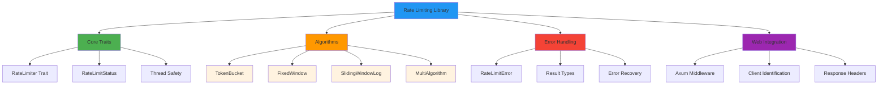
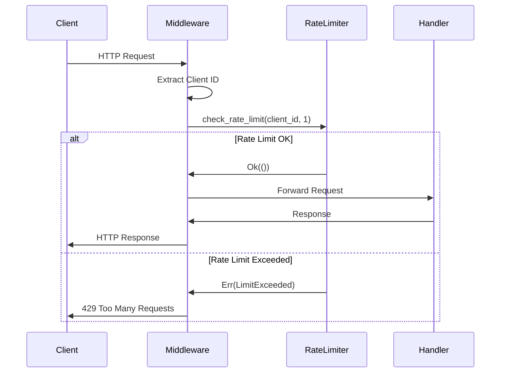

# Rust Implementation: Production-Ready Rate Limiting

## Complete Rate Limiting Library

This implementation provides a comprehensive, production-ready rate limiting library with multiple algorithms, thread safety, and real-world features.



## Core Library Structure

### Dependencies

```toml
[dependencies]
tokio = { version = "1.0", features = ["full"] }
serde = { version = "1.0", features = ["derive"] }
thiserror = "1.0"
tracing = "0.1"
parking_lot = "0.12"
```

### Error Types

```rust
use thiserror::Error;

#[derive(Error, Debug)]
pub enum RateLimitError {
    #[error("Rate limit exceeded: {requests} requests in {window:?}")]
    LimitExceeded { requests: u64, window: std::time::Duration },
    
    #[error("Insufficient tokens: requested {requested}, available {available}")]
    InsufficientTokens { requested: u64, available: u64 },
    
    #[error("Invalid configuration: {message}")]
    InvalidConfig { message: String },
    
    #[error("Internal error: {message}")]
    Internal { message: String },
}

pub type Result<T> = std::result::Result<T, RateLimitError>;
```

### Rate Limiter Trait

```rust
use std::time::Duration;

pub trait RateLimiter: Send + Sync {
    fn check_rate_limit(&self, key: &str, tokens: u64) -> Result<()>;
    fn reset(&self, key: &str) -> Result<()>;
    fn get_status(&self, key: &str) -> Result<RateLimitStatus>;
}

#[derive(Debug, Clone)]
pub struct RateLimitStatus {
    pub remaining: u64,
    pub reset_time: Option<std::time::SystemTime>,
    pub retry_after: Option<Duration>,
}
```

## Token Bucket Implementation

```rust
use std::time::{Duration, Instant};
use parking_lot::RwLock;
use std::collections::HashMap;

pub struct TokenBucket {
    capacity: u64,
    tokens: f64,
    refill_rate: f64, // tokens per second
    last_refill: Instant,
}

impl TokenBucket {
    pub fn new(capacity: u64, refill_rate: f64) -> Self {
        TokenBucket {
            capacity,
            tokens: capacity as f64,
            refill_rate,
            last_refill: Instant::now(),
        }
    }
    
    pub fn try_consume(&mut self, tokens: u64) -> Result<()> {
        self.refill();
        
        let tokens_f = tokens as f64;
        if self.tokens >= tokens_f {
            self.tokens -= tokens_f;
            Ok(())
        } else {
            Err(RateLimitError::InsufficientTokens {
                requested: tokens,
                available: self.tokens as u64,
            })
        }
    }
    
    pub fn available_tokens(&mut self) -> u64 {
        self.refill();
        self.tokens as u64
    }
    
    fn refill(&mut self) {
        let now = Instant::now();
        let elapsed = now.duration_since(self.last_refill);
        
        let tokens_to_add = elapsed.as_secs_f64() * self.refill_rate;
        self.tokens = (self.tokens + tokens_to_add).min(self.capacity as f64);
        self.last_refill = now;
    }
}
```

## Distributed Token Bucket Rate Limiter

```rust
use parking_lot::RwLock;
use std::collections::HashMap;
use std::sync::Arc;
use std::time::{Duration, SystemTime};

pub struct TokenBucketRateLimiter {
    buckets: Arc<RwLock<HashMap<String, TokenBucket>>>,
    capacity: u64,
    refill_rate: f64,
    cleanup_interval: Duration,
    last_cleanup: Arc<RwLock<Instant>>,
}

impl TokenBucketRateLimiter {
    pub fn new(capacity: u64, refill_rate: f64) -> Self {
        TokenBucketRateLimiter {
            buckets: Arc::new(RwLock::new(HashMap::new())),
            capacity,
            refill_rate,
            cleanup_interval: Duration::from_secs(300), // 5 minutes
            last_cleanup: Arc::new(RwLock::new(Instant::now())),
        }
    }
    
    fn cleanup_old_buckets(&self) {
        let mut last_cleanup = self.last_cleanup.write();
        let now = Instant::now();
        
        if now.duration_since(*last_cleanup) > self.cleanup_interval {
            let mut buckets = self.buckets.write();
            let cutoff = now - Duration::from_secs(3600); // 1 hour
            
            buckets.retain(|_, bucket| {
                bucket.last_refill > cutoff
            });
            
            *last_cleanup = now;
            tracing::debug!("Cleaned up old rate limit buckets, remaining: {}", buckets.len());
        }
    }
    
    fn get_or_create_bucket(&self, key: &str) -> TokenBucket {
        self.cleanup_old_buckets();
        
        let mut buckets = self.buckets.write();
        buckets.entry(key.to_string())
            .or_insert_with(|| TokenBucket::new(self.capacity, self.refill_rate))
            .clone()
    }
}

impl RateLimiter for TokenBucketRateLimiter {
    fn check_rate_limit(&self, key: &str, tokens: u64) -> Result<()> {
        let mut buckets = self.buckets.write();
        let bucket = buckets.entry(key.to_string())
            .or_insert_with(|| TokenBucket::new(self.capacity, self.refill_rate));
        
        bucket.try_consume(tokens)
    }
    
    fn reset(&self, key: &str) -> Result<()> {
        let mut buckets = self.buckets.write();
        buckets.remove(key);
        Ok(())
    }
    
    fn get_status(&self, key: &str) -> Result<RateLimitStatus> {
        let mut buckets = self.buckets.write();
        let bucket = buckets.entry(key.to_string())
            .or_insert_with(|| TokenBucket::new(self.capacity, self.refill_rate));
        
        let remaining = bucket.available_tokens();
        let retry_after = if remaining == 0 {
            Some(Duration::from_secs_f64(1.0 / self.refill_rate))
        } else {
            None
        };
        
        Ok(RateLimitStatus {
            remaining,
            reset_time: None,
            retry_after,
        })
    }
}
```

## Fixed Window Rate Limiter

```rust
use std::time::{Duration, SystemTime, UNIX_EPOCH};

pub struct FixedWindowRateLimiter {
    windows: Arc<RwLock<HashMap<String, WindowState>>>,
    limit: u64,
    window_duration: Duration,
}

#[derive(Debug, Clone)]
struct WindowState {
    count: u64,
    window_start: SystemTime,
}

impl FixedWindowRateLimiter {
    pub fn new(limit: u64, window_duration: Duration) -> Self {
        FixedWindowRateLimiter {
            windows: Arc::new(RwLock::new(HashMap::new())),
            limit,
            window_duration,
        }
    }
    
    fn get_current_window_start(&self) -> SystemTime {
        let now = SystemTime::now();
        let since_epoch = now.duration_since(UNIX_EPOCH).unwrap();
        let window_number = since_epoch.as_secs() / self.window_duration.as_secs();
        UNIX_EPOCH + Duration::from_secs(window_number * self.window_duration.as_secs())
    }
}

impl RateLimiter for FixedWindowRateLimiter {
    fn check_rate_limit(&self, key: &str, tokens: u64) -> Result<()> {
        let current_window_start = self.get_current_window_start();
        let mut windows = self.windows.write();
        
        let window_state = windows.entry(key.to_string())
            .or_insert_with(|| WindowState {
                count: 0,
                window_start: current_window_start,
            });
        
        // Reset window if it's a new window
        if window_state.window_start != current_window_start {
            window_state.count = 0;
            window_state.window_start = current_window_start;
        }
        
        if window_state.count + tokens <= self.limit {
            window_state.count += tokens;
            Ok(())
        } else {
            Err(RateLimitError::LimitExceeded {
                requests: window_state.count,
                window: self.window_duration,
            })
        }
    }
    
    fn reset(&self, key: &str) -> Result<()> {
        let mut windows = self.windows.write();
        windows.remove(key);
        Ok(())
    }
    
    fn get_status(&self, key: &str) -> Result<RateLimitStatus> {
        let current_window_start = self.get_current_window_start();
        let windows = self.windows.read();
        
        let window_state = windows.get(key);
        let count = window_state.map_or(0, |w| {
            if w.window_start == current_window_start {
                w.count
            } else {
                0
            }
        });
        
        let remaining = self.limit.saturating_sub(count);
        let reset_time = current_window_start + self.window_duration;
        
        Ok(RateLimitStatus {
            remaining,
            reset_time: Some(reset_time),
            retry_after: if remaining == 0 {
                Some(reset_time.duration_since(SystemTime::now()).unwrap_or(Duration::ZERO))
            } else {
                None
            },
        })
    }
}
```

## Sliding Window Log Implementation

```rust
use std::collections::VecDeque;

pub struct SlidingWindowLogRateLimiter {
    logs: Arc<RwLock<HashMap<String, VecDeque<SystemTime>>>>,
    limit: u64,
    window_duration: Duration,
}

impl SlidingWindowLogRateLimiter {
    pub fn new(limit: u64, window_duration: Duration) -> Self {
        SlidingWindowLogRateLimiter {
            logs: Arc::new(RwLock::new(HashMap::new())),
            limit,
            window_duration,
        }
    }
    
    fn clean_old_entries(&self, log: &mut VecDeque<SystemTime>) {
        let cutoff = SystemTime::now() - self.window_duration;
        while let Some(&front) = log.front() {
            if front < cutoff {
                log.pop_front();
            } else {
                break;
            }
        }
    }
}

impl RateLimiter for SlidingWindowLogRateLimiter {
    fn check_rate_limit(&self, key: &str, tokens: u64) -> Result<()> {
        let mut logs = self.logs.write();
        let log = logs.entry(key.to_string())
            .or_insert_with(VecDeque::new);
        
        self.clean_old_entries(log);
        
        if log.len() as u64 + tokens <= self.limit {
            let now = SystemTime::now();
            for _ in 0..tokens {
                log.push_back(now);
            }
            Ok(())
        } else {
            Err(RateLimitError::LimitExceeded {
                requests: log.len() as u64,
                window: self.window_duration,
            })
        }
    }
    
    fn reset(&self, key: &str) -> Result<()> {
        let mut logs = self.logs.write();
        logs.remove(key);
        Ok(())
    }
    
    fn get_status(&self, key: &str) -> Result<RateLimitStatus> {
        let mut logs = self.logs.write();
        let log = logs.entry(key.to_string())
            .or_insert_with(VecDeque::new);
        
        self.clean_old_entries(log);
        
        let remaining = self.limit.saturating_sub(log.len() as u64);
        let retry_after = if remaining == 0 {
            log.front().map(|&earliest| {
                let reset_time = earliest + self.window_duration;
                reset_time.duration_since(SystemTime::now()).unwrap_or(Duration::ZERO)
            })
        } else {
            None
        };
        
        Ok(RateLimitStatus {
            remaining,
            reset_time: None,
            retry_after,
        })
    }
}
```

## Multi-Algorithm Rate Limiter

```rust
pub struct MultiAlgorithmRateLimiter {
    algorithms: Vec<Box<dyn RateLimiter>>,
    strategy: CombinationStrategy,
}

pub enum CombinationStrategy {
    AllMustPass,    // All algorithms must allow the request
    AnyCanPass,     // Any algorithm allowing the request is sufficient
    Majority,       // Majority of algorithms must allow the request
}

impl MultiAlgorithmRateLimiter {
    pub fn new(algorithms: Vec<Box<dyn RateLimiter>>, strategy: CombinationStrategy) -> Self {
        MultiAlgorithmRateLimiter {
            algorithms,
            strategy,
        }
    }
}

impl RateLimiter for MultiAlgorithmRateLimiter {
    fn check_rate_limit(&self, key: &str, tokens: u64) -> Result<()> {
        let results: Vec<_> = self.algorithms.iter()
            .map(|alg| alg.check_rate_limit(key, tokens))
            .collect();
        
        match self.strategy {
            CombinationStrategy::AllMustPass => {
                if results.iter().all(|r| r.is_ok()) {
                    Ok(())
                } else {
                    results.into_iter().find(|r| r.is_err()).unwrap()
                }
            }
            CombinationStrategy::AnyCanPass => {
                if results.iter().any(|r| r.is_ok()) {
                    Ok(())
                } else {
                    results.into_iter().find(|r| r.is_err()).unwrap()
                }
            }
            CombinationStrategy::Majority => {
                let pass_count = results.iter().filter(|r| r.is_ok()).count();
                if pass_count > self.algorithms.len() / 2 {
                    Ok(())
                } else {
                    results.into_iter().find(|r| r.is_err()).unwrap()
                }
            }
        }
    }
    
    fn reset(&self, key: &str) -> Result<()> {
        for algorithm in &self.algorithms {
            algorithm.reset(key)?;
        }
        Ok(())
    }
    
    fn get_status(&self, key: &str) -> Result<RateLimitStatus> {
        // Return the most restrictive status
        let statuses: Result<Vec<_>> = self.algorithms.iter()
            .map(|alg| alg.get_status(key))
            .collect();
        
        let statuses = statuses?;
        let min_remaining = statuses.iter().map(|s| s.remaining).min().unwrap_or(0);
        let earliest_reset = statuses.iter()
            .filter_map(|s| s.reset_time)
            .min();
        let shortest_retry = statuses.iter()
            .filter_map(|s| s.retry_after)
            .min();
        
        Ok(RateLimitStatus {
            remaining: min_remaining,
            reset_time: earliest_reset,
            retry_after: shortest_retry,
        })
    }
}
```

## Web Framework Integration



### Axum Middleware

```rust
use axum::{
    extract::Request,
    http::StatusCode,
    middleware::Next,
    response::Response,
};
use std::sync::Arc;

pub struct RateLimitMiddleware {
    limiter: Arc<dyn RateLimiter>,
}

impl RateLimitMiddleware {
    pub fn new(limiter: Arc<dyn RateLimiter>) -> Self {
        RateLimitMiddleware { limiter }
    }
    
    pub async fn middleware(
        &self,
        request: Request,
        next: Next,
    ) -> std::result::Result<Response, StatusCode> {
        let client_id = self.extract_client_id(&request);
        
        match self.limiter.check_rate_limit(&client_id, 1) {
            Ok(()) => Ok(next.run(request).await),
            Err(RateLimitError::LimitExceeded { .. }) => {
                Err(StatusCode::TOO_MANY_REQUESTS)
            }
            Err(RateLimitError::InsufficientTokens { .. }) => {
                Err(StatusCode::TOO_MANY_REQUESTS)
            }
            Err(_) => Err(StatusCode::INTERNAL_SERVER_ERROR),
        }
    }
    
    fn extract_client_id(&self, request: &Request) -> String {
        // Extract from API key, IP address, or user ID
        request.headers()
            .get("X-API-Key")
            .and_then(|h| h.to_str().ok())
            .unwrap_or("anonymous")
            .to_string()
    }
}
```

## Usage Examples

### Basic Token Bucket

```rust
use std::time::Duration;

#[tokio::main]
async fn main() -> Result<()> {
    let limiter = TokenBucketRateLimiter::new(100, 10.0); // 100 tokens, 10/sec refill
    
    // Simulate API requests
    for i in 0..150 {
        match limiter.check_rate_limit("user123", 1) {
            Ok(()) => println!("Request {} allowed", i),
            Err(e) => println!("Request {} rejected: {}", i, e),
        }
        
        if i % 10 == 0 {
            tokio::time::sleep(Duration::from_secs(1)).await;
        }
    }
    
    Ok(())
}
```

### Multi-Layer Protection

```rust
fn create_production_rate_limiter() -> MultiAlgorithmRateLimiter {
    let algorithms: Vec<Box<dyn RateLimiter>> = vec![
        Box::new(TokenBucketRateLimiter::new(1000, 100.0)), // Burst handling
        Box::new(FixedWindowRateLimiter::new(5000, Duration::from_secs(60))), // Quota
        Box::new(SlidingWindowLogRateLimiter::new(100, Duration::from_secs(10))), // Precision
    ];
    
    MultiAlgorithmRateLimiter::new(algorithms, CombinationStrategy::AllMustPass)
}
```

## Testing

```rust
#[cfg(test)]
mod tests {
    use super::*;
    use std::time::Duration;
    
    #[test]
    fn test_token_bucket_burst() {
        let limiter = TokenBucketRateLimiter::new(10, 1.0);
        
        // Should allow 10 immediate requests
        for i in 0..10 {
            assert!(limiter.check_rate_limit("user1", 1).is_ok(), "Request {} should succeed", i);
        }
        
        // 11th request should fail
        assert!(limiter.check_rate_limit("user1", 1).is_err());
    }
    
    #[tokio::test]
    async fn test_token_bucket_refill() {
        let limiter = TokenBucketRateLimiter::new(10, 2.0);
        
        // Consume all tokens
        for _ in 0..10 {
            limiter.check_rate_limit("user1", 1).unwrap();
        }
        
        // Wait for refill
        tokio::time::sleep(Duration::from_secs(1)).await;
        
        // Should have ~2 tokens now
        assert!(limiter.check_rate_limit("user1", 1).is_ok());
        assert!(limiter.check_rate_limit("user1", 1).is_ok());
        assert!(limiter.check_rate_limit("user1", 1).is_err());
    }
    
    #[test]
    fn test_fixed_window_reset() {
        let limiter = FixedWindowRateLimiter::new(5, Duration::from_secs(1));
        
        // Use all requests in window
        for i in 0..5 {
            assert!(limiter.check_rate_limit("user1", 1).is_ok());
        }
        
        // Next request should fail
        assert!(limiter.check_rate_limit("user1", 1).is_err());
        
        // Wait for window reset
        std::thread::sleep(Duration::from_secs(1));
        
        // Should work again
        assert!(limiter.check_rate_limit("user1", 1).is_ok());
    }
}
```

## Performance Considerations

### Memory Usage
- **Token Bucket**: O(1) per user
- **Fixed Window**: O(1) per user
- **Sliding Window Log**: O(limit) per user

### CPU Usage
- **Token Bucket**: O(1) per request
- **Fixed Window**: O(1) per request
- **Sliding Window Log**: O(log n) per request

### Scalability
- Use cleanup intervals to prevent memory leaks
- Consider distributed storage (Redis) for multi-instance deployments
- Implement circuit breakers for limiter failures

This implementation provides a solid foundation for production rate limiting with proper error handling, multiple algorithms, and real-world considerations.