# The Core Problem: When Single Points of Failure Become Critical

Picture this: Your database server powers a thriving e-commerce platform processing thousands of orders daily. At 2 AM on Black Friday, a disk failure brings everything to a halt. Orders stop processing, customers can't access their accounts, and revenue bleeds away with every passing minute.

```mermaid
timeline
    title Black Friday Database Disaster
    
    section Peak Traffic
        01:45 : 🛒 10,000 concurrent users
              : 500 orders/minute
              : $50,000/hour revenue
    
    section The Failure
        02:00 : 💥 Disk Controller Fails
              : Database Becomes Unresponsive
              : Error 500 on All Pages
    
    section Immediate Impact
        02:05 : 📞 Support Calls Flooding In
              : 🐦 Social Media Complaints
              : 💸 Revenue Stream Stops
    
    section Recovery Attempt
        02:30 : 👨‍💻 Engineers Wake Up
              : 🔍 Diagnosis Begins
              : 📁 Backup Search
    
    section Business Cost
        06:00 : 💰 $200,000 Lost Revenue
              : 😞 50,000 Frustrated Customers
              : 📰 Bad Press Coverage
```

## The Vulnerability of Single Systems

Modern applications depend heavily on their databases, creating several critical vulnerabilities:

**Hardware Failures Are Inevitable**
- Disk drives fail (industry average: 2-5% annually)
- Memory modules develop errors
- Power supplies can die unexpectedly  
- Network cards malfunction
- Even "enterprise-grade" hardware isn't immune

**Network Partitions Happen**
- Internet connectivity can be lost
- Data center network switches fail
- Routing problems isolate entire regions
- Cloud provider outages affect availability zones

**Software and Human Errors**
- Database corruption from software bugs
- Accidental data deletion or schema changes
- Configuration errors during maintenance
- Security breaches requiring immediate shutdown

## The Business Impact

When your single database becomes unavailable, the consequences cascade:

**Immediate Revenue Loss**
- E-commerce sites lose sales directly
- SaaS platforms can't serve paying customers
- Advertising platforms miss revenue opportunities
- Financial services can't process transactions

**Customer Trust Erosion**
- Users expect 24/7 availability
- Repeated outages drive customers to competitors
- Social media amplifies negative experiences
- Recovery often takes longer than the initial failure

**Operational Chaos**
- Support teams flooded with complaints
- Engineering teams scrambling to restore service
- Management dealing with external communications
- Lost productivity across the entire organization

## The Scale of the Problem

```mermaid
graph TB
    subgraph "Single Database Architecture"
        App["Application Servers"]
        LB["Load Balancer"]
        DB[("Single Database<br/>💥 FAILURE POINT")]
        
        LB --> App
        App --> DB
    end
    
    subgraph "Failure Impact"
        Users["😞 Users"]
        Revenue["💸 Lost Revenue"]
        Support["📞 Support Calls"]
        
        DB -.->|"Database Down"| Users
        DB -.->|"No Transactions"| Revenue
        DB -.->|"Service Outage"| Support
    end
```



Consider these real-world failure scenarios:

**The "Simple" Disk Failure**
A startup's primary database experiences disk corruption. They have backups, but:
- Last backup was 6 hours ago (lost data)
- Restore process takes 4 hours (downtime)
- Total impact: 10 hours of disruption, 6 hours of lost transactions

**The Network Partition**
A cloud provider's availability zone becomes unreachable:
- Database is healthy but inaccessible
- Application servers can't connect
- Users see connection timeouts
- Duration: 2 hours until connectivity restored

**The Human Error**
A database administrator accidentally drops a critical table:
- Realized immediately but damage is done
- Point-in-time recovery needed
- 3 hours to restore from backup
- Plus time to replay missed transactions

## The Recovery Problem

Even with backups, restoration from failure is problematic:

```mermaid
timeline
    title Database Failure Recovery Timeline
    
    section Normal Operation
        00:00 : Database Running
              : Users Active
              : Transactions Processing
    
    section Failure Event
        02:15 : 💥 Disk Failure
              : Database Unavailable
              : Error Pages Served
    
    section Detection & Response
        02:18 : 🚨 Alerts Triggered
              : Engineering Team Paged
              : Incident Response Started
    
    section Recovery Process
        02:30 : 🔍 Problem Diagnosed
              : Recovery Plan Chosen
              : Backup Location Identified
    
    section Data Restoration
        03:00 : 📁 Backup Restoration Started
              : 6 Hours of Data Lost
              : Users Still Waiting
    
    section Service Resume
        06:15 : ✅ Database Restored
              : Applications Reconnected
              : 4 Hours Total Downtime
```

**Recovery Time Objective (RTO)**
The time between failure and full service restoration is often:
- Minutes to detect the problem
- Minutes to decide on recovery strategy  
- Hours to restore from backup
- Additional time to catch up missed changes

**Recovery Point Objective (RPO)**
The amount of data loss acceptable is often:
- Last backup might be hours old
- Transaction logs may be incomplete
- Some data loss is usually inevitable

**The Availability Gap**
Traditional backup-restore strategies typically provide:


- **99%** availability = 3.6 days downtime per year
- **99.9%** availability = 8.8 hours downtime per year  
- **99.99%** availability = 52 minutes downtime per year
- **99.999%** availability = 5.2 minutes downtime per year

Modern applications often need **99.99%** or better.

## Why Traditional Solutions Fall Short

**Backup-Only Strategies**
- Long recovery times (hours)
- Inevitable data loss (backup intervals)
- Manual intervention required
- Single point of failure remains

**Clustering Solutions**
- Complex to set up and maintain
- Shared storage can become the bottleneck
- Doesn't protect against data corruption
- Often vendor-specific and expensive

**Cloud Provider "Reliability"**
- Multi-AZ doesn't protect against region-wide issues
- Managed services still have single points of failure
- Vendor lock-in limits recovery options
- SLAs don't cover all failure scenarios

## The Need for Redundancy

What we really need is a system that:

```mermaid
graph TB
    subgraph "Resilient Architecture with Replication"
        LB["Load Balancer"]
        App1["App Server 1"]
        App2["App Server 2"]
        
        Primary[("Primary DB<br/>Read/Write")]
        Replica1[("Replica 1<br/>Read Only")]
        Replica2[("Replica 2<br/>Read Only")]
        
        LB --> App1
        LB --> App2
        
        App1 --> Primary
        App2 --> Primary
        
        App1 -.->|"Read Traffic"| Replica1
        App2 -.->|"Read Traffic"| Replica2
        
        Primary -.->|"Sync"| Replica1
        Primary -.->|"Sync"| Replica2
    end
    
    subgraph "Failure Scenario"
        FailedPrimary[("❌ Primary Failed")]
        NewPrimary[("✅ Replica Promoted<br/>New Primary")]
        StillReplica[("Replica<br/>Still Available")]
        
        NewPrimary -.->|"Continues Sync"| StillReplica
    end
    
    style FailedPrimary fill:#ffcccc
    style NewPrimary fill:#ccffcc
```



1. **Maintains Multiple Copies**: Data exists on multiple independent servers
2. **Provides Automatic Failover**: When one copy fails, traffic seamlessly shifts to another
3. **Ensures Data Consistency**: All copies stay synchronized despite network issues
4. **Minimizes Recovery Time**: Failover happens in seconds, not hours
5. **Prevents Data Loss**: Recent transactions aren't lost during failures

### The Replication Advantage

```mermaid
flowchart LR
    subgraph "Traditional Backup Recovery"
        T1["💥 Failure"] --> T2["🔍 Detect"]
        T2 --> T3["📁 Find Backup"]
        T3 --> T4["⏳ Restore Hours"]
        T4 --> T5["😞 Data Loss"]
    end
    
    subgraph "Replication Recovery"
        R1["💥 Failure"] --> R2["🚨 Auto-Detect"]
        R2 --> R3["⚡ Promote Replica"]
        R3 --> R4["✅ Service Restored"]
        R4 --> R5["😊 No Data Loss"]
    end
    
    style T4 fill:#ffcccc
    style T5 fill:#ffcccc
    style R4 fill:#ccffcc
    style R5 fill:#ccffcc
```



This is exactly what database replication provides—a robust, battle-tested approach to eliminating single points of failure while maintaining the performance and consistency your applications require.