# The Guiding Philosophy: Redundancy Through Intelligent Copying

Database replication operates on a fundamentally simple yet powerful principle: **maintain multiple identical copies of your data on independent systems**. When one system fails, the others seamlessly take over, ensuring your application never stops serving users.

## The Core Philosophy


**Multiple Independent Copies**
Rather than putting all your data on one server, replication distributes identical copies across multiple database instances. Each copy can operate independently, creating natural redundancy.

**Automatic Synchronization**
Changes made to one database are automatically propagated to all replicas. This synchronization happens continuously, keeping all copies current and consistent.

**Transparent Failover**
When a database becomes unavailable, applications automatically connect to a healthy replica. From the application's perspective, the database "never went down."

## The Essential Trade-offs

Replication isn't magic—it involves fundamental trade-offs that shape how you design your system:

### Consistency vs. Availability

```mermaid
graph LR
    subgraph "Strong Consistency (Synchronous)"
        SC_App["App"] --> SC_Primary[("Primary")]
        SC_Primary -.->|"1. Send Data"| SC_Replica[("Replica")]
        SC_Replica -.->|"2. ACK Received"| SC_Primary
        SC_Primary -.->|"3. Confirm to App"| SC_App
        
        SC_Benefit["✅ Zero Data Loss<br/>✅ All Copies Identical"]
        SC_Cost["❌ Higher Latency<br/>❌ May Block on Failures"]
    end
    
    subgraph "High Availability (Asynchronous)"
        AC_App["App"] --> AC_Primary[("Primary")]
        AC_Primary -.->|"1. Confirm Immediately"| AC_App
        AC_Primary -.->|"2. Sync Later"| AC_Replica[("Replica")]
        
        AC_Benefit["✅ Low Latency<br/>✅ High Performance"]
        AC_Cost["❌ Potential Data Loss<br/>❌ Temporary Inconsistency"]
    end
```



**Strong Consistency** (Synchronous Replication)
- All replicas must acknowledge before a write completes
- Guarantees all copies are identical at all times
- Cost: Higher latency, potential blocking on replica failures

**High Availability** (Asynchronous Replication)  
- Primary completes writes immediately, syncs to replicas afterward
- Applications experience minimal latency
- Cost: Brief windows where replicas may lag behind

### Performance vs. Durability


**Write Performance**
- More replicas = more network overhead
- Geographic distribution adds latency
- Must balance replica count with performance needs

**Read Performance**
- More replicas = more read capacity
- Can distribute read traffic across replicas
- Geographic replicas improve regional access times

**Durability Guarantees**
- More replicas = better protection against data loss
- Geographic distribution protects against regional disasters
- Must balance protection level with complexity

## Design Principles

**1. Plan for Failure Modes**
Design your replication strategy around realistic failure scenarios:
- Single server hardware failures
- Data center network partitions
- Regional outages or disasters
- Software bugs and corruption

**2. Align with Access Patterns**
Structure replication to match how your application uses data:
- Read-heavy workloads benefit from multiple read replicas
- Write-heavy workloads need careful primary selection
- Geographic users benefit from regional replicas

**3. Balance Consistency Requirements**
Choose the right consistency model for each use case:
- Financial transactions may require strong consistency
- Content feeds can tolerate eventual consistency
- Analytics queries often work with slightly stale data

**4. Automate Everything**
Manual intervention during failures defeats the purpose:
- Automatic failover detection and promotion
- Health monitoring and alerting
- Replica recovery and resynchronization

## Mental Model: The Synchronized Office Network

```mermaid
graph TB
    subgraph "Global Office Network"
        HQ["🏢 Headquarters<br/>(Primary Office)<br/>📝 Creates Documents<br/>✏️ Makes Changes"]
        
        Branch1["🏢 London Office<br/>(Replica)<br/>📖 Reads Documents<br/>📠 Receives Updates"]
        
        Branch2["🏢 Tokyo Office<br/>(Replica)<br/>📖 Reads Documents<br/>📠 Receives Updates"]
        
        Branch3["🏢 Sydney Office<br/>(Replica)<br/>📖 Reads Documents<br/>📠 Receives Updates"]
        
        HQ -.->|"Document Updates"| Branch1
        HQ -.->|"Document Updates"| Branch2
        HQ -.->|"Document Updates"| Branch3
    end
    
    subgraph "Failover Scenario"
        FailedHQ["❌ HQ Goes Offline<br/>(Primary Failure)"]
        NewHQ["🏢 London Promoted<br/>(New Primary)<br/>📝 Now Creates Documents"]
        
        NewHQ -.->|"Continues Updates"| Branch2
        NewHQ -.->|"Continues Updates"| Branch3
    end
    
    style FailedHQ fill:#ffcccc
    style NewHQ fill:#ccffcc
```



Imagine a company with multiple offices around the world, each maintaining identical copies of critical business documents:

**The Primary Office (Leader)**
- New documents are first created here
- Changes to existing documents happen here
- Responsible for distributing updates to all other offices

**Branch Offices (Followers)**
- Receive copies of all documents from the primary office
- Can answer questions using their local copies
- Cannot create or modify documents independently

**When the Primary Office Goes Down**
- One branch office is promoted to become the new primary
- It takes over document creation and modification responsibilities
- Other branches sync with the new primary
- Business continues with minimal interruption

**The Synchronization Process**
- Every change made at the primary is immediately copied to all branches
- Each branch confirms receipt of the updates
- The system can operate at different levels of strictness:
  - **Strict**: Primary waits for all branches to confirm before considering a change complete
  - **Relaxed**: Primary processes changes immediately, branches catch up asynchronously

## The Replication Spectrum

```mermaid
graph TB
    subgraph "Evolution of Replication Complexity"
        subgraph "Level 1: Single Replica"
            L1_P[("Primary")]
            L1_R[("Replica")]
            L1_P -.-> L1_R
            L1_Benefits["✅ Simple Setup<br/>✅ Basic Protection<br/>✅ Good Starting Point"]
        end
        
        subgraph "Level 2: Regional Replicas"
            L2_P[("Primary<br/>US-East")]
            L2_R1[("Replica<br/>US-West")]
            L2_R2[("Replica<br/>EU")]
            L2_P -.-> L2_R1
            L2_P -.-> L2_R2
            L2_Benefits["✅ Regional Protection<br/>✅ Geographic Performance<br/>❓ More Complex"]
        end
        
        subgraph "Level 3: Global Multi-Master"
            L3_P1[("Primary<br/>US")]
            L3_P2[("Primary<br/>EU")]
            L3_P3[("Primary<br/>Asia")]
            L3_P1 <-.-> L3_P2
            L3_P2 <-.-> L3_P3
            L3_P3 <-.-> L3_P1
            L3_Benefits["✅ Maximum Availability<br/>✅ Global Performance<br/>❌ Complex Conflicts"]
        end
    end
```



Different applications need different levels of protection and performance:

**Single Replica**
- One primary + one standby
- Protects against single server failure
- Simple to understand and manage
- Good starting point for most applications

**Multiple Regional Replicas**
- Primary + replicas in different data centers
- Protects against regional outages
- Improves read performance across geographies
- More complex configuration and monitoring

**Global Multi-Master**
- Multiple primaries in different regions
- Highest availability and performance
- Complex conflict resolution required
- Suitable for large-scale global applications

## The Implementation Philosophy

```mermaid
flowchart TD
    Start["🚀 Start Here<br/>Single Replica Setup"]
    
    Decision1{"Need Read<br/>Scaling?"}
    Multiple["📈 Add Multiple Replicas<br/>Distribution Read Load"]
    
    Decision2{"Need Disaster<br/>Recovery?"}
    Geographic["🌍 Add Geographic Replicas<br/>Cross-Region Protection"]
    
    Decision3{"Need Global<br/>Scale?"}
    Advanced["⚡ Advanced Topologies<br/>Multi-Master, Sharding"]
    
    Monitor["📊 Monitor & Optimize<br/>Throughout Journey"]
    
    Start --> Decision1
    Decision1 -->|Yes| Multiple
    Decision1 -->|No| Decision2
    Multiple --> Decision2
    Decision2 -->|Yes| Geographic
    Decision2 -->|No| Monitor
    Geographic --> Decision3
    Decision3 -->|Yes| Advanced
    Decision3 -->|No| Monitor
    Advanced --> Monitor
    
    style Start fill:#e1f5fe
    style Monitor fill:#f3e5f5
```



**Start Simple, Scale Complexity**
Begin with basic primary-replica setup, then add complexity only as needed:
1. Single read replica for high availability
2. Multiple replicas for read scaling
3. Geographic replicas for disaster recovery
4. Advanced topologies for global scale

**Automate the Routine, Monitor the Critical**
- Automate replica setup, failover, and recovery
- Monitor replication lag, connection health, and data consistency
- Alert on anomalies, but let the system handle routine operations

**Test Failure Scenarios Regularly**
- Practice failover procedures in non-production environments
- Verify backup and recovery processes work correctly
- Measure actual RTO and RPO in realistic conditions

**Plan for the Unexpected**

```mermaid
graph TB
    subgraph "Network Partition Scenario"
        subgraph "Cluster A"
            P1[("Primary?")]
            R1[("Replica 1")]
        end
        
        subgraph "Cluster B"
            R2[("Replica 2")]
            R3[("Replica 3<br/>Promoted?")]
        end
        
        Partition["❌ Network Split"]
        
        P1 -.x R2
        P1 -.x R3
        
        SplitBrain["⚠️ Split-Brain Risk<br/>Two Primaries!"]
        
        style P1 fill:#ffcccc
        style R3 fill:#ffcccc
        style SplitBrain fill:#ffe6cc
    end
```

- Consider scenarios like network partitions that split your replicas
- Design for "split-brain" situations where multiple replicas think they're primary
- Have procedures for manual intervention when automation fails
- Implement quorum-based decision making
- Use "fencing" to prevent split-brain scenarios

## The Replication Mindset


The philosophy of replication is ultimately about **preparedness through redundancy**—ensuring that when (not if) failures occur, your system gracefully continues serving users while you address the underlying problem.

### Key Principles for Success

**Assume Failure Will Happen**
- Hardware fails, networks partition, software has bugs
- Design for these scenarios, don't hope they won't occur
- Practice failure scenarios regularly

**Automate the Routine**
- Manual intervention should be the exception, not the rule
- Automated failover, monitoring, and recovery
- Human judgment for complex decisions only

**Monitor Proactively**
- Know about problems before users do
- Track replication lag, connection health, data consistency
- Alert on trends, not just absolute thresholds

**Start Simple, Evolve Thoughtfully**
- Begin with basic replication, add complexity as needed
- Each additional replica adds operational overhead
- Balance protection against complexity costs