# Key Abstractions: The Building Blocks of Replication

Understanding replication requires mastering five fundamental concepts that work together to create robust, distributed database systems.


## Primary (Leader): The Source of Truth

```mermaid
graph TB
    subgraph "Primary Database Role"
        Apps["📱 Applications"]
        Primary["📛 Primary Database<br/>(Source of Truth)"]
        
        Apps -->|"INSERT<br/>UPDATE<br/>DELETE"| Primary
        
        Primary --> TxLog["📄 Transaction Log<br/>(WAL)"]
        Primary --> Conflict["⚖️ Conflict Resolution"]
        Primary --> Order["🔢 Operation Ordering"]
        
        TxLog -.->|"Replicate"| R1[("Replica 1")]
        TxLog -.->|"Replicate"| R2[("Replica 2")]
        TxLog -.->|"Replicate"| R3[("Replica 3")]
    end
    
    subgraph "Newspaper Analogy"
        Editor["📰 Chief Editor<br/>(Primary)"]
        Submission["✏️ Article Submissions"]
        
        Submission --> Editor
        Editor -.->|"Final Content"| Press1["🖨️ Press 1"]
        Editor -.->|"Final Content"| Press2["🖨️ Press 2"]
        Editor -.->|"Final Content"| Press3["🖨️ Press 3"]
    end
```



The **primary** is the authoritative database instance that accepts writes and coordinates data distribution. All data modifications flow through the primary, ensuring a single source of truth.

**Characteristics**:
- Accepts INSERT, UPDATE, DELETE operations
- Generates a log of all changes (transaction log)
- Distributes changes to all replicas
- Handles conflict resolution and ordering

**The Chief Editor Analogy**
Think of the primary as a newspaper's chief editor. All article submissions, edits, and deletions go through the chief editor, who then ensures every printing press (replica) receives the same finalized content.

```sql
-- On the primary database
INSERT INTO orders (customer_id, total) VALUES (1001, 299.99);
-- This change will be automatically sent to all replicas
```

## Secondary (Follower): The Synchronized Copy


A **secondary** is a replica database that receives and applies changes from the primary. Secondaries can serve read-only queries but cannot accept writes directly.

**Characteristics**:
- Receives transaction log from primary
- Applies changes in the same order as the primary
- Serves read-only queries
- Can be promoted to primary during failover

**The Printing Press Analogy**
Secondaries are like printing presses in different cities. They receive the same content from the chief editor and produce identical newspapers, but they can't create or modify articles independently.

```sql
-- On a secondary database (read-only)
SELECT * FROM orders WHERE customer_id = 1001;  -- ✅ Allowed
INSERT INTO orders (customer_id, total) VALUES (1002, 199.99);  -- ❌ Error: read-only
```

## Replication Lag: The Synchronization Delay

```mermaid
timeline
    title Replication Lag Visualization
    
    section Primary
        T0 : ✏️ Write Committed
           : Data Available
    
    section Network
        T1 : 🛫 Data in Transit
           : Network Latency
    
    section Secondary
        T2 : 📨 Data Received
           : Processing...
        T3 : ✅ Data Applied
           : Available for Reads
    
    section Lag Window
        Gap : ⏳ Replication Lag
            : T3 - T0
```



**Replication lag** is the time delay between when a change is committed on the primary and when it becomes visible on a secondary. This lag is measured in milliseconds to seconds under normal conditions.

**Causes of Lag**:
- Network latency between primary and secondary
- High write volume overwhelming replication bandwidth
- Secondary hardware being slower than primary
- Large transactions that take time to transfer

**The News Distribution Analogy**
Like the time between when a news story is finalized at headquarters and when it appears in regional newspapers. In busy news cycles (high write load), distribution takes longer.

```sql
-- Measuring replication lag in PostgreSQL
SELECT 
    client_addr,
    pg_wal_lsn_diff(pg_current_wal_lsn(), sent_lsn) AS send_lag,
    pg_wal_lsn_diff(sent_lsn, flush_lsn) AS receive_lag
FROM pg_stat_replication;
```

**Typical Lag Values**:
- **Good**: < 100ms consistently
- **Acceptable**: < 1 second average, occasional spikes
- **Concerning**: > 5 seconds regularly
- **Critical**: Minutes or continuously growing

## Failover: The Leadership Transition

**Failover** is the process of promoting a secondary to become the new primary when the original primary becomes unavailable. This can be automatic or manual.

**Types of Failover**:

**Automatic Failover**
- System detects primary failure
- Promotes the most up-to-date secondary
- Redirects application traffic
- Typically completes in 30-120 seconds

**Manual Failover**
- Human administrator triggers promotion
- More control over which secondary becomes primary
- Can be faster if operator is standing by
- Used for planned maintenance

**The Government Succession Analogy**
Like the constitutional succession when a leader becomes unavailable. The vice president (most current secondary) automatically becomes president (primary), and government operations continue without interruption.

```bash
# Manual failover in PostgreSQL
pg_ctl promote -D /var/lib/postgresql/data
```

**Failover Considerations**:
- **Data Loss Risk**: Asynchronous replication may lose recent transactions
- **Split-Brain Prevention**: Ensure only one primary exists at a time
- **Application Reconnection**: Apps must reconnect to the new primary
- **Replica Rebuild**: Old primary becomes secondary after recovery

## Synchronous vs. Asynchronous Replication

This is the fundamental trade-off in replication design, affecting both performance and data safety.

### Synchronous Replication: Safety First

In **synchronous replication**, the primary waits for acknowledgment from one or more secondaries before confirming a transaction as committed.


**Benefits**:
- **Zero data loss**: If primary fails, secondary has identical data
- **Strong consistency**: Reads from any replica return same result
- **Predictable recovery**: Failover preserves all committed transactions

**Costs**:
- **Higher latency**: Every write waits for network round-trip
- **Availability risk**: Primary blocks if secondaries are unreachable
- **Performance impact**: Write throughput limited by slowest replica

**When to Use**:
- Financial systems where data loss is unacceptable
- Compliance requirements mandate zero data loss
- Network latency between replicas is very low

### Asynchronous Replication: Performance First

In **asynchronous replication**, the primary commits transactions immediately and sends changes to secondaries afterward.


**Benefits**:
- **Low latency**: Writes complete at primary's speed
- **High availability**: Primary continues operating even if secondaries fail
- **Better throughput**: Not limited by replica performance

**Costs**:
- **Potential data loss**: Recent transactions may be lost on primary failure
- **Eventual consistency**: Secondaries may lag behind primary
- **Failover complexity**: May need to reconcile lost transactions

**When to Use**:
- Performance is critical and some data loss is acceptable
- Network latency to replicas is high
- High write volume that synchronous replication can't handle

## The Replication Topology Patterns

### Single Primary, Multiple Secondaries

```
    Primary ──┬── Secondary A
              ├── Secondary B
              └── Secondary C
```

Most common pattern for high availability and read scaling.

### Chained Replication

```
Primary ── Secondary A ── Secondary B ── Secondary C
```

Reduces load on primary by having secondaries replicate from each other.

### Multi-Primary (Active-Active)

```
Primary A ←──→ Primary B
```

Both databases accept writes, requiring conflict resolution mechanisms.

## Best Practices for Replication Design

**Monitor Replication Health**
- Track replication lag continuously
- Alert on lag spikes or secondary disconnections
- Monitor disk space on secondaries (logs accumulate)

**Plan Your Consistency Model**
- Use synchronous for critical data that can't be lost
- Use asynchronous for performance-sensitive applications
- Consider hybrid approaches (synchronous to local replica, async to distant ones)

**Design for Network Partitions**
- What happens if primary can't reach secondaries?
- How do you prevent split-brain scenarios?
- Plan for manual intervention procedures

**Test Failover Regularly**
- Practice failover procedures in staging environments
- Measure actual failover times
- Verify applications handle reconnection correctly

Understanding these abstractions provides the foundation for designing robust, highly available database systems that can gracefully handle the inevitable failures of distributed computing.