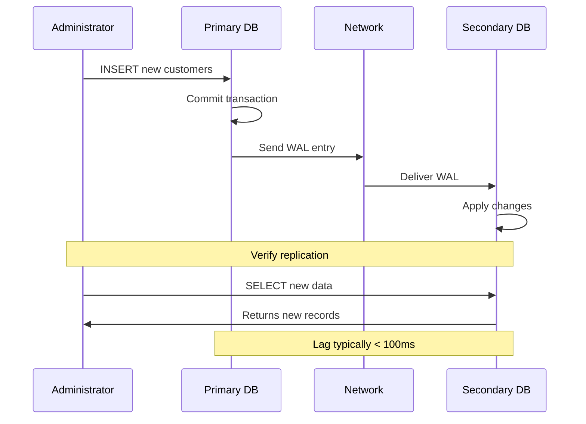

# Setting Up a Simple Replica: A Practical PostgreSQL Guide

Let's build a complete primary-secondary replication setup using PostgreSQL. We'll create a streaming replication configuration that provides high availability and read scaling for a sample application database.

## Prerequisites

- Two PostgreSQL 12+ instances (can be on same machine for testing)
- Network connectivity between instances
- Basic PostgreSQL administration knowledge
- Sufficient disk space for WAL logs

## Architecture Overview

```
┌─────────────────┐    WAL Stream    ┌─────────────────┐
│   Primary       │ ──────────────→ │   Secondary     │
│   (Read/Write)  │                 │   (Read Only)   │
│   Port: 5432    │                 │   Port: 5433    │
└─────────────────┘                 └─────────────────┘
```

## Step 1: Configure the Primary Server

### Enable Replication in postgresql.conf

```bash
# Edit postgresql.conf on primary
sudo nano /etc/postgresql/14/main/postgresql.conf
```

Add these configuration settings:

```conf
# Enable WAL archiving and replication
wal_level = replica                    # Enable WAL for replication
max_wal_senders = 3                   # Allow up to 3 replicas
max_replication_slots = 3             # Persistent replication connections
wal_keep_size = 64                    # Keep 64MB of WAL files
hot_standby = on                      # Allow read queries on replica

# Optional: Enable synchronous replication (for zero data loss)
# synchronous_standby_names = 'replica1'
```

### Configure Authentication for Replication

Edit `pg_hba.conf` to allow replication connections:

```bash
sudo nano /etc/postgresql/14/main/pg_hba.conf
```

Add this line (adjust IP addresses for your setup):

```conf
# Allow replication connections
host    replication     replica_user    192.168.1.0/24    md5
```

### Create Replication User

```sql
-- Connect to primary as superuser
psql -h localhost -U postgres

-- Create dedicated replication user
CREATE USER replica_user WITH REPLICATION LOGIN ENCRYPTED PASSWORD 'secure_replica_password';

-- Create a replication slot (optional but recommended)
SELECT pg_create_physical_replication_slot('replica_slot');
```

### Restart Primary Database

```bash
sudo systemctl restart postgresql
```

## Step 2: Set Up Sample Application Database

Let's create a sample database to demonstrate replication:

```sql
-- Create application database
CREATE DATABASE ecommerce;

-- Connect to the new database
\c ecommerce;

-- Create sample tables
CREATE TABLE customers (
    customer_id SERIAL PRIMARY KEY,
    email VARCHAR(255) UNIQUE NOT NULL,
    name VARCHAR(100) NOT NULL,
    created_at TIMESTAMP DEFAULT NOW()
);

CREATE TABLE orders (
    order_id SERIAL PRIMARY KEY,
    customer_id INTEGER REFERENCES customers(customer_id),
    total_amount DECIMAL(10,2) NOT NULL,
    order_status VARCHAR(50) DEFAULT 'pending',
    created_at TIMESTAMP DEFAULT NOW()
);

-- Insert sample data
INSERT INTO customers (email, name) VALUES
    ('john@example.com', 'John Doe'),
    ('jane@example.com', 'Jane Smith'),
    ('bob@example.com', 'Bob Johnson');

INSERT INTO orders (customer_id, total_amount, order_status) VALUES
    (1, 299.99, 'completed'),
    (2, 159.50, 'pending'),
    (1, 89.99, 'shipped'),
    (3, 449.99, 'pending');
```

## Step 3: Create the Secondary Server

### Prepare Secondary Server Directory

```bash
# Stop secondary PostgreSQL if running
sudo systemctl stop postgresql

# Remove existing data directory
sudo rm -rf /var/lib/postgresql/14/main/*

# Ensure correct ownership
sudo chown postgres:postgres /var/lib/postgresql/14/main/
```

### Use pg_basebackup to Clone Primary

```bash
# Run as postgres user
sudo -u postgres pg_basebackup \
    -h 192.168.1.100 \           # Primary server IP
    -D /var/lib/postgresql/14/main \
    -U replica_user \
    -W \                         # Prompt for password
    -v \                         # Verbose output
    -P \                         # Show progress
    -X stream \                  # Stream WAL during backup
    -R                           # Create recovery.conf automatically
```

This command:
- Connects to the primary at `192.168.1.100`
- Creates a binary copy of the entire database cluster
- Streams WAL logs during the backup to ensure consistency
- Creates replication configuration automatically

## Step 4: Configure the Secondary Server

### Edit Secondary's postgresql.conf

```bash
sudo nano /var/lib/postgresql/14/main/postgresql.conf
```

Ensure these settings (many will be copied from primary):

```conf
# Change port to avoid conflicts (if on same machine)
port = 5433

# Enable hot standby for read queries
hot_standby = on
max_standby_streaming_delay = 30s
```

### Configure Replication Connection

PostgreSQL 12+ uses `postgresql.auto.conf` for replication settings. Check if it was created:

```bash
cat /var/lib/postgresql/14/main/postgresql.auto.conf
```

Should contain something like:

```conf
# Do not edit this file manually!
# It will be overwritten by the ALTER SYSTEM command.
primary_conninfo = 'user=replica_user password=secure_replica_password host=192.168.1.100 port=5432 sslmode=prefer sslcompression=0 gssencmode=prefer krbsrvname=postgres target_session_attrs=any'
primary_slot_name = 'replica_slot'
```

### Create Standby Signal File

```bash
# This tells PostgreSQL to start in standby mode
sudo -u postgres touch /var/lib/postgresql/14/main/standby.signal
```

### Start Secondary Server

```bash
sudo systemctl start postgresql@14-main

# Check status
sudo systemctl status postgresql@14-main
```

## Step 5: Verify Replication is Working

### Check Replication Status on Primary

```sql
-- Connect to primary
psql -h localhost -U postgres -d ecommerce

-- View replication status
SELECT 
    client_addr,
    state,
    pg_wal_lsn_diff(pg_current_wal_lsn(), sent_lsn) AS send_lag_bytes,
    pg_wal_lsn_diff(sent_lsn, flush_lsn) AS receive_lag_bytes,
    pg_wal_lsn_diff(flush_lsn, replay_lsn) AS replay_lag_bytes
FROM pg_stat_replication;
```

Expected output:
```
  client_addr   |   state   | send_lag_bytes | receive_lag_bytes | replay_lag_bytes 
----------------+-----------+----------------+-------------------+------------------
 192.168.1.101  | streaming |              0 |                 0 |                0
```

### Test Read Operations on Secondary

```sql
-- Connect to secondary (read-only)
psql -h localhost -p 5433 -U postgres -d ecommerce

-- Verify data is replicated
SELECT COUNT(*) FROM customers;
SELECT COUNT(*) FROM orders;

-- This should work (read operation)
SELECT * FROM customers WHERE name LIKE 'John%';
```

### Test Write Protection on Secondary

```sql
-- This should fail with "read-only" error
INSERT INTO customers (email, name) VALUES ('test@example.com', 'Test User');
```

Expected error:
```
ERROR:  cannot execute INSERT in a read-only transaction
```

## Step 6: Test Real-time Replication



### Insert Data on Primary

```sql
-- Connect to primary
psql -h localhost -U postgres -d ecommerce

-- Insert new data
INSERT INTO customers (email, name) VALUES 
    ('alice@example.com', 'Alice Williams'),
    ('charlie@example.com', 'Charlie Brown');

INSERT INTO orders (customer_id, total_amount, order_status) VALUES
    (4, 199.99, 'pending'),
    (5, 299.99, 'completed');
```

### Verify on Secondary

```sql
-- Connect to secondary
psql -h localhost -p 5433 -U postgres -d ecommerce

-- Check if new data appears (should be nearly instantaneous)
SELECT * FROM customers WHERE customer_id > 3;
SELECT * FROM orders WHERE customer_id > 3;
```

## Step 7: Monitor Replication Health

### Create Monitoring Queries

```sql
-- Replication lag monitoring (run on primary)
SELECT 
    client_addr as replica_ip,
    usename as replica_user,
    state,
    pg_size_pretty(pg_wal_lsn_diff(pg_current_wal_lsn(), sent_lsn)) as send_lag,
    pg_size_pretty(pg_wal_lsn_diff(sent_lsn, flush_lsn)) as receive_lag,
    pg_size_pretty(pg_wal_lsn_diff(flush_lsn, replay_lsn)) as replay_lag,
    extract(seconds from now() - backend_start) as connection_duration
FROM pg_stat_replication;

-- WAL generation rate (run on primary)
SELECT 
    pg_size_pretty(pg_wal_lsn_diff(pg_current_wal_lsn(), '0/0')) as total_wal_generated,
    pg_size_pretty(pg_current_wal_lsn() - pg_current_wal_lsn()) as current_position;
```

### Set Up Basic Alerting

Create a simple monitoring script:

```bash
#!/bin/bash
# replication_monitor.sh

# Check if replica is connected
REPLICA_COUNT=$(psql -h localhost -U postgres -t -c "SELECT COUNT(*) FROM pg_stat_replication;")

if [ "$REPLICA_COUNT" -eq "0" ]; then
    echo "ALERT: No replicas connected!"
    # Send alert (email, Slack, etc.)
fi

# Check replication lag
LAG_BYTES=$(psql -h localhost -U postgres -t -c "SELECT COALESCE(MAX(pg_wal_lsn_diff(pg_current_wal_lsn(), sent_lsn)), 0) FROM pg_stat_replication;")

if [ "$LAG_BYTES" -gt "16777216" ]; then  # 16MB threshold
    echo "ALERT: Replication lag is ${LAG_BYTES} bytes"
fi
```

## Step 8: Test Failover (Optional)

**⚠️ Warning**: This will cause downtime. Only test in development environments.

### Simulate Primary Failure

```bash
# Stop primary database
sudo systemctl stop postgresql
```

### Promote Secondary to Primary

```bash
# Connect to secondary machine
sudo -u postgres pg_ctl promote -D /var/lib/postgresql/14/main/

# Or use SQL command
psql -h localhost -p 5433 -U postgres -c "SELECT pg_promote();"
```

### Test Write Operations on Promoted Server

```sql
-- Connect to former secondary (now primary)
psql -h localhost -p 5433 -U postgres -d ecommerce

-- This should now work
INSERT INTO customers (email, name) VALUES ('failover@example.com', 'Failover Test');
```

### Recovery Considerations

After failover:
1. Update application configuration to point to new primary
2. Fix or rebuild the failed primary server
3. Set up the recovered server as a new secondary

## Key Takeaways

✅ **Replication is Transparent**: Applications see normal read/write behavior  
✅ **Near Real-time Sync**: Changes appear on replica within milliseconds  
✅ **Read Scaling**: Secondary can handle read-only queries  
✅ **High Availability**: Automatic failover protects against primary failure  
✅ **Monitoring is Critical**: Watch replication lag and connection status  

Your PostgreSQL replication setup is now ready to provide high availability and read scaling for production workloads!