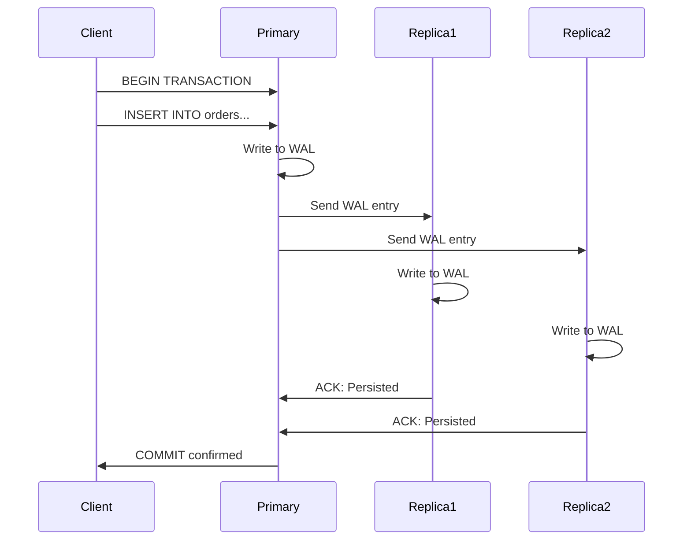
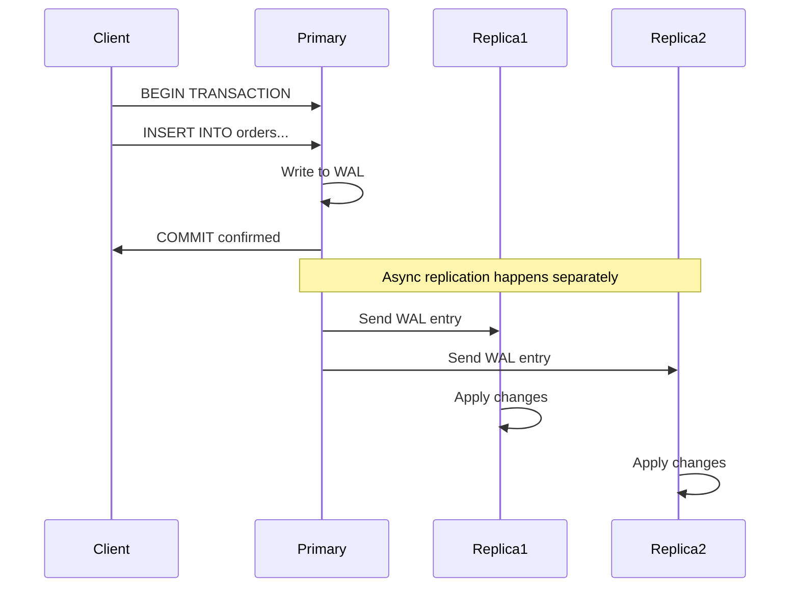

# Synchronous vs. Asynchronous Replication: The Fundamental Trade-off

The choice between synchronous and asynchronous replication represents one of the most important architectural decisions in distributed database design. This decision fundamentally affects your system's consistency guarantees, performance characteristics, and availability behavior.

## The Core Trade-off: Consistency vs. Availability

This is a practical manifestation of the famous **CAP theorem** (Consistency, Availability, Partition tolerance). When network issues occur between your primary and replicas, you must choose:

- **Synchronous**: Prioritize consistency (all replicas have identical data)
- **Asynchronous**: Prioritize availability (primary continues operating independently)

## Synchronous Replication: Safety Through Coordination

In synchronous replication, the primary database waits for explicit acknowledgment from one or more replicas before confirming a transaction as committed.

### The Transaction Flow



**Key Characteristics**:
- Primary blocks until at least N replicas confirm the write
- All acknowledged replicas have identical, current data
- Zero data loss during failover to any acknowledged replica
- Higher latency for write operations

### Synchronous Configuration in PostgreSQL

```sql
-- Configure synchronous replication
ALTER SYSTEM SET synchronous_standby_names = 'replica1,replica2';

-- Or require confirmation from any 2 replicas
ALTER SYSTEM SET synchronous_standby_names = '2 (replica1,replica2,replica3)';

-- Reload configuration
SELECT pg_reload_conf();
```

### Performance Characteristics

**Latency Impact**:
```
Async Write Time:  Local disk write (1-5ms)
Sync Write Time:   Local disk + network round-trip + remote disk (10-100ms)
```

**Throughput Impact**:
With 10ms network latency, theoretical maximum throughput drops from 10,000 TPS to 100 TPS for individual transactions.

### When Synchronous Excels

**Financial Systems**
```sql
-- Money transfer that cannot be lost
BEGIN;
UPDATE accounts SET balance = balance - 1000 WHERE account_id = 123;
UPDATE accounts SET balance = balance + 1000 WHERE account_id = 456;
COMMIT;  -- Must be guaranteed on all replicas before confirming
```

**Compliance Requirements**
- Healthcare records (HIPAA)
- Financial transactions (SOX, PCI-DSS)
- Legal documents requiring audit trails

**Low-Latency Networks**
- Same data center deployment (< 1ms latency)
- High-speed dedicated networks
- Cloud availability zones with fast interconnects

## Asynchronous Replication: Performance Through Independence

In asynchronous replication, the primary commits transactions locally and sends changes to replicas afterward, without waiting for confirmation.

### The Transaction Flow



**Key Characteristics**:
- Primary operates at local disk speed
- Replicas catch up independently
- Potential data loss window during primary failure
- Lower latency for write operations

### The Replication Lag Window

The critical concept in async replication is the **lag window**—the period between when data is committed on the primary and when it's available on replicas.

```sql
-- Monitor replication lag
SELECT 
    client_addr,
    pg_wal_lsn_diff(pg_current_wal_lsn(), sent_lsn) AS send_lag_bytes,
    pg_wal_lsn_diff(sent_lsn, flush_lsn) AS receive_lag_bytes,
    extract(seconds from replay_lag) AS replay_lag_seconds
FROM pg_stat_replication;
```

**Typical Lag Scenarios**:
- **Normal operation**: 10-100ms lag
- **High write load**: 1-10 seconds lag
- **Network issues**: Minutes or hours lag
- **Replica failure**: Lag grows until replica recovers

### When Asynchronous Excels

**High-Throughput Applications**
```python
# E-commerce site with thousands of orders per second
for order in incoming_orders:
    db.execute("""
        INSERT INTO orders (customer_id, total, items) 
        VALUES (%(customer_id)s, %(total)s, %(items)s)
    """, order)
    # Commits immediately, replicates asynchronously
```

**Geographic Distribution**
- Cross-continent replicas (100-300ms latency)
- Edge locations for regional performance
- Global content distribution

**Read-Heavy Workloads**
- Analytics dashboards (can tolerate stale data)
- Content management systems
- Search indexes

## The Data Loss Scenario

Understanding the data loss implications is crucial for choosing between sync and async.

### Asynchronous Data Loss Example

```sql
-- Timeline of events:
-- T1: Primary commits transaction (user places order)
-- T2: Application confirms order to user
-- T3: Primary crashes before replicating
-- T4: Replica is promoted to primary
-- Result: Order is lost, but user believes it was successful
```

### Measuring the Risk

**Recovery Point Objective (RPO)**:
- Synchronous: 0 seconds (no data loss)
- Asynchronous: Depends on lag (typically 1-60 seconds)

**Business Impact Calculation**:
```
Data Loss Risk = Average Transaction Rate × Average Lag Time
Example: 100 TPS × 5 second lag = 500 transactions at risk
```

## Hybrid Approaches: Best of Both Worlds

### Semi-Synchronous Replication

Wait for acknowledgment from at least one replica, but not all:

```sql
-- PostgreSQL: Require acknowledgment from 1 replica
ALTER SYSTEM SET synchronous_standby_names = '1 (replica1,replica2,replica3)';
```

**Benefits**:
- Protection against single-point-of-failure
- Better performance than full synchronous
- Reduced data loss risk compared to async

### Geographic Synchronous/Asynchronous

Different consistency levels for different replicas:

```
Local Data Center:     Primary ←→ Replica (Synchronous)
Remote Data Center:    Primary → Replica (Asynchronous)
```

```sql
-- Local replica synchronous, remote async
ALTER SYSTEM SET synchronous_standby_names = 'local_replica';
-- Remote replicas automatically asynchronous
```

### Application-Level Consistency

Choose consistency level per transaction:

```sql
-- Critical transaction: Force synchronous
SET synchronous_commit = on;
UPDATE accounts SET balance = balance - 1000 WHERE account_id = 123;

-- Non-critical transaction: Allow asynchronous  
SET synchronous_commit = off;
INSERT INTO access_logs (user_id, page, timestamp) VALUES (123, '/products', NOW());
```

## Performance Comparison: Real-World Numbers

### Benchmark Scenario
- PostgreSQL 14
- 3 replicas
- 1GB RAM, SSD storage
- Various network latencies

| Network Latency | Async TPS | Sync TPS | Sync Overhead |
|----------------|-----------|----------|---------------|
| 1ms (same DC)  | 5,000     | 4,200    | 16%          |
| 10ms (region)  | 5,000     | 950      | 81%          |
| 50ms (continent)| 5,000    | 190      | 96%          |
| 100ms (global) | 5,000     | 95       | 98%          |

### Availability During Network Partitions

**Scenario**: Network partition isolates primary from all replicas

| Replication Mode | Primary Behavior | Application Impact |
|-----------------|------------------|--------------------|
| Synchronous     | Blocks all writes| 100% write downtime |
| Asynchronous    | Continues normally| No immediate impact |

## Decision Framework

### Choose Synchronous When:

✅ **Data loss is unacceptable**
- Financial transactions
- Legal or compliance requirements
- Critical business data

✅ **Network latency is low**
- Same data center deployment
- High-speed dedicated networks
- Performance impact is acceptable

✅ **Write volume is moderate**
- < 1,000 transactions per second
- Batch processing workloads
- Read-heavy applications

### Choose Asynchronous When:

✅ **Performance is critical**
- High-throughput applications
- Real-time user interactions
- Latency-sensitive workloads

✅ **Geographic distribution needed**
- Global user base
- Disaster recovery across regions
- Edge computing scenarios

✅ **Some data loss is acceptable**
- Analytics data
- Logs and metrics
- Content management systems

### Implementation Recommendations

**Start with Asynchronous**
- Easier to implement and tune
- Better performance out of the box
- Can upgrade to synchronous later

**Monitor Replication Lag**
```sql
-- Alert when lag exceeds threshold
SELECT CASE 
    WHEN pg_wal_lsn_diff(pg_current_wal_lsn(), sent_lsn) > 16777216 THEN 'ALERT'
    ELSE 'OK'
END AS status
FROM pg_stat_replication;
```

**Plan for Network Partitions**
- Define behavior when replicas become unreachable
- Implement circuit breakers for sync replication
- Have procedures for manual intervention

**Test Failover Scenarios**
- Practice with both sync and async configurations
- Measure actual RPO and RTO
- Verify application behavior during failover

The choice between synchronous and asynchronous replication ultimately depends on your specific balance between consistency requirements and performance needs. Most successful systems start with asynchronous replication and selectively use synchronous replication only for the most critical data.