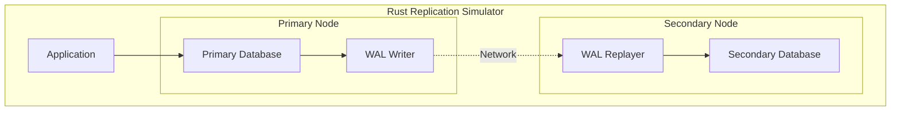

# Rust Implementation: Building a Simple Database Replication Simulator

This implementation demonstrates the core concepts of database replication using Rust. We'll build a simplified replication system that shows how primary-secondary relationships work, WAL (Write-Ahead Logging), and failover mechanisms.

## Overview

Our Rust implementation will simulate:
- Primary and secondary database nodes
- Write-Ahead Logging (WAL) for replication
- Synchronous and asynchronous replication modes
- Basic failover and promotion logic
- Network communication between nodes



## Dependencies

Add these dependencies to your `Cargo.toml`:

```toml
[package]
name = "replication-simulator"
version = "0.1.0"
edition = "2021"

[dependencies]
tokio = { version = "1", features = ["full"] }
serde = { version = "1.0", features = ["derive"] }
serde_json = "1.0"
uuid = { version = "1.0", features = ["v4"] }
async-trait = "0.1"
thiserror = "1.0"
tracing = "0.1"
tracing-subscriber = "0.3"
```

## Core Data Structures

```rust
use serde::{Deserialize, Serialize};
use std::collections::HashMap;
use std::time::{SystemTime, UNIX_EPOCH};
use tokio::sync::{mpsc, RwLock};
use uuid::Uuid;

/// Represents a database operation in the WAL
#[derive(Debug, Clone, Serialize, Deserialize)]
pub struct WALEntry {
    pub id: Uuid,
    pub timestamp: u64,
    pub operation: Operation,
    pub lsn: u64, // Log Sequence Number
}

#[derive(Debug, Clone, Serialize, Deserialize)]
pub enum Operation {
    Insert { table: String, key: String, value: String },
    Update { table: String, key: String, value: String },
    Delete { table: String, key: String },
}

/// Simple in-memory database
#[derive(Debug, Clone, Default)]
pub struct Database {
    tables: HashMap<String, HashMap<String, String>>,
}

impl Database {
    pub fn new() -> Self {
        Self {
            tables: HashMap::new(),
        }
    }

    pub fn apply_operation(&mut self, op: &Operation) -> Result<(), DatabaseError> {
        match op {
            Operation::Insert { table, key, value } => {
                let table_data = self.tables.entry(table.clone()).or_default();
                table_data.insert(key.clone(), value.clone());
                Ok(())
            }
            Operation::Update { table, key, value } => {
                let table_data = self.tables.entry(table.clone()).or_default();
                table_data.insert(key.clone(), value.clone());
                Ok(())
            }
            Operation::Delete { table, key } => {
                if let Some(table_data) = self.tables.get_mut(table) {
                    table_data.remove(key);
                }
                Ok(())
            }
        }
    }

    pub fn get(&self, table: &str, key: &str) -> Option<&String> {
        self.tables.get(table)?.get(key)
    }

    pub fn list_table(&self, table: &str) -> Vec<(String, String)> {
        self.tables
            .get(table)
            .map(|t| t.iter().map(|(k, v)| (k.clone(), v.clone())).collect())
            .unwrap_or_default()
    }
}

#[derive(thiserror::Error, Debug)]
pub enum DatabaseError {
    #[error("Table not found: {0}")]
    TableNotFound(String),
    #[error("Key not found: {0}")]
    KeyNotFound(String),
    #[error("Replication error: {0}")]
    ReplicationError(String),
}

/// Replication modes
#[derive(Debug, Clone, Copy)]
pub enum ReplicationMode {
    Synchronous,
    Asynchronous,
}

/// Node roles in the replication cluster
#[derive(Debug, Clone, Copy, PartialEq)]
pub enum NodeRole {
    Primary,
    Secondary,
}
```

## Primary Database Node

```rust
use std::sync::Arc;
use tokio::time::{Duration, sleep};

pub struct PrimaryNode {
    id: String,
    database: Arc<RwLock<Database>>,
    wal: Vec<WALEntry>,
    replicas: Vec<mpsc::UnboundedSender<WALEntry>>,
    next_lsn: u64,
    replication_mode: ReplicationMode,
}

impl PrimaryNode {
    pub fn new(id: String, replication_mode: ReplicationMode) -> Self {
        Self {
            id,
            database: Arc::new(RwLock::new(Database::new())),
            wal: Vec::new(),
            replicas: Vec::new(),
            next_lsn: 1,
            replication_mode,
        }
    }

    pub fn add_replica(&mut self, sender: mpsc::UnboundedSender<WALEntry>) {
        self.replicas.push(sender);
        tracing::info!("Added replica to primary {}", self.id);
    }

    pub async fn execute_operation(&mut self, operation: Operation) -> Result<(), DatabaseError> {
        // Create WAL entry
        let wal_entry = WALEntry {
            id: Uuid::new_v4(),
            timestamp: SystemTime::now()
                .duration_since(UNIX_EPOCH)
                .unwrap()
                .as_millis() as u64,
            operation: operation.clone(),
            lsn: self.next_lsn,
        };

        // Apply to local database
        {
            let mut db = self.database.write().await;
            db.apply_operation(&operation)?;
        }

        // Add to WAL
        self.wal.push(wal_entry.clone());
        self.next_lsn += 1;

        // Replicate to secondaries
        match self.replication_mode {
            ReplicationMode::Synchronous => {
                self.replicate_synchronously(wal_entry).await?;
            }
            ReplicationMode::Asynchronous => {
                self.replicate_asynchronously(wal_entry).await?;
            }
        }

        tracing::info!(
            "Primary {} executed operation: {:?}",
            self.id,
            operation
        );

        Ok(())
    }

    async fn replicate_synchronously(&self, entry: WALEntry) -> Result<(), DatabaseError> {
        // In a real implementation, this would wait for ACKs from replicas
        // For simulation, we'll just send and add a small delay
        for replica in &self.replicas {
            if let Err(e) = replica.send(entry.clone()) {
                return Err(DatabaseError::ReplicationError(format!(
                    "Failed to send to replica: {}",
                    e
                )));
            }
        }

        // Simulate network latency for synchronous replication
        sleep(Duration::from_millis(10)).await;

        tracing::debug!("Synchronous replication completed for LSN {}", entry.lsn);
        Ok(())
    }

    async fn replicate_asynchronously(&self, entry: WALEntry) -> Result<(), DatabaseError> {
        // Send to replicas without waiting
        for replica in &self.replicas {
            if let Err(e) = replica.send(entry.clone()) {
                tracing::warn!("Failed to send to replica: {}", e);
                // In async mode, we don't fail the operation
            }
        }

        tracing::debug!("Asynchronous replication initiated for LSN {}", entry.lsn);
        Ok(())
    }

    pub async fn read(&self, table: &str, key: &str) -> Option<String> {
        let db = self.database.read().await;
        db.get(table, key).cloned()
    }

    pub async fn list_table(&self, table: &str) -> Vec<(String, String)> {
        let db = self.database.read().await;
        db.list_table(table)
    }

    pub fn get_current_lsn(&self) -> u64 {
        self.next_lsn - 1
    }

    pub fn get_wal_entries(&self) -> &[WALEntry] {
        &self.wal
    }
}
```

## Secondary Database Node

```rust
pub struct SecondaryNode {
    id: String,
    database: Arc<RwLock<Database>>,
    applied_lsn: u64,
    role: NodeRole,
    wal_receiver: Option<mpsc::UnboundedReceiver<WALEntry>>,
}

impl SecondaryNode {
    pub fn new(id: String) -> (Self, mpsc::UnboundedSender<WALEntry>) {
        let (sender, receiver) = mpsc::unbounded_channel();
        
        let node = Self {
            id,
            database: Arc::new(RwLock::new(Database::new())),
            applied_lsn: 0,
            role: NodeRole::Secondary,
            wal_receiver: Some(receiver),
        };

        (node, sender)
    }

    pub async fn start_replication(&mut self) -> Result<(), DatabaseError> {
        let mut receiver = self.wal_receiver.take()
            .ok_or_else(|| DatabaseError::ReplicationError("No WAL receiver".to_string()))?;

        tracing::info!("Secondary {} starting replication", self.id);

        while let Some(wal_entry) = receiver.recv().await {
            self.apply_wal_entry(wal_entry).await?;
        }

        Ok(())
    }

    async fn apply_wal_entry(&mut self, entry: WALEntry) -> Result<(), DatabaseError> {
        // Check LSN ordering (simplified - real systems handle gaps)
        if entry.lsn <= self.applied_lsn {
            tracing::warn!(
                "Secondary {} received out-of-order WAL entry: {} (expected > {})",
                self.id,
                entry.lsn,
                self.applied_lsn
            );
            return Ok(());
        }

        // Apply the operation
        {
            let mut db = self.database.write().await;
            db.apply_operation(&entry.operation)?;
        }

        self.applied_lsn = entry.lsn;

        tracing::debug!(
            "Secondary {} applied WAL entry LSN {} - {:?}",
            self.id,
            entry.lsn,
            entry.operation
        );

        Ok(())
    }

    pub async fn promote_to_primary(mut self) -> PrimaryNode {
        tracing::info!("Promoting secondary {} to primary", self.id);
        
        // In a real system, this would involve more complex promotion logic
        let database = self.database;
        let next_lsn = self.applied_lsn + 1;

        PrimaryNode {
            id: self.id,
            database,
            wal: Vec::new(), // Start fresh WAL after promotion
            replicas: Vec::new(),
            next_lsn,
            replication_mode: ReplicationMode::Asynchronous, // Default after promotion
        }
    }

    pub async fn read(&self, table: &str, key: &str) -> Option<String> {
        let db = self.database.read().await;
        db.get(table, key).cloned()
    }

    pub async fn list_table(&self, table: &str) -> Vec<(String, String)> {
        let db = self.database.read().await;
        db.list_table(table)
    }

    pub fn get_applied_lsn(&self) -> u64 {
        self.applied_lsn
    }

    pub fn get_role(&self) -> NodeRole {
        self.role
    }
}
```

## Replication Cluster Manager

```rust
pub struct ReplicationCluster {
    primary: Option<PrimaryNode>,
    secondaries: Vec<SecondaryNode>,
}

impl ReplicationCluster {
    pub fn new() -> Self {
        Self {
            primary: None,
            secondaries: Vec::new(),
        }
    }

    pub fn set_primary(&mut self, primary: PrimaryNode) {
        self.primary = Some(primary);
    }

    pub fn add_secondary(&mut self, secondary: SecondaryNode, sender: mpsc::UnboundedSender<WALEntry>) {
        if let Some(ref mut primary) = self.primary {
            primary.add_replica(sender);
        }
        self.secondaries.push(secondary);
    }

    pub async fn execute_write(&mut self, operation: Operation) -> Result<(), DatabaseError> {
        match &mut self.primary {
            Some(primary) => primary.execute_operation(operation).await,
            None => Err(DatabaseError::ReplicationError("No primary available".to_string())),
        }
    }

    pub async fn execute_read(&self, table: &str, key: &str, prefer_secondary: bool) -> Option<String> {
        if prefer_secondary && !self.secondaries.is_empty() {
            // Read from first available secondary
            self.secondaries[0].read(table, key).await
        } else if let Some(ref primary) = self.primary {
            primary.read(table, key).await
        } else {
            None
        }
    }

    pub async fn failover(&mut self) -> Result<(), DatabaseError> {
        if self.secondaries.is_empty() {
            return Err(DatabaseError::ReplicationError("No secondaries available for failover".to_string()));
        }

        // Promote the first secondary (in real systems, choose the most up-to-date)
        let secondary = self.secondaries.remove(0);
        let new_primary = secondary.promote_to_primary().await;
        
        tracing::info!("Failover completed - new primary: {}", new_primary.id);
        self.primary = Some(new_primary);

        Ok(())
    }

    pub fn get_cluster_status(&self) -> ClusterStatus {
        ClusterStatus {
            primary_id: self.primary.as_ref().map(|p| p.id.clone()),
            primary_lsn: self.primary.as_ref().map(|p| p.get_current_lsn()),
            secondary_count: self.secondaries.len(),
            secondary_lsns: self.secondaries.iter().map(|s| (s.id.clone(), s.get_applied_lsn())).collect(),
        }
    }
}

#[derive(Debug)]
pub struct ClusterStatus {
    pub primary_id: Option<String>,
    pub primary_lsn: Option<u64>,
    pub secondary_count: usize,
    pub secondary_lsns: Vec<(String, u64)>,
}
```

## Example Usage and Testing

```rust
#[tokio::main]
async fn main() -> Result<(), Box<dyn std::error::Error>> {
    // Initialize tracing
    tracing_subscriber::init();

    // Create replication cluster
    let mut cluster = ReplicationCluster::new();

    // Create primary node
    let primary = PrimaryNode::new("primary-1".to_string(), ReplicationMode::Asynchronous);
    cluster.set_primary(primary);

    // Create secondary nodes
    let (secondary1, sender1) = SecondaryNode::new("secondary-1".to_string());
    let (secondary2, sender2) = SecondaryNode::new("secondary-2".to_string());

    cluster.add_secondary(secondary1, sender1);
    cluster.add_secondary(secondary2, sender2);

    // Start replication on secondaries (in real app, these would run in separate tasks)
    let secondary_handles = cluster.secondaries.into_iter().map(|mut secondary| {
        tokio::spawn(async move {
            if let Err(e) = secondary.start_replication().await {
                tracing::error!("Secondary replication failed: {}", e);
            }
        })
    }).collect::<Vec<_>>();

    // Simulate database operations
    println!("=== Database Replication Simulation ===");

    // Insert some data
    cluster.execute_write(Operation::Insert {
        table: "users".to_string(),
        key: "user1".to_string(),
        value: "Alice".to_string(),
    }).await?;

    cluster.execute_write(Operation::Insert {
        table: "users".to_string(),
        key: "user2".to_string(),
        value: "Bob".to_string(),
    }).await?;

    // Wait for replication
    tokio::time::sleep(Duration::from_millis(100)).await;

    // Read from primary
    println!("Reading from primary:");
    if let Some(value) = cluster.execute_read("users", "user1", false).await {
        println!("  user1: {}", value);
    }

    // Read from secondary
    println!("Reading from secondary:");
    if let Some(value) = cluster.execute_read("users", "user1", true).await {
        println!("  user1: {}", value);
    }

    // Update data
    cluster.execute_write(Operation::Update {
        table: "users".to_string(),
        key: "user1".to_string(),
        value: "Alice Updated".to_string(),
    }).await?;

    // Wait for replication
    tokio::time::sleep(Duration::from_millis(100)).await;

    // Show cluster status
    let status = cluster.get_cluster_status();
    println!("Cluster Status: {:#?}", status);

    // Simulate failover
    println!("\n=== Simulating Primary Failure ===");
    cluster.failover().await?;

    // Continue operations with new primary
    cluster.execute_write(Operation::Insert {
        table: "users".to_string(),
        key: "user3".to_string(),
        value: "Charlie".to_string(),
    }).await?;

    let final_status = cluster.get_cluster_status();
    println!("Final Cluster Status: {:#?}", final_status);

    Ok(())
}

#[cfg(test)]
mod tests {
    use super::*;

    #[tokio::test]
    async fn test_basic_replication() {
        let mut primary = PrimaryNode::new("test-primary".to_string(), ReplicationMode::Asynchronous);
        let (mut secondary, sender) = SecondaryNode::new("test-secondary".to_string());
        
        primary.add_replica(sender);

        // Start secondary replication in background
        let _handle = tokio::spawn(async move {
            secondary.start_replication().await.unwrap();
        });

        // Execute operation on primary
        let operation = Operation::Insert {
            table: "test".to_string(),
            key: "key1".to_string(),
            value: "value1".to_string(),
        };

        primary.execute_operation(operation).await.unwrap();

        // Verify data on primary
        let value = primary.read("test", "key1").await;
        assert_eq!(value, Some("value1".to_string()));

        // Wait for replication
        tokio::time::sleep(Duration::from_millis(50)).await;
    }

    #[tokio::test]
    async fn test_synchronous_vs_asynchronous() {
        // Test both replication modes to demonstrate performance differences
        let start = std::time::Instant::now();

        let mut sync_primary = PrimaryNode::new("sync-primary".to_string(), ReplicationMode::Synchronous);
        let (sender, _receiver) = mpsc::unbounded_channel();
        sync_primary.add_replica(sender);

        // Execute operations synchronously
        for i in 0..10 {
            sync_primary.execute_operation(Operation::Insert {
                table: "test".to_string(),
                key: format!("key{}", i),
                value: format!("value{}", i),
            }).await.unwrap();
        }

        let sync_duration = start.elapsed();

        let start = std::time::Instant::now();

        let mut async_primary = PrimaryNode::new("async-primary".to_string(), ReplicationMode::Asynchronous);
        let (sender, _receiver) = mpsc::unbounded_channel();
        async_primary.add_replica(sender);

        // Execute operations asynchronously
        for i in 0..10 {
            async_primary.execute_operation(Operation::Insert {
                table: "test".to_string(),
                key: format!("key{}", i),
                value: format!("value{}", i),
            }).await.unwrap();
        }

        let async_duration = start.elapsed();

        println!("Synchronous replication: {:?}", sync_duration);
        println!("Asynchronous replication: {:?}", async_duration);

        // Async should be faster
        assert!(async_duration < sync_duration);
    }
}
```

## Running the Implementation

To run the replication simulator:

```bash
# Create a new Rust project
cargo new replication-simulator
cd replication-simulator

# Add the dependencies to Cargo.toml (as shown above)
# Copy the implementation code to src/main.rs

# Run the simulation
cargo run

# Run tests
cargo test -- --nocapture
```

## Expected Output

```
=== Database Replication Simulation ===
Reading from primary:
  user1: Alice
Reading from secondary:
  user1: Alice
Cluster Status: ClusterStatus {
    primary_id: Some("primary-1"),
    primary_lsn: Some(3),
    secondary_count: 2,
    secondary_lsns: [
        ("secondary-1", 3),
        ("secondary-2", 3)
    ]
}

=== Simulating Primary Failure ===
Final Cluster Status: ClusterStatus {
    primary_id: Some("secondary-1"),
    primary_lsn: Some(4),
    secondary_count: 1,
    secondary_lsns: [
        ("secondary-2", 3)
    ]
}
```

## Key Learning Points

1. **WAL-based Replication**: The implementation shows how Write-Ahead Logging enables reliable replication
2. **Synchronous vs Asynchronous**: Different replication modes have clear performance trade-offs
3. **Failover Logic**: Secondary promotion involves transferring the primary role and continuing operations
4. **LSN Tracking**: Log Sequence Numbers ensure ordered application of changes
5. **Error Handling**: Real replication systems need robust error handling for network failures

This Rust implementation provides a foundation for understanding how production database replication systems work, while being simple enough to modify and experiment with different replication strategies.